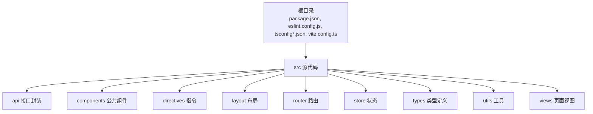
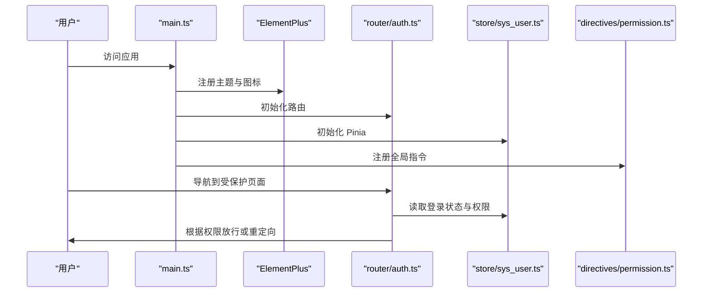
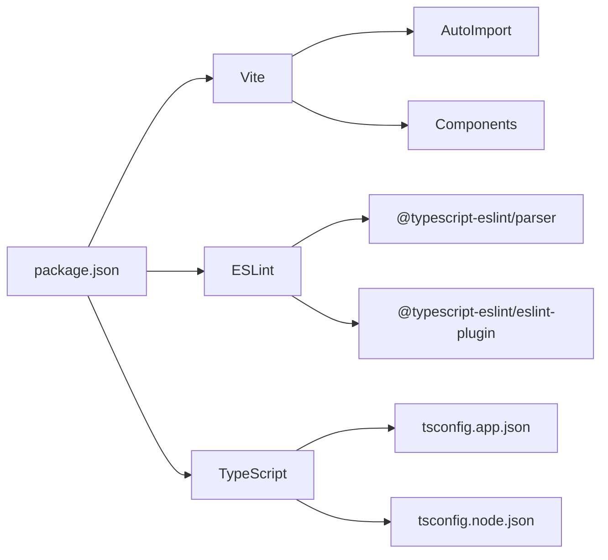

# 代码规范

<cite>
**本文引用的文件**
- [eslint.config.js](file://eslint.config.js)
- [tsconfig.json](file://tsconfig.json)
- [tsconfig.app.json](file://tsconfig.app.json)
- [tsconfig.node.json](file://tsconfig.node.json)
- [package.json](file://package.json)
- [vite.config.ts](file://vite.config.ts)
- [src/main.ts](file://src/main.ts)
- [src/App.vue](file://src/App.vue)
- [src/router/auth.ts](file://src/router/auth.ts)
- [src/store/auth.ts](file://src/store/auth.ts)
- [src/store/sys_user.ts](file://src/store/sys_user.ts)
- [src/types/auth.ts](file://src/types/auth.ts)
- [src/utils/request.ts](file://src/utils/request.ts)
- [src/directives/permission.ts](file://src/directives/permission.ts)
- [src/views/system/user/index.vue](file://src/views/system/user/index.vue)
</cite>

## 目录
1. [简介](#简介)
2. [项目结构](#项目结构)
3. [核心组件](#核心组件)
4. [架构总览](#架构总览)
5. [详细组件分析](#详细组件分析)
6. [依赖分析](#依赖分析)
7. [性能考虑](#性能考虑)
8. [故障排查指南](#故障排查指南)
9. [结论](#结论)
10. [附录](#附录)

## 简介
本文件为本项目的代码规范与最佳实践指南，围绕 ESLint 配置与 TypeScript 编译规则展开，结合项目中的 Vue 组件命名、文件组织与命名约定，给出接口设计、泛型使用与类型推导的最佳实践，并提供代码格式化、注释与文档编写建议。同时，通过具体文件路径示例，展示“正确”与“错误”的编码方式，帮助团队统一风格、提升可维护性。

## 项目结构
本项目采用前端工程化的典型分层组织：
- 根目录包含构建与工具配置（Vite、ESLint、TypeScript）、包管理与入口脚本
- 源代码位于 src/，按功能域划分：api、components、directives、layout、router、store、types、utils、views 等
- 类型定义集中于 types/auth.ts，便于跨模块复用
- 构建与运行通过 Vite 插件自动导入与组件解析，减少样板代码

章节来源
- [package.json](file://package.json#L1-L38)
- [vite.config.ts](file://vite.config.ts#L1-L49)

## 核心组件
本节聚焦于代码规范的关键配置与实现要点，包括 ESLint 规则、TypeScript 编译选项、Vue 文件组织与命名约定、类型定义与工具函数的使用模式。

- ESLint 配置要点
  - 使用 flat 配置风格，集成 JavaScript 基础推荐规则、Vue 推荐规则与 TypeScript 插件
  - 对 ts/tsx/vue 文件启用 TypeScript 解析器，统一语言选项
  - 关键规则：
    - @typescript-eslint/no-unused-vars：对以“_”开头的参数忽略未使用警告，便于占位参数
    - @typescript-eslint/no-explicit-any：将 any 使用标记为警告，鼓励更严格的类型约束
    - vue/multi-word-component-names：关闭多词组件名强制，便于简短组件名
    - vue/no-v-html：关闭危险 HTML 注入规则，便于模板内动态渲染

- TypeScript 编译规则
  - 应用侧（tsconfig.app.json）启用严格模式、未使用局部变量/参数检测、switch 穿透与副作用导入检查
  - Node 工具侧（tsconfig.node.json）同样启用严格模式与相关 linting 选项，确保构建脚本类型安全
  - 通过 references 将应用与 Node 配置聚合，避免重复声明

- Vue 文件组织与命名约定
  - 组件命名采用 PascalCase（如 User、Role），路由与视图文件夹保持一致
  - 使用 <script setup lang="ts"> 的组合式 API 写法，配合类型推导
  - 指令与权限控制通过自定义指令实现，统一在 directives 中集中管理

- 类型定义最佳实践
  - 在 types/auth.ts 定义通用接口（如 UserInfo、LoginForm、ApiResponse、MenuItem）
  - 泛型用于 API 响应包装器，支持数据泛化与强类型提取
  - Store 状态与 getters/actions 明确类型约束，避免 any

- 工具函数与拦截器
  - utils/request.ts 提供统一的 axios 实例与拦截器，封装常用请求方法
  - 支持统一错误处理与鉴权头注入，减少重复逻辑

章节来源
- [eslint.config.js](file://eslint.config.js#L1-L42)
- [tsconfig.app.json](file://tsconfig.app.json#L1-L17)
- [tsconfig.node.json](file://tsconfig.node.json#L1-L27)
- [src/types/auth.ts](file://src/types/index.ts#L1-L45)
- [src/utils/request.ts](file://src/utils/request.ts#L1-L102)
- [src/directives/permission.ts](file://src/directives/permission.ts#L1-L67)

## 架构总览
下图展示了前端运行时的主流程：入口应用初始化、插件注册、路由守卫、状态管理与权限指令协同工作。

图表来源
- [src/main.ts](file://src/main.ts#L1-L27)
- [src/router/auth.ts](file://src/router/index.ts#L1-L123)
- [src/store/sys_user.ts](file://src/store/user.ts#L1-L68)
- [src/directives/permission.ts](file://src/directives/permission.ts#L1-L67)

章节来源
- [src/main.ts](file://src/main.ts#L1-L27)
- [src/router/auth.ts](file://src/router/index.ts#L1-L123)
- [src/store/sys_user.ts](file://src/store/user.ts#L1-L68)
- [src/directives/permission.ts](file://src/directives/permission.ts#L1-L67)

## 详细组件分析

### ESLint 规则详解与使用场景
- @typescript-eslint/no-unused-vars
  - 作用：检测未使用的变量与参数，提升代码整洁度
  - 配置：argsIgnorePattern: '^_' 忽略以下划线开头的参数，常用于回调占位
  - 使用场景：函数签名中需要遵循接口但不需要使用某些参数时
  - 参考实现位置：[eslint.config.js](file://eslint.config.js#L22-L22)

- @typescript-eslint/no-explicit-any
  - 作用：限制 any 的滥用，鼓励更精确的类型表达
  - 配置：warn 级别，便于逐步替换 any
  - 使用场景：迁移旧代码、临时桥接第三方库时可短暂允许，但需制定替换计划
  - 参考实现位置：[eslint.config.js](file://eslint.config.js#L23-L23)

- vue/multi-word-component-names
  - 作用：强制组件名使用多词（kebab-case 或 PascalCase）
  - 配置：off，允许简短组件名（如 Layout、User）
  - 使用场景：内部组件命名简洁，不强制 kebab-case
  - 参考实现位置：[eslint.config.js](file://eslint.config.js#L24-L24)

- vue/no-v-html
  - 作用：禁止直接使用 v-html，降低 XSS 风险
  - 配置：off，便于模板内动态渲染
  - 使用场景：必要时可开启，但需配合内容过滤与 CSP
  - 参考实现位置：[eslint.config.js](file://eslint.config.js#L25-L25)

章节来源
- [eslint.config.js](file://eslint.config.js#L1-L42)

### TypeScript 编译规则详解与使用场景
- 严格模式与未使用检测
  - strict: true，开启严格模式，提升类型安全性
  - noUnusedLocals/Parameters：检测未使用局部变量与参数，减少冗余
  - 使用场景：保证代码质量与可维护性
  - 参考实现位置：
    - [tsconfig.app.json](file://tsconfig.app.json#L8-L13)
    - [tsconfig.node.json](file://tsconfig.node.json#L17-L23)

- 语法与检查策略
  - erasableSyntaxOnly：仅擦除可擦除语法，避免破坏运行时行为
  - noFallthroughCasesInSwitch：switch 穿透检查
  - noUncheckedSideEffectImports：未检查副作用导入检查
  - 使用场景：平衡类型安全与构建兼容性
  - 参考实现位置：
    - [tsconfig.app.json](file://tsconfig.app.json#L11-L13)
    - [tsconfig.node.json](file://tsconfig.node.json#L21-L23)

- 配置聚合
  - tsconfig.json 通过 references 引入 app 与 node 配置，避免重复声明
  - 使用场景：多环境配置共享与隔离
  - 参考实现位置：[tsconfig.json](file://tsconfig.json#L1-L8)

章节来源
- [tsconfig.json](file://tsconfig.json#L1-L8)
- [tsconfig.app.json](file://tsconfig.app.json#L1-L17)
- [tsconfig.node.json](file://tsconfig.node.json#L1-L27)

### Vue 组件命名规范与文件组织
- 命名规范
  - 组件文件名采用 PascalCase（如 User.vue、Role.vue）
  - 路由与视图文件夹与组件名保持一致，便于查找
  - 示例参考：views/system/user/index.vue
  - 参考实现位置：[src/views/system/user/index.vue](file://src/views/system/user/index.vue#L1-L183)

- 文件组织原则
  - 按功能域划分：views 下按业务模块组织（如 system/user、system/role）
  - 组件与页面分离：公共组件置于 components，页面视图置于 views
  - 指令集中管理：权限与角色指令置于 directives
  - 参考实现位置：
    - [src/directives/permission.ts](file://src/directives/permission.ts#L1-L67)
    - [src/router/auth.ts](file://src/router/index.ts#L1-L123)

- 命名约定
  - 组件导出使用 PascalCase
  - 路由名称使用 PascalCase 或稳定标识
  - 参考实现位置：[src/router/auth.ts](file://src/router/index.ts#L6-L86)

章节来源
- [src/views/system/user/index.vue](file://src/views/system/user/index.vue#L1-L183)
- [src/directives/permission.ts](file://src/directives/permission.ts#L1-L67)
- [src/router/auth.ts](file://src/router/index.ts#L1-L123)

### TypeScript 类型定义最佳实践
- 接口设计
  - 使用只读与可选属性明确数据结构（如 UserInfo 的可选字段）
  - 复杂嵌套结构使用递归接口（如 MenuItem 的 children）
  - 参考实现位置：[src/types/auth.ts](file://src/types/index.ts#L1-L45)

- 泛型使用
  - ApiResponse<T> 支持泛型数据承载，避免 any
  - request.ts 中的泛型函数封装，确保返回值类型安全
  - 参考实现位置：
    - [src/types/auth.ts](file://src/types/index.ts#L25-L30)
    - [src/utils/request.ts](file://src/utils/request.ts#L80-L102)

- 类型推导
  - 在 Vue 组合式 API 中利用 ref、reactive 的类型推导
  - 在 store 中明确 state/gatters/actions 的类型约束
  - 参考实现位置：
    - [src/views/system/user/index.vue](file://src/views/system/user/index.vue#L77-L101)
    - [src/store/sys_user.ts](file://src/store/user.ts#L4-L23)

章节来源
- [src/types/auth.ts](file://src/types/index.ts#L1-L45)
- [src/utils/request.ts](file://src/utils/request.ts#L1-L102)
- [src/views/system/user/index.vue](file://src/views/system/user/index.vue#L77-L101)
- [src/store/sys_user.ts](file://src/store/user.ts#L1-L68)

### 代码格式化、注释与文档编写指南
- 代码格式化
  - 使用 ESLint 的 --fix 能力统一格式（lint 脚本已配置）
  - 参考实现位置：[package.json](file://package.json#L10-L10)

- 注释规范
  - 指令与复杂逻辑处提供清晰注释，说明用途与使用方式
  - 参考实现位置：[src/directives/permission.ts](file://src/directives/permission.ts#L4-L31)

- 文档编写
  - README.md 作为项目背景与使用说明的入口
  - 参考实现位置：[README.md](file://README.md)

章节来源
- [package.json](file://package.json#L10-L10)
- [src/directives/permission.ts](file://src/directives/permission.ts#L4-L31)

### 具体示例：正确与错误的编码方式（以路径代替代码片段）
- 正确：使用泛型的请求封装
  - 路径参考：[src/utils/request.ts](file://src/utils/request.ts#L80-L102)
- 错误：使用 any 替代具体类型
  - 路径参考：[src/types/auth.ts](file://src/types/index.ts#L26-L30)（可对比使用泛型的 ApiResponse）
- 正确：组件命名与路由配置一致
  - 路径参考：[src/router/auth.ts](file://src/router/index.ts#L46-L74)、[src/views/system/user/index.vue](file://src/views/system/user/index.vue#L1-L183)
- 错误：未使用占位参数前缀导致未使用变量警告
  - 路径参考：[eslint.config.js](file://eslint.config.js#L22-L22)
- 正确：权限指令的数组与字符串两种使用方式
  - 路径参考：[src/directives/permission.ts](file://src/directives/permission.ts#L6-L31)、[src/views/system/user/index.vue](file://src/views/system/user/index.vue#L7-L59)

## 依赖分析
- 构建与工具链
  - Vite 作为开发服务器与打包工具，配合 unplugin-auto-import 与 unplugin-vue-components 自动导入与组件解析
  - 参考实现位置：[vite.config.ts](file://vite.config.ts#L1-L49)

- 类型与校验
  - @typescript-eslint/eslint-plugin 与 @typescript-eslint/parser 提供 TS 规则与解析
  - vue-tsc 与 tsconfig 配置共同保障类型检查
  - 参考实现位置：
    - [eslint.config.js](file://eslint.config.js#L1-L42)
    - [tsconfig.json](file://tsconfig.json#L1-L8)

- 运行时依赖
  - Vue 3、Element Plus、Pinia、Vue Router 等
  - 参考实现位置：[package.json](file://package.json#L12-L20)

图表来源
- [package.json](file://package.json#L1-L38)
- [vite.config.ts](file://vite.config.ts#L1-L49)
- [eslint.config.js](file://eslint.config.js#L1-L42)
- [tsconfig.json](file://tsconfig.json#L1-L8)

章节来源
- [package.json](file://package.json#L1-L38)
- [vite.config.ts](file://vite.config.ts#L1-L49)
- [eslint.config.js](file://eslint.config.js#L1-L42)
- [tsconfig.json](file://tsconfig.json#L1-L8)

## 性能考虑
- 构建与懒加载
  - 路由与视图采用动态导入，减少首屏体积
  - 参考实现位置：[src/router/auth.ts](file://src/router/index.ts#L10-L85)

- 插件优化
  - 自动导入与组件解析减少手动引入，提高开发效率
  - 参考实现位置：[vite.config.ts](file://vite.config.ts#L14-L28)

- 请求拦截与缓存
  - 统一拦截器处理鉴权与错误，避免重复逻辑
  - 参考实现位置：[src/utils/request.ts](file://src/utils/request.ts#L13-L78)

## 故障排查指南
- ESLint 报错
  - 未使用变量：若为占位参数，可在参数名前加下划线以忽略警告
    - 参考实现位置：[eslint.config.js](file://eslint.config.js#L22-L22)
  - any 类型警告：优先使用具体类型或泛型替代 any
    - 参考实现位置：[eslint.config.js](file://eslint.config.js#L23-L23)

- TypeScript 编译错误
  - 严格模式导致的类型不匹配：根据编译器提示补充类型或调整实现
    - 参考实现位置：
      - [tsconfig.app.json](file://tsconfig.app.json#L8-L13)
      - [tsconfig.node.json](file://tsconfig.node.json#L17-L23)

- 运行时问题
  - 权限不足：检查指令绑定值与用户权限集合
    - 参考实现位置：[src/directives/permission.ts](file://src/directives/permission.ts#L10-L31)
  - 请求失败：查看拦截器中的错误分支与消息提示
    - 参考实现位置：[src/utils/request.ts](file://src/utils/request.ts#L30-L78)

章节来源
- [eslint.config.js](file://eslint.config.js#L22-L23)
- [tsconfig.app.json](file://tsconfig.app.json#L8-L13)
- [tsconfig.node.json](file://tsconfig.node.json#L17-L23)
- [src/directives/permission.ts](file://src/directives/permission.ts#L10-L31)
- [src/utils/request.ts](file://src/utils/request.ts#L30-L78)

## 结论
本项目的代码规范以 ESLint 与 TypeScript 编译规则为核心，结合 Vue 组合式 API 与 Pinia 状态管理，形成了一套可维护、可扩展的前端工程化实践。通过统一的命名约定、类型定义与工具函数封装，团队可以高效协作并降低技术债。建议持续执行 lint 脚本与类型检查，逐步替换 any 并完善注释与文档。

## 附录
- 快速检查清单
  - 使用 npm/pnpm/yarn 执行 lint 脚本进行格式化与修复
    - 参考实现位置：[package.json](file://package.json#L10-L10)
  - 新增组件遵循 PascalCase 命名与路由/视图文件夹一致性
    - 参考实现位置：[src/router/auth.ts](file://src/router/index.ts#L46-L74)
  - 使用泛型封装 API 响应，避免 any
    - 参考实现位置：[src/types/auth.ts](file://src/types/index.ts#L25-L30)