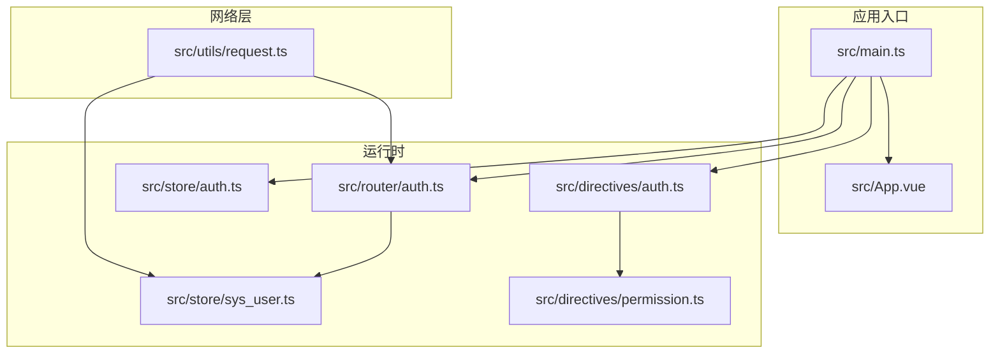
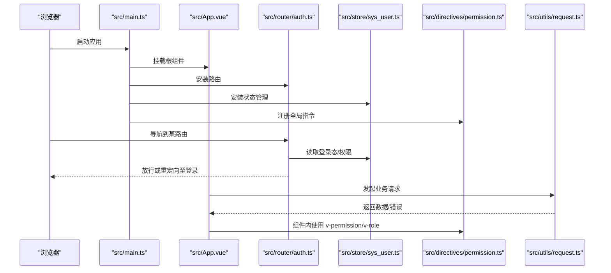
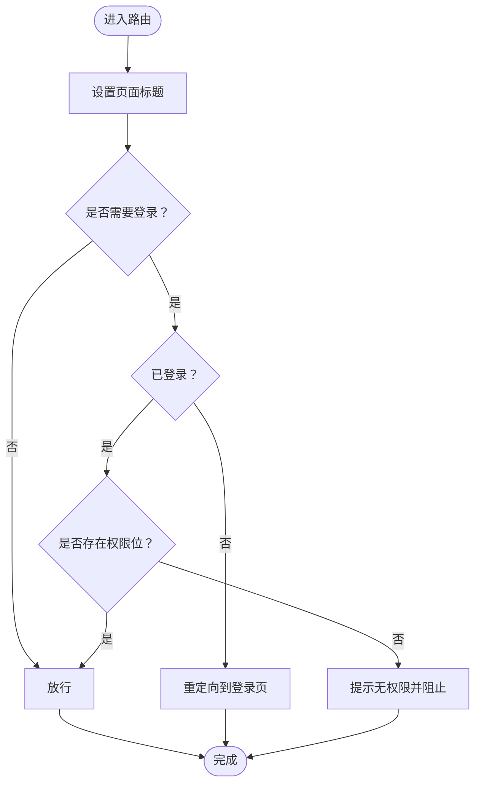
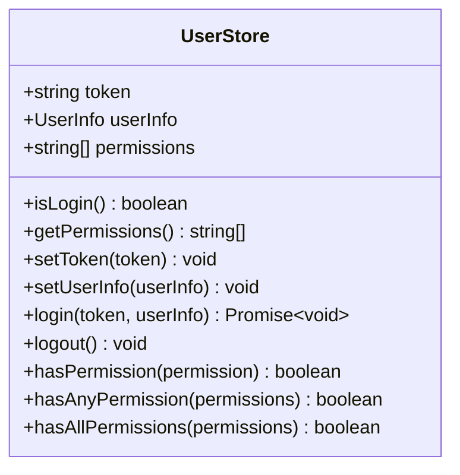
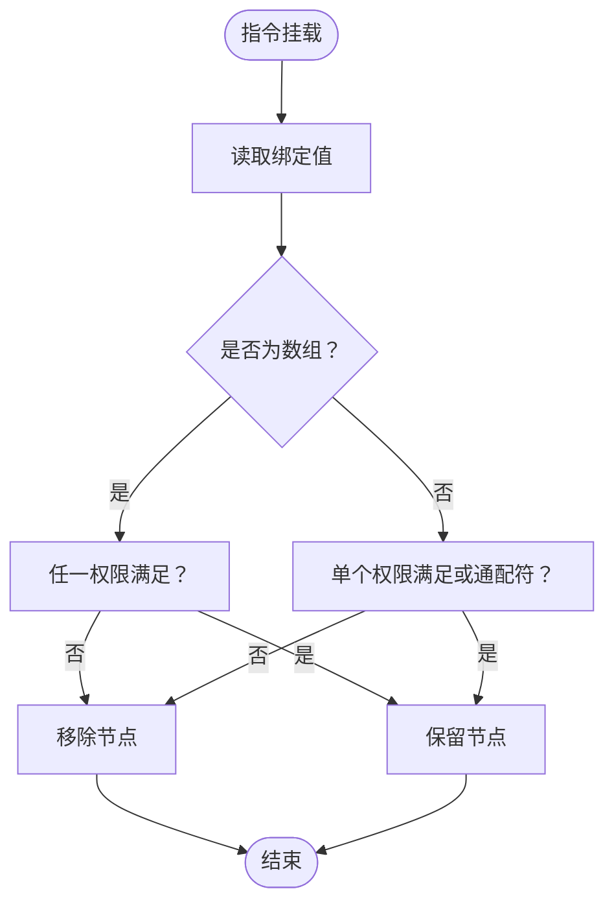
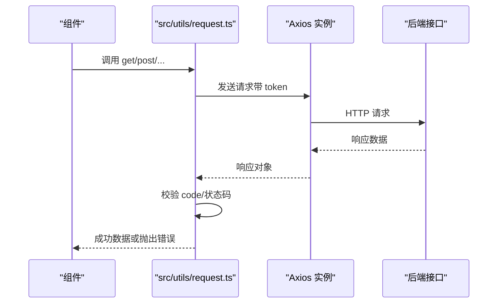
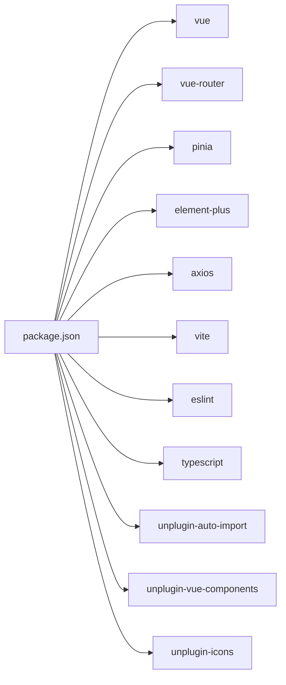

# 开发指南

<cite>
**本文引用的文件**
- [eslint.config.js](file://eslint.config.js)
- [vite.config.ts](file://vite.config.ts)
- [tsconfig.json](file://tsconfig.json)
- [tsconfig.app.json](file://tsconfig.app.json)
- [tsconfig.node.json](file://tsconfig.node.json)
- [package.json](file://package.json)
- [README.md](file://README.md)
- [src/main.ts](file://src/main.ts)
- [src/App.vue](file://src/App.vue)
- [src/router/auth.ts](file://src/router/auth.ts)
- [src/store/auth.ts](file://src/store/auth.ts)
- [src/store/sys_user.ts](file://src/store/sys_user.ts)
- [src/utils/request.ts](file://src/utils/request.ts)
- [src/directives/auth.ts](file://src/directives/auth.ts)
- [src/directives/permission.ts](file://src/directives/permission.ts)
</cite>

## 目录
1. [简介](#简介)
2. [项目结构](#项目结构)
3. [核心组件](#核心组件)
4. [架构总览](#架构总览)
5. [详细组件分析](#详细组件分析)
6. [依赖分析](#依赖分析)
7. [性能考虑](#性能考虑)
8. [故障排查指南](#故障排查指南)
9. [结论](#结论)
10. [附录](#附录)

## 简介
本指南面向使用 Vue 3 + TypeScript + Vite 的前端团队，提供从代码规范、开发流程、最佳实践到调试与性能优化的完整开发手册。文档基于仓库现有配置与实现进行提炼，帮助新成员快速上手并保持一致的工程化标准。

## 项目结构
项目采用“功能域 + 层次化”组织方式，核心目录与职责如下：
- src/api：后端接口封装（示例：认证）
- src/components：可复用组件（示例：HelloWorld）
- src/directives：全局指令（权限、角色）
- src/layout：布局容器
- src/router：路由定义与守卫
- src/store：状态管理（Pinia）
- src/types：全局类型声明
- src/utils：通用工具（示例：HTTP 请求）
- src/views：页面级视图（系统管理、仪表盘、登录等）
- 配置层：Vite、ESLint、TypeScript 多配置文件

图表来源
- [src/main.ts](file://src/main.ts#L1-L27)
- [src/App.vue](file://src/App.vue#L1-L51)
- [src/router/auth.ts](file://src/router/index.ts#L1-L119)
- [src/store/auth.ts](file://src/store/index.ts#L1-L6)
- [src/store/sys_user.ts](file://src/store/user.ts#L1-L68)
- [src/directives/auth.ts](file://src/directives/index.ts#L1-L16)
- [src/directives/permission.ts](file://src/directives/permission.ts#L1-L67)
- [src/utils/request.ts](file://src/utils/request.ts#L1-L102)

章节来源
- [README.md](file://README.md#L1-L6)
- [src/main.ts](file://src/main.ts#L1-L27)
- [src/App.vue](file://src/App.vue#L1-L51)

## 核心组件
- 应用启动与插件注册：在入口文件中完成 Element Plus、路由、状态管理、全局指令的安装与挂载。
- 路由与鉴权：通过路由守卫统一设置标题、校验登录态与权限位，结合 Pinia 用户状态。
- 状态管理：以 Pinia Store 管理 token、用户信息与权限集合，提供多维度权限判断能力。
- 全局指令：提供 v-permission 与 v-role 指令，支持字符串与数组两种绑定形式，按权限/角色动态显隐。
- 网络层：基于 Axios 的二次封装，内置请求/响应拦截器，统一封装 GET/POST/PUT/DELETE 方法。

章节来源
- [src/main.ts](file://src/main.ts#L1-L27)
- [src/router/auth.ts](file://src/router/index.ts#L90-L116)
- [src/store/sys_user.ts](file://src/store/user.ts#L10-L66)
- [src/directives/permission.ts](file://src/directives/permission.ts#L9-L61)
- [src/utils/request.ts](file://src/utils/request.ts#L1-L102)

## 架构总览
下图展示从入口到各子系统的交互关系与数据流向。

图表来源
- [src/main.ts](file://src/main.ts#L1-L27)
- [src/App.vue](file://src/App.vue#L1-L51)
- [src/router/auth.ts](file://src/router/index.ts#L90-L116)
- [src/store/sys_user.ts](file://src/store/user.ts#L10-L66)
- [src/directives/permission.ts](file://src/directives/permission.ts#L9-L61)
- [src/utils/request.ts](file://src/utils/request.ts#L1-L102)

## 详细组件分析

### ESLint 配置与规则说明
- 配置结构：采用扁平配置风格，组合基础 JS 推荐规则、Vue 插件推荐规则以及 TypeScript 解析器与插件。
- 语言选项：指定最新 ECMAScript 版本与模块源类型，确保对现代语法与 Vue 单文件组件的正确解析。
- 插件与规则：
  - 禁止未使用变量（忽略以下划线开头的参数）：提升代码整洁度。
  - 对 any 类型发出警告而非报错：鼓励更严格的类型约束但不强制。
  - 关闭多词组件名强制：兼容现有组件命名。
  - 关闭 v-html 使用限制：根据项目需要放宽特定规则。
- 忽略项：忽略 dist、node_modules 与类型声明文件，避免对生成物与类型文件执行检查。

章节来源
- [eslint.config.js](file://eslint.config.js#L1-L42)

### TypeScript 编译选项与作用
- 根配置（tsconfig.json）：通过 references 引入应用与 Node 环境两套配置，实现分层编译。
- 应用配置（tsconfig.app.json）：
  - 继承 DOM 相关默认配置，启用严格模式与多项 linting 选项，提升类型安全与可维护性。
  - 引入 Vite 客户端类型，使环境变量与模块热替换等类型可用。
- Node 配置（tsconfig.node.json）：
  - 面向构建脚本与 Vite 配置文件，启用 bundler 模式与 ESNext 模块解析，保证 Vite 插件链路的类型正确性。
  - 严格模式与 linting 选项同上，确保构建侧同样具备高质量约束。

章节来源
- [tsconfig.json](file://tsconfig.json#L1-L8)
- [tsconfig.app.json](file://tsconfig.app.json#L1-L17)
- [tsconfig.node.json](file://tsconfig.node.json#L1-L27)

### Vite 构建配置与自定义
- 插件生态：
  - Vue 插件：支持单文件组件与组合式 API。
  - 自动导入：自动导入 Vue、路由与状态管理相关 API，减少手工引入。
  - 组件自动注册：按解析器自动注册 Element Plus 与图标组件，生成类型声明文件。
  - 图标插件：自动安装与解析图标资源。
- 路径别名：将 @ 指向 src，便于统一路径引用。
- 开发服务器：本地端口与代理配置，将 /api 前缀转发至后端服务，支持路径重写。
- 可扩展点：可通过新增插件、调整解析器与别名、扩展代理规则等方式进一步定制。

章节来源
- [vite.config.ts](file://vite.config.ts#L1-L49)

### 路由与鉴权流程
- 路由配置：包含登录页、仪表盘、系统管理（用户、角色、菜单）与 404 页面，使用异步加载组件。
- 路由守卫：在进入路由前设置页面标题；非登录页需校验登录态；若路由声明了权限位，则进一步校验用户权限；无权限时提示并阻止导航。
- 与状态管理协作：通过用户 Store 提供 isLogin 与权限判断方法，实现细粒度控制。

图表来源
- [src/router/auth.ts](file://src/router/index.ts#L90-L116)

章节来源
- [src/router/auth.ts](file://src/router/index.ts#L1-L119)

### 状态管理（Pinia）设计
- 状态模型：token、用户信息、权限列表。
- Getter：提供 isLogin、权限集合查询。
- Actions：设置 token 与用户信息、登录、登出、权限判断（任一/全部/单个）。
- 数据持久化：token 写入 localStorage，刷新后恢复登录态。

图表来源
- [src/store/sys_user.ts](file://src/store/user.ts#L4-L66)

章节来源
- [src/store/sys_user.ts](file://src/store/user.ts#L1-L68)
- [src/store/auth.ts](file://src/store/index.ts#L1-L6)

### 全局指令（权限/角色）
- v-permission：支持字符串与数组两种绑定；当用户不满足任一权限时，移除对应 DOM 节点，实现前端显隐控制。
- v-role：支持字符串与数组两种绑定；当用户角色不匹配时，移除对应 DOM 节点。
- 与用户 Store 解耦：指令内部仅依赖当前用户状态，便于在任意组件中使用。

图表来源
- [src/directives/permission.ts](file://src/directives/permission.ts#L9-L31)

章节来源
- [src/directives/auth.ts](file://src/directives/index.ts#L1-L16)
- [src/directives/permission.ts](file://src/directives/permission.ts#L1-L67)

### 网络层（Axios 封装）
- 实例配置：baseURL 统一为 /api，超时时间与 Content-Type 固定。
- 请求拦截：从 localStorage 读取 token 并注入 Authorization 头。
- 响应拦截：统一校验 code=200；异常时根据状态码给出提示；401 自动清理 token 并跳转登录。
- 方法封装：提供 request、get、post、put、del 等常用方法。

图表来源
- [src/utils/request.ts](file://src/utils/request.ts#L14-L78)

章节来源
- [src/utils/request.ts](file://src/utils/request.ts#L1-L102)

### 组件开发规范、命名约定与文件组织
- 组件命名：采用 PascalCase，如 Dashboard、User、Role、Menu。
- 文件命名：组件文件使用 .vue，遵循“功能域/页面/模块”的层级组织，如 views/system/user/index.vue。
- 组合式 API：优先使用 script setup 与组合式函数，保持逻辑内聚。
- 样式组织：全局样式集中于 App.vue 或独立样式文件，组件内样式局部化。
- 指令与权限：通过 v-permission 与 v-role 控制 UI 显示，避免在逻辑中重复判断权限。

章节来源
- [src/router/auth.ts](file://src/router/index.ts#L6-L82)
- [src/directives/permission.ts](file://src/directives/permission.ts#L6-L37)

### Vite 构建配置的自定义与优化策略
- 插件链：按需启用自动导入与组件解析，减少样板代码。
- 别名与代理：@ 指向 src，开发时通过代理将 /api 转发至后端，便于联调。
- 产物优化：可结合压缩、分包与预构建策略进一步优化首屏与缓存命中率（依据实际业务规模评估）。
- 类型生成：自动生成 auto-imports.d.ts 与 components.d.ts，提升 DX。

章节来源
- [vite.config.ts](file://vite.config.ts#L11-L49)

### 单元测试与集成测试编写指南
- 单元测试（建议）：针对纯函数、工具方法与 Store 的 getter/actions 进行断言，覆盖边界条件与错误分支。
- 集成测试（建议）：围绕路由守卫、权限指令与网络层进行端到端验证，模拟登录态、权限位与不同响应码场景。
- 测试工具：可引入 Vitest（单元）与 Playwright/Cypress（集成），结合 Mock 与快照测试提升稳定性。
- 覆盖范围：优先保障核心流程（登录、权限校验、关键页面渲染与交互）。

[本节为通用指导，不直接分析具体文件，故无章节来源]

### 性能优化建议与内存管理
- 路由懒加载：已采用动态 import 加载页面组件，降低首屏体积。
- 组件按需：Element Plus 与图标通过解析器自动按需引入，避免全量打包。
- 网络层优化：合理设置超时与重试策略，避免阻塞 UI；对高频请求进行去抖/节流。
- 内存管理：及时清理定时器、事件监听与订阅；Store 中避免存储大对象或循环引用；必要时提供 reset 方法。
- 构建优化：开启压缩与 Tree Shaking；拆分第三方库与业务代码；利用浏览器缓存策略。

[本节为通用指导，不直接分析具体文件，故无章节来源]

### 错误处理最佳实践
- 统一拦截：在网络层集中处理错误，区分业务错误与系统错误，给出明确提示。
- 登录态失效：401 场景自动清除 token 并跳转登录，避免脏状态继续使用。
- 用户体验：对常见错误码（403、404、500）提供友好提示；网络异常时引导检查连通性。
- 日志记录：在开发阶段输出详细日志，生产阶段收敛到最小必要信息。

章节来源
- [src/utils/request.ts](file://src/utils/request.ts#L30-L78)

### 调试工具使用与常见问题
- 浏览器 DevTools：检查网络面板、控制台与应用标签，定位请求失败与权限指令生效情况。
- Vue DevTools：查看组件树、状态与指令绑定值，辅助定位权限显隐问题。
- ESLint：通过命令行修复与 IDE 集成，保持代码风格一致。
- Vite：关注热更新与代理行为，确认 /api 前缀是否正确转发。
- 常见问题：
  - 权限指令无效：检查绑定值格式与用户 Store 权限集合是否正确。
  - 登录后仍被重定向：确认路由守卫逻辑与 token 存储位置。
  - 接口 401：检查请求头 Authorization 是否携带 token，后端是否校验通过。

章节来源
- [src/directives/permission.ts](file://src/directives/permission.ts#L9-L31)
- [src/router/auth.ts](file://src/router/index.ts#L90-L116)
- [src/utils/request.ts](file://src/utils/request.ts#L14-L28)

## 依赖分析
- 运行时依赖：Vue 3、Vue Router、Pinia、Element Plus、Axios、Sass。
- 开发依赖：Vite、Vue 插件、ESLint、TypeScript、自动导入与组件解析插件、图标插件、类型声明等。
- 脚本命令：dev、build、preview、lint，分别用于开发、构建、预览与代码检查。

图表来源
- [package.json](file://package.json#L12-L36)

章节来源
- [package.json](file://package.json#L1-L38)

## 性能考虑
- 代码分割：利用路由级懒加载与按需引入第三方库，降低首屏 JS 体积。
- 缓存策略：合理设置静态资源缓存与版本号策略，提升二次加载速度。
- 渲染优化：避免不必要的响应式数据膨胀；组件内使用 shallowRef/shallowReactive 降低无关响应式开销。
- 网络优化：合并请求、批量操作、长列表虚拟滚动与图片懒加载。

[本节为通用指导，不直接分析具体文件，故无章节来源]

## 故障排查指南
- ESLint 报错：根据规则逐项修正；必要时在规则层面放宽（仅限受控场景）。
- TypeScript 类型错误：补充缺失类型或调整严格选项；确保类型声明文件生成与同步。
- Vite 启动失败：检查插件配置与别名映射；确认端口占用与代理目标可达。
- 权限指令不生效：核对绑定值与用户权限集合；确认指令注册与组件生命周期。
- 路由跳转异常：检查路由守卫逻辑与 meta 字段；确认登录态与权限位设置。

章节来源
- [eslint.config.js](file://eslint.config.js#L21-L26)
- [tsconfig.app.json](file://tsconfig.app.json#L8-L13)
- [vite.config.ts](file://vite.config.ts#L33-L47)
- [src/directives/permission.ts](file://src/directives/permission.ts#L9-L31)
- [src/router/auth.ts](file://src/router/index.ts#L90-L116)

## 结论
本指南总结了项目的工程化配置、核心模块与开发最佳实践。建议在日常开发中坚持统一的代码风格、严格的类型约束与完善的错误处理机制；在性能与可维护性之间取得平衡，持续优化构建与运行时表现。

## 附录
- 快速命令参考：
  - 开发：npm run dev
  - 构建：npm run build
  - 预览：npm run preview
  - 代码检查：npm run lint
- 推荐 IDE 插件：ESLint、Prettier、TypeScript TSServer、Vue Language Features、Volar。