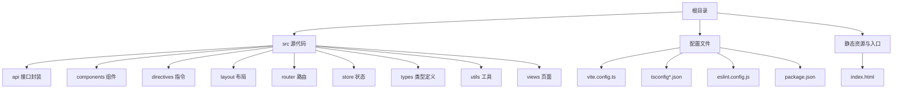
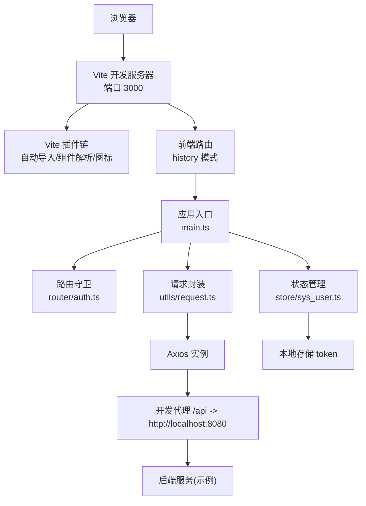
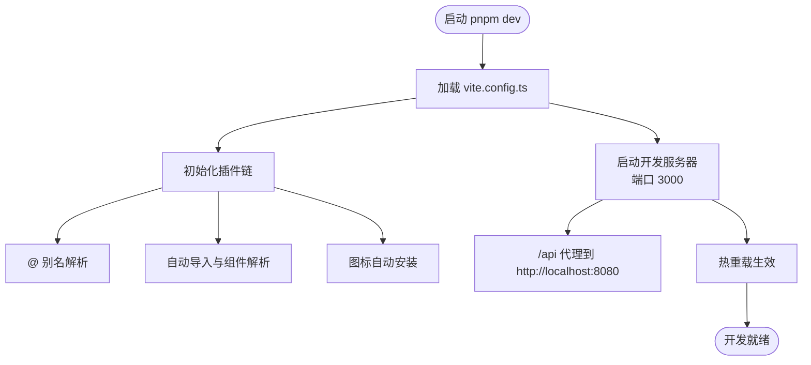
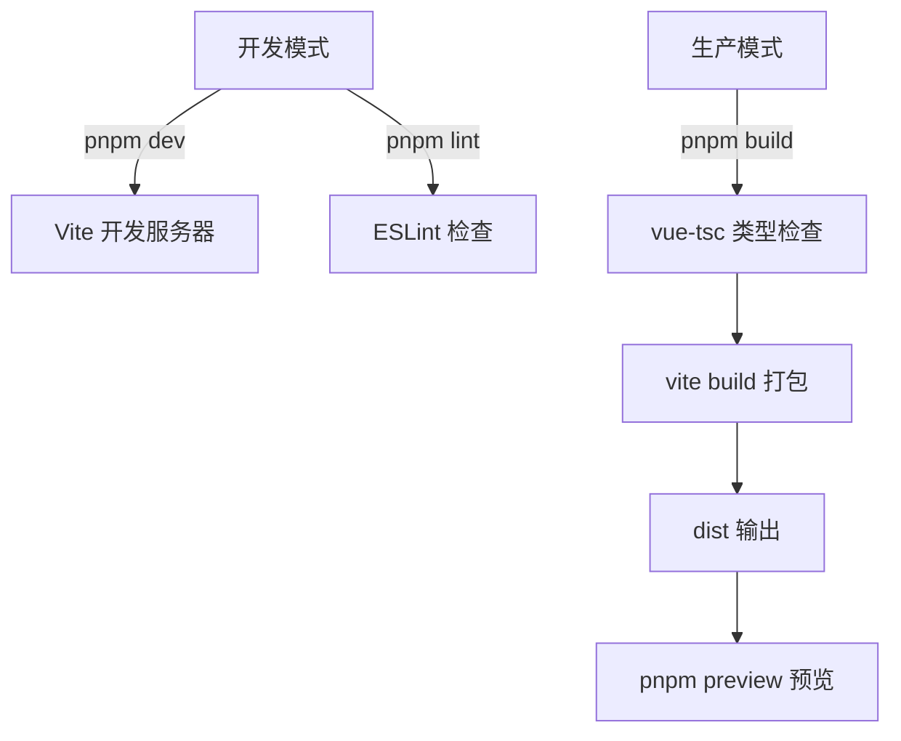
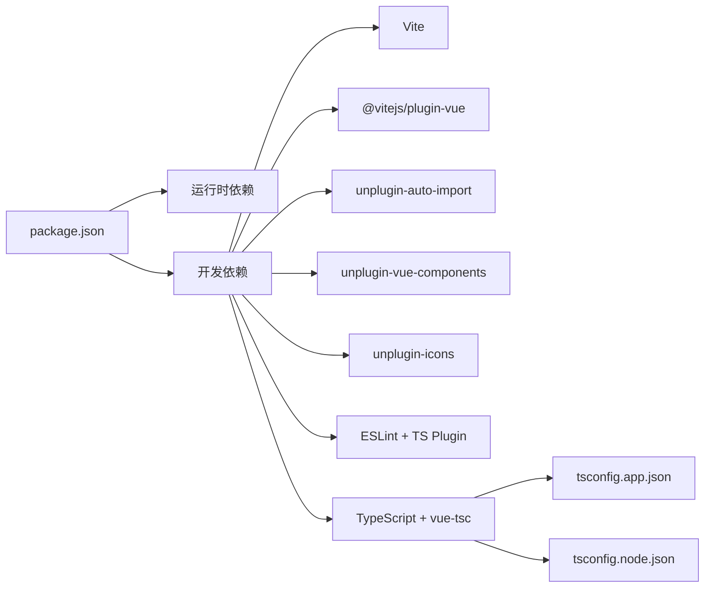
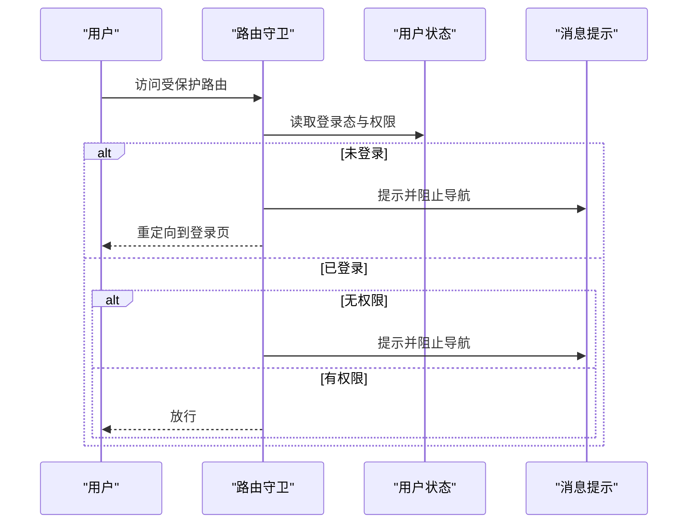

# 开发流程

<cite>
**本文引用的文件**
- [package.json](file://package.json)
- [vite.config.ts](file://vite.config.ts)
- [README.md](file://README.md)
- [eslint.config.js](file://eslint.config.js)
- [tsconfig.json](file://tsconfig.json)
- [tsconfig.app.json](file://tsconfig.app.json)
- [tsconfig.node.json](file://tsconfig.node.json)
- [src/main.ts](file://src/main.ts)
- [src/router/auth.ts](file://src/router/auth.ts)
- [src/store/auth.ts](file://src/store/auth.ts)
- [src/store/sys_user.ts](file://src/store/sys_user.ts)
- [src/utils/request.ts](file://src/utils/request.ts)
- [src/directives/auth.ts](file://src/directives/auth.ts)
- [src/directives/permission.ts](file://src/directives/permission.ts)
- [src/api/auth.ts](file://src/api/auth.ts)
</cite>

## 目录
1. [简介](#简介)
2. [项目结构](#项目结构)
3. [核心组件](#核心组件)
4. [架构总览](#架构总览)
5. [详细组件分析](#详细组件分析)
6. [依赖分析](#依赖分析)
7. [性能考虑](#性能考虑)
8. [故障排查指南](#故障排查指南)
9. [结论](#结论)
10. [附录](#附录)

## 简介
本指南面向从零开始到生产部署的完整开发流程，覆盖开发环境搭建（Node.js 版本、包管理器与依赖安装）、Vite 开发服务器启动与配置（热重载、代理、环境变量）、构建与打包（开发/生产差异）、Git 工作流与代码审查、以及调试技巧与开发工具使用。项目采用 Vue 3 + TypeScript + Vite 技术栈，集成 Element Plus、Pinia、Vue Router、Axios 等生态模块。

## 项目结构
项目采用“功能域+分层”的组织方式：
- 源代码位于 src 目录，按功能划分为 api、components、directives、layout、router、store、types、utils、views 等子目录
- 根级配置文件控制构建、类型检查、ESLint、Vite 行为
- 包管理器使用 pnpm（从锁文件可见）

图表来源
- [vite.config.ts](file://vite.config.ts#L1-L49)
- [tsconfig.json](file://tsconfig.json#L1-L8)
- [tsconfig.app.json](file://tsconfig.app.json#L1-L17)
- [tsconfig.node.json](file://tsconfig.node.json#L1-L27)
- [package.json](file://package.json#L1-L38)

章节来源
- [README.md](file://README.md#L1-L6)
- [package.json](file://package.json#L1-L38)
- [vite.config.ts](file://vite.config.ts#L1-L49)
- [tsconfig.json](file://tsconfig.json#L1-L8)

## 核心组件
- 应用入口与插件注册：在应用入口集中注册 Element Plus、路由、状态管理、全局指令等
- 路由与权限：基于路由元信息与 Pinia 用户态进行登录态与权限校验
- 状态管理：基于 Pinia 的用户 Store，持久化 token 并提供权限判断
- 请求封装：基于 Axios 的服务实例，统一处理鉴权头、错误提示与登出逻辑
- 全局指令：权限与角色指令，支持字符串与数组两种绑定形式
- 构建与类型：Vite + vue-tsc 双轨构建；多 tsconfig 分离应用与 Node 环境类型

章节来源
- [src/main.ts](file://src/main.ts#L1-L27)
- [src/router/auth.ts](file://src/router/index.ts#L1-L123)
- [src/store/auth.ts](file://src/store/index.ts#L1-L6)
- [src/store/sys_user.ts](file://src/store/user.ts#L1-L68)
- [src/utils/request.ts](file://src/utils/request.ts#L1-L102)
- [src/directives/auth.ts](file://src/directives/index.ts#L1-L16)
- [src/directives/permission.ts](file://src/directives/permission.ts#L1-L67)
- [src/api/auth.ts](file://src/api/auth.ts#L1-L18)

## 架构总览
下图展示从浏览器到后端 API 的典型交互路径，以及开发服务器代理与本地存储的关系。

图表来源
- [vite.config.ts](file://vite.config.ts#L11-L48)
- [src/main.ts](file://src/main.ts#L1-L27)
- [src/router/auth.ts](file://src/router/index.ts#L94-L120)
- [src/store/sys_user.ts](file://src/store/user.ts#L10-L66)
- [src/utils/request.ts](file://src/utils/request.ts#L5-L11)

## 详细组件分析

### 开发环境搭建与依赖安装
- Node.js 版本与包管理器
  - 使用 pnpm 作为包管理器（锁文件存在）
  - TypeScript 版本约 5.9.x，建议 Node LTS（如 18/20）以获得最佳兼容性
- 依赖安装
  - 安装命令：pnpm install
  - 运行时依赖：Vue 3、Element Plus、Axios、Pinia、Vue Router
  - 开发依赖：Vite、@vitejs/plugin-vue、unplugin-* 生态、ESLint、TypeScript、vue-tsc
- 类型与构建配置
  - 多 tsconfig：分离 DOM 与 Node 环境，确保 Vite 与类型检查协同
  - ESLint 配置启用 Vue 与 TS 规则，并忽略 dist、node_modules、声明文件

章节来源
- [package.json](file://package.json#L12-L36)
- [tsconfig.json](file://tsconfig.json#L1-L8)
- [tsconfig.app.json](file://tsconfig.app.json#L1-L17)
- [tsconfig.node.json](file://tsconfig.node.json#L1-L27)
- [eslint.config.js](file://eslint.config.js#L1-L42)

### Vite 开发服务器启动与配置
- 启动命令
  - 开发：pnpm dev（调用 vite）
  - 预览：pnpm preview（生产预览）
- 端口与代理
  - 默认端口 3000
  - 代理规则：/api 前缀转发至 http://localhost:8080，并去除前缀
- 插件生态
  - 自动导入：自动引入 Vue/Pinia/Router API 与组件、图标解析
  - 组件自动注册：Element Plus 与图标组件自动解析
  - 路径别名：@ 指向 src
- 热重载与类型检查
  - Vite 提供快速热重载
  - 类型检查通过 vue-tsc 在构建阶段执行

图表来源
- [vite.config.ts](file://vite.config.ts#L11-L48)

章节来源
- [vite.config.ts](file://vite.config.ts#L1-L49)
- [package.json](file://package.json#L6-L11)

### 构建与打包流程（开发 vs 生产）
- 开发构建
  - 类型检查：pnpm run lint（ESLint）
  - 启动开发服务器：pnpm dev
- 生产构建
  - 类型检查与打包：pnpm run build（先执行 vue-tsc 再 vite build）
  - 预览产物：pnpm preview
- 开发与生产差异
  - 开发：启用 HMR、插件链、代理、严格类型检查
  - 生产：最小化、Tree-shaking、生成静态资源与 HTML

图表来源
- [package.json](file://package.json#L6-L11)
- [vite.config.ts](file://vite.config.ts#L11-L48)

章节来源
- [package.json](file://package.json#L6-L11)
- [vite.config.ts](file://vite.config.ts#L11-L48)

### Git 工作流程、分支管理与代码审查
- 分支策略建议
  - 主分支：main（受保护），仅允许通过合并请求合入
  - 功能分支：feature/*，修复分支：fix/*，发布分支：release/*
- 提交规范
  - 建议使用约定式提交（如 feat、fix、docs、style、refactor、test、chore）
- 代码审查
  - 合并请求需至少一名维护者审查并通过
  - 合并前确保通过 CI（类型检查、ESLint、单元测试）
- 日志与变更记录
  - 保持清晰的提交历史，必要时生成变更日志

（本节为通用实践说明，不直接分析具体文件）

### 调试技巧与开发工具
- 浏览器调试
  - 使用 Vue DevTools 检查组件树、状态与路由
  - 控制台查看请求拦截器与响应拦截器输出
- 状态调试
  - 在浏览器开发者工具中观察 Pinia Store 的 token、userInfo、permissions
- 网络与代理
  - 关注 /api 前缀请求是否正确转发至后端服务
  - 如遇跨域问题，检查代理 changeOrigin 与路径重写
- 类型与语法
  - 使用 pnpm lint 快速定位未使用变量、显式 any 等问题
  - 在 IDE 中启用 ESLint 与 TypeScript 检查实时提示

章节来源
- [src/utils/request.ts](file://src/utils/request.ts#L14-L78)
- [src/store/sys_user.ts](file://src/store/user.ts#L10-L66)
- [eslint.config.js](file://eslint.config.js#L21-L26)

## 依赖分析
- 应用运行时依赖
  - Vue 3、Element Plus、Axios、Pinia、Vue Router、Sass
- 开发工具依赖
  - Vite、@vitejs/plugin-vue、unplugin-auto-import、unplugin-icons、unplugin-vue-components、ESLint、TypeScript、vue-tsc
- 类型与构建
  - tsconfig.app.json 面向 DOM 环境，tsconfig.node.json 面向 Node 环境，配合 Vite bundler 模式

图表来源
- [package.json](file://package.json#L12-L36)
- [tsconfig.app.json](file://tsconfig.app.json#L1-L17)
- [tsconfig.node.json](file://tsconfig.node.json#L1-L27)

章节来源
- [package.json](file://package.json#L12-L36)
- [tsconfig.app.json](file://tsconfig.app.json#L1-L17)
- [tsconfig.node.json](file://tsconfig.node.json#L1-L27)

## 性能考虑
- 代码分割与懒加载
  - 路由与视图组件采用动态导入，减少首屏体积
- 组件与图标
  - 使用 unplugin-vue-components 与 Element Plus 解析器，按需注册组件与图标
- 构建优化
  - 生产构建开启压缩与 Tree-shaking；避免打包无用类型声明
- 网络请求
  - Axios 统一超时与错误处理，避免重复请求与无效重试

章节来源
- [src/router/auth.ts](file://src/router/index.ts#L10-L120)
- [vite.config.ts](file://vite.config.ts#L14-L32)
- [src/utils/request.ts](file://src/utils/request.ts#L5-L11)

## 故障排查指南
- 无法访问 /api
  - 检查代理配置与目标地址是否可达
  - 确认请求头 Authorization 是否正确注入
- 登录后仍被重定向到登录页
  - 检查本地 token 是否持久化成功
  - 确认后端返回的 code 与消息，401 会触发登出逻辑
- 权限相关按钮/菜单不显示
  - 检查路由元信息中的 permission 与用户权限集合
  - 检查 v-permission 绑定值（字符串或数组）
- ESLint 报错
  - 使用 pnpm lint 修复可自动修复的问题
  - 对于未使用变量、显式 any 等规则，按需调整或重构

章节来源
- [vite.config.ts](file://vite.config.ts#L40-L46)
- [src/utils/request.ts](file://src/utils/request.ts#L35-L78)
- [src/store/sys_user.ts](file://src/store/user.ts#L52-L65)
- [src/directives/permission.ts](file://src/directives/permission.ts#L9-L31)
- [eslint.config.js](file://eslint.config.js#L21-L26)

## 结论
本指南提供了从环境准备、开发服务器配置、构建打包、Git 工作流到调试与故障排查的完整路径。遵循上述流程与最佳实践，可高效完成从开发到生产的全流程交付。

## 附录

### 开发服务器启动与常用命令
- 启动开发服务器：pnpm dev
- 预览生产构建：pnpm preview
- 类型检查与修复：pnpm lint
- 生产构建：pnpm build

章节来源
- [package.json](file://package.json#L6-L11)

### 路由与权限校验流程

图表来源
- [src/router/auth.ts](file://src/router/index.ts#L94-L120)
- [src/store/sys_user.ts](file://src/store/user.ts#L17-L23)