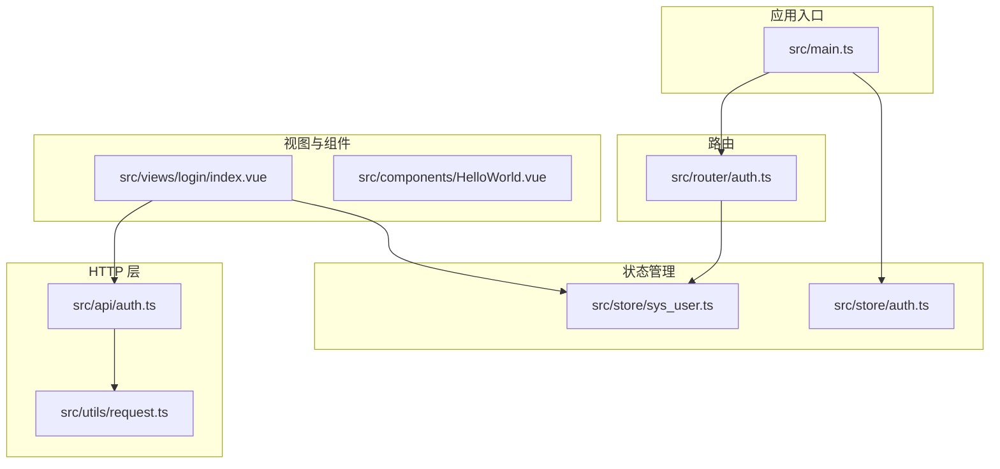
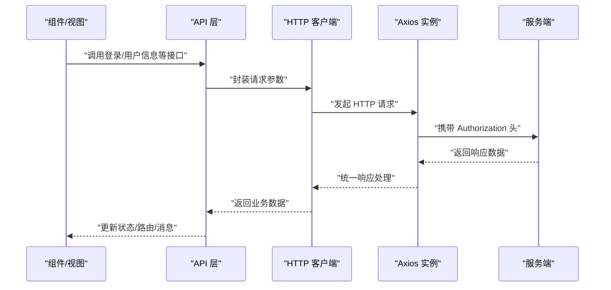
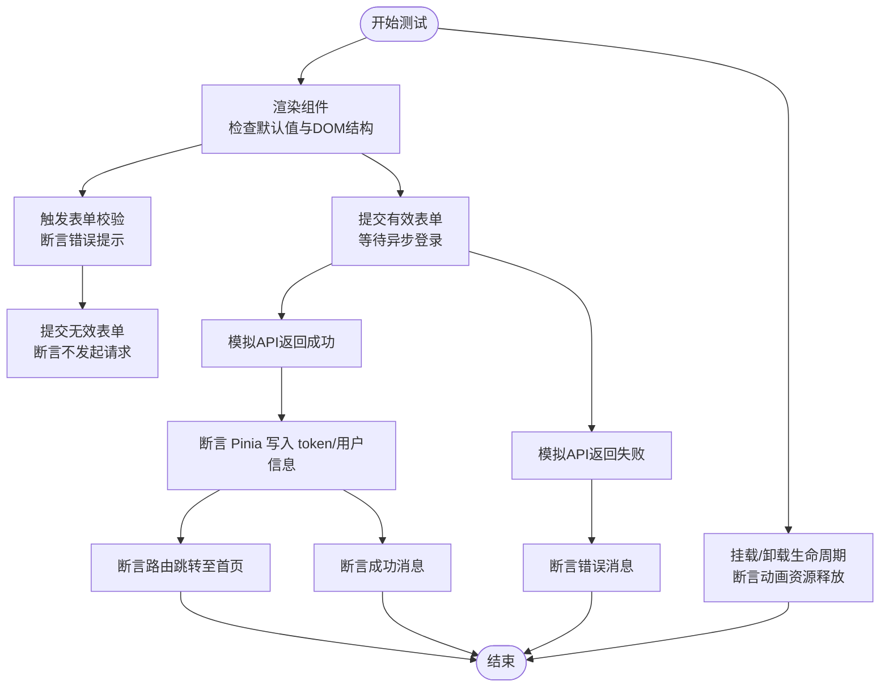
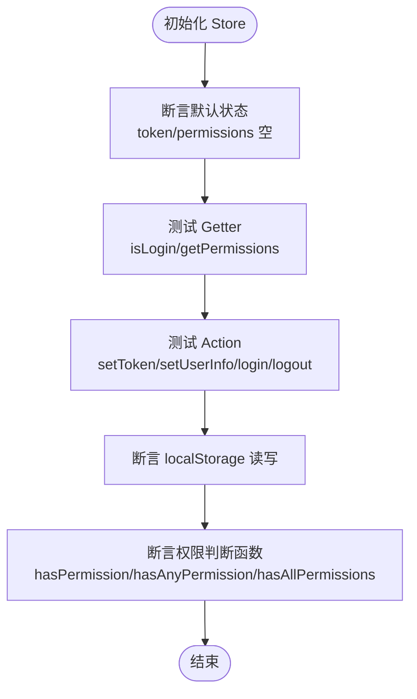
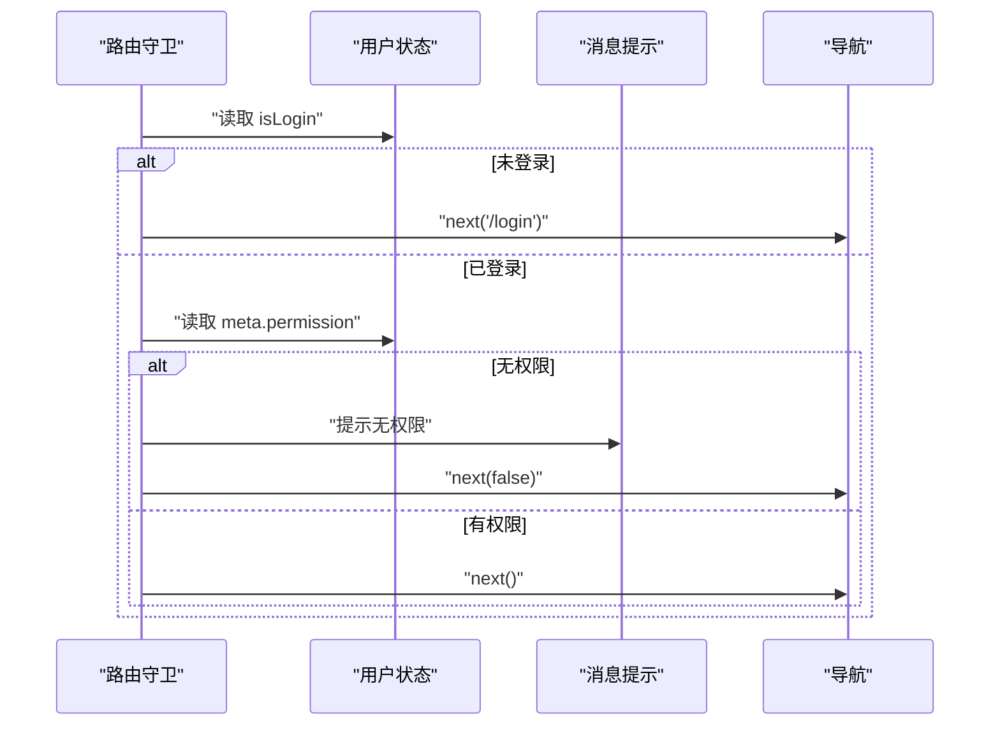
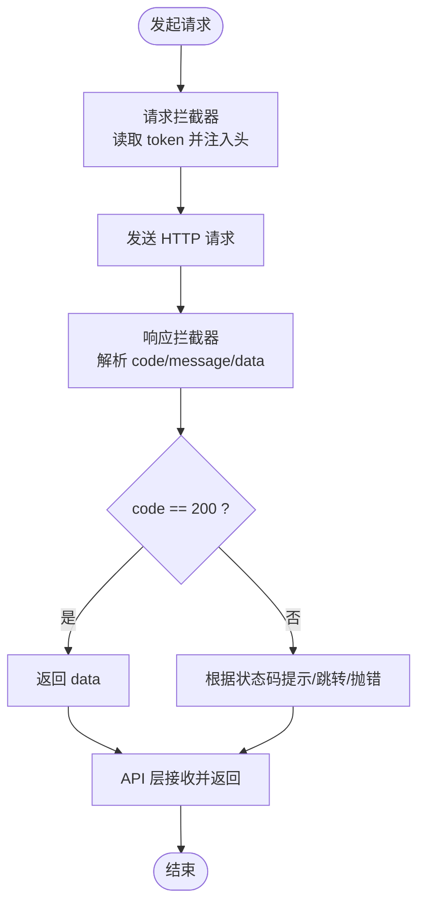
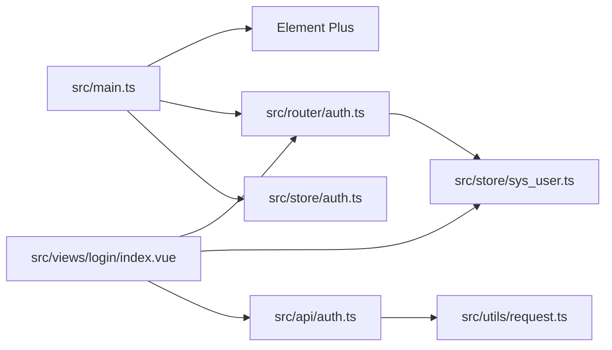

# 测试指南

<cite>
**本文引用的文件**
- [package.json](file://package.json)
- [vite.config.ts](file://vite.config.ts)
- [src/main.ts](file://src/main.ts)
- [src/store/auth.ts](file://src/store/auth.ts)
- [src/store/sys_user.ts](file://src/store/sys_user.ts)
- [src/router/auth.ts](file://src/router/auth.ts)
- [src/utils/request.ts](file://src/utils/request.ts)
- [src/api/auth.ts](file://src/api/auth.ts)
- [src/views/login/index.vue](file://src/views/login/index.vue)
- [src/components/HelloWorld.vue](file://src/components/HelloWorld.vue)
- [src/types/auth.ts](file://src/types/auth.ts)
- [README.md](file://README.md)
</cite>

## 目录
1. [简介](#简介)
2. [项目结构](#项目结构)
3. [核心组件](#核心组件)
4. [架构总览](#架构总览)
5. [详细组件分析](#详细组件分析)
6. [依赖分析](#依赖分析)
7. [性能考虑](#性能考虑)
8. [故障排查指南](#故障排查指南)
9. [结论](#结论)
10. [附录](#附录)

## 简介
本测试指南面向使用 Vue 3 + TypeScript + Vite 的前端工程，围绕单元测试、集成测试与端到端测试的编写方法展开，重点覆盖以下方面：
- Jest 或 Vitest 的配置与使用（含测试环境设置与模拟数据准备）
- Vue 组件测试最佳实践（渲染、事件、Props/Emits）
- Vuex/Pinia 状态管理测试方法与 API 请求模拟
- 测试覆盖率要求与在持续集成中的执行策略
- 具体测试用例示例与测试驱动开发（TDD）实践建议

本指南以仓库现有代码为依据，结合实际模块关系与交互流程，给出可落地的测试方案。

## 项目结构
该项目采用标准的 Vue 3 + Vite 工程布局，核心目录与职责如下：
- src/api：封装业务 API 方法（如登录、用户信息、登出）
- src/utils：封装 HTTP 客户端（基于 axios），统一拦截器与请求方法
- src/store：基于 Pinia 的状态管理（用户 token、权限等）
- src/router：基于 vue-router 的路由与导航守卫
- src/views 与 src/components：页面与通用组件
- vite.config.ts：Vite 插件与代理配置
- package.json：脚本与依赖声明

图表来源
- [src/main.ts](file://src/main.ts#L1-L27)
- [src/store/auth.ts](file://src/store/index.ts#L1-L6)
- [src/store/sys_user.ts](file://src/store/user.ts#L1-L68)
- [src/router/auth.ts](file://src/router/index.ts#L1-L123)
- [src/utils/request.ts](file://src/utils/request.ts#L1-L102)
- [src/api/auth.ts](file://src/api/auth.ts#L1-L18)
- [src/views/login/index.vue](file://src/views/login/index.vue#L1-L257)
- [src/components/HelloWorld.vue](file://src/components/HelloWorld.vue#L1-L42)

章节来源
- [README.md](file://README.md#L1-L6)
- [package.json](file://package.json#L1-L38)
- [vite.config.ts](file://vite.config.ts#L1-L49)

## 核心组件
- 应用入口与插件注册：在入口文件中完成 Element Plus、路由、Pinia、全局指令的注册，便于在测试中按需挂载或替换。
- Pinia 用户状态：提供 token、userInfo、permissions 的读取与写入，以及登录、登出、权限校验等动作。
- 路由与守卫：实现页面标题设置、登录态校验与权限控制。
- HTTP 客户端：统一的 axios 实例与拦截器，负责请求头注入、错误处理与统一响应格式。
- API 层：对 HTTP 客户端进行薄封装，暴露具体业务接口。
- 视图与组件：登录页包含复杂交互与动画逻辑；通用组件用于基础功能验证。

章节来源
- [src/main.ts](file://src/main.ts#L1-L27)
- [src/store/sys_user.ts](file://src/store/user.ts#L1-L68)
- [src/router/auth.ts](file://src/router/index.ts#L1-L123)
- [src/utils/request.ts](file://src/utils/request.ts#L1-L102)
- [src/api/auth.ts](file://src/api/auth.ts#L1-L18)
- [src/views/login/index.vue](file://src/views/login/index.vue#L1-L257)
- [src/components/HelloWorld.vue](file://src/components/HelloWorld.vue#L1-L42)

## 架构总览
下图展示测试视角下的关键交互路径：组件调用 API → HTTP 客户端发送请求 → 后端接口 → 返回数据 → 组件更新状态与视图。

图表来源
- [src/views/login/index.vue](file://src/views/login/index.vue#L68-L106)
- [src/api/auth.ts](file://src/api/auth.ts#L1-L18)
- [src/utils/request.ts](file://src/utils/request.ts#L1-L102)

## 详细组件分析

### 登录视图组件测试
登录页包含表单校验、异步登录流程、动画与生命周期处理。测试要点：
- 渲染与默认值：校验初始表单值、按钮文案、样式类名等
- 表单校验：输入非法字段时阻止提交，正确提示
- 异步登录：模拟接口返回，断言 store 写入、路由跳转、消息提示
- 生命周期：挂载与卸载时动画资源清理
- 权限与路由：结合路由守卫测试无权限访问行为

图表来源
- [src/views/login/index.vue](file://src/views/login/index.vue#L45-L106)
- [src/store/sys_user.ts](file://src/store/user.ts#L38-L50)
- [src/router/auth.ts](file://src/router/index.ts#L94-L120)

章节来源
- [src/views/login/index.vue](file://src/views/login/index.vue#L1-L257)
- [src/store/sys_user.ts](file://src/store/user.ts#L1-L68)
- [src/router/auth.ts](file://src/router/index.ts#L1-L123)

### Pinia 状态管理测试
测试目标：
- 初始化状态：token、userInfo、permissions 的默认值
- Getter 行为：isLogin、权限查询函数
- Action 行为：setToken、setUserInfo、login、logout、hasPermission 等
- 与本地存储交互：登录/登出对 localStorage 的读写

图表来源
- [src/store/sys_user.ts](file://src/store/user.ts#L10-L67)
- [src/store/auth.ts](file://src/store/index.ts#L1-L6)

章节来源
- [src/store/sys_user.ts](file://src/store/user.ts#L1-L68)
- [src/store/auth.ts](file://src/store/index.ts#L1-L6)

### 路由与守卫测试
测试目标：
- 页面标题设置：根据 meta.title 设置 document.title
- 登录态校验：未登录访问受保护路由时重定向至登录页
- 权限校验：无权限访问时阻止跳转并提示

图表来源
- [src/router/auth.ts](file://src/router/index.ts#L94-L120)
- [src/store/sys_user.ts](file://src/store/user.ts#L17-L23)

章节来源
- [src/router/auth.ts](file://src/router/index.ts#L1-L123)
- [src/store/sys_user.ts](file://src/store/user.ts#L1-L68)

### HTTP 客户端与 API 测试
测试目标：
- 请求拦截器：自动注入 Authorization 头
- 响应拦截器：统一错误处理与状态码判断
- 封装方法：get/post/put/del 的可用性
- 与 API 层配合：login/getUserInfo/logout 的调用链

图表来源
- [src/utils/request.ts](file://src/utils/request.ts#L14-L78)
- [src/api/auth.ts](file://src/api/auth.ts#L1-L18)

章节来源
- [src/utils/request.ts](file://src/utils/request.ts#L1-L102)
- [src/api/auth.ts](file://src/api/auth.ts#L1-L18)

### Vue 组件测试最佳实践
- 渲染测试：使用测试运行器挂载组件，断言初始 DOM 结构与文本
- 事件触发：通过用户操作（点击、输入）触发事件，断言回调与状态变化
- Props/Emits：验证传入属性的行为与对外派发事件
- 模拟外部依赖：对 store、router、API 进行模块级 mock，避免真实副作用
- 快照与稳定性：对复杂组件输出进行快照对比，确保 UI 变更可控

章节来源
- [src/components/HelloWorld.vue](file://src/components/HelloWorld.vue#L1-L42)
- [src/views/login/index.vue](file://src/views/login/index.vue#L45-L106)

### API 请求模拟技术
- 在单元测试中使用模块替身（mock）替换 API 层与 HTTP 客户端
- 对 axios 实例进行拦截器级别的模拟，或直接对封装方法进行替身
- 针对不同场景构造成功/失败响应，覆盖边界条件与异常分支

章节来源
- [src/api/auth.ts](file://src/api/auth.ts#L1-L18)
- [src/utils/request.ts](file://src/utils/request.ts#L1-L102)

## 依赖分析
- 应用入口依赖：Element Plus、路由、Pinia、全局指令
- 登录页依赖：路由、Pinia 用户状态、Element Plus 表单与消息组件
- 路由依赖：用户状态 store 以实现守卫逻辑
- HTTP 客户端依赖：axios，提供拦截器与统一方法封装
- API 层依赖：HTTP 客户端，向上提供业务接口

图表来源
- [src/main.ts](file://src/main.ts#L1-L27)
- [src/router/auth.ts](file://src/router/index.ts#L1-L123)
- [src/store/auth.ts](file://src/store/index.ts#L1-L6)
- [src/store/sys_user.ts](file://src/store/user.ts#L1-L68)
- [src/api/auth.ts](file://src/api/auth.ts#L1-L18)
- [src/utils/request.ts](file://src/utils/request.ts#L1-L102)

章节来源
- [src/main.ts](file://src/main.ts#L1-L27)
- [src/router/auth.ts](file://src/router/index.ts#L1-L123)
- [src/store/sys_user.ts](file://src/store/user.ts#L1-L68)
- [src/utils/request.ts](file://src/utils/request.ts#L1-L102)
- [src/api/auth.ts](file://src/api/auth.ts#L1-L18)

## 性能考虑
- 测试运行性能：优先使用模块级 mock，减少真实网络请求与 DOM 操作
- 组件测试：对动画与定时器进行控制或替换，避免阻塞测试执行
- 状态测试：使用最小化 store 快照，避免不必要的状态同步
- 覆盖率：关注关键路径（登录、权限、错误处理）与边界条件（空值、异常）

## 故障排查指南
- 登录失败提示：确认响应拦截器对错误码的处理与消息提示逻辑
- 权限不足：检查路由守卫中权限判断与消息提示
- 本地存储异常：核对登录/登出对 localStorage 的读写时机
- 路由跳转异常：确认守卫中 next 的调用顺序与条件分支

章节来源
- [src/utils/request.ts](file://src/utils/request.ts#L30-L78)
- [src/router/auth.ts](file://src/router/index.ts#L94-L120)
- [src/store/sys_user.ts](file://src/store/user.ts#L44-L50)

## 结论
本指南基于仓库现有代码，给出了从组件到状态、路由与 HTTP 层的测试策略与实践建议。建议在团队内统一测试规范，优先保障关键业务路径的覆盖率，并在 CI 中执行测试与覆盖率检查，确保质量稳定。

## 附录

### 测试工具与配置建议（基于现有工程）
- 测试运行器：推荐 Vitest（与 Vite 生态契合度高）
- 测试环境：使用 jsdom 或 DOM 环境，结合 Vue Test Utils 进行组件测试
- 模块模拟：对 API 层与 HTTP 客户端进行模块级替身，避免真实网络请求
- 类型支持：保持与项目 TypeScript 配置一致，确保类型安全

章节来源
- [package.json](file://package.json#L1-L38)
- [vite.config.ts](file://vite.config.ts#L1-L49)

### 测试覆盖率与 CI 执行
- 覆盖率目标：建议关键模块（store、router、utils、api）达到较高覆盖率，组件与业务逻辑至少 80%
- CI 执行：在构建前运行测试与覆盖率统计，失败即中断流水线

章节来源
- [package.json](file://package.json#L6-L11)

### TDD 实践建议
- 从最小可运行需求开始：先写失败的测试，再实现最简逻辑
- 逐步完善：针对边界与异常分支补充测试，再扩展实现
- 回归与重构：在保证测试通过的前提下进行重构与优化