# 调试与性能优化

<cite>
**本文档引用的文件**
- [src/main.ts](file://src/main.ts)
- [src/router/auth.ts](file://src/router/auth.ts)
- [src/store/auth.ts](file://src/store/auth.ts)
- [src/store/sys_user.ts](file://src/store/sys_user.ts)
- [src/utils/request.ts](file://src/utils/request.ts)
- [vite.config.ts](file://vite.config.ts)
- [src/directives/permission.ts](file://src/directives/permission.ts)
- [src/directives/auth.ts](file://src/directives/auth.ts)
- [src/views/login/index.vue](file://src/views/login/index.vue)
- [src/layout/index.vue](file://src/layout/index.vue)
- [src/App.vue](file://src/App.vue)
- [src/types/auth.ts](file://src/types/auth.ts)
- [package.json](file://package.json)
</cite>

## 目录
1. [简介](#简介)
2. [项目结构](#项目结构)
3. [核心组件](#核心组件)
4. [架构概览](#架构概览)
5. [详细组件分析](#详细组件分析)
6. [依赖关系分析](#依赖关系分析)
7. [性能考虑](#性能考虑)
8. [故障排除指南](#故障排除指南)
9. [结论](#结论)

## 简介

本指南专注于Vue 3 TypeScript管理系统的调试和性能优化策略。该系统采用现代化的技术栈，包括Vue 3 Composition API、TypeScript、Vite构建工具、Pinia状态管理和Element Plus UI组件库。本文档提供了从开发调试到生产性能优化的完整指导，涵盖浏览器开发者工具使用、常见问题诊断、性能监控指标和优化技术等关键内容。

## 项目结构

该项目采用模块化架构设计，主要分为以下几个核心模块：

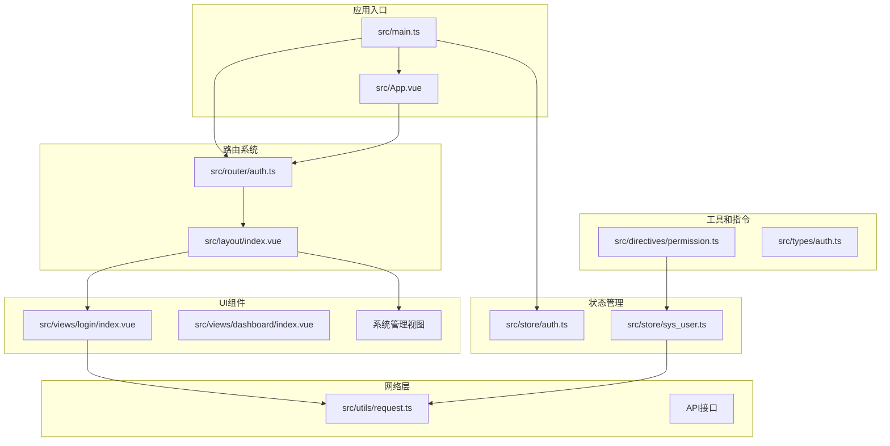

**图表来源**
- [src/main.ts](file://src/main.ts#L1-L27)
- [src/router/auth.ts](file://src/router/index.ts#L1-L123)
- [src/store/auth.ts](file://src/store/index.ts#L1-L6)

**章节来源**
- [src/main.ts](file://src/main.ts#L1-L27)
- [src/App.vue](file://src/App.vue#L1-L51)
- [vite.config.ts](file://vite.config.ts#L1-L49)

## 核心组件

### 应用初始化流程

应用启动时通过主入口文件进行初始化，注册必要的插件和服务：

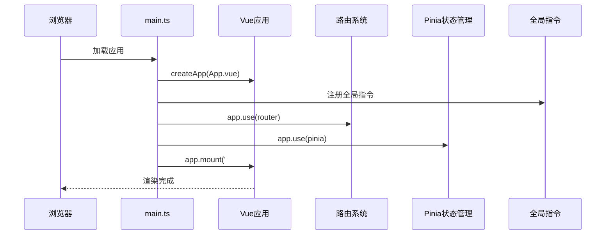

**图表来源**
- [src/main.ts](file://src/main.ts#L11-L26)
- [src/directives/auth.ts](file://src/directives/index.ts#L7-L13)

### 路由系统架构

系统采用Vue Router实现前端路由管理，支持嵌套路由和动态导入：

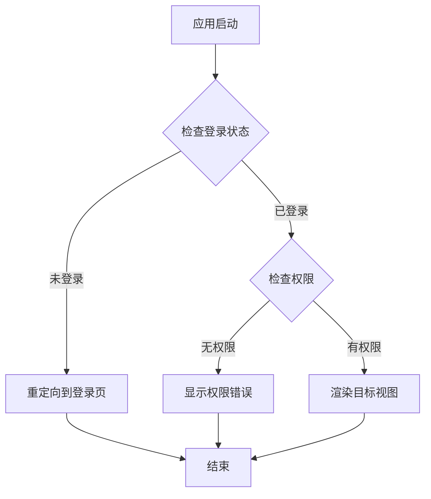

**图表来源**
- [src/router/auth.ts](file://src/router/index.ts#L95-L120)

**章节来源**
- [src/main.ts](file://src/main.ts#L1-L27)
- [src/router/auth.ts](file://src/router/index.ts#L1-L123)

## 架构概览

系统采用分层架构设计，各层职责明确：

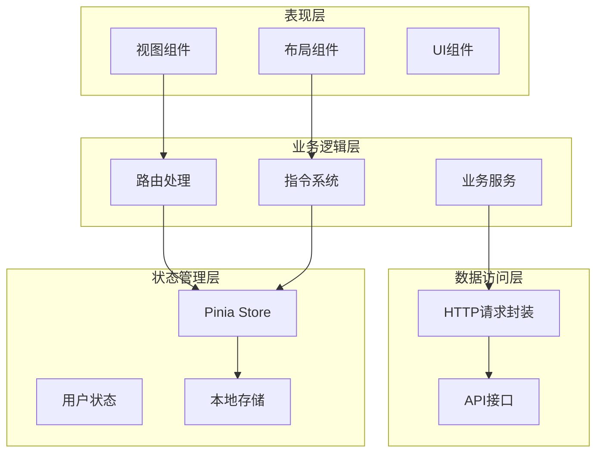

**图表来源**
- [src/layout/index.vue](file://src/layout/index.vue#L78-L134)
- [src/directives/permission.ts](file://src/directives/permission.ts#L9-L31)
- [src/utils/request.ts](file://src/utils/request.ts#L1-L102)

## 详细组件分析

### 状态管理系统

Pinia状态管理提供了类型安全的状态存储和管理：

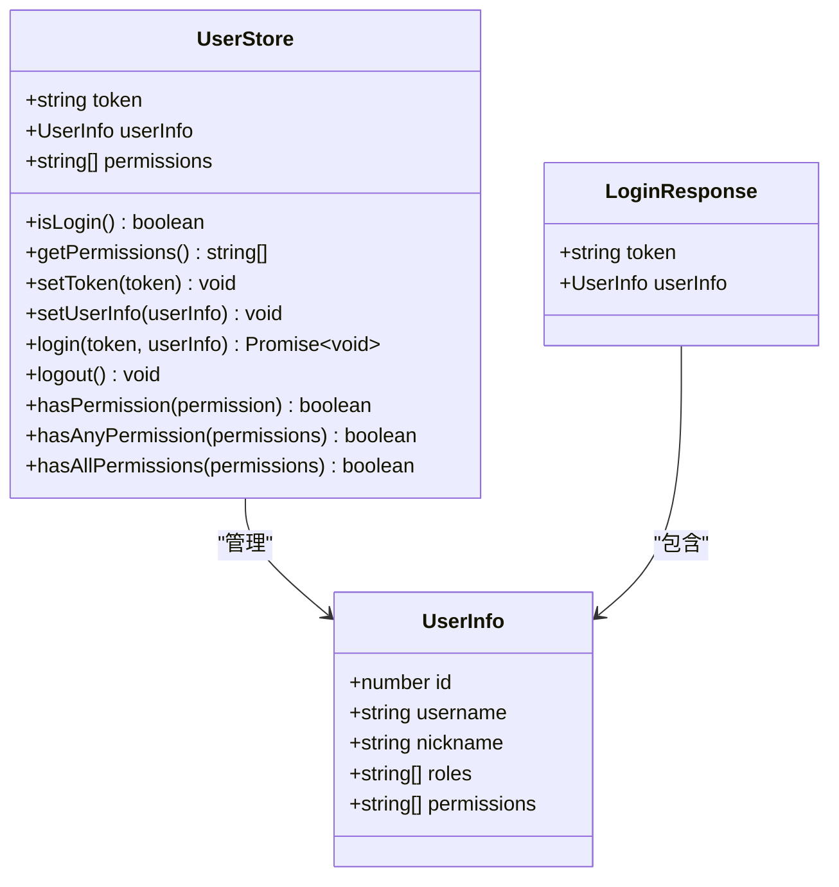

**图表来源**
- [src/store/sys_user.ts](file://src/store/user.ts#L4-L67)
- [src/types/auth.ts](file://src/types/index.ts#L2-L23)

#### 状态管理最佳实践

1. **类型安全**: 所有状态都定义了明确的TypeScript类型
2. **持久化存储**: Token自动保存到localStorage
3. **权限检查**: 提供多种权限检查方法
4. **异步操作**: 支持异步登录流程

**章节来源**
- [src/store/sys_user.ts](file://src/store/user.ts#L1-L68)
- [src/types/auth.ts](file://src/types/index.ts#L1-L45)

### 权限控制系统

自定义指令系统实现了细粒度的权限控制：

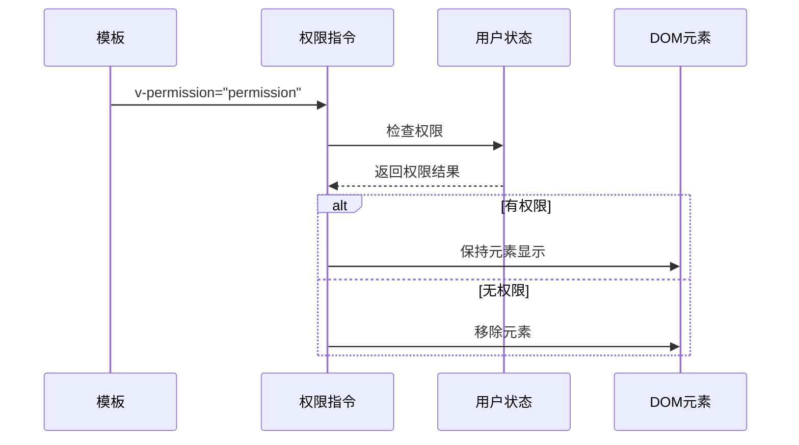

**图表来源**
- [src/directives/permission.ts](file://src/directives/permission.ts#L10-L29)

#### 权限指令特性

1. **灵活的权限表达式**: 支持字符串和数组两种形式
2. **超级权限**: `*:*:*` 可以绕过权限检查
3. **实时更新**: 权限变化时自动重新评估
4. **DOM优化**: 无权限时直接移除DOM节点

**章节来源**
- [src/directives/permission.ts](file://src/directives/permission.ts#L1-L67)
- [src/directives/auth.ts](file://src/directives/index.ts#L1-L16)

### 网络请求封装

HTTP请求通过Axios封装，提供统一的错误处理和拦截器：

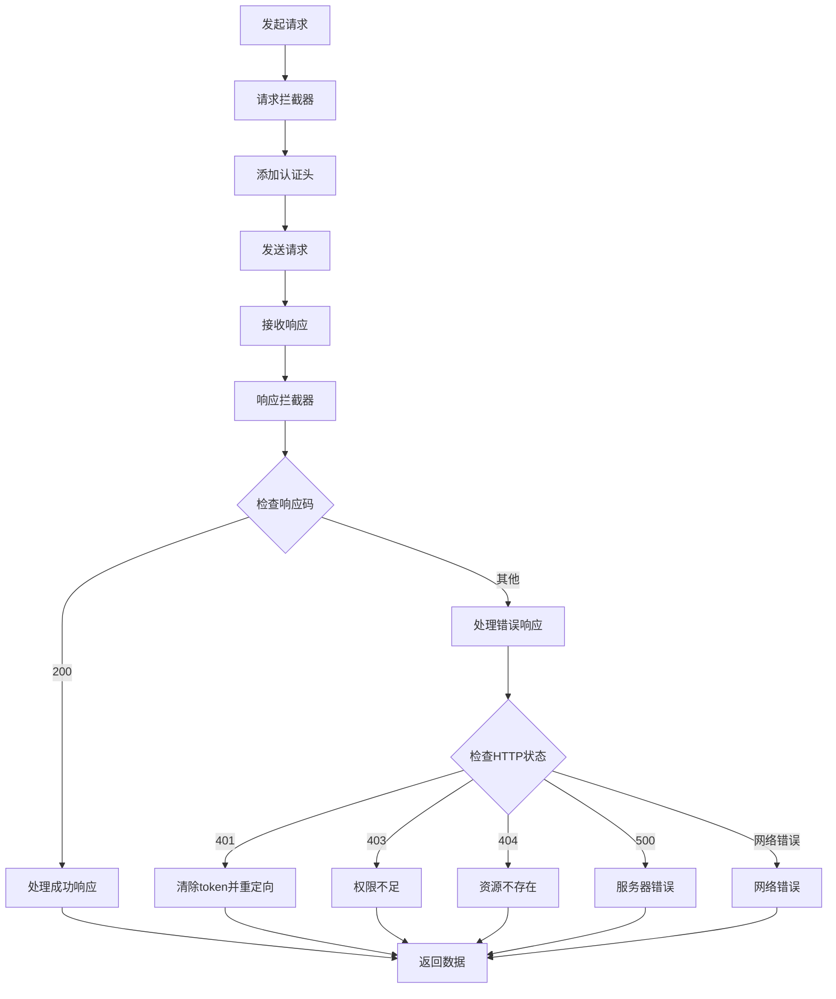

**图表来源**
- [src/utils/request.ts](file://src/utils/request.ts#L14-L78)

**章节来源**
- [src/utils/request.ts](file://src/utils/request.ts#L1-L102)

### 构建配置优化

Vite配置提供了开发和生产环境的优化设置：

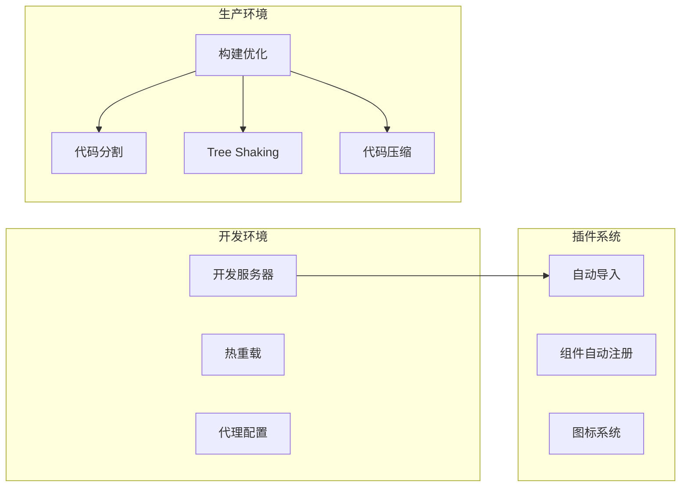

**图表来源**
- [vite.config.ts](file://vite.config.ts#L11-L48)

**章节来源**
- [vite.config.ts](file://vite.config.ts#L1-L49)

## 依赖关系分析

系统依赖关系清晰，采用松耦合设计：

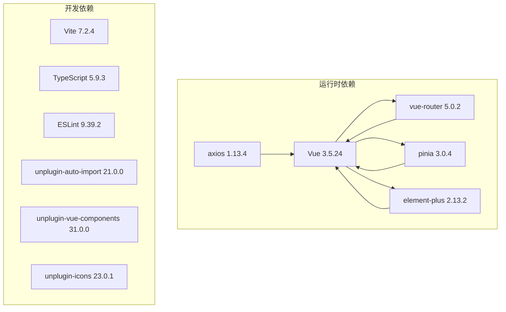

**图表来源**
- [package.json](file://package.json#L12-L36)

**章节来源**
- [package.json](file://package.json#L1-L38)

## 性能考虑

### 代码分割和懒加载

系统充分利用Vue Router的动态导入实现代码分割：

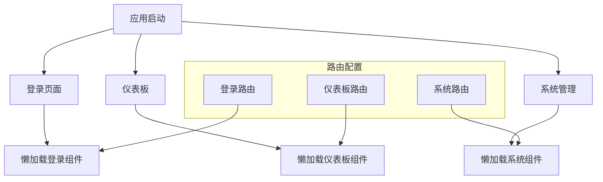

**图表来源**
- [src/router/auth.ts](file://src/router/index.ts#L10-L85)

### 缓存策略

系统采用多层缓存机制：

1. **HTTP缓存**: Axios实例配置了合理的超时时间
2. **本地存储**: Token和用户信息持久化存储
3. **组件缓存**: Vue Router的keep-alive功能
4. **浏览器缓存**: Vite构建的静态资源缓存

### 内存管理

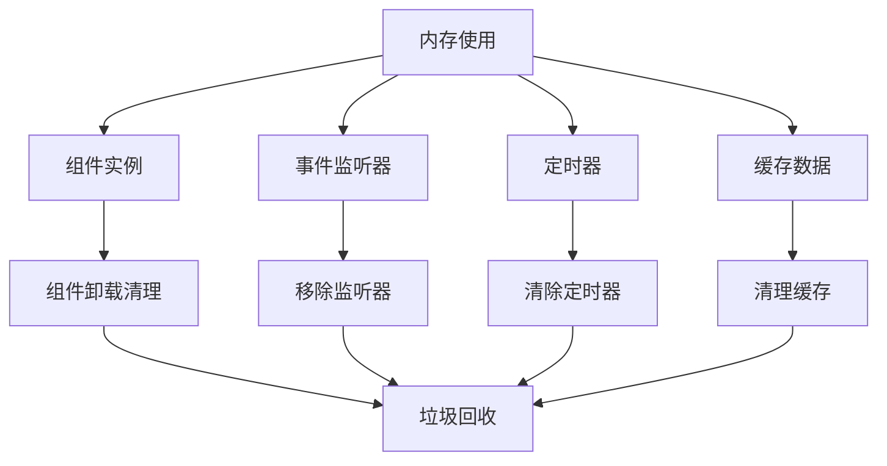

**章节来源**
- [src/views/login/index.vue](file://src/views/login/index.vue#L187-L197)
- [src/layout/index.vue](file://src/layout/index.vue#L119-L133)

## 故障排除指南

### 路由跳转问题诊断

#### 常见路由问题及解决方案

1. **循环重定向问题**
   - 检查路由配置中的redirect属性
   - 验证路由守卫逻辑
   - 确认用户登录状态

2. **权限相关跳转失败**
   - 检查用户权限数据
   - 验证权限字符串格式
   - 确认路由meta.permission配置

3. **懒加载组件不显示**
   - 检查组件路径配置
   - 验证组件导出格式
   - 确认打包配置

**章节来源**
- [src/router/auth.ts](file://src/router/index.ts#L95-L120)

### 状态管理异常诊断

#### Pinia状态问题排查

1. **状态不同步**
   - 检查store实例创建
   - 验证状态更新方式
   - 确认响应式数据结构

2. **权限检查失败**
   - 验证用户权限数据
   - 检查权限字符串格式
   - 确认权限检查方法调用

3. **Token失效**
   - 检查localStorage存储
   - 验证token格式
   - 确认路由守卫逻辑

**章节来源**
- [src/store/sys_user.ts](file://src/store/user.ts#L25-L66)

### API请求失败诊断

#### HTTP请求问题排查

1. **认证失败**
   - 检查token存储和传递
   - 验证认证头格式
   - 确认后端认证接口

2. **网络连接问题**
   - 检查代理配置
   - 验证API地址
   - 确认CORS设置

3. **响应数据异常**
   - 验证API响应格式
   - 检查错误码处理
   - 确认数据转换逻辑

**章节来源**
- [src/utils/request.ts](file://src/utils/request.ts#L14-L78)

### 性能问题诊断

#### 性能监控指标

1. **首屏加载时间**
   - 分析路由懒加载效果
   - 检查资源加载顺序
   - 优化关键渲染路径

2. **内存使用情况**
   - 监控组件实例数量
   - 检查事件监听器泄漏
   - 验证定时器清理

3. **CPU使用率**
   - 分析动画性能
   - 检查重计算优化
   - 优化渲染频率

**章节来源**
- [src/views/login/index.vue](file://src/views/login/index.vue#L139-L179)

### 开发者工具使用指南

#### 浏览器开发者工具最佳实践

1. **Vue DevTools使用**
   - 安装Vue DevTools扩展
   - 检查组件树结构
   - 监控状态变化
   - 分析组件性能

2. **网络面板分析**
   - 监控API请求
   - 分析响应时间
   - 检查缓存命中率
   - 识别阻塞请求

3. **性能面板优化**
   - 分析JavaScript执行时间
   - 监控内存使用
   - 识别渲染瓶颈
   - 优化重绘重排

4. **Elements面板调试**
   - 检查DOM结构
   - 分析CSS样式
   - 调试事件绑定
   - 验证权限指令效果

**章节来源**
- [src/directives/permission.ts](file://src/directives/permission.ts#L9-L31)

### 生产环境问题排查

#### 日志记录和监控

1. **错误日志收集**
   - 实现全局错误处理器
   - 记录用户操作轨迹
   - 监控API调用错误

2. **性能监控**
   - 收集关键性能指标
   - 监控用户体验指标
   - 设置性能告警阈值

3. **用户行为分析**
   - 跟踪用户导航路径
   - 分析功能使用情况
   - 识别异常使用模式

**章节来源**
- [src/utils/request.ts](file://src/utils/request.ts#L24-L27)
- [src/utils/request.ts](file://src/utils/request.ts#L50-L77)

## 结论

本指南提供了Vue 3 TypeScript管理系统的完整调试和性能优化方案。通过合理利用Vue DevTools、网络面板和性能面板，结合系统的权限控制、状态管理和网络请求封装机制，可以有效解决开发和生产环境中的各种问题。

关键要点包括：
- 利用Vue Router的动态导入实现代码分割
- 通过Pinia实现类型安全的状态管理
- 使用Axios拦截器统一处理HTTP请求
- 通过自定义指令实现细粒度的权限控制
- 在开发环境中充分利用Vite的热重载和代理功能
- 在生产环境中关注性能指标和用户体验

建议在实际项目中根据具体需求调整配置，并建立完善的监控和日志体系，确保系统的稳定性和可维护性。