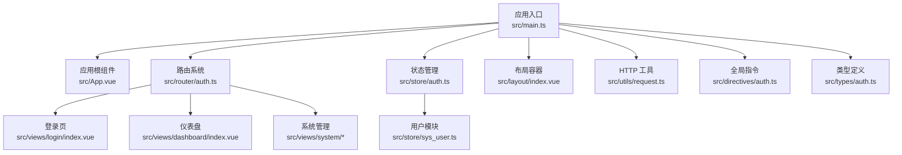
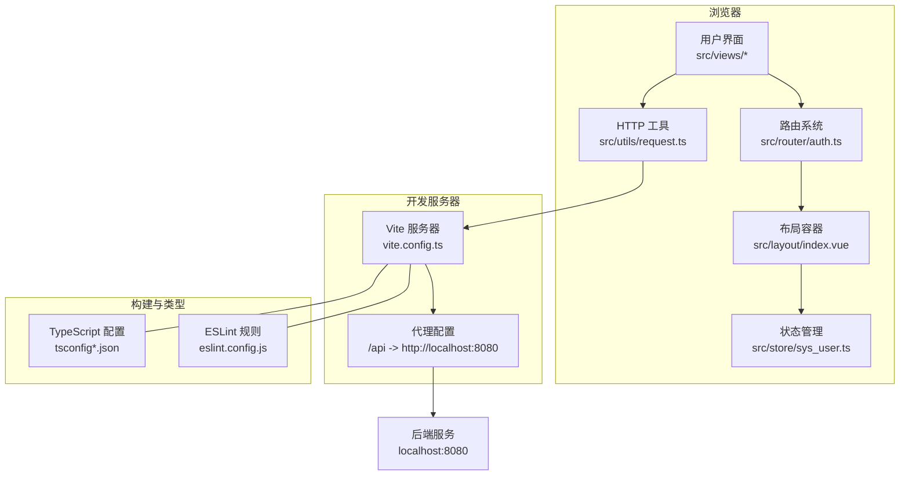

# 快速开始

<cite>
**本文引用的文件**
- [package.json](file://package.json)
- [README.md](file://README.md)
- [vite.config.ts](file://vite.config.ts)
- [tsconfig.json](file://tsconfig.json)
- [tsconfig.app.json](file://tsconfig.app.json)
- [tsconfig.node.json](file://tsconfig.node.json)
- [eslint.config.js](file://eslint.config.js)
- [src/main.ts](file://src/main.ts)
- [src/App.vue](file://src/App.vue)
- [src/router/auth.ts](file://src/router/auth.ts)
- [src/store/auth.ts](file://src/store/auth.ts)
- [src/store/sys_user.ts](file://src/store/sys_user.ts)
- [src/layout/index.vue](file://src/layout/index.vue)
- [src/views/login/index.vue](file://src/views/login/index.vue)
- [src/utils/request.ts](file://src/utils/request.ts)
- [src/directives/auth.ts](file://src/directives/auth.ts)
- [src/types/auth.ts](file://src/types/auth.ts)
</cite>

## 目录
1. [简介](#简介)
2. [项目结构](#项目结构)
3. [核心组件](#核心组件)
4. [架构总览](#架构总览)
5. [详细组件分析](#详细组件分析)
6. [依赖分析](#依赖分析)
7. [性能考虑](#性能考虑)
8. [故障排除指南](#故障排除指南)
9. [结论](#结论)
10. [附录](#附录)

## 简介
本指南面向首次接触 Vue TypeScript Admin 项目的开发者，帮助你在约 30 分钟内完成环境准备、安装依赖、启动开发服务器，并完成首次登录与基础功能演示。项目采用 Vue 3 + TypeScript + Vite 技术栈，集成了路由、状态管理、UI 组件库、自动导入与 ESLint 规则，具备可扩展的权限体系与代理配置。

## 项目结构
项目采用“按功能域分层 + 组合式 API”的组织方式，核心目录与职责如下：
- src/api：API 接口定义（当前为空，便于接入后端）
- src/components：通用组件（示例：HelloWorld.vue）
- src/directives：全局指令注册与权限指令（permission、role）
- src/layout：布局容器与侧边栏菜单
- src/router：路由定义与全局前置守卫
- src/store：Pinia 状态管理入口与用户模块
- src/types：TypeScript 类型定义（用户、登录、响应、菜单等）
- src/utils：HTTP 请求封装（基于 axios 的拦截器与工具函数）
- src/views：页面视图（登录、仪表盘、系统管理子模块）
- 根目录配置：Vite、TypeScript、ESLint、包管理脚本

图表来源
- [src/main.ts](file://src/main.ts#L1-L27)
- [src/App.vue](file://src/App.vue#L1-L51)
- [src/router/auth.ts](file://src/router/index.ts#L1-L119)
- [src/store/auth.ts](file://src/store/index.ts#L1-L6)
- [src/layout/index.vue](file://src/layout/index.vue#L1-L255)
- [src/views/login/index.vue](file://src/views/login/index.vue#L1-L257)
- [src/store/sys_user.ts](file://src/store/user.ts#L1-L68)
- [src/utils/request.ts](file://src/utils/request.ts#L1-L102)
- [src/directives/auth.ts](file://src/directives/index.ts#L1-L16)
- [src/types/auth.ts](file://src/types/index.ts#L1-L45)

章节来源
- [src/main.ts](file://src/main.ts#L1-L27)
- [src/App.vue](file://src/App.vue#L1-L51)
- [src/router/auth.ts](file://src/router/index.ts#L1-L119)
- [src/store/auth.ts](file://src/store/index.ts#L1-L6)
- [src/layout/index.vue](file://src/layout/index.vue#L1-L255)
- [src/views/login/index.vue](file://src/views/login/index.vue#L1-L257)
- [src/store/sys_user.ts](file://src/store/user.ts#L1-L68)
- [src/utils/request.ts](file://src/utils/request.ts#L1-L102)
- [src/directives/auth.ts](file://src/directives/index.ts#L1-L16)
- [src/types/auth.ts](file://src/types/index.ts#L1-L45)

## 核心组件
- 应用入口与插件注册：在入口文件中创建应用实例，注册 Element Plus、路由、状态管理、全局指令与图标组件。
- 路由与守卫：定义登录、仪表盘、系统管理等路由，并在进入受保护路由前进行登录态与权限校验。
- 状态管理：使用 Pinia 管理 token、用户信息与权限列表，支持持久化与权限判断。
- 布局与菜单：侧边栏根据路由生成菜单项，支持权限过滤与折叠切换。
- 登录页：内置表单校验、模拟登录流程与动态背景动画。
- HTTP 工具：统一的 axios 实例，包含请求/响应拦截器与常用方法封装，支持代理转发。

章节来源
- [src/main.ts](file://src/main.ts#L1-L27)
- [src/router/auth.ts](file://src/router/index.ts#L1-L119)
- [src/store/sys_user.ts](file://src/store/user.ts#L1-L68)
- [src/layout/index.vue](file://src/layout/index.vue#L1-L255)
- [src/views/login/index.vue](file://src/views/login/index.vue#L1-L257)
- [src/utils/request.ts](file://src/utils/request.ts#L1-L102)

## 架构总览
下图展示了从浏览器到后端服务的请求链路，以及前端内部的模块交互关系。

图表来源
- [vite.config.ts](file://vite.config.ts#L1-L49)
- [src/utils/request.ts](file://src/utils/request.ts#L1-L102)
- [src/router/auth.ts](file://src/router/index.ts#L1-L119)
- [src/layout/index.vue](file://src/layout/index.vue#L1-L255)
- [src/store/sys_user.ts](file://src/store/user.ts#L1-L68)
- [tsconfig.app.json](file://tsconfig.app.json#L1-L17)
- [tsconfig.node.json](file://tsconfig.node.json#L1-L27)
- [eslint.config.js](file://eslint.config.js#L1-L42)

## 详细组件分析

### 开发服务器与热重载
- 启动命令：通过包管理脚本启动 Vite 开发服务器，支持热重载与实时刷新。
- 端口与代理：开发服务器默认监听本地端口，配置了 /api 前缀代理至后端服务地址。
- 自动导入：集成自动导入插件，减少重复引入，提升开发效率。

章节来源
- [package.json](file://package.json#L6-L11)
- [vite.config.ts](file://vite.config.ts#L38-L47)

### 路由与权限控制
- 路由结构：包含登录页、仪表盘、系统管理（用户、角色、菜单）等页面；支持嵌套路由与重定向。
- 全局守卫：在进入非登录路由前检查登录态与权限，无权限时提示并阻止导航。
- 页面标题：根据路由元信息设置页面标题，增强用户体验。

章节来源
- [src/router/auth.ts](file://src/router/index.ts#L1-L119)

### 状态管理（Pinia）
- 用户模块：维护 token、用户信息与权限列表，支持登录、退出、权限判断等动作。
- 持久化：token 存储于本地存储，刷新后仍保持登录态。
- 权限判断：提供多种权限判断方法，满足不同场景需求。

章节来源
- [src/store/sys_user.ts](file://src/store/user.ts#L1-L68)
- [src/store/auth.ts](file://src/store/index.ts#L1-L6)

### 布局与菜单
- 菜单生成：根据路由表动态生成菜单，支持图标、折叠与权限过滤。
- 顶部栏：展示用户信息与下拉菜单，支持退出登录等操作。
- 过渡动画：页面切换时提供淡入淡出过渡效果。

章节来源
- [src/layout/index.vue](file://src/layout/index.vue#L1-L255)

### 登录流程
- 表单校验：对用户名与密码进行必填校验。
- 模拟登录：提交后模拟异步登录，成功后写入用户信息与 token 并跳转首页。
- 动态背景：登录页包含 Canvas 动态粒子背景，提升视觉体验。

章节来源
- [src/views/login/index.vue](file://src/views/login/index.vue#L1-L257)

### HTTP 请求封装
- 统一实例：创建带基础配置的 axios 实例，设置基础路径与超时时间。
- 请求拦截：自动注入 Authorization 头部（若存在 token）。
- 响应拦截：统一处理业务状态码与错误提示，401 时清理 token 并跳转登录。
- 工具方法：提供 get、post、put、delete 等常用方法。

章节来源
- [src/utils/request.ts](file://src/utils/request.ts#L1-L102)

### 类型定义
- 用户信息：包含标识、账号、昵称、头像、邮箱、角色与权限数组。
- 登录表单与响应：定义登录输入与返回数据结构。
- API 响应：统一的响应体结构，便于前后端约定。
- 菜单项：描述路由菜单的结构与元信息。

章节来源
- [src/types/auth.ts](file://src/types/index.ts#L1-L45)

### 全局指令与图标
- 指令注册：集中注册权限与角色相关指令，便于在模板中使用。
- 图标组件：遍历注册 Element Plus 图标组件，减少手动引入。

章节来源
- [src/directives/auth.ts](file://src/directives/index.ts#L1-L16)
- [src/main.ts](file://src/main.ts#L13-L16)

## 依赖分析
- 运行时依赖：Vue 3、Vue Router、Pinia、Element Plus、Axios、Sass 等。
- 开发依赖：Vite、TypeScript、ESLint、Vue 类型配置、自动导入与组件解析插件等。
- 脚本命令：dev（开发）、build（编译构建）、preview（预览）、lint（代码规范修复）。

章节来源
- [package.json](file://package.json#L12-L36)

## 性能考虑
- 按需加载：路由与视图均采用动态导入，减小首屏体积。
- 插件优化：自动导入与组件解析减少样板代码，提高开发效率。
- 代理与缓存：开发阶段合理利用浏览器缓存与 Vite 热更新，避免不必要的全量刷新。

## 故障排除指南
- 无法启动开发服务器
  - 检查 Node.js 版本与包管理器是否符合项目要求。
  - 清理缓存并重新安装依赖。
  - 确认端口未被占用。
- 登录后无法进入系统
  - 确认路由守卫逻辑与用户权限是否正确设置。
  - 检查本地存储中的 token 是否存在。
- 请求失败或 401
  - 检查代理配置是否指向正确的后端地址。
  - 确认响应拦截器中业务状态码与提示逻辑。
- ESLint 报错
  - 执行 lint 脚本自动修复常见问题。
  - 根据规则调整代码风格或忽略特定规则（谨慎使用）。

章节来源
- [vite.config.ts](file://vite.config.ts#L38-L47)
- [src/router/auth.ts](file://src/router/index.ts#L90-L116)
- [src/utils/request.ts](file://src/utils/request.ts#L30-L78)
- [eslint.config.js](file://eslint.config.js#L21-L26)

## 结论
通过本指南，你可以在短时间内完成环境准备、安装依赖、启动开发服务器，并完成登录与基础功能演示。建议在本地先熟悉路由、状态管理与权限控制机制，再逐步接入真实后端接口与业务模块。

## 附录

### 环境要求
- Node.js：建议使用 LTS 版本（如 18 或 20）。
- 包管理器：推荐使用 pnpm（仓库已提供锁定文件）。
- 浏览器：现代浏览器即可。

章节来源
- [package.json](file://package.json#L1-L38)
- [README.md](file://README.md#L1-L6)

### 安装与运行步骤
- 步骤 1：安装依赖
  - 使用 pnpm 安装项目依赖。
- 步骤 2：启动开发服务器
  - 执行开发脚本，打开浏览器访问开发服务器地址。
- 步骤 3：首次登录
  - 在登录页使用内置账号信息进行登录，进入系统后可查看菜单与页面。
- 步骤 4：构建与预览
  - 执行构建脚本生成生产包，使用预览脚本查看效果。

章节来源
- [package.json](file://package.json#L6-L11)
- [src/views/login/index.vue](file://src/views/login/index.vue#L58-L61)
- [src/router/auth.ts](file://src/router/index.ts#L90-L116)

### 关键配置文件说明
- vite.config.ts：配置插件、别名、开发服务器与代理。
- tsconfig.json/tsconfig.app.json/tsconfig.node.json：分层 TypeScript 编译配置。
- eslint.config.js：ESLint 规则与忽略项。
- package.json：脚本命令与依赖声明。

章节来源
- [vite.config.ts](file://vite.config.ts#L1-L49)
- [tsconfig.json](file://tsconfig.json#L1-L8)
- [tsconfig.app.json](file://tsconfig.app.json#L1-L17)
- [tsconfig.node.json](file://tsconfig.node.json#L1-L27)
- [eslint.config.js](file://eslint.config.js#L1-L42)
- [package.json](file://package.json#L1-L38)

### 首次运行后的基本操作
- 登录验证：使用内置账号登录，观察 token 写入与页面跳转。
- 功能演示：进入仪表盘与系统管理模块，查看菜单与页面内容。
- 权限控制：尝试访问受保护页面，确认权限拦截逻辑生效。

章节来源
- [src/views/login/index.vue](file://src/views/login/index.vue#L68-L106)
- [src/router/auth.ts](file://src/router/index.ts#L90-L116)
- [src/layout/index.vue](file://src/layout/index.vue#L90-L104)