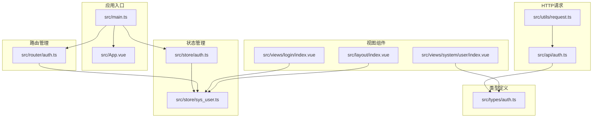
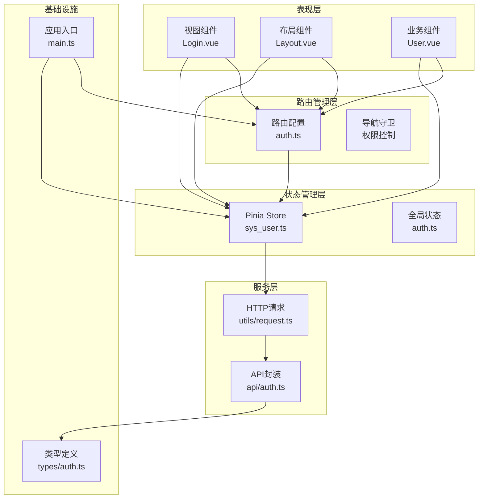
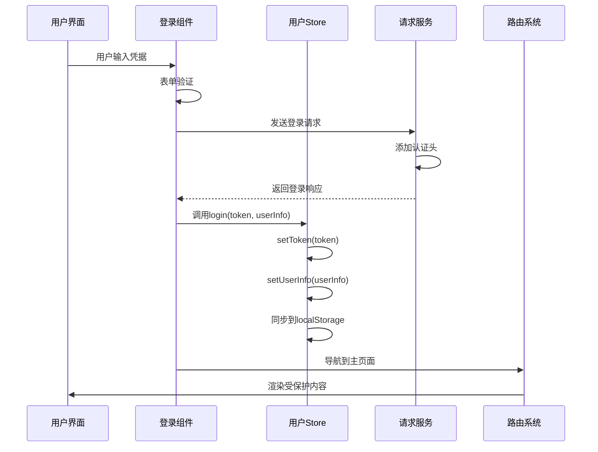
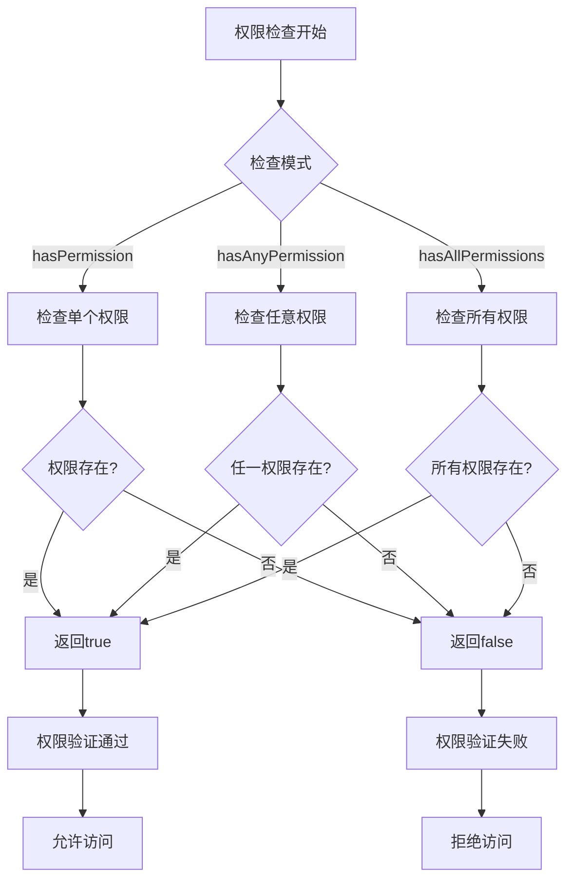
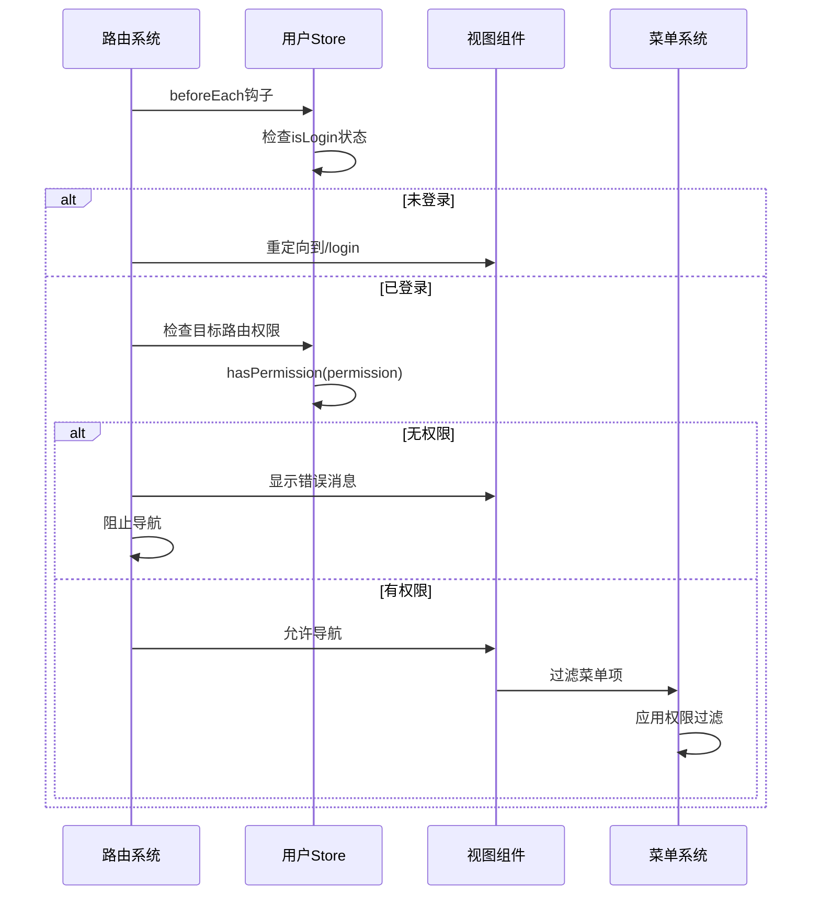
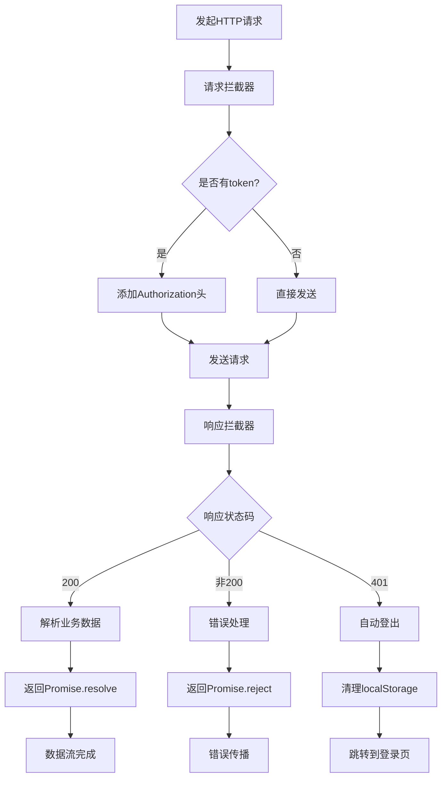

# 数据流设计

<cite>
**本文档引用的文件**
- [main.ts](file://src/main.ts)
- [store/auth.ts](file://src/store/auth.ts)
- [store/sys_user.ts](file://src/store/sys_user.ts)
- [router/auth.ts](file://src/router/auth.ts)
- [utils/request.ts](file://src/utils/request.ts)
- [types/auth.ts](file://src/types/auth.ts)
- [api/auth.ts](file://src/api/auth.ts)
- [views/login/index.vue](file://src/views/login/index.vue)
- [layout/index.vue](file://src/layout/index.vue)
- [views/system/user/index.vue](file://src/views/system/user/index.vue)
- [App.vue](file://src/App.vue)
- [package.json](file://package.json)
</cite>

## 目录
1. [引言](#引言)
2. [项目结构](#项目结构)
3. [核心组件](#核心组件)
4. [架构概览](#架构概览)
5. [详细组件分析](#详细组件分析)
6. [依赖关系分析](#依赖关系分析)
7. [性能考虑](#性能考虑)
8. [故障排除指南](#故障排除指南)
9. [结论](#结论)

## 引言

本项目是一个基于Vue 3 + TypeScript + Pinia + Element Plus构建的后台管理系统。本文档深入分析了应用中的数据流向和状态管理策略，重点涵盖用户状态管理、路由状态同步、API数据处理以及Pinia Store的设计模式。

该系统采用现代化的前端架构，通过Pinia实现集中式状态管理，结合Vue Router进行路由控制，并使用Axios封装HTTP请求。整个数据流设计遵循单向数据流原则，确保状态变更的可预测性和可追踪性。

## 项目结构

项目采用模块化的文件组织方式，主要目录结构如下：



**图表来源**
- [main.ts](file://src/main.ts#L1-L27)
- [store/auth.ts](file://src/store/index.ts#L1-L6)
- [router/auth.ts](file://src/router/index.ts#L1-L123)

**章节来源**
- [main.ts](file://src/main.ts#L1-L27)
- [package.json](file://package.json#L1-L38)

## 核心组件

### 状态管理核心

系统的核心状态管理由Pinia提供，主要包含以下关键组件：

#### 用户状态存储（User Store）
- **状态结构**：token、userInfo、permissions
- **持久化策略**：自动同步到localStorage
- **权限管理**：支持单个权限检查、任意权限检查、全部权限检查
- **认证状态**：通过token判断登录状态

#### 全局状态初始化
- **Pinia实例创建**：在应用启动时初始化
- **插件注册**：与Vue应用集成
- **类型安全**：完整的TypeScript类型定义

**章节来源**
- [store/sys_user.ts](file://src/store/user.ts#L1-L68)
- [store/auth.ts](file://src/store/index.ts#L1-L6)
- [types/auth.ts](file://src/types/index.ts#L1-L45)

### 路由控制系统

路由系统实现了完整的权限控制和导航管理：

#### 路由配置
- **嵌套路由**：支持多级菜单结构
- **动态权限**：基于用户权限的菜单过滤
- **懒加载**：按需加载组件提升性能

#### 导航守卫
- **登录状态检查**：未登录自动跳转
- **权限验证**：动态检查页面访问权限
- **标题设置**：根据路由元信息设置页面标题

**章节来源**
- [router/auth.ts](file://src/router/index.ts#L1-L123)

### HTTP请求层

统一的HTTP请求封装提供了完整的错误处理和拦截机制：

#### 请求拦截器
- **Token注入**：自动添加认证头
- **请求预处理**：统一的请求配置
- **错误捕获**：及时发现请求问题

#### 响应拦截器
- **状态码验证**：统一处理业务状态
- **错误分类**：不同HTTP状态的差异化处理
- **自动登出**：401状态的自动清理机制

**章节来源**
- [utils/request.ts](file://src/utils/request.ts#L1-L102)

## 架构概览

系统采用分层架构设计，各层职责清晰，耦合度低：



**图表来源**
- [main.ts](file://src/main.ts#L1-L27)
- [store/sys_user.ts](file://src/store/user.ts#L1-L68)
- [router/auth.ts](file://src/router/index.ts#L1-L123)
- [utils/request.ts](file://src/utils/request.ts#L1-L102)
- [api/auth.ts](file://src/api/auth.ts#L1-L18)

## 详细组件分析

### 用户状态管理流程

用户状态管理是整个系统的核心，涉及多个组件间的协调工作：



**图表来源**
- [views/login/index.vue](file://src/views/login/index.vue#L68-L106)
- [store/sys_user.ts](file://src/store/user.ts#L38-L50)
- [utils/request.ts](file://src/utils/request.ts#L14-L28)

#### 状态变更机制

用户状态的变更遵循严格的单向数据流：

1. **初始化阶段**：从localStorage读取token
2. **登录阶段**：setToken写入localStorage并更新内存状态
3. **权限同步**：setUserInfo同时更新权限数组
4. **状态监听**：组件自动响应状态变化

#### 权限检查策略

系统提供了三种权限检查模式：



**图表来源**
- [store/sys_user.ts](file://src/store/user.ts#L52-L65)

**章节来源**
- [store/sys_user.ts](file://src/store/user.ts#L1-L68)
- [views/login/index.vue](file://src/views/login/index.vue#L68-L106)

### 路由状态同步机制

路由系统与状态管理深度集成，实现了双向同步：



**图表来源**
- [router/auth.ts](file://src/router/index.ts#L94-L120)
- [layout/index.vue](file://src/layout/index.vue#L91-L104)

#### 菜单权限过滤

菜单系统的权限过滤逻辑：

1. **路由扫描**：遍历所有路由配置
2. **权限提取**：从meta.permission获取权限标识
3. **权限匹配**：使用用户权限进行匹配
4. **结果应用**：动态生成可访问的菜单树

**章节来源**
- [router/auth.ts](file://src/router/index.ts#L94-L120)
- [layout/index.vue](file://src/layout/index.vue#L91-L104)

### API数据处理流程

HTTP请求处理采用统一的拦截器模式：



**图表来源**
- [utils/request.ts](file://src/utils/request.ts#L14-L78)

#### 错误处理策略

系统实现了多层次的错误处理机制：

1. **请求级错误**：网络异常、超时等
2. **响应级错误**：HTTP状态码错误
3. **业务级错误**：后端返回的业务错误
4. **自动恢复**：401状态的自动登出机制

**章节来源**
- [utils/request.ts](file://src/utils/request.ts#L1-L102)

### 数据验证规则

系统在多个层面实施数据验证：

#### 类型安全
- **接口定义**：完整的TypeScript接口
- **运行时验证**：表单字段验证
- **编译时检查**：类型推导和约束

#### 表单验证
- **必填字段**：用户名、密码的必填检查
- **实时反馈**：输入时的即时验证
- **提交验证**：提交前的完整验证

**章节来源**
- [types/auth.ts](file://src/types/index.ts#L1-L45)
- [views/login/index.vue](file://src/views/login/index.vue#L63-L66)

## 依赖关系分析

系统各模块间的依赖关系清晰明确：

```mermaid
graph LR
subgraph "外部依赖"
A[vue@^3.5.24]
B[pinia@^3.0.4]
C[axios@^1.13.4]
D[element-plus@^2.13.2]
E[vue-router@^5.0.2]
end
subgraph "内部模块"
F[main.ts]
G[store/sys_user.ts]
H[router/auth.ts]
I[utils/request.ts]
J[api/auth.ts]
K[types/auth.ts]
end
F --> A
F --> B
F --> C
F --> D
F --> E
G --> B
H --> E
I --> C
J --> I
J --> K
G --> K
H --> K
```

**图表来源**
- [package.json](file://package.json#L12-L20)
- [main.ts](file://src/main.ts#L1-L27)

### 循环依赖检测

经过分析，系统不存在循环依赖：
- Store不依赖Router
- Router不依赖Store
- API层独立于状态管理
- Utils层为纯函数工具

**章节来源**
- [package.json](file://package.json#L1-L38)

## 性能考虑

### 状态管理优化

1. **局部状态优先**：组件内部状态优先于全局状态
2. **计算属性缓存**：利用Vue的响应式缓存机制
3. **状态拆分**：按功能域拆分Store，避免单一Store过大

### 路由性能优化

1. **懒加载组件**：按需加载减少初始包体积
2. **权限预检查**：导航前快速判断权限
3. **菜单缓存**：计算后的菜单树进行缓存

### HTTP请求优化

1. **请求合并**：相似请求的合并处理
2. **超时控制**：合理的超时设置
3. **错误重试**：网络错误的智能重试

## 故障排除指南

### 常见问题及解决方案

#### 登录状态异常
- **症状**：登录后仍显示未登录
- **原因**：localStorage数据损坏
- **解决**：清除浏览器localStorage中的token键

#### 权限访问受限
- **症状**：某些页面无法访问
- **原因**：用户权限不足
- **解决**：检查用户角色和权限分配

#### 请求失败
- **症状**：API调用返回错误
- **原因**：网络问题或后端异常
- **解决**：检查网络连接和后端服务状态

#### 菜单显示异常
- **症状**：菜单项显示不正确
- **原因**：路由配置或权限数据不一致
- **解决**：检查路由配置和用户权限

**章节来源**
- [utils/request.ts](file://src/utils/request.ts#L50-L78)
- [router/auth.ts](file://src/router/index.ts#L110-L116)

## 结论

本项目的数据流设计体现了现代前端应用的最佳实践：

### 设计优势

1. **清晰的分层架构**：表现层、状态层、服务层职责分明
2. **强类型安全保障**：完整的TypeScript类型系统
3. **统一的状态管理**：Pinia提供的集中式状态管理
4. **完善的权限控制**：基于路由和组件的双重权限验证
5. **健壮的错误处理**：多层次的错误捕获和处理机制

### 技术亮点

- **单向数据流**：确保状态变更的可预测性
- **响应式更新**：Vue的响应式系统提供高效的UI更新
- **模块化设计**：清晰的模块边界和依赖关系
- **类型安全**：编译时类型检查防止运行时错误

### 改进建议

1. **增加缓存机制**：为频繁访问的数据添加缓存层
2. **实现状态快照**：支持状态的撤销/重做功能
3. **增强监控能力**：添加状态变更的日志和监控
4. **优化打包策略**：进一步减小bundle大小

该数据流设计为后续的功能扩展和维护奠定了坚实的基础，为构建复杂的后台管理系统提供了可靠的架构支撑。