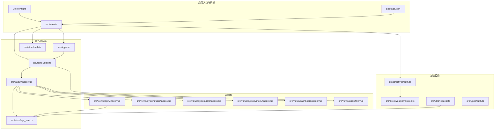
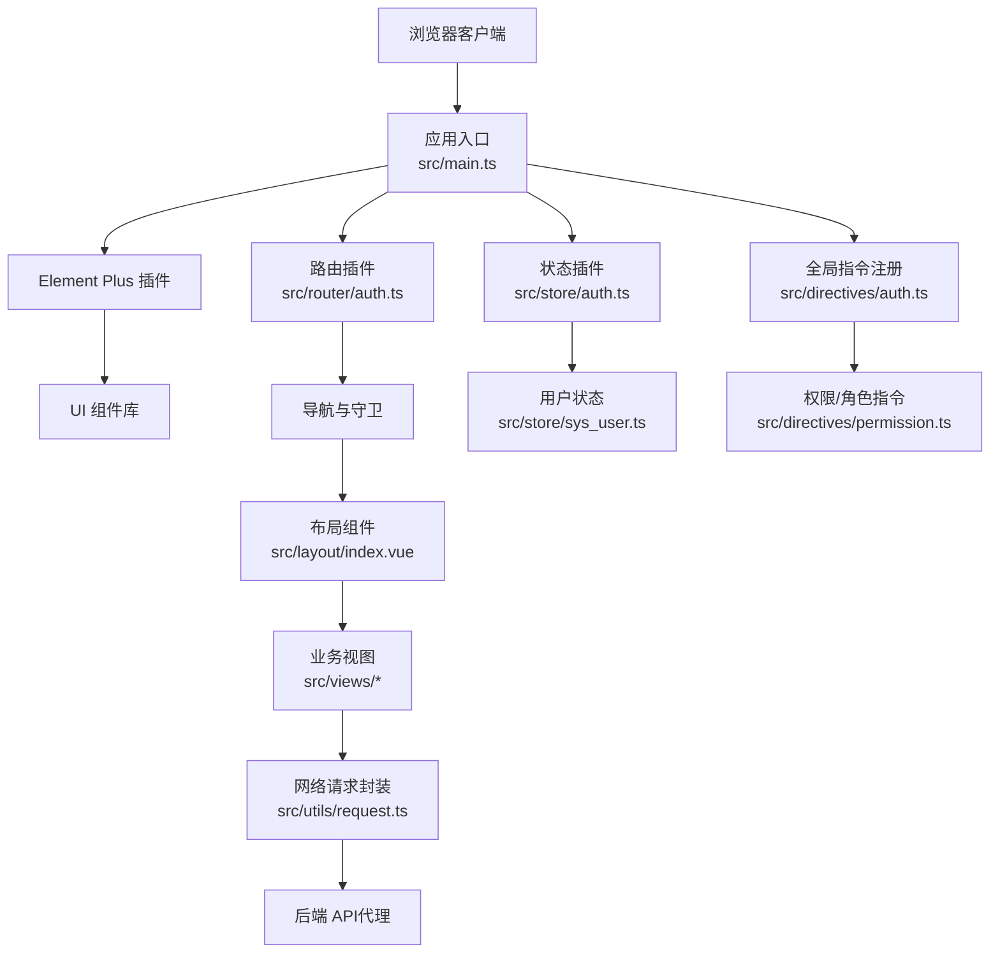
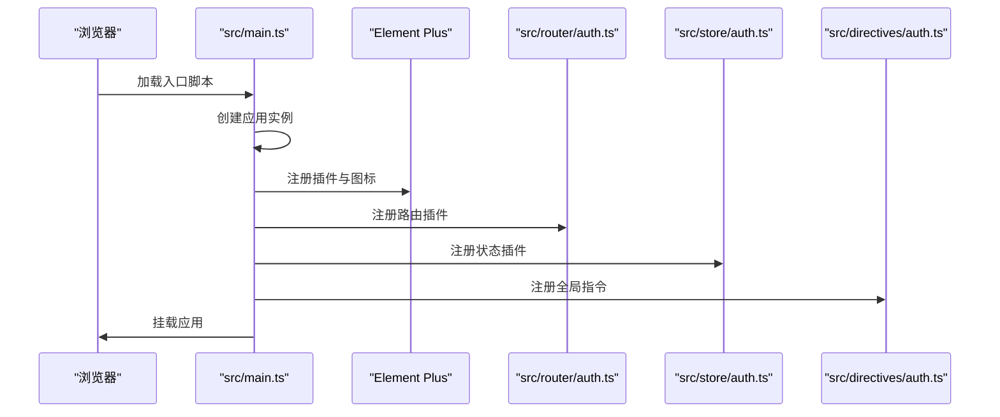
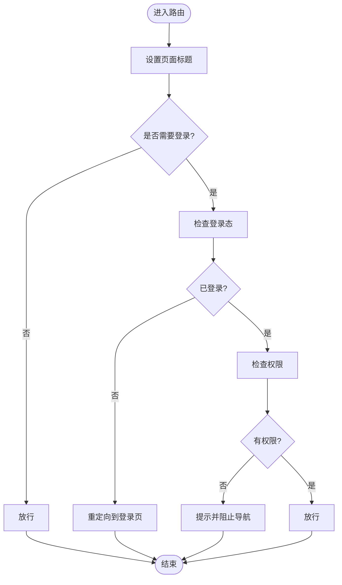
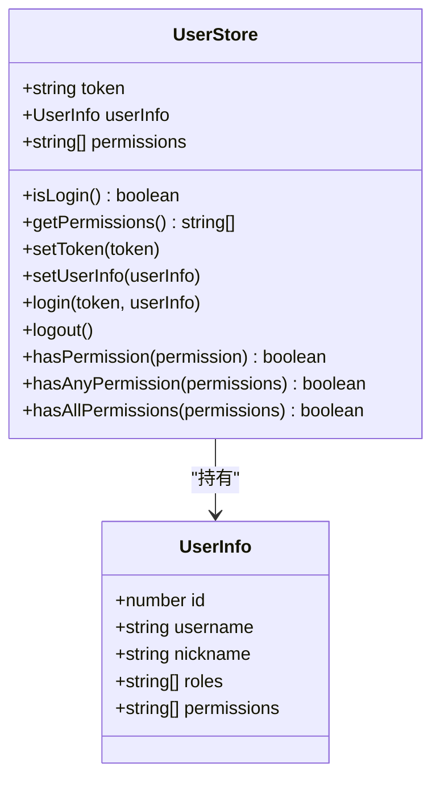
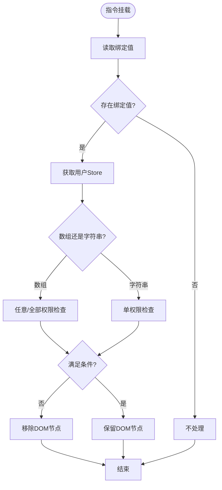
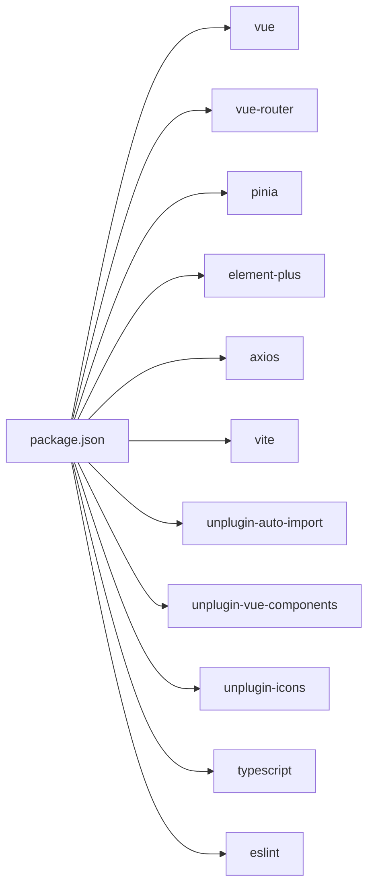

# 整体架构

<cite>
**本文引用的文件列表**
- [src/main.ts](file://src/main.ts)
- [src/App.vue](file://src/App.vue)
- [src/router/auth.ts](file://src/router/auth.ts)
- [src/store/auth.ts](file://src/store/auth.ts)
- [src/store/sys_user.ts](file://src/store/sys_user.ts)
- [src/directives/auth.ts](file://src/directives/auth.ts)
- [src/directives/permission.ts](file://src/directives/permission.ts)
- [src/layout/index.vue](file://src/layout/index.vue)
- [src/views/login/index.vue](file://src/views/login/index.vue)
- [src/utils/request.ts](file://src/utils/request.ts)
- [src/types/auth.ts](file://src/types/auth.ts)
- [vite.config.ts](file://vite.config.ts)
- [package.json](file://package.json)
</cite>

## 目录
1. [引言](#引言)
2. [项目结构](#项目结构)
3. [核心组件](#核心组件)
4. [架构总览](#架构总览)
5. [详细组件分析](#详细组件分析)
6. [依赖关系分析](#依赖关系分析)
7. [性能考虑](#性能考虑)
8. [故障排查指南](#故障排查指南)
9. [结论](#结论)
10. [附录](#附录)

## 引言
本项目是一个基于 Vue 3 + TypeScript 的后台管理系统模板，采用 Composition API、Element Plus 组件库与 Pinia 状态管理，结合 Vite 构建工具与自动导入生态，形成清晰的模块化与组件化架构。本文档从系统边界、技术栈集成策略、插件注册机制、应用初始化流程、MVC 模式变体与模块化设计等方面进行系统性阐述，并给出性能优化建议与常见问题排查路径。

## 项目结构
项目采用“按功能域分层 + 组件化”的组织方式：
- 应用入口与全局配置：src/main.ts、vite.config.ts、package.json
- 视图与布局：src/views、src/layout
- 路由与导航：src/router
- 状态管理：src/store
- 指令与工具：src/directives、src/utils
- 类型定义：src/types
- 根组件与样式：src/App.vue、src/style.css

图表来源
- [src/main.ts](file://src/main.ts#L1-L27)
- [src/router/auth.ts](file://src/router/index.ts#L1-L113)
- [src/store/auth.ts](file://src/store/index.ts#L1-L6)
- [src/store/sys_user.ts](file://src/store/user.ts#L1-L68)
- [src/layout/index.vue](file://src/layout/index.vue#L1-L255)
- [src/views/login/index.vue](file://src/views/login/index.vue#L1-L257)
- [src/directives/auth.ts](file://src/directives/index.ts#L1-L16)
- [src/directives/permission.ts](file://src/directives/permission.ts#L1-L67)
- [src/utils/request.ts](file://src/utils/request.ts#L1-L102)
- [vite.config.ts](file://vite.config.ts#L1-L49)
- [package.json](file://package.json#L1-L38)

章节来源
- [src/main.ts](file://src/main.ts#L1-L27)
- [vite.config.ts](file://vite.config.ts#L1-L49)
- [package.json](file://package.json#L1-L38)

## 核心组件
- 应用入口与插件注册：在入口文件中完成 Element Plus、路由、Pinia、全局指令的注册与挂载。
- 路由系统：集中定义路由表与前置守卫，实现登录态校验与权限控制。
- 状态管理：以 Pinia Store 管理用户会话、权限与本地持久化。
- 布局与导航：统一侧边栏菜单、头部用户信息与页面切换动画。
- 权限指令：通过 v-permission 与 v-role 在模板层面进行细粒度渲染控制。
- 网络层封装：基于 Axios 的请求/响应拦截器与统一错误处理。
- 类型体系：集中定义用户、登录、菜单等核心类型，提升可维护性。

章节来源
- [src/main.ts](file://src/main.ts#L1-L27)
- [src/router/auth.ts](file://src/router/index.ts#L1-L113)
- [src/store/sys_user.ts](file://src/store/user.ts#L1-L68)
- [src/layout/index.vue](file://src/layout/index.vue#L1-L255)
- [src/directives/permission.ts](file://src/directives/permission.ts#L1-L67)
- [src/utils/request.ts](file://src/utils/request.ts#L1-L102)
- [src/types/auth.ts](file://src/types/index.ts#L1-L45)

## 架构总览
本项目采用“入口装配 + 路由驱动 + 状态管理 + 组件化视图”的分层架构。系统边界清晰：前端应用仅负责 UI 展示、交互与数据请求；后端服务通过代理暴露 REST 接口。技术栈选择围绕 Vue 3 生态与 Element Plus 组件库，借助 Vite 与自动导入插件提升开发效率与构建性能。

图表来源
- [src/main.ts](file://src/main.ts#L1-L27)
- [src/router/auth.ts](file://src/router/index.ts#L1-L113)
- [src/store/auth.ts](file://src/store/index.ts#L1-L6)
- [src/store/sys_user.ts](file://src/store/user.ts#L1-L68)
- [src/directives/auth.ts](file://src/directives/index.ts#L1-L16)
- [src/directives/permission.ts](file://src/directives/permission.ts#L1-L67)
- [src/layout/index.vue](file://src/layout/index.vue#L1-L255)
- [src/utils/request.ts](file://src/utils/request.ts#L1-L102)

## 详细组件分析

### 应用初始化与插件注册机制
- 初始化流程
  - 创建 Vue 应用实例，注册 Element Plus（含图标与暗色主题）、路由、Pinia。
  - 自动注册 Element Plus 图标为全局组件，减少重复引入。
  - 注册全局指令集，统一权限与角色控制。
  - 挂载到 DOM 容器。
- 全局配置
  - Vite 配置启用自动导入与组件解析，支持 Element Plus 与图标自动按需引入。
  - 项目别名 @ 指向 src，简化路径引用。
  - 开发服务器配置代理，将 /api 前缀转发至后端服务。

图表来源
- [src/main.ts](file://src/main.ts#L1-L27)
- [vite.config.ts](file://vite.config.ts#L1-L49)

章节来源
- [src/main.ts](file://src/main.ts#L1-L27)
- [vite.config.ts](file://vite.config.ts#L1-L49)

### 路由与导航（MVC 模式变体）
- MVC 变体映射
  - Model：Pinia Store（用户状态、权限）。
  - View：Vue 单文件组件（views、layout）。
  - Controller：路由守卫与布局组件逻辑（导航、菜单生成、页面切换）。
- 路由守卫
  - 设置页面标题。
  - 非登录页校验登录态，未登录重定向至登录页。
  - 检查路由元信息中的权限标识，无权限则提示并阻止导航。
- 菜单生成
  - 基于路由表过滤隐藏项与权限项，动态生成侧边栏菜单。
  - 支持图标组件按名称动态渲染。

图表来源
- [src/router/auth.ts](file://src/router/index.ts#L84-L110)
- [src/layout/index.vue](file://src/layout/index.vue#L90-L104)

章节来源
- [src/router/auth.ts](file://src/router/index.ts#L1-L113)
- [src/layout/index.vue](file://src/layout/index.vue#L1-L255)

### 状态管理（Pinia）
- Store 设计
  - 用户状态：token、用户信息、权限集合。
  - Getters：登录态判断、权限集合。
  - Actions：设置 token、设置用户信息、登录、登出、权限检查（任意/全部/单个）。
- 持久化策略
  - token 写入 localStorage，实现刷新后保持登录态。
- 与路由联动
  - 路由守卫与布局组件均通过 Store 进行权限判断与页面控制。

图表来源
- [src/store/sys_user.ts](file://src/store/user.ts#L1-L68)
- [src/types/auth.ts](file://src/types/index.ts#L1-L45)

章节来源
- [src/store/auth.ts](file://src/store/index.ts#L1-L6)
- [src/store/sys_user.ts](file://src/store/user.ts#L1-L68)
- [src/types/auth.ts](file://src/types/index.ts#L1-L45)

### 权限指令（v-permission 与 v-role）
- 指令行为
  - v-permission：支持字符串或数组，任意满足即显示；支持通配符权限。
  - v-role：支持字符串或数组，匹配用户角色集合。
- 渲染控制
  - 无权限/无角色时，直接移除对应 DOM 节点，避免无效渲染。
- 与 Store 解耦
  - 指令内部通过 Store 获取当前用户权限与角色，实现声明式控制。

图表来源
- [src/directives/permission.ts](file://src/directives/permission.ts#L9-L31)
- [src/directives/permission.ts](file://src/directives/permission.ts#L38-L61)

章节来源
- [src/directives/auth.ts](file://src/directives/index.ts#L1-L16)
- [src/directives/permission.ts](file://src/directives/permission.ts#L1-L67)

### 布局与导航（Layout）
- 结构组成
  - 侧边栏：折叠/展开、图标与标题、子菜单。
  - 头部：折叠按钮、用户信息下拉、登出确认。
  - 主内容区：路由视图容器与过渡动画。
- 动态菜单
  - 基于路由表与用户权限动态生成菜单树。
- 交互逻辑
  - 切换折叠状态、处理下拉命令、登出流程。

章节来源
- [src/layout/index.vue](file://src/layout/index.vue#L1-L255)

### 登录视图（Login）
- 表单校验与提交
  - 使用 Element Plus 表单校验规则，模拟登录流程。
  - 成功后写入 Store 并跳转首页。
- 动画背景
  - Canvas 实现粒子与连线动画，随窗口大小自适应。
- 与 Store 联动
  - 登录成功后调用 Store 的登录动作，持久化 token 与用户信息。

章节来源
- [src/views/login/index.vue](file://src/views/login/index.vue#L1-L257)
- [src/store/sys_user.ts](file://src/store/user.ts#L38-L50)

### 网络层封装（Axios）
- 请求拦截
  - 自动从 localStorage 读取 token 并注入 Authorization 头。
- 响应拦截
  - 统一处理业务状态码与 HTTP 错误，401 自动清理 token 并跳转登录。
- 方法封装
  - 提供 get/post/put/del 与通用 request 封装，便于上层调用。

章节来源
- [src/utils/request.ts](file://src/utils/request.ts#L1-L102)

### 类型体系（Types）
- 用户信息：包含基础字段、角色与权限数组。
- 登录表单与响应：标准化登录数据结构。
- API 响应：统一 code/message/data 结构。
- 菜单项：路由元信息的类型化表示。

章节来源
- [src/types/auth.ts](file://src/types/index.ts#L1-L45)

## 依赖关系分析
- 运行时依赖
  - Vue 3、Vue Router、Pinia、Element Plus、Axios。
- 开发依赖
  - Vite、@vitejs/plugin-vue、unplugin-auto-import、unplugin-vue-components、unplugin-icons、TypeScript、ESLint。
- 构建与自动导入
  - Vite 插件链自动导入 Vue/Pinia/Routes 与 Element Plus、图标组件，减少样板代码。

图表来源
- [package.json](file://package.json#L12-L36)
- [vite.config.ts](file://vite.config.ts#L14-L32)

章节来源
- [package.json](file://package.json#L1-L38)
- [vite.config.ts](file://vite.config.ts#L1-L49)

## 性能考虑
- 按需加载与懒加载
  - 路由组件使用动态导入，减少首屏体积。
  - Element Plus 与图标通过自动导入按需引入，降低打包体积。
- 状态持久化
  - token 写入 localStorage，避免每次刷新重新登录。
- 动画与渲染
  - 登录页 Canvas 动画在组件卸载时取消帧循环，防止内存泄漏。
- 构建优化
  - Vite 默认开启 HMR 与预构建，生产构建压缩与 Tree-shaking 已启用。

章节来源
- [src/router/auth.ts](file://src/router/index.ts#L10-L11)
- [src/views/login/index.vue](file://src/views/login/index.vue#L187-L197)
- [vite.config.ts](file://vite.config.ts#L14-L32)

## 故障排查指南
- 登录后无法进入系统
  - 检查路由守卫是否正确设置页面标题与登录态校验。
  - 确认 Store 中 token 与用户信息是否写入成功。
- 权限控制不生效
  - 检查路由 meta.permission 是否正确配置。
  - 确认 v-permission 绑定值格式（字符串或数组）与用户权限集合一致。
- 网络请求失败
  - 查看请求拦截器是否注入了正确的 Authorization 头。
  - 检查响应拦截器对 401/403/404/500 的处理逻辑。
- 图标不显示
  - 确认 Element Plus 图标是否已注册为全局组件。
  - 检查图标名称与路由 meta.icon 是否一致。
- 开发代理失效
  - 检查 Vite 代理配置与后端服务地址是否一致。

章节来源
- [src/router/auth.ts](file://src/router/index.ts#L84-L110)
- [src/directives/permission.ts](file://src/directives/permission.ts#L14-L29)
- [src/utils/request.ts](file://src/utils/request.ts#L14-L78)
- [src/main.ts](file://src/main.ts#L14-L16)
- [vite.config.ts](file://vite.config.ts#L40-L46)

## 结论
本项目以 Vue 3 Composition API 为核心，结合 Element Plus 与 Pinia，构建了清晰的模块化与组件化架构。通过路由守卫与权限指令实现细粒度的安全控制，借助 Vite 自动导入生态提升开发效率。整体设计具备良好的扩展性与可维护性，适合在中大型后台管理系统中推广使用。

## 附录
- 技术选型理由
  - Vue 3 + TypeScript：提供更好的类型安全与组合式 API。
  - Element Plus：成熟的 UI 组件库，生态完善。
  - Pinia：轻量、易用且与 Composition API 协同良好。
  - Vite：快速冷启动与热更新，自动导入减少样板代码。
- 第三方依赖管理
  - 运行时依赖集中在 package.json 的 dependencies 字段。
  - 开发依赖集中在 devDependencies 字段，构建与代码质量工具分离。
- 系统边界
  - 前端负责 UI、交互与数据请求；后端提供 REST 接口并通过代理暴露。
  - 数据持久化采用 localStorage（token），避免跨域 Cookie 复杂性。