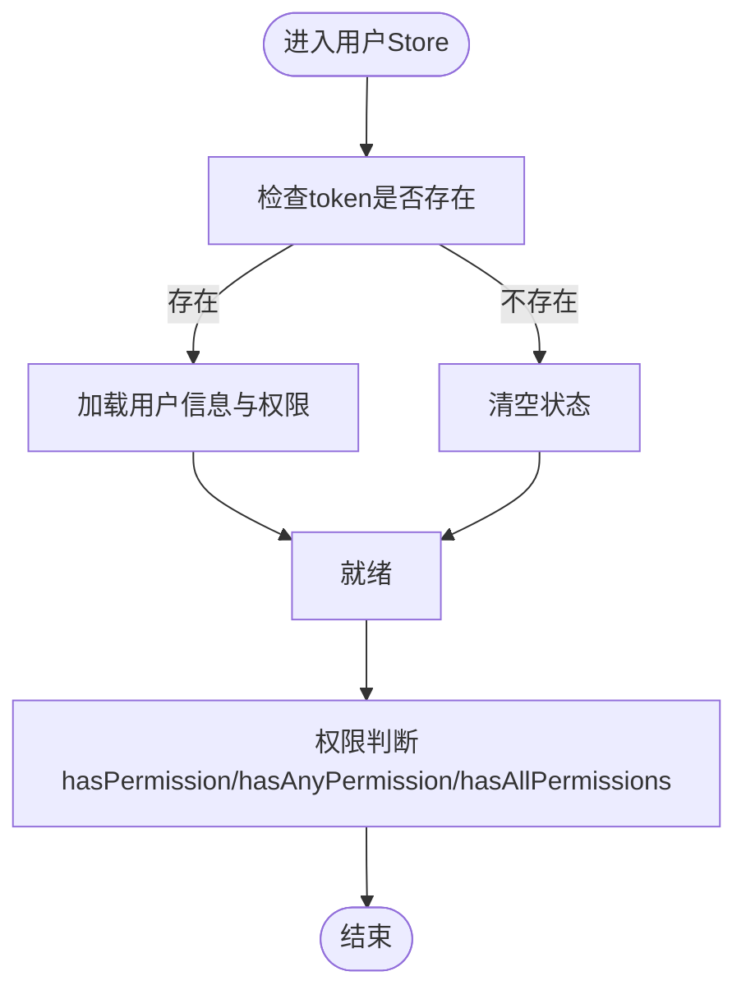

# 架构设计

<cite>
**本文档引用的文件**
- [package.json](file://package.json)
- [vite.config.ts](file://vite.config.ts)
- [src/main.ts](file://src/main.ts)
- [src/App.vue](file://src/App.vue)
- [src/router/index.ts](file://src/router/index.ts)
- [src/store/index.ts](file://src/store/index.ts)
- [src/store/user.ts](file://src/store/user.ts)
- [src/layout/index.vue](file://src/layout/index.vue)
- [src/views/login/index.vue](file://src/views/login/index.vue)
- [src/views/dashboard/index.vue](file://src/views/dashboard/index.vue)
- [src/views/system/user/index.vue](file://src/views/system/user/index.vue)
- [src/views/system/role/index.vue](file://src/views/system/role/index.vue)
- [src/directives/index.ts](file://src/directives/index.ts)
- [src/directives/permission.ts](file://src/directives/permission.ts)
- [src/utils/request.ts](file://src/utils/request.ts)
- [src/types/index.ts](file://src/types/index.ts)
- [README.md](file://README.md)
</cite>

## 目录
1. [引言](#引言)
2. [项目结构](#项目结构)
3. [核心组件](#核心组件)
4. [架构总览](#架构总览)
5. [详细组件分析](#详细组件分析)
6. [依赖分析](#依赖分析)
7. [性能考虑](#性能考虑)
8. [故障排除指南](#故障排除指南)
9. [结论](#结论)
10. [附录](#附录)

## 引言
本项目是一个基于 Vue 3 + TypeScript 的后台管理系统模板，采用现代前端工程化实践，结合 Composition API、Pinia 状态管理与 Element Plus 组件库，构建模块化、可扩展且易于维护的前端架构。本文档旨在系统阐述整体架构模式（MVC 变体、模块化与组件化）、核心设计原则与架构决策（如选择 Vue 3 Composition API、Pinia、Element Plus 等），并给出组件交互关系、数据流向、模块依赖、系统边界与技术栈集成方案。

## 项目结构
项目采用按功能域划分的模块化组织方式，主要目录与职责如下：
- src/api：API 客户端封装（当前通过工具层统一处理）
- src/components：通用业务无关的可复用组件
- src/directives：全局自定义指令（权限、角色）
- src/layout：布局容器与导航菜单
- src/router：路由配置与全局前置守卫
- src/store：Pinia 状态管理（用户相关）
- src/types：TypeScript 类型定义
- src/utils：HTTP 请求封装与拦截器
- src/views：页面视图（按业务模块划分）

**图表来源**
- [src/main.ts](file://src/main.ts#L1-L27)
- [src/App.vue](file://src/App.vue#L1-L51)
- [src/router/index.ts](file://src/router/index.ts#L1-L119)
- [src/layout/index.vue](file://src/layout/index.vue#L1-L255)
- [src/store/index.ts](file://src/store/index.ts#L1-L6)
- [src/store/user.ts](file://src/store/user.ts#L1-L68)
- [src/views/login/index.vue](file://src/views/login/index.vue#L1-L257)
- [src/views/dashboard/index.vue](file://src/views/dashboard/index.vue#L1-L157)
- [src/views/system/user/index.vue](file://src/views/system/user/index.vue#L1-L183)
- [src/views/system/role/index.vue](file://src/views/system/role/index.vue#L1-L150)
- [src/directives/index.ts](file://src/directives/index.ts#L1-L16)
- [src/directives/permission.ts](file://src/directives/permission.ts#L1-L67)
- [src/utils/request.ts](file://src/utils/request.ts#L1-L102)
- [src/types/index.ts](file://src/types/index.ts#L1-L45)

**章节来源**
- [README.md](file://README.md#L1-L6)
- [package.json](file://package.json#L1-L38)
- [vite.config.ts](file://vite.config.ts#L1-L49)

## 核心组件
- 应用入口与插件注册：在入口文件中完成 Element Plus、路由、Pinia、全局指令的安装与注册，并挂载应用。
- 路由系统：集中式路由配置，支持嵌套路由、动态导入视图、全局前置守卫进行登录态与权限校验。
- 状态管理：使用 Pinia 定义用户 Store，集中管理 token、用户信息与权限集合，并提供权限判断方法。
- 布局与导航：侧边栏菜单根据路由元信息动态生成，顶部用户下拉菜单实现登出与信息展示。
- 页面视图：登录页、仪表盘、系统管理（用户、角色）等页面，均通过 Element Plus 组件实现。
- 自定义指令：权限指令与角色指令，用于在模板层面控制元素可见性。
- 工具层：基于 Axios 的请求封装，统一处理请求头、响应拦截与错误提示。

**章节来源**
- [src/main.ts](file://src/main.ts#L1-L27)
- [src/router/index.ts](file://src/router/index.ts#L1-L119)
- [src/store/user.ts](file://src/store/user.ts#L1-L68)
- [src/layout/index.vue](file://src/layout/index.vue#L1-L255)
- [src/views/login/index.vue](file://src/views/login/index.vue#L1-L257)
- [src/views/dashboard/index.vue](file://src/views/dashboard/index.vue#L1-L157)
- [src/views/system/user/index.vue](file://src/views/system/user/index.vue#L1-L183)
- [src/views/system/role/index.vue](file://src/views/system/role/index.vue#L1-L150)
- [src/directives/index.ts](file://src/directives/index.ts#L1-L16)
- [src/directives/permission.ts](file://src/directives/permission.ts#L1-L67)
- [src/utils/request.ts](file://src/utils/request.ts#L1-L102)

## 架构总览
本项目采用“视图层-路由层-状态管理层-工具层”的分层架构，结合组件化与模块化设计，形成清晰的职责边界与数据流向。

**图表来源**
- [src/main.ts](file://src/main.ts#L1-L27)
- [src/router/index.ts](file://src/router/index.ts#L1-L119)
- [src/store/user.ts](file://src/store/user.ts#L1-L68)
- [src/utils/request.ts](file://src/utils/request.ts#L1-L102)
- [src/layout/index.vue](file://src/layout/index.vue#L1-L255)

## 详细组件分析

### 路由与权限守卫
- 路由配置：采用嵌套路由组织页面，系统管理模块通过子路由聚合多个功能页；登录页与 404 页面分别处理未登录与路径不存在场景。
- 全局前置守卫：在进入路由前设置页面标题、校验登录状态与权限，无权限时提示并阻止跳转。
- 菜单生成：布局组件根据路由表过滤生成菜单，结合用户权限动态显示。

**图表来源**
- [src/router/index.ts](file://src/router/index.ts#L90-L116)
- [src/layout/index.vue](file://src/layout/index.vue#L90-L111)
- [src/store/user.ts](file://src/store/user.ts#L52-L65)

**章节来源**
- [src/router/index.ts](file://src/router/index.ts#L1-L119)
- [src/layout/index.vue](file://src/layout/index.vue#L1-L255)
- [src/store/user.ts](file://src/store/user.ts#L1-L68)

### 状态管理（Pinia）
- 用户 Store：集中管理 token、用户信息与权限列表；提供登录、登出、权限判断等动作。
- 数据持久化：token 使用本地存储，确保刷新后仍保持登录态。
- 权限判断：提供单权限、任一权限、全部权限的判断方法，供指令与页面逻辑使用。

**图表来源**
- [src/store/user.ts](file://src/store/user.ts#L10-L66)

**章节来源**
- [src/store/index.ts](file://src/store/index.ts#L1-L6)
- [src/store/user.ts](file://src/store/user.ts#L1-L68)

### 布局与菜单
- 侧边栏菜单：根据路由元信息渲染图标、标题与层级；支持折叠与展开；点击菜单项触发路由跳转。
- 顶部导航：用户头像与下拉菜单，支持退出登录与个人中心入口。
- 菜单过滤：仅显示非隐藏且具备权限的路由项。

**图表来源**
- [src/layout/index.vue](file://src/layout/index.vue#L90-L111)
- [src/router/index.ts](file://src/router/index.ts#L6-L82)

**章节来源**
- [src/layout/index.vue](file://src/layout/index.vue#L1-L255)

### 登录流程
- 表单校验：基于 Element Plus 表单规则进行输入校验。
- 登录模拟：模拟调用登录接口，接收 token 与用户信息，写入用户 Store 并跳转首页。
- 背景动画：Canvas 实现动态粒子与连线效果。

**图表来源**
- [src/views/login/index.vue](file://src/views/login/index.vue#L68-L106)
- [src/store/user.ts](file://src/store/user.ts#L38-L50)
- [src/router/index.ts](file://src/router/index.ts#L98-L103)

**章节来源**
- [src/views/login/index.vue](file://src/views/login/index.vue#L1-L257)
- [src/store/user.ts](file://src/store/user.ts#L1-L68)

### 系统管理页面（用户与角色）
- 用户管理：表格展示用户列表，支持搜索、分页与操作按钮；按钮使用权限指令控制可见性。
- 角色管理：表格展示角色列表，支持编辑、分配权限与删除；按钮同样受权限指令保护。
- 数据模拟：页面内部模拟数据，便于演示与开发。

**图表来源**
- [src/views/system/user/index.vue](file://src/views/system/user/index.vue#L103-L142)
- [src/views/system/role/index.vue](file://src/views/system/role/index.vue#L80-L111)
- [src/directives/permission.ts](file://src/directives/permission.ts#L9-L31)

**章节来源**
- [src/views/system/user/index.vue](file://src/views/system/user/index.vue#L1-L183)
- [src/views/system/role/index.vue](file://src/views/system/role/index.vue#L1-L150)
- [src/directives/permission.ts](file://src/directives/permission.ts#L1-L67)

### 自定义指令（权限与角色）
- 权限指令：支持字符串与数组两种形式，若用户不满足权限则移除 DOM 元素。
- 角色指令：根据用户角色集合判断元素可见性。
- 注册方式：在入口文件统一注册为全局指令，可在任意组件中直接使用。

**图表来源**
- [src/directives/permission.ts](file://src/directives/permission.ts#L9-L31)
- [src/directives/index.ts](file://src/directives/index.ts#L7-L13)

**章节来源**
- [src/directives/index.ts](file://src/directives/index.ts#L1-L16)
- [src/directives/permission.ts](file://src/directives/permission.ts#L1-L67)

### HTTP 请求封装
- 基础配置：统一 base URL、超时与 Content-Type。
- 请求拦截：自动注入 Authorization 头（基于 token）。
- 响应拦截：统一处理业务状态码与 HTTP 错误，401 自动清理 token 并跳转登录。
- 方法封装：提供 get/post/put/del 等常用方法。

**图表来源**
- [src/utils/request.ts](file://src/utils/request.ts#L14-L78)

**章节来源**
- [src/utils/request.ts](file://src/utils/request.ts#L1-L102)

## 依赖分析
- 运行时依赖：Vue 3、Vue Router、Pinia、Element Plus、Axios、Sass。
- 开发依赖：Vite、@vitejs/plugin-vue、TypeScript、ESLint、unplugin-auto-import、unplugin-vue-components、unplugin-icons 等。
- 构建配置：Vite 插件链自动导入 Vue/Pinia/Routes 与 Element Plus、图标组件，简化模板书写与体积优化。

**图表来源**
- [package.json](file://package.json#L12-L36)
- [vite.config.ts](file://vite.config.ts#L14-L32)

**章节来源**
- [package.json](file://package.json#L1-L38)
- [vite.config.ts](file://vite.config.ts#L1-L49)

## 性能考虑
- 按需加载：路由采用动态导入，减少首屏包体。
- 组件懒加载：Element Plus 与图标通过解析器按需引入，降低打包体积。
- 状态持久化：token 存储于本地，避免重复登录带来的往返开销。
- 图标注册：一次性注册图标组件，减少运行时查找成本。
- 菜单渲染：菜单基于路由元信息生成，避免硬编码导致的冗余渲染。

## 故障排除指南
- 登录后无法进入系统：检查路由守卫中的登录态与权限判断逻辑，确认用户 Store 中 token 与权限是否正确写入。
- 权限按钮不显示：确认权限指令绑定值格式与用户权限集合一致，检查通配权限是否生效。
- 接口 401：查看响应拦截器是否正确清理 token 并跳转登录页。
- 菜单不显示：检查路由元信息中的 hidden 与 permission 字段，确认用户权限是否匹配。
- 构建报错：确认 Vite 插件配置与自动导入声明文件生成路径正确。

**章节来源**
- [src/router/index.ts](file://src/router/index.ts#L90-L116)
- [src/directives/permission.ts](file://src/directives/permission.ts#L9-L31)
- [src/utils/request.ts](file://src/utils/request.ts#L30-L78)
- [src/layout/index.vue](file://src/layout/index.vue#L90-L111)
- [vite.config.ts](file://vite.config.ts#L14-L32)

## 结论
本项目以 Vue 3 Composition API 为核心，结合 Pinia 状态管理与 Element Plus 组件库，构建了清晰的模块化与组件化架构。通过路由守卫与自定义指令实现权限控制，借助 Axios 封装统一处理网络请求，配合 Vite 插件链实现自动化导入与组件解析，形成高内聚、低耦合、易扩展的前端工程化体系。建议后续在真实后端对接时，完善 API 客户端与鉴权策略，并补充单元测试与 E2E 测试以提升质量与稳定性。

## 附录
- 系统边界：前端负责视图渲染、用户交互、状态管理与网络请求；后端提供 RESTful API；数据库由后端管理。
- 技术栈集成：Vue 3 + TypeScript + Vite + Pinia + Element Plus + Axios + Sass；通过 unplugin 生态实现零样板代码。
- 第三方依赖管理：通过 package.json 管理版本与脚本；Vite 配置集中管理别名与代理；类型声明由自动导入与组件解析生成。