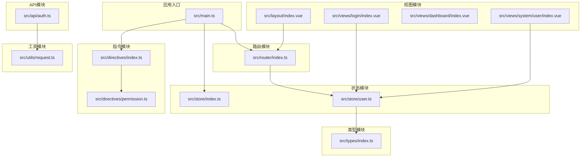
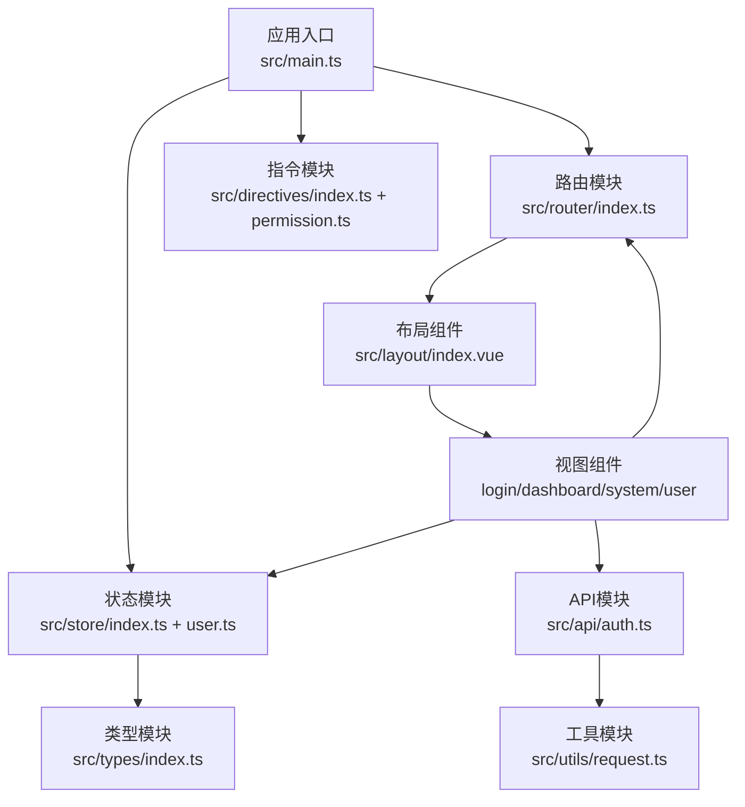
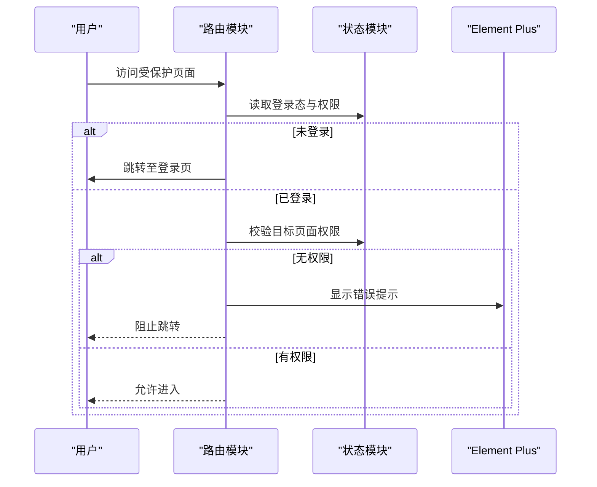
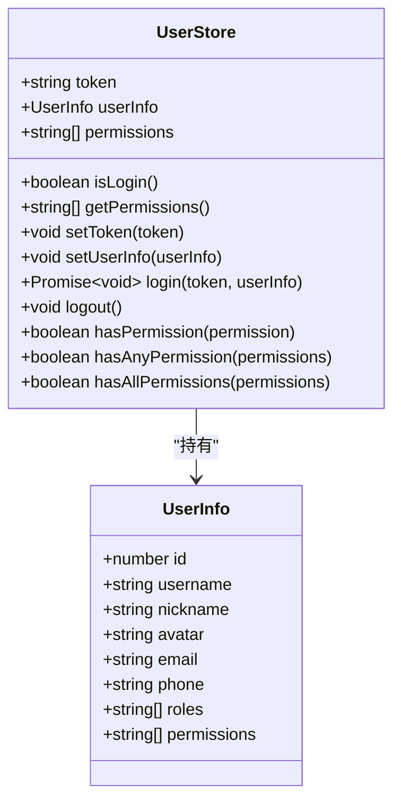
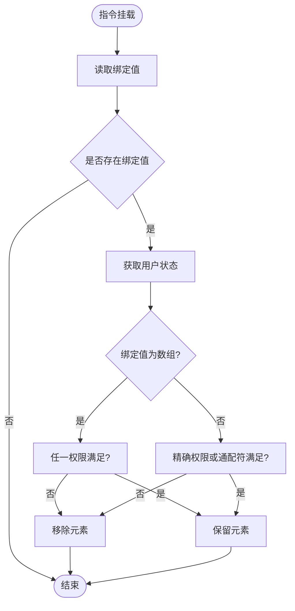
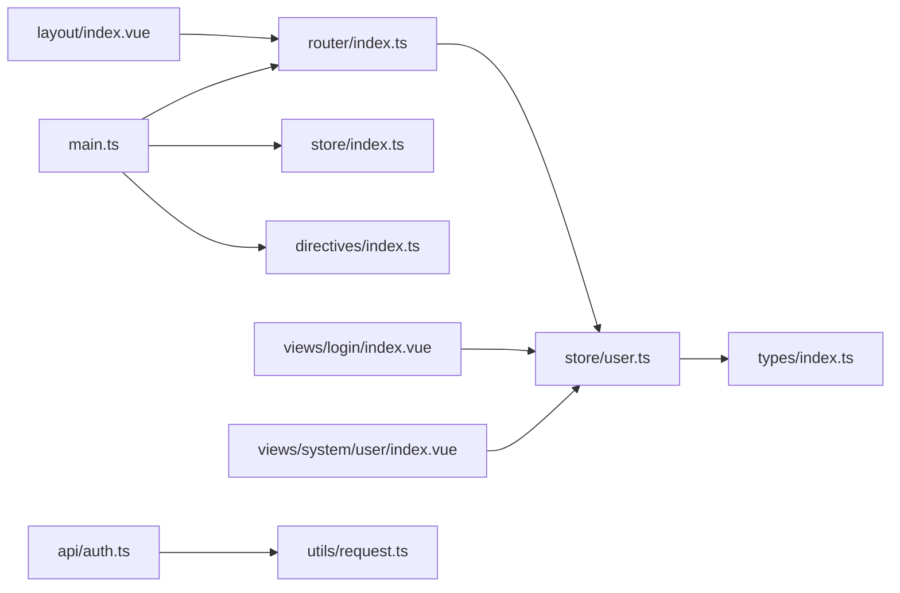

# 模块架构

<cite>
**本文档引用的文件**
- [src/main.ts](file://src/main.ts)
- [src/router/index.ts](file://src/router/index.ts)
- [src/store/index.ts](file://src/store/index.ts)
- [src/store/user.ts](file://src/store/user.ts)
- [src/directives/index.ts](file://src/directives/index.ts)
- [src/directives/permission.ts](file://src/directives/permission.ts)
- [src/types/index.ts](file://src/types/index.ts)
- [src/utils/request.ts](file://src/utils/request.ts)
- [src/api/auth.ts](file://src/api/auth.ts)
- [src/layout/index.vue](file://src/layout/index.vue)
- [src/views/login/index.vue](file://src/views/login/index.vue)
- [src/views/dashboard/index.vue](file://src/views/dashboard/index.vue)
- [src/views/system/user/index.vue](file://src/views/system/user/index.vue)
- [vite.config.ts](file://vite.config.ts)
- [package.json](file://package.json)
</cite>

## 目录
1. [引言](#引言)
2. [项目结构](#项目结构)
3. [核心模块](#核心模块)
4. [架构总览](#架构总览)
5. [详细组件分析](#详细组件分析)
6. [依赖分析](#依赖分析)
7. [性能考虑](#性能考虑)
8. [故障排除指南](#故障排除指南)
9. [结论](#结论)
10. [附录](#附录)

## 引言
本文件面向开发者与架构师，系统化阐述本项目的模块化设计原则与组织结构，重点覆盖以下方面：
- 功能模块划分与职责边界
- 模块间依赖关系与接口设计
- 路由模块、状态模块、指令模块、类型模块的架构设计
- 模块加载策略、懒加载机制与模块扩展方案
- 模块边界定义、接口抽象与可维护性设计
- 提供模块依赖图与模块交互图，帮助快速理解整体设计思路

## 项目结构
项目采用按功能域分层的目录组织方式，核心模块包括：
- 应用入口与插件注册：应用启动、第三方库与插件初始化、全局指令注册
- 路由模块：基于 vue-router 的路由定义与导航守卫
- 状态模块：基于 Pinia 的用户状态管理
- 指令模块：全局自定义指令（权限、角色）
- 类型模块：统一的 TypeScript 类型定义
- 工具模块：HTTP 请求封装与拦截器
- API 模块：业务接口封装
- 视图模块：页面视图与布局组件
- 构建配置：Vite 插件与别名配置

图表来源
- [src/main.ts](file://src/main.ts#L1-L27)
- [src/router/index.ts](file://src/router/index.ts#L1-L123)
- [src/store/index.ts](file://src/store/index.ts#L1-L6)
- [src/store/user.ts](file://src/store/user.ts#L1-L68)
- [src/directives/index.ts](file://src/directives/index.ts#L1-L16)
- [src/directives/permission.ts](file://src/directives/permission.ts#L1-L67)
- [src/types/index.ts](file://src/types/index.ts#L1-L45)
- [src/utils/request.ts](file://src/utils/request.ts#L1-L102)
- [src/api/auth.ts](file://src/api/auth.ts#L1-L18)
- [src/layout/index.vue](file://src/layout/index.vue#L1-L255)
- [src/views/login/index.vue](file://src/views/login/index.vue#L1-L257)
- [src/views/dashboard/index.vue](file://src/views/dashboard/index.vue#L1-L157)
- [src/views/system/user/index.vue](file://src/views/system/user/index.vue#L1-L183)

章节来源
- [src/main.ts](file://src/main.ts#L1-L27)
- [vite.config.ts](file://vite.config.ts#L1-L49)

## 核心模块
本节从模块化视角深入解析四大核心模块的设计与实现。

- 路由模块（src/router/index.ts）
  - 职责：集中定义路由表、处理导航守卫、动态设置页面标题
  - 关键特性：使用懒加载组件；在 beforeEach 中进行登录态与权限校验；支持菜单渲染过滤
  - 依赖：Pinia 用户状态、Element Plus 消息提示
  - 扩展：通过 meta 字段扩展权限、隐藏、图标等元信息，便于菜单与权限联动

- 状态模块（src/store/index.ts、src/store/user.ts）
  - 职责：集中管理用户 Token、用户信息与权限集合
  - 关键特性：持久化存储 Token；提供 hasPermission 系列方法；支持多权限判断
  - 依赖：TypeScript 类型定义
  - 扩展：可通过新增 Store 管理其他领域状态（如菜单、主题）

- 指令模块（src/directives/index.ts、src/directives/permission.ts）
  - 职责：全局注册权限与角色指令，实现视图层的细粒度控制
  - 关键特性：支持字符串与数组两种绑定值；在挂载阶段即执行权限判断
  - 依赖：Pinia 用户状态
  - 扩展：可增加更多指令（如按钮禁用、可见性等）

- 类型模块（src/types/index.ts）
  - 职责：统一定义用户、登录、响应、菜单等类型，提升代码一致性与可维护性
  - 关键特性：集中管理业务类型，避免重复定义
  - 扩展：随着业务增长持续补充类型定义

章节来源
- [src/router/index.ts](file://src/router/index.ts#L1-L123)
- [src/store/index.ts](file://src/store/index.ts#L1-L6)
- [src/store/user.ts](file://src/store/user.ts#L1-L68)
- [src/directives/index.ts](file://src/directives/index.ts#L1-L16)
- [src/directives/permission.ts](file://src/directives/permission.ts#L1-L67)
- [src/types/index.ts](file://src/types/index.ts#L1-L45)

## 架构总览
下图展示模块间的高层交互关系与数据流向：

图表来源
- [src/main.ts](file://src/main.ts#L1-L27)
- [src/router/index.ts](file://src/router/index.ts#L1-L123)
- [src/store/index.ts](file://src/store/index.ts#L1-L6)
- [src/store/user.ts](file://src/store/user.ts#L1-L68)
- [src/directives/index.ts](file://src/directives/index.ts#L1-L16)
- [src/directives/permission.ts](file://src/directives/permission.ts#L1-L67)
- [src/types/index.ts](file://src/types/index.ts#L1-L45)
- [src/utils/request.ts](file://src/utils/request.ts#L1-L102)
- [src/api/auth.ts](file://src/api/auth.ts#L1-L18)
- [src/layout/index.vue](file://src/layout/index.vue#L1-L255)
- [src/views/login/index.vue](file://src/views/login/index.vue#L1-L257)
- [src/views/dashboard/index.vue](file://src/views/dashboard/index.vue#L1-L157)
- [src/views/system/user/index.vue](file://src/views/system/user/index.vue#L1-L183)

## 详细组件分析

### 路由模块分析
- 模块边界
  - 路由表集中定义，包含登录、仪表盘、系统管理子模块与 404 页面
  - 导航守卫负责登录态与权限校验，确保受保护页面的安全访问
- 加载策略
  - 所有页面组件均采用懒加载，按需加载，降低首屏体积
- 交互流程
  - 进入页面时设置标题；非登录页检查登录态与权限；无权限时提示并阻止跳转

图表来源
- [src/router/index.ts](file://src/router/index.ts#L94-L120)
- [src/store/user.ts](file://src/store/user.ts#L52-L65)

章节来源
- [src/router/index.ts](file://src/router/index.ts#L1-L123)
- [src/layout/index.vue](file://src/layout/index.vue#L90-L104)

### 状态模块分析
- 模块边界
  - 用户状态集中在 user Store，包含 token、userInfo、permissions
  - 提供登录、登出、权限判断等动作
- 数据模型
  - UserState 定义状态结构；Getter 提供派生状态；Action 实现业务逻辑
- 性能与可维护性
  - 使用 localStorage 持久化 token，减少重复登录
  - hasPermission 系列方法统一权限判断逻辑

图表来源
- [src/store/user.ts](file://src/store/user.ts#L4-L66)
- [src/types/index.ts](file://src/types/index.ts#L2-L11)

章节来源
- [src/store/index.ts](file://src/store/index.ts#L1-L6)
- [src/store/user.ts](file://src/store/user.ts#L1-L68)
- [src/types/index.ts](file://src/types/index.ts#L1-L45)

### 指令模块分析
- 模块边界
  - 全局注册 v-permission 与 v-role 指令
  - 在 mounted 阶段根据用户权限/角色决定元素可见性
- 接口设计
  - 支持字符串与数组两种绑定值，增强灵活性
- 错误处理
  - 无权限时移除 DOM 节点，避免渲染无效内容

图表来源
- [src/directives/permission.ts](file://src/directives/permission.ts#L9-L61)
- [src/store/user.ts](file://src/store/user.ts#L52-L65)

章节来源
- [src/directives/index.ts](file://src/directives/index.ts#L1-L16)
- [src/directives/permission.ts](file://src/directives/permission.ts#L1-L67)
- [src/store/user.ts](file://src/store/user.ts#L1-L68)

### 类型模块分析
- 模块边界
  - 统一定义用户信息、登录表单、登录响应、通用 API 响应、菜单项等类型
- 设计原则
  - 明确字段含义与可选性；为 API 层与视图层提供契约
- 扩展建议
  - 随着业务增长逐步补充实体类型与校验规则

章节来源
- [src/types/index.ts](file://src/types/index.ts#L1-L45)

### 模块加载与懒加载机制
- 应用入口加载
  - main.ts 中注册 Element Plus、路由、Pinia、全局指令，随后挂载应用
- 路由懒加载
  - 路由表中各页面组件均以动态导入方式引入，实现按需加载
- 构建期自动导入
  - Vite 配置中启用 unplugin-auto-import 与 unplugin-vue-components，自动导入 Vue、Router、Pinia 以及 Element Plus 组件与图标，减少样板代码

章节来源
- [src/main.ts](file://src/main.ts#L1-L27)
- [src/router/index.ts](file://src/router/index.ts#L10-L85)
- [vite.config.ts](file://vite.config.ts#L14-L32)

### 模块扩展方案
- 新增页面模块
  - 在路由模块中添加新路由记录，设置 meta 元信息（权限、标题、图标），并在 layout 下创建对应视图
- 新增业务模块
  - 在 API 模块中新增接口函数，封装请求与响应类型
- 新增全局指令
  - 在指令模块中新增指令并在入口注册
- 新增状态域
  - 在 store 下新增模块文件，遵循 Pinia 命名规范

章节来源
- [src/router/index.ts](file://src/router/index.ts#L6-L86)
- [src/api/auth.ts](file://src/api/auth.ts#L1-L18)
- [src/directives/index.ts](file://src/directives/index.ts#L7-L13)
- [src/store/user.ts](file://src/store/user.ts#L10-L66)

## 依赖分析
- 外部依赖
  - Vue 3、vue-router、pinia、element-plus、axios 等
- 内部依赖
  - 路由依赖状态模块进行权限校验；视图依赖路由与状态；API 依赖工具模块；指令依赖状态模块
- 依赖方向
  - 自顶向下：main.ts -> router/pinia/directives -> views/layout
  - 自底向上：views -> router/state -> api/utils

图表来源
- [src/main.ts](file://src/main.ts#L1-L27)
- [src/router/index.ts](file://src/router/index.ts#L1-L123)
- [src/store/index.ts](file://src/store/index.ts#L1-L6)
- [src/store/user.ts](file://src/store/user.ts#L1-L68)
- [src/directives/index.ts](file://src/directives/index.ts#L1-L16)
- [src/types/index.ts](file://src/types/index.ts#L1-L45)
- [src/utils/request.ts](file://src/utils/request.ts#L1-L102)
- [src/api/auth.ts](file://src/api/auth.ts#L1-L18)
- [src/layout/index.vue](file://src/layout/index.vue#L1-L255)
- [src/views/login/index.vue](file://src/views/login/index.vue#L1-L257)
- [src/views/system/user/index.vue](file://src/views/system/user/index.vue#L1-L183)

章节来源
- [package.json](file://package.json#L12-L20)
- [vite.config.ts](file://vite.config.ts#L1-L49)

## 性能考虑
- 懒加载与按需加载
  - 路由与组件懒加载显著降低首屏包体，提升初始加载速度
- 请求拦截与统一错误处理
  - 工具模块中的请求拦截器统一注入 Token，响应拦截器统一处理错误码与提示，减少重复逻辑
- 构建优化
  - 自动导入与组件解析减少手动引入，提高开发效率与打包体积可控性

## 故障排除指南
- 登录后无法进入受保护页面
  - 检查路由守卫逻辑与用户权限；确认 meta.permission 与用户 permissions 匹配
- 权限指令不生效
  - 确认指令已在入口注册；检查绑定值格式（字符串/数组）与权限通配符
- 请求失败或 401
  - 检查工具模块拦截器是否正确注入 Authorization；确认服务端返回 code 与前端处理一致
- 构建报错或自动导入失效
  - 检查 Vite 配置中的自动导入与组件解析插件是否启用与路径别名配置

章节来源
- [src/router/index.ts](file://src/router/index.ts#L94-L120)
- [src/directives/permission.ts](file://src/directives/permission.ts#L9-L31)
- [src/utils/request.ts](file://src/utils/request.ts#L14-L78)
- [vite.config.ts](file://vite.config.ts#L14-L32)

## 结论
本项目通过清晰的功能域划分与模块化设计，实现了路由、状态、指令、类型与工具的高内聚低耦合。结合懒加载与构建期自动导入，既保证了良好的开发体验，也兼顾了运行时性能。建议在后续迭代中继续完善类型体系、扩展状态域与指令集，并保持模块边界与接口契约的稳定性，以提升整体可维护性与可扩展性。

## 附录
- 关键文件清单
  - 应用入口与插件：[src/main.ts](file://src/main.ts#L1-L27)
  - 路由定义与守卫：[src/router/index.ts](file://src/router/index.ts#L1-L123)
  - 状态管理：[src/store/index.ts](file://src/store/index.ts#L1-L6)、[src/store/user.ts](file://src/store/user.ts#L1-L68)
  - 指令注册与实现：[src/directives/index.ts](file://src/directives/index.ts#L1-L16)、[src/directives/permission.ts](file://src/directives/permission.ts#L1-L67)
  - 类型定义：[src/types/index.ts](file://src/types/index.ts#L1-L45)
  - 请求封装与拦截：[src/utils/request.ts](file://src/utils/request.ts#L1-L102)
  - API 封装：[src/api/auth.ts](file://src/api/auth.ts#L1-L18)
  - 布局与视图：[src/layout/index.vue](file://src/layout/index.vue#L1-L255)、[src/views/login/index.vue](file://src/views/login/index.vue#L1-L257)、[src/views/dashboard/index.vue](file://src/views/dashboard/index.vue#L1-L157)、[src/views/system/user/index.vue](file://src/views/system/user/index.vue#L1-L183)
  - 构建配置：[vite.config.ts](file://vite.config.ts#L1-L49)
  - 依赖声明：[package.json](file://package.json#L12-L20)