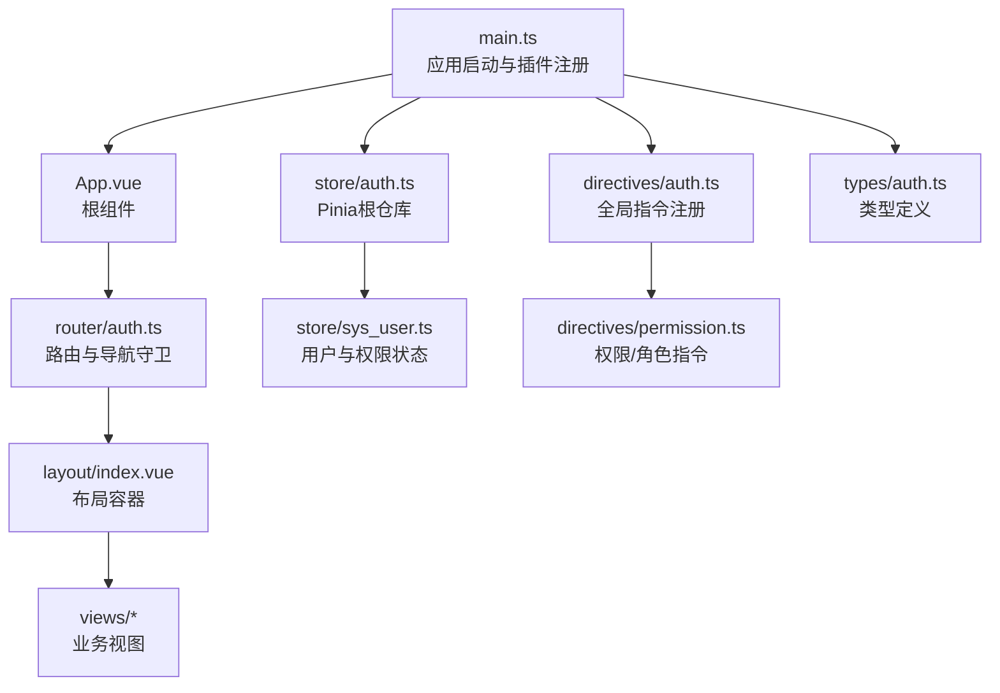
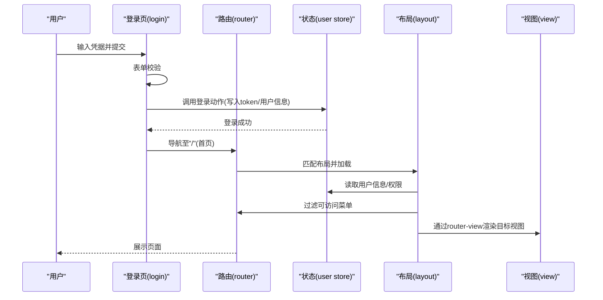
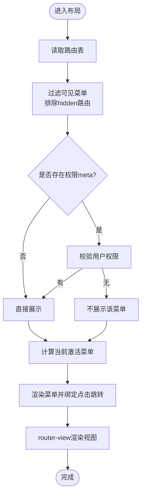
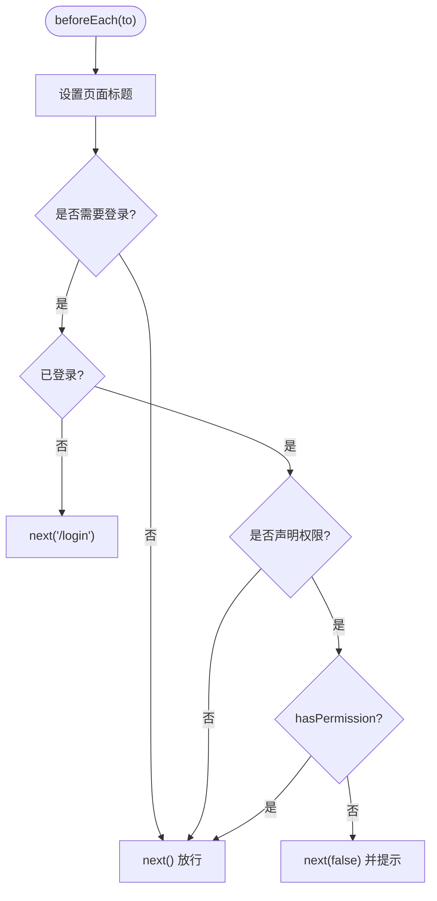
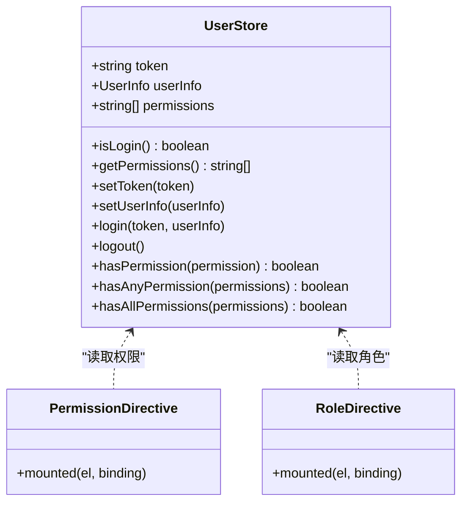
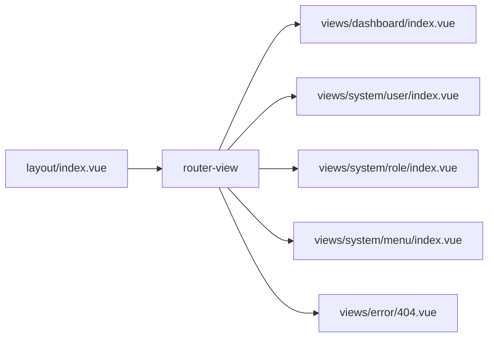
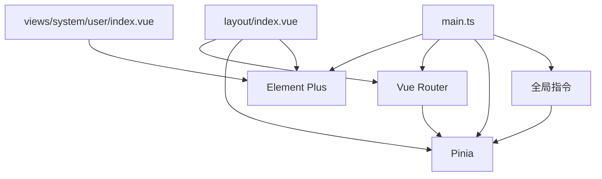

# 组件交互关系

<cite>
**本文引用的文件**
- [src/App.vue](file://src/App.vue)
- [src/main.ts](file://src/main.ts)
- [src/layout/index.vue](file://src/layout/index.vue)
- [src/router/auth.ts](file://src/router/auth.ts)
- [src/store/auth.ts](file://src/store/auth.ts)
- [src/store/sys_user.ts](file://src/store/sys_user.ts)
- [src/views/dashboard/index.vue](file://src/views/dashboard/index.vue)
- [src/views/system/user/index.vue](file://src/views/system/user/index.vue)
- [src/views/system/role/index.vue](file://src/views/system/role/index.vue)
- [src/views/system/menu/index.vue](file://src/views/system/menu/index.vue)
- [src/views/login/index.vue](file://src/views/login/index.vue)
- [src/views/error/404.vue](file://src/views/error/404.vue)
- [src/directives/permission.ts](file://src/directives/permission.ts)
- [src/directives/auth.ts](file://src/directives/auth.ts)
- [src/types/auth.ts](file://src/types/auth.ts)
</cite>

## 目录
1. [引言](#引言)
2. [项目结构](#项目结构)
3. [核心组件](#核心组件)
4. [架构总览](#架构总览)
5. [详细组件分析](#详细组件分析)
6. [依赖分析](#依赖分析)
7. [性能考虑](#性能考虑)
8. [故障排查指南](#故障排查指南)
9. [结论](#结论)
10. [附录](#附录)

## 引言
本文件聚焦于Vue组件间的通信机制与依赖关系，覆盖父子组件通信、兄弟组件通信与跨层级通信；阐述布局组件与路由系统、状态管理的交互模式；文档化组件生命周期管理、事件传递机制与数据流向；总结组件解耦策略、依赖注入模式与可复用性设计，并提供组件关系图与交互时序图，帮助开发者快速理解复杂组件协作。

## 项目结构
该项目采用典型的前端单页应用结构：入口应用、布局容器、视图页面、路由与状态管理、指令系统与类型定义。核心交互围绕“布局容器承载路由视图”“路由守卫控制访问与标题”“Pinia状态驱动权限与用户信息”展开。

图表来源
- [src/main.ts](file://src/main.ts#L1-L27)
- [src/App.vue](file://src/App.vue#L1-L51)
- [src/router/auth.ts](file://src/router/index.ts#L1-L123)
- [src/layout/index.vue](file://src/layout/index.vue#L1-L255)
- [src/store/auth.ts](file://src/store/index.ts#L1-L6)
- [src/store/sys_user.ts](file://src/store/user.ts#L1-L68)
- [src/directives/auth.ts](file://src/directives/index.ts#L1-L16)
- [src/directives/permission.ts](file://src/directives/permission.ts#L1-L67)
- [src/types/auth.ts](file://src/types/index.ts#L1-L45)

章节来源
- [src/main.ts](file://src/main.ts#L1-L27)
- [src/App.vue](file://src/App.vue#L1-L51)

## 核心组件
- 应用入口与插件注册：在入口中注册Element Plus、路由、Pinia与全局指令，形成统一的运行环境。
- 布局容器：提供侧边菜单、头部用户信息与主内容区，通过router-view承载当前路由组件，并使用过渡动画切换。
- 路由系统：集中定义路由表、导航守卫（登录态与权限校验）、动态设置页面标题。
- 状态管理：以Pinia Store管理token、用户信息与权限集合，提供登录、登出与权限检查等动作。
- 权限指令：在模板层面按权限/角色条件渲染或移除DOM节点，实现UI层的细粒度控制。
- 视图组件：各业务页面（仪表盘、系统管理子模块）负责具体业务逻辑与UI展示。

章节来源
- [src/layout/index.vue](file://src/layout/index.vue#L1-L255)
- [src/router/auth.ts](file://src/router/index.ts#L1-L123)
- [src/store/sys_user.ts](file://src/store/user.ts#L1-L68)
- [src/directives/permission.ts](file://src/directives/permission.ts#L1-L67)
- [src/views/dashboard/index.vue](file://src/views/dashboard/index.vue#L1-L157)
- [src/views/system/user/index.vue](file://src/views/system/user/index.vue#L1-L183)
- [src/views/system/role/index.vue](file://src/views/system/role/index.vue#L1-L150)
- [src/views/system/menu/index.vue](file://src/views/system/menu/index.vue#L1-L161)

## 架构总览
整体交互链路如下：用户通过登录页进行认证，成功后进入布局容器；布局容器根据路由生成菜单并渲染对应视图；路由守卫在每次导航时检查登录态与权限；状态管理为布局与视图提供共享数据与能力；权限指令在模板层进行UI控制。

图表来源
- [src/views/login/index.vue](file://src/views/login/index.vue#L1-L257)
- [src/router/auth.ts](file://src/router/index.ts#L1-L123)
- [src/store/sys_user.ts](file://src/store/user.ts#L1-L68)
- [src/layout/index.vue](file://src/layout/index.vue#L1-L255)

## 详细组件分析

### 布局组件与路由、状态的交互
- 菜单生成：布局组件基于路由表过滤出可见菜单项，并结合用户权限决定是否展示；同时根据当前路由高亮激活菜单。
- 页面标题：路由守卫在导航前设置页面标题，增强用户体验。
- 登录退出：布局头部下拉菜单触发退出流程，清理状态并跳转登录页。
- 视图切换：布局通过router-view承载视图，并使用过渡动画提升视觉体验。

图表来源
- [src/layout/index.vue](file://src/layout/index.vue#L90-L133)
- [src/router/auth.ts](file://src/router/index.ts#L6-L86)

章节来源
- [src/layout/index.vue](file://src/layout/index.vue#L1-L255)
- [src/router/auth.ts](file://src/router/index.ts#L1-L123)

### 路由守卫与权限控制
- 登录态校验：非登录页且未登录则强制跳转登录页。
- 权限校验：若目标路由声明了权限元信息，则检查用户权限集合，无权限则提示并阻止导航。
- 页面标题：根据路由meta.title动态设置document.title。

图表来源
- [src/router/auth.ts](file://src/router/index.ts#L94-L120)

章节来源
- [src/router/auth.ts](file://src/router/index.ts#L1-L123)

### 状态管理与权限指令
- 用户状态：包含token、用户信息与权限数组；提供登录、登出、权限检查等动作。
- 权限指令：在mounted阶段读取用户权限，支持字符串与数组两种形式；无权限时从DOM移除元素。
- 角色指令：基于用户角色集合进行判定，同样在mounted阶段移除无权元素。

图表来源
- [src/store/sys_user.ts](file://src/store/user.ts#L1-L68)
- [src/directives/permission.ts](file://src/directives/permission.ts#L1-L67)

章节来源
- [src/store/sys_user.ts](file://src/store/user.ts#L1-L68)
- [src/directives/permission.ts](file://src/directives/permission.ts#L1-L67)

### 视图组件与布局/路由的协作
- 仪表盘：作为系统首页，展示统计卡片与活动时间线，无特殊交互。
- 系统管理子模块：用户管理、角色管理、菜单管理均采用表格+分页+按钮的通用模式，权限指令控制按钮显隐。
- 错误页：404页面提供返回首页能力。

图表来源
- [src/layout/index.vue](file://src/layout/index.vue#L67-L74)
- [src/views/dashboard/index.vue](file://src/views/dashboard/index.vue#L1-L157)
- [src/views/system/user/index.vue](file://src/views/system/user/index.vue#L1-L183)
- [src/views/system/role/index.vue](file://src/views/system/role/index.vue#L1-L150)
- [src/views/system/menu/index.vue](file://src/views/system/menu/index.vue#L1-L161)
- [src/views/error/404.vue](file://src/views/error/404.vue#L1-L46)

章节来源
- [src/views/dashboard/index.vue](file://src/views/dashboard/index.vue#L1-L157)
- [src/views/system/user/index.vue](file://src/views/system/user/index.vue#L1-L183)
- [src/views/system/role/index.vue](file://src/views/system/role/index.vue#L1-L150)
- [src/views/system/menu/index.vue](file://src/views/system/menu/index.vue#L1-L161)
- [src/views/error/404.vue](file://src/views/error/404.vue#L1-L46)

### 组件间通信机制
- 父子通信（布局与视图）
  - 布局通过router-view向子视图注入组件实例，实现跨层级渲染。
  - 布局通过computed与路由实例联动，向子视图提供菜单与权限上下文。
- 兄弟组件通信（视图内）
  - 各业务视图内部通过本地状态与方法处理搜索、分页、弹窗等交互。
- 跨层级通信（布局与指令）
  - 布局与指令通过Pinia状态共享实现跨层级的权限控制与UI联动。

章节来源
- [src/layout/index.vue](file://src/layout/index.vue#L78-L133)
- [src/directives/permission.ts](file://src/directives/permission.ts#L9-L31)

### 生命周期管理与事件传递
- 登录页：在挂载时初始化画布动画，在卸载时清理动画帧与事件监听。
- 视图组件：在挂载时发起数据请求（如获取列表），并在交互事件中更新本地状态。
- 布局组件：在挂载时计算菜单与激活项，响应菜单点击与下拉命令。

章节来源
- [src/views/login/index.vue](file://src/views/login/index.vue#L187-L197)
- [src/views/system/user/index.vue](file://src/views/system/user/index.vue#L169-L171)
- [src/layout/index.vue](file://src/layout/index.vue#L118-L133)

### 数据流向
- 认证流：登录页 -> 用户Store -> 路由守卫 -> 布局渲染 -> 视图加载。
- 权限流：路由守卫 -> 用户Store -> 布局菜单过滤 -> 指令渲染控制 -> 视图按钮显隐。
- 菜单流：路由表 -> 布局computed过滤 -> Element Plus菜单渲染 -> 路由跳转。

章节来源
- [src/views/login/index.vue](file://src/views/login/index.vue#L68-L106)
- [src/router/auth.ts](file://src/router/index.ts#L94-L120)
- [src/layout/index.vue](file://src/layout/index.vue#L90-L133)

### 组件解耦策略、依赖注入与可复用性
- 解耦策略
  - 布局与视图通过router-view解耦，视图内部通过本地状态管理自身数据。
  - 权限控制下沉到指令层，避免在视图中重复判断权限。
- 依赖注入
  - 在入口集中注册插件与全局指令，形成统一依赖注入点。
  - Pinia Store作为全局状态源，被布局与指令共同消费。
- 可复用性
  - 权限指令支持字符串与数组两种形式，适配不同场景。
  - 路由meta统一承载标题、图标、权限等元信息，便于复用与扩展。

章节来源
- [src/main.ts](file://src/main.ts#L11-L26)
- [src/directives/permission.ts](file://src/directives/permission.ts#L9-L31)
- [src/router/auth.ts](file://src/router/index.ts#L6-L86)

## 依赖分析
- 组件耦合
  - 布局与路由：强耦合（菜单生成依赖路由表）；弱耦合（视图通过router-view注入）。
  - 布局与状态：中等耦合（菜单与激活项依赖用户权限）。
  - 视图与状态：弱耦合（仅在需要时读取状态）。
- 外部依赖
  - Element Plus用于UI组件与消息提示。
  - Vue Router用于导航与守卫。
  - Pinia用于状态管理。

图表来源
- [src/main.ts](file://src/main.ts#L1-L27)
- [src/layout/index.vue](file://src/layout/index.vue#L1-L255)
- [src/views/system/user/index.vue](file://src/views/system/user/index.vue#L1-L183)
- [src/router/auth.ts](file://src/router/index.ts#L1-L123)
- [src/store/sys_user.ts](file://src/store/user.ts#L1-L68)
- [src/directives/permission.ts](file://src/directives/permission.ts#L1-L67)

章节来源
- [src/main.ts](file://src/main.ts#L1-L27)
- [src/layout/index.vue](file://src/layout/index.vue#L1-L255)
- [src/router/auth.ts](file://src/router/index.ts#L1-L123)
- [src/store/sys_user.ts](file://src/store/user.ts#L1-L68)
- [src/directives/permission.ts](file://src/directives/permission.ts#L1-L67)

## 性能考虑
- 路由懒加载：路由组件采用动态导入，减少首屏体积。
- 渐进动画：布局中的视图切换使用轻量过渡，兼顾体验与性能。
- 指令渲染：权限指令在mounted阶段一次性判定并移除DOM，避免运行期重复计算。
- 状态持久化：token存储于本地存储，减少重复登录成本。

章节来源
- [src/router/auth.ts](file://src/router/index.ts#L10-L11, #L28-L33, #L48-L53, #L68-L74)
- [src/layout/index.vue](file://src/layout/index.vue#L68-L72)
- [src/directives/permission.ts](file://src/directives/permission.ts#L10-L31)
- [src/store/sys_user.ts](file://src/store/user.ts#L27-L30)

## 故障排查指南
- 登录后无法进入首页
  - 检查路由守卫是否正确拦截未登录态并跳转登录页。
  - 确认用户Store的登录动作是否写入token与用户信息。
- 无权限页面或按钮不可见
  - 检查路由meta.permission是否正确配置。
  - 确认用户Store的权限集合是否包含目标权限。
- 菜单不显示
  - 检查路由meta.hidden是否为true。
  - 确认用户权限是否满足过滤条件。
- 404页面频繁出现
  - 检查路由表中是否存在通配符路由并正确redirect。

章节来源
- [src/router/auth.ts](file://src/router/index.ts#L94-L120)
- [src/store/sys_user.ts](file://src/store/user.ts#L52-L65)
- [src/layout/index.vue](file://src/layout/index.vue#L90-L104)
- [src/views/error/404.vue](file://src/views/error/404.vue#L1-L46)

## 结论
本项目通过“布局容器 + 路由守卫 + Pinia状态 + 权限指令”的组合，实现了清晰的组件交互与职责分离。布局承担导航与菜单生成，路由负责访问控制与标题管理，状态管理提供统一的数据源，指令在模板层实现UI级权限控制。该模式具备良好的可扩展性与可维护性，适合在中大型后台管理系统中推广。

## 附录
- 类型定义：统一管理用户信息、登录表单、API响应与菜单项等类型，确保跨组件数据一致性。
- 入口配置：集中注册UI库、路由、状态与指令，保证依赖注入的一致性与可追溯性。

章节来源
- [src/types/auth.ts](file://src/types/index.ts#L1-L45)
- [src/main.ts](file://src/main.ts#L11-L26)