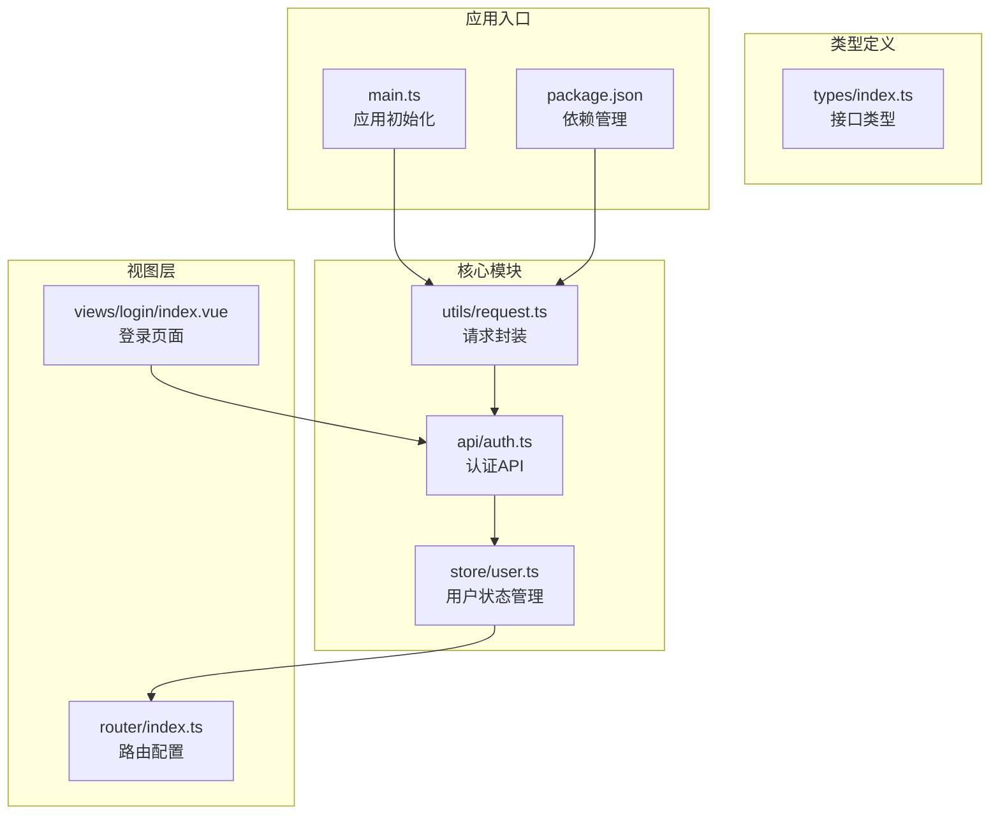
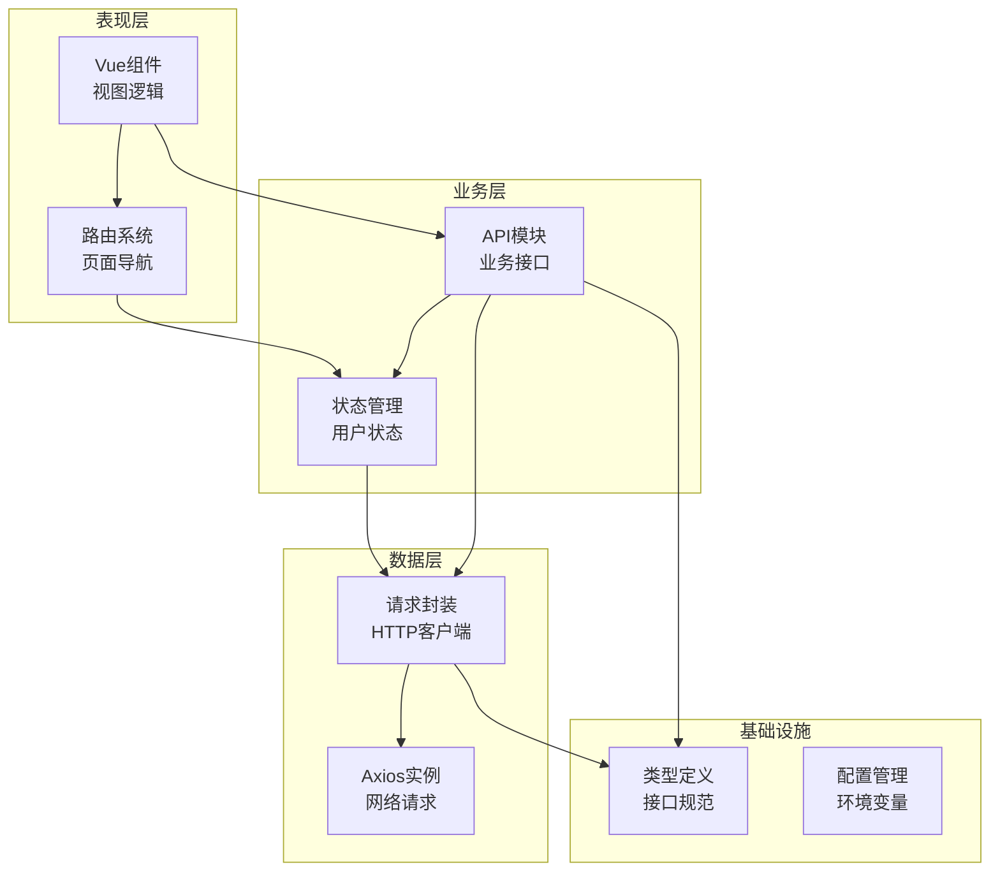
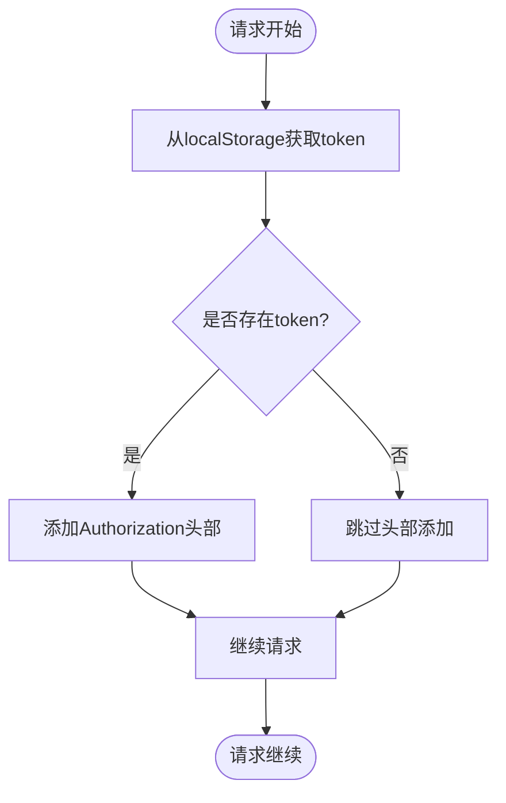
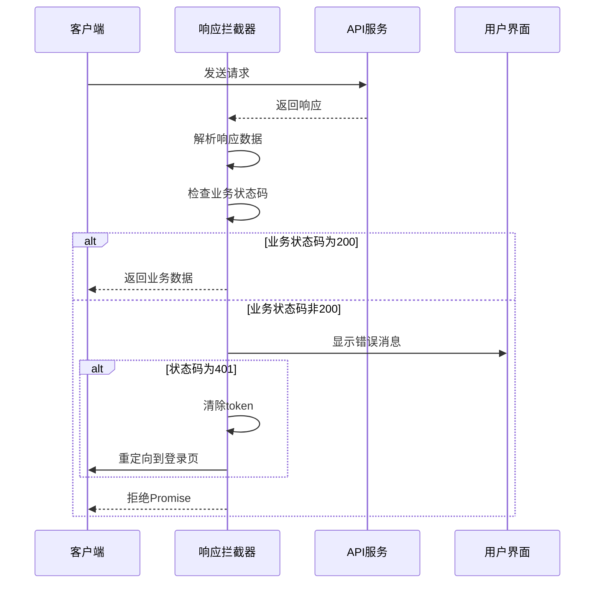
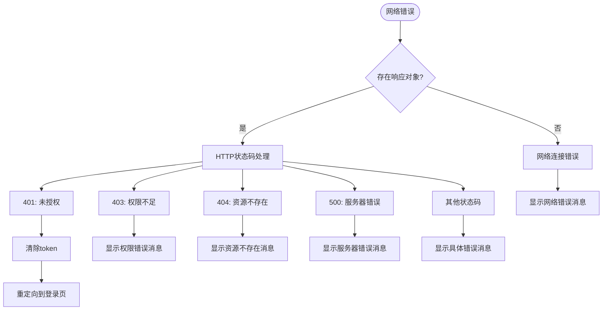
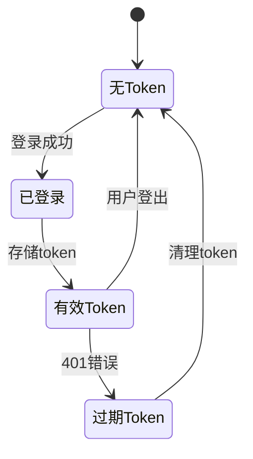
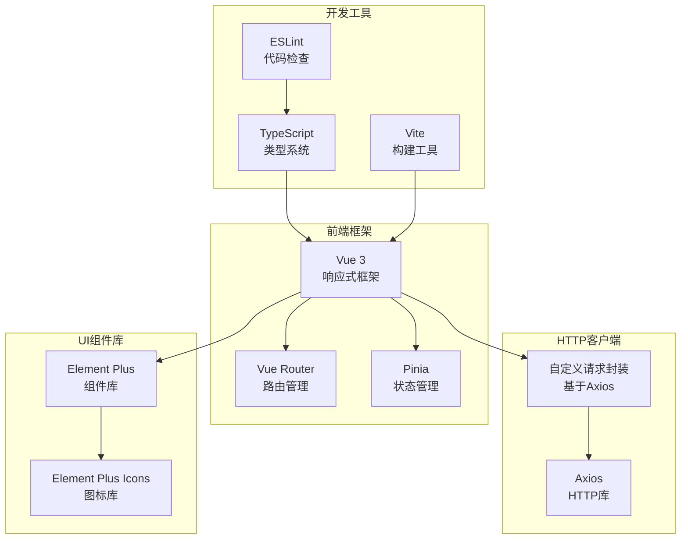
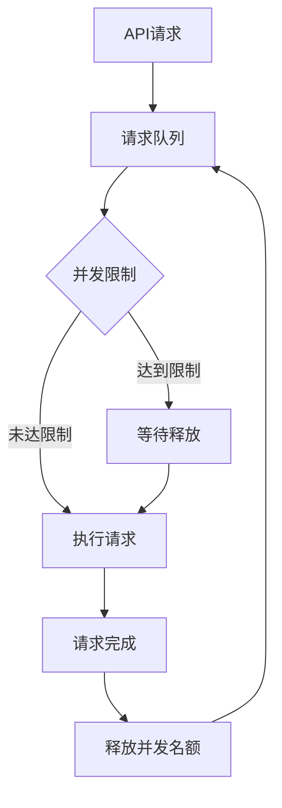

# API请求封装

<cite>
**本文档引用的文件**
- [src/utils/request.ts](file://src/utils/request.ts)
- [src/api/auth.ts](file://src/api/auth.ts)
- [src/store/user.ts](file://src/store/user.ts)
- [src/types/index.ts](file://src/types/index.ts)
- [src/router/index.ts](file://src/router/index.ts)
- [src/views/login/index.vue](file://src/views/login/index.vue)
- [src/main.ts](file://src/main.ts)
- [package.json](file://package.json)
</cite>

## 目录
1. [简介](#简介)
2. [项目结构](#项目结构)
3. [核心组件](#核心组件)
4. [架构概览](#架构概览)
5. [详细组件分析](#详细组件分析)
6. [依赖关系分析](#依赖关系分析)
7. [性能考虑](#性能考虑)
8. [故障排除指南](#故障排除指南)
9. [结论](#结论)
10. [附录](#附录)

## 简介

本项目采用Vue 3 + TypeScript + Vite技术栈构建的管理系统，其中API请求封装是整个应用的核心基础设施。本文档深入分析了基于Axios的HTTP请求统一配置和拦截器实现，包括请求拦截器、响应拦截器和错误处理机制，详细说明了Token自动添加、请求重试策略和超时处理配置，并提供了API调用的最佳实践、错误码处理和网络异常恢复方案。

## 项目结构

项目采用模块化组织方式，API相关代码主要分布在以下目录：



**图表来源**
- [src/utils/request.ts](file://src/utils/request.ts#L1-L102)
- [src/api/auth.ts](file://src/api/auth.ts#L1-L18)
- [src/store/user.ts](file://src/store/user.ts#L1-L68)

**章节来源**
- [src/utils/request.ts](file://src/utils/request.ts#L1-L102)
- [src/api/auth.ts](file://src/api/auth.ts#L1-L18)
- [src/store/user.ts](file://src/store/user.ts#L1-L68)
- [src/types/index.ts](file://src/types/index.ts#L1-L45)
- [src/router/index.ts](file://src/router/index.ts#L1-L123)
- [src/views/login/index.vue](file://src/views/login/index.vue#L1-L257)
- [src/main.ts](file://src/main.ts#L1-L27)
- [package.json](file://package.json#L1-L38)

## 核心组件

### 请求封装服务

项目的核心是基于Axios的请求封装服务，提供了统一的HTTP客户端配置和便捷的API方法。

#### 基础配置
- **基础URL**: `/api` - 所有API请求的基础路径
- **超时设置**: 15秒 - 防止网络请求长时间阻塞
- **默认头部**: JSON内容类型配置
- **错误消息**: 使用Element Plus的消息提示组件

#### 请求方法封装
项目提供了标准的HTTP方法封装：
- `get()`: GET请求，支持查询参数
- `post()`: POST请求，支持请求体数据
- `put()`: PUT请求，支持更新数据
- `del()`: DELETE请求，支持删除操作
- `request()`: 通用请求方法

**章节来源**
- [src/utils/request.ts](file://src/utils/request.ts#L5-L11)
- [src/utils/request.ts](file://src/utils/request.ts#L81-L99)

### 认证API模块

认证相关的API接口集中在独立的模块中，便于维护和测试：

#### 接口定义
- `login()`: 用户登录接口
- `getUserInfo()`: 获取用户信息接口  
- `logout()`: 用户登出接口

#### 类型安全
所有API接口都使用TypeScript泛型确保类型安全：
- 返回值类型通过泛型参数指定
- 参数类型通过接口定义约束
- 错误处理类型明确

**章节来源**
- [src/api/auth.ts](file://src/api/auth.ts#L1-L18)
- [src/types/index.ts](file://src/types/index.ts#L19-L30)

### 用户状态管理

Pinia状态管理提供了完整的用户认证状态管理：

#### 状态结构
- `token`: JWT访问令牌
- `userInfo`: 用户基本信息
- `permissions`: 用户权限列表

#### 核心功能
- `setToken()`: 设置并持久化token
- `login()`: 完整的登录流程
- `logout()`: 清理用户状态
- 权限检查方法：`hasPermission()`, `hasAnyPermission()`, `hasAllPermissions()`

**章节来源**
- [src/store/user.ts](file://src/store/user.ts#L4-L8)
- [src/store/user.ts](file://src/store/user.ts#L25-L65)

## 架构概览

项目采用分层架构设计，各层职责清晰分离：



**图表来源**
- [src/utils/request.ts](file://src/utils/request.ts#L1-L102)
- [src/api/auth.ts](file://src/api/auth.ts#L1-L18)
- [src/store/user.ts](file://src/store/user.ts#L1-L68)
- [src/router/index.ts](file://src/router/index.ts#L1-L123)

## 详细组件分析

### 请求拦截器实现

请求拦截器负责在请求发送前进行预处理，主要功能包括：

#### Token自动添加机制


**图表来源**
- [src/utils/request.ts](file://src/utils/request.ts#L14-L28)

#### 错误处理策略
- **请求错误捕获**: 捕获拦截器内部异常
- **日志记录**: 控制台输出错误信息
- **Promise拒绝**: 正确传递错误给调用方

**章节来源**
- [src/utils/request.ts](file://src/utils/request.ts#L14-L28)

### 响应拦截器实现

响应拦截器负责统一处理API响应，提供完整的错误处理和状态管理：

#### 业务状态码处理


**图表来源**
- [src/utils/request.ts](file://src/utils/request.ts#L31-L78)

#### HTTP状态码映射
- **401**: 自动清理token并重定向到登录页
- **403**: 权限不足提示
- **404**: 资源不存在提示
- **500**: 服务器错误提示
- **其他**: 显示具体的错误消息

**章节来源**
- [src/utils/request.ts](file://src/utils/request.ts#L31-L78)

### 错误处理机制

项目实现了多层次的错误处理机制：

#### 错误分类处理


**图表来源**
- [src/utils/request.ts](file://src/utils/request.ts#L50-L77)

#### 用户体验优化
- **消息提示**: 使用Element Plus消息组件提供友好的错误反馈
- **自动重定向**: 401错误自动跳转到登录页面
- **状态清理**: 自动清理无效的认证状态

**章节来源**
- [src/utils/request.ts](file://src/utils/request.ts#L50-L77)

### Token管理策略

项目实现了完整的Token生命周期管理：

#### Token存储与读取
- **存储位置**: localStorage持久化存储
- **读取时机**: 每次请求前自动读取
- **更新机制**: 登录成功后更新token状态

#### Token验证流程


**图表来源**
- [src/store/user.ts](file://src/store/user.ts#L27-L30)
- [src/utils/request.ts](file://src/utils/request.ts#L40-L43)

**章节来源**
- [src/store/user.ts](file://src/store/user.ts#L27-L30)
- [src/utils/request.ts](file://src/utils/request.ts#L40-L43)

### API调用最佳实践

#### 类型安全使用
```typescript
// 正确的类型使用方式
const login = async (credentials: LoginForm) => {
  const response = await post<ApiResponse<LoginResponse>>('/auth/login', credentials);
  return response.data;
};

// 泛型参数确保返回值类型安全
const userInfo = await getUserInfo<ApiResponse<UserInfo>>();
```

#### 错误处理模式
```typescript
try {
  const result = await apiCall();
  // 处理成功响应
} catch (error) {
  // 统一错误处理
  if (error.response?.status === 401) {
    // 处理未授权
  }
}
```

**章节来源**
- [src/api/auth.ts](file://src/api/auth.ts#L5-L17)
- [src/types/index.ts](file://src/types/index.ts#L26-L30)

## 依赖关系分析

项目的技术栈和依赖关系如下：



**图表来源**
- [package.json](file://package.json#L12-L20)
- [src/main.ts](file://src/main.ts#L1-L27)

**章节来源**
- [package.json](file://package.json#L12-L20)
- [src/main.ts](file://src/main.ts#L1-L27)

## 性能考虑

### 超时配置
- **默认超时**: 15秒，平衡用户体验和资源占用
- **可配置性**: 支持针对不同API设置不同的超时时间
- **内存管理**: 超时后自动清理请求资源

### 并发控制


### 缓存策略
当前实现未包含请求缓存机制，建议的缓存策略：
- **GET请求缓存**: 对于不经常变化的数据使用缓存
- **缓存失效**: 基于时间戳或版本号的缓存失效机制
- **缓存优先级**: 不同数据类型的缓存优先级设置

## 故障排除指南

### 常见问题诊断

#### Token相关问题
- **问题**: 登录后仍然提示未登录
- **原因**: token未正确存储或请求头未正确添加
- **解决方案**: 检查localStorage中的token状态和请求拦截器

#### 网络请求问题
- **问题**: 请求超时或网络错误
- **原因**: 网络连接不稳定或服务器响应慢
- **解决方案**: 检查网络状态和服务器可用性

#### 类型错误
- **问题**: TypeScript编译错误
- **原因**: API返回类型不匹配
- **解决方案**: 检查API响应格式和类型定义

**章节来源**
- [src/utils/request.ts](file://src/utils/request.ts#L14-L28)
- [src/utils/request.ts](file://src/utils/request.ts#L50-L77)

### 调试技巧

#### 开发者工具使用
- **网络面板**: 监控API请求和响应
- **控制台**: 查看错误日志和警告信息
- **Vue DevTools**: 检查组件状态和props

#### 日志记录
```typescript
// 在关键位置添加日志
console.log('请求配置:', config);
console.log('响应数据:', response.data);
```

## 结论

本项目的API请求封装实现了以下核心特性：

### 技术优势
- **统一配置**: 基于Axios的统一HTTP客户端配置
- **拦截器机制**: 完整的请求和响应拦截器实现
- **类型安全**: 全面的TypeScript类型定义
- **错误处理**: 分层次的错误处理和恢复机制
- **状态管理**: 集成的用户认证状态管理

### 最佳实践总结
- **模块化设计**: API接口按功能模块组织
- **类型约束**: 强类型约束确保代码质量
- **错误处理**: 统一的错误处理策略
- **用户体验**: 友好的错误提示和状态反馈

### 改进建议
- **请求重试**: 实现指数退避的请求重试机制
- **请求取消**: 支持请求取消和中断
- **缓存策略**: 添加智能缓存机制
- **性能监控**: 集成请求性能监控

该项目为Vue 3应用的API请求封装提供了良好的基础架构，具有良好的扩展性和维护性。

## 附录

### 使用示例

#### 基础API调用
```typescript
// 登录API调用
const login = async (credentials: LoginForm) => {
  try {
    const response = await login(credentials);
    return response.data;
  } catch (error) {
    console.error('登录失败:', error);
    throw error;
  }
};
```

#### 错误处理示例
```typescript
// 统一错误处理
const handleApiError = (error: any) => {
  if (error.response?.status === 401) {
    // 处理未授权
    store.logout();
    router.push('/login');
  }
  // 其他错误处理
};
```

### 配置选项

#### Axios配置
- **baseURL**: API基础URL
- **timeout**: 请求超时时间（毫秒）
- **headers**: 默认请求头
- **withCredentials**: 是否携带凭证

#### 自定义配置
- **Token自动添加**: 通过请求拦截器实现
- **错误消息显示**: 通过响应拦截器实现
- **状态码处理**: 业务状态码和HTTP状态码分别处理

**章节来源**
- [src/utils/request.ts](file://src/utils/request.ts#L5-L11)
- [src/utils/request.ts](file://src/utils/request.ts#L81-L99)