# 布局系统

<cite>
**本文档引用的文件**
- [src/layout/index.vue](file://src/layout/index.vue)
- [src/App.vue](file://src/App.vue)
- [src/main.ts](file://src/main.ts)
- [src/router/index.ts](file://src/router/index.ts)
- [src/store/user.ts](file://src/store/user.ts)
- [src/types/index.ts](file://src/types/index.ts)
- [src/directives/permission.ts](file://src/directives/permission.ts)
- [src/views/dashboard/index.vue](file://src/views/dashboard/index.vue)
- [src/views/system/user/index.vue](file://src/views/system/user/index.vue)
- [src/views/system/role/index.vue](file://src/views/system/role/index.vue)
- [src/views/system/menu/index.vue](file://src/views/system/menu/index.vue)
- [package.json](file://package.json)
</cite>

## 目录
1. [简介](#简介)
2. [项目结构](#项目结构)
3. [核心组件](#核心组件)
4. [架构概览](#架构概览)
5. [详细组件分析](#详细组件分析)
6. [依赖关系分析](#依赖关系分析)
7. [性能考虑](#性能考虑)
8. [故障排除指南](#故障排除指南)
9. [结论](#结论)
10. [附录](#附录)

## 简介

Vue TS Admin 布局系统是一个基于 Vue 3 + TypeScript + Element Plus 的现代化后台管理系统布局解决方案。该系统采用经典的三栏布局设计，包含侧边栏导航、顶部头部区域和主要内容区域，支持响应式设计、权限控制和主题切换等功能。

系统的核心特点包括：
- 响应式布局设计，支持桌面端和移动端适配
- 动态菜单生成，基于路由元信息构建导航结构
- 权限控制机制，支持细粒度的页面和操作权限管理
- 主题切换支持，内置深色模式和浅色模式
- 流畅的动画过渡效果，提升用户体验

## 项目结构

该项目采用模块化的文件组织方式，布局系统主要集中在 `src/layout` 目录中，配合路由、状态管理和权限指令等核心模块。

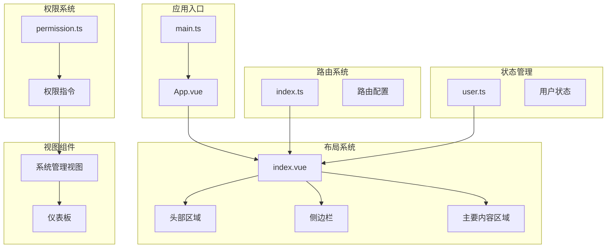

**图表来源**
- [src/main.ts](file://src/main.ts#L1-L27)
- [src/App.vue](file://src/App.vue#L1-L51)
- [src/layout/index.vue](file://src/layout/index.vue#L1-L255)
- [src/router/index.ts](file://src/router/index.ts#L1-L123)

**章节来源**
- [src/main.ts](file://src/main.ts#L1-L27)
- [src/App.vue](file://src/App.vue#L1-L51)
- [src/layout/index.vue](file://src/layout/index.vue#L1-L255)

## 核心组件

布局系统由三个主要组件构成：侧边栏、头部区域和主要内容区域。每个组件都有明确的职责分工和交互逻辑。

### 侧边栏组件

侧边栏是布局系统的核心导航组件，负责展示系统菜单和处理用户交互。

**组件特性：**
- 支持折叠/展开状态切换
- 动态菜单生成，基于路由配置
- 权限控制，仅显示用户有权限的菜单项
- 响应式宽度调整（64px - 220px）

### 头部区域组件

头部区域提供系统级的操作功能，包括用户信息展示和系统操作。

**组件特性：**
- 用户头像和昵称显示
- 下拉菜单操作（个人中心、退出登录）
- 侧边栏折叠控制按钮
- 阴影效果和背景色设计

### 主要内容区域

主要内容区域负责渲染当前路由对应的视图组件，并提供平滑的页面切换动画。

**组件特性：**
- 路由视图容器
- 进出场动画效果
- 滚动条样式定制
- 内容区域背景色

**章节来源**
- [src/layout/index.vue](file://src/layout/index.vue#L1-L255)

## 架构概览

布局系统采用分层架构设计，各层之间职责清晰，耦合度低，便于维护和扩展。

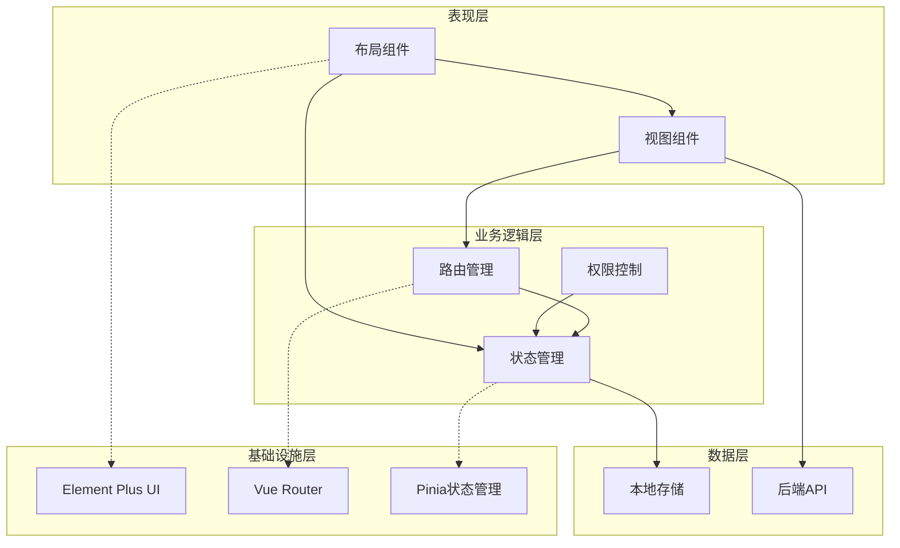

**图表来源**
- [src/layout/index.vue](file://src/layout/index.vue#L78-L134)
- [src/router/index.ts](file://src/router/index.ts#L1-L123)
- [src/store/user.ts](file://src/store/user.ts#L1-L68)

### 数据流分析

布局系统的数据流遵循单向数据流原则，从用户交互到状态更新再到界面渲染。

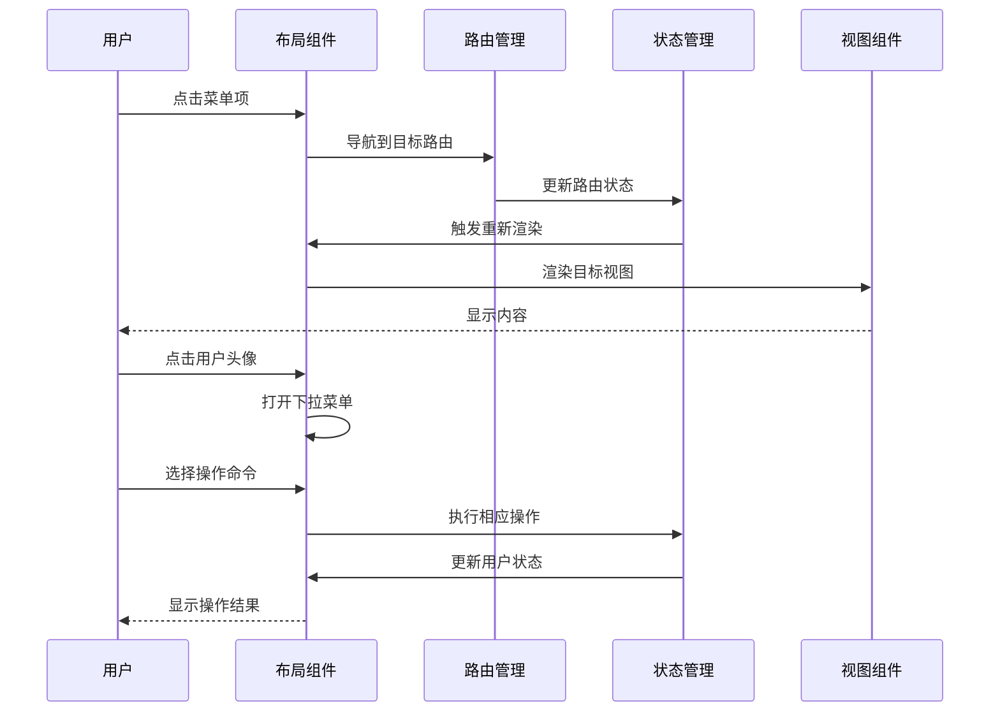

**图表来源**
- [src/layout/index.vue](file://src/layout/index.vue#L114-L133)
- [src/router/index.ts](file://src/router/index.ts#L95-L120)
- [src/store/user.ts](file://src/store/user.ts#L38-L50)

## 详细组件分析

### 布局容器组件

布局容器是整个布局系统的基础组件，采用 Element Plus 的容器布局组件实现。

#### 组件结构设计

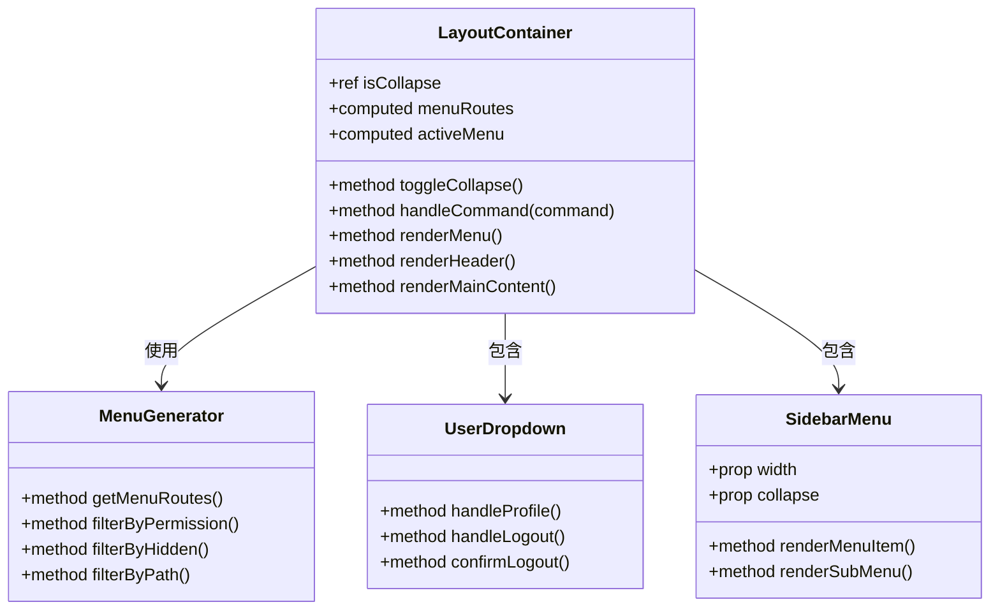

**图表来源**
- [src/layout/index.vue](file://src/layout/index.vue#L78-L134)

#### 菜单生成逻辑

菜单生成是布局系统的核心功能之一，基于路由配置动态生成导航菜单。

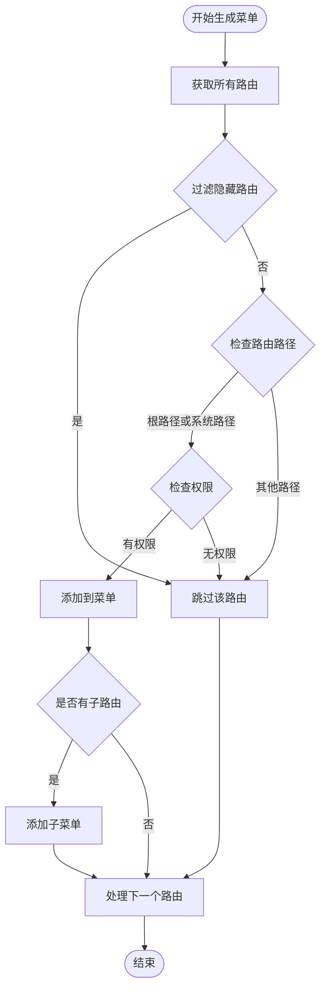

**图表来源**
- [src/layout/index.vue](file://src/layout/index.vue#L91-L104)

#### 用户信息展示机制

用户信息展示通过下拉菜单实现，支持用户头像、昵称显示和操作命令。

**组件特性：**
- 动态头像显示，支持图片和默认头像
- 昵称显示，支持多语言环境
- 下拉菜单操作，包括个人中心和退出登录
- 消息提示和确认对话框

**章节来源**
- [src/layout/index.vue](file://src/layout/index.vue#L44-L65)

### 响应式布局设计

布局系统采用响应式设计原则，确保在不同设备和屏幕尺寸下的良好体验。

#### 布局断点设计

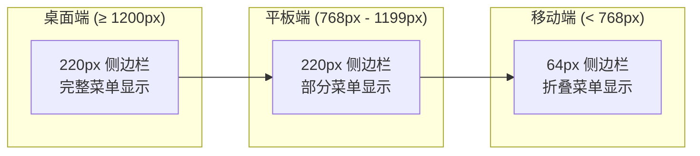

#### 折叠状态管理

侧边栏的折叠状态通过响应式状态管理实现，支持手动切换和自动适应。

**状态转换流程：**
- 正常状态：侧边栏宽度220px，显示完整菜单
- 折叠状态：侧边栏宽度64px，仅显示图标
- 动画过渡：宽度变化时的平滑过渡效果

**章节来源**
- [src/layout/index.vue](file://src/layout/index.vue#L3-L116)

### 权限控制系统

权限控制是布局系统的重要安全特性，通过路由元信息和用户状态实现细粒度的权限管理。

#### 权限检查流程

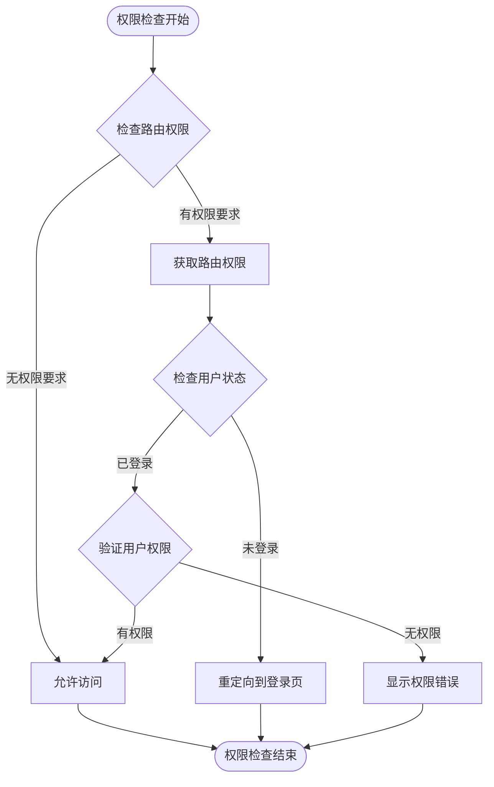

**图表来源**
- [src/router/index.ts](file://src/router/index.ts#L95-L120)
- [src/directives/permission.ts](file://src/directives/permission.ts#L9-L31)

#### 权限指令实现

权限指令提供了声明式的权限控制方式，可以在模板中直接使用。

**指令类型：**
- `v-permission`：用于页面元素的权限控制
- `v-role`：用于角色级别的权限控制

**使用示例：**
- 单个权限：`v-permission="'system:user:add'"`
- 多个权限：`v-permission="['system:user:add', 'system:user:edit']"`
- 角色控制：`v-role="'admin'"`

**章节来源**
- [src/directives/permission.ts](file://src/directives/permission.ts#L1-L67)

### 主题切换机制

布局系统支持主题切换功能，提供深色模式和浅色模式两种视觉风格。

#### 主题切换实现

主题切换通过 Element Plus 的 CSS 变量系统实现，支持运行时切换。

**切换流程：**
1. 用户触发主题切换操作
2. 应用程序检测当前主题状态
3. 切换到对应的主题 CSS 文件
4. 更新界面元素的颜色和样式
5. 保存用户偏好设置到本地存储

#### 主题样式定制

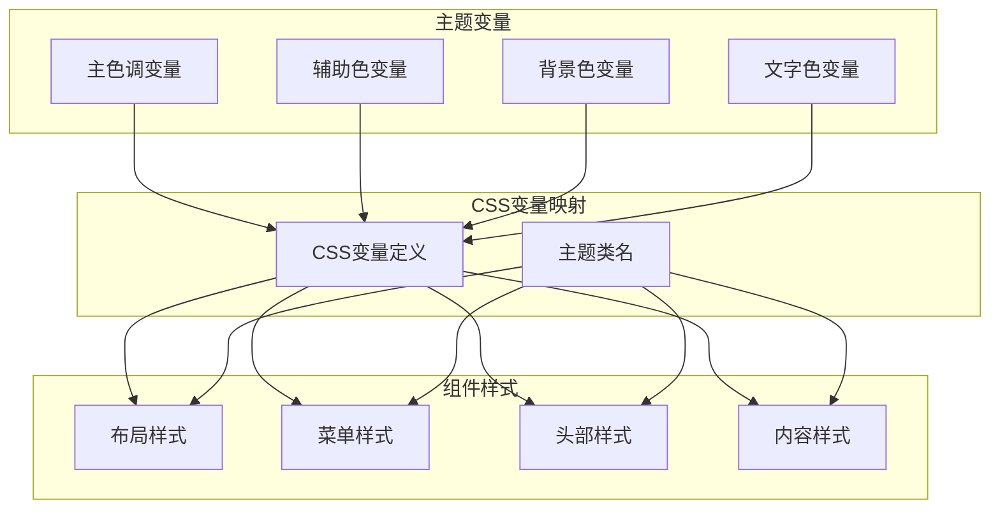

**图表来源**
- [src/main.ts](file://src/main.ts#L4-L4)
- [src/layout/index.vue](file://src/layout/index.vue#L136-L254)

**章节来源**
- [src/main.ts](file://src/main.ts#L1-L27)
- [src/layout/index.vue](file://src/layout/index.vue#L136-L254)

## 依赖关系分析

布局系统的依赖关系清晰明确，各模块之间的耦合度低，便于维护和扩展。

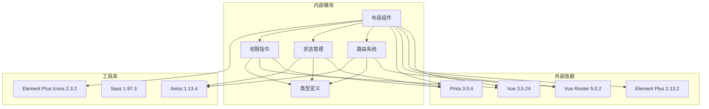

**图表来源**
- [package.json](file://package.json#L12-L36)
- [src/layout/index.vue](file://src/layout/index.vue#L80-L82)
- [src/router/index.ts](file://src/router/index.ts#L1-L4)

### 模块间通信

布局系统中的模块间通信采用事件驱动和状态共享的方式实现。

**通信模式：**
- 路由事件：通过 Vue Router 的导航守卫实现
- 状态事件：通过 Pinia 的 store 实现
- 用户交互：通过组件事件和 props 实现
- 权限事件：通过自定义指令实现

**章节来源**
- [src/layout/index.vue](file://src/layout/index.vue#L78-L134)
- [src/router/index.ts](file://src/router/index.ts#L95-L120)
- [src/store/user.ts](file://src/store/user.ts#L25-L66)

## 性能考虑

布局系统在设计时充分考虑了性能优化，采用了多种策略来提升用户体验和系统响应速度。

### 渲染性能优化

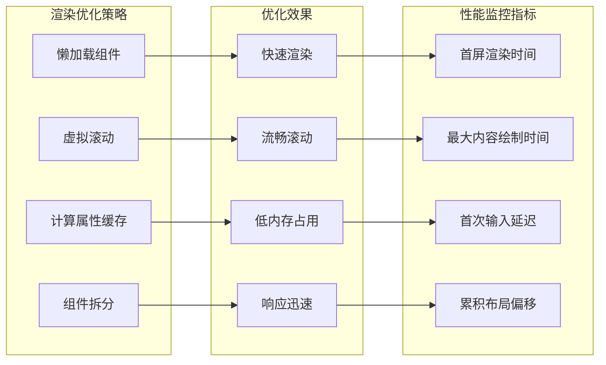

#### 组件懒加载

布局系统中的视图组件采用动态导入的方式实现懒加载，减少初始包体积。

**实现方式：**
- 使用 `() => import()` 语法进行动态导入
- 路由级别懒加载，按需加载组件
- 减少首屏 JavaScript 代码量

#### 计算属性缓存

布局系统大量使用 Vue 的计算属性来缓存复杂的数据计算结果。

**应用场景：**
- 菜单路由的过滤和排序
- 用户权限的验证结果
- 响应式样式的计算

#### 动画性能优化

页面切换动画采用 CSS3 变换和过渡实现，避免 JavaScript 动画带来的性能问题。

**优化措施：**
- 使用 transform 和 opacity 属性
- 避免触发布局和重绘
- 合理设置动画持续时间和缓动函数

### 内存管理策略

布局系统采用多种内存管理策略来避免内存泄漏和过度占用。

#### 组件生命周期管理

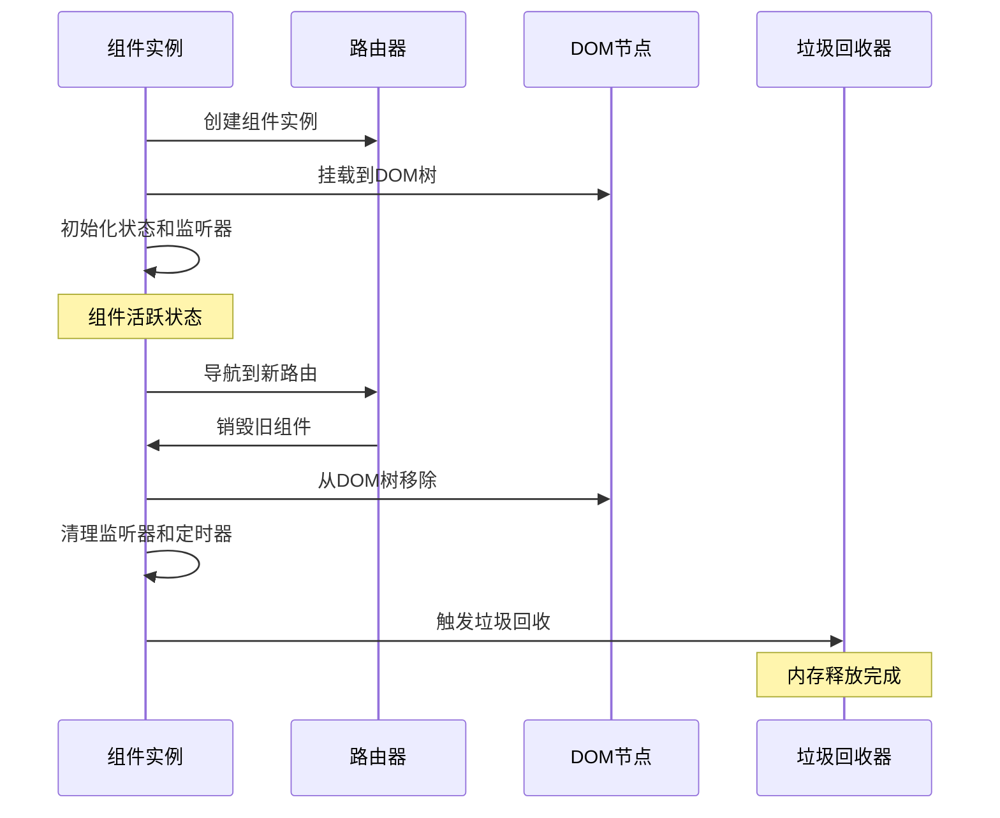

#### 事件监听器清理

布局系统中的事件监听器会在组件卸载时自动清理，防止内存泄漏。

**清理时机：**
- 组件 beforeUnmount 生命周期
- 路由切换时的自动清理
- 手动调用的清理函数

#### 存储空间管理

用户状态和权限信息存储在本地存储中，系统会定期清理过期数据。

**清理策略：**
- 退出登录时清除所有存储数据
- 令牌过期时自动清理
- 定期检查和清理无效数据

**章节来源**
- [src/layout/index.vue](file://src/layout/index.vue#L114-L133)
- [src/store/user.ts](file://src/store/user.ts#L45-L50)

## 故障排除指南

布局系统在实际使用过程中可能会遇到各种问题，本节提供了常见问题的诊断和解决方法。

### 常见问题及解决方案

#### 菜单不显示问题

**问题现象：** 用户登录后看不到任何菜单项

**可能原因：**
- 用户权限不足
- 路由配置错误
- 菜单数据加载失败

**解决方案：**
1. 检查用户权限是否正确设置
2. 验证路由配置中的 meta 信息
3. 查看浏览器开发者工具的网络请求
4. 确认菜单数据的加载状态

#### 页面跳转异常

**问题现象：** 点击菜单后页面无法正常跳转

**可能原因：**
- 路由配置缺失
- 导航守卫阻止
- 组件加载失败

**解决方案：**
1. 检查路由配置中的 component 属性
2. 验证路由的 redirect 配置
3. 查看路由守卫的逻辑
4. 确认组件文件路径正确

#### 权限控制失效

**问题现象：** 权限指令不生效，按钮仍然显示

**可能原因：**
- 权限指令注册失败
- 用户状态未正确更新
- 权限字符串格式错误

**解决方案：**
1. 确认权限指令已在 main.ts 中注册
2. 检查用户状态的更新逻辑
3. 验证权限字符串的格式和值
4. 查看控制台的错误信息

#### 主题切换问题

**问题现象：** 主题切换后样式不更新

**可能原因：**
- CSS 变量未正确更新
- 主题文件加载失败
- 浏览器缓存问题

**解决方案：**
1. 检查主题 CSS 文件的加载状态
2. 验证 CSS 变量的定义和使用
3. 清除浏览器缓存后重试
4. 确认主题切换逻辑的正确性

### 调试工具和技巧

#### 开发者工具使用

**浏览器开发者工具：**
- Network 标签：查看路由和 API 请求
- Console 标签：查看错误和警告信息
- Elements 标签：检查 DOM 结构和样式
- Sources 标签：调试 JavaScript 代码

**Vue DevTools 使用：**
- State 标签：查看 Pinia 状态
- Components 标签：检查组件树结构
- Events 标签：追踪组件事件
- Performance 标签：分析性能问题

#### 日志记录策略

布局系统建议在关键位置添加日志记录，便于问题排查。

**日志级别：**
- Info：一般信息和状态变更
- Warning：潜在问题和异常情况
- Error：严重错误和异常终止
- Debug：详细的技术信息和调试数据

**记录时机：**
- 路由切换时的状态变更
- 权限检查的结果
- 用户操作的执行结果
- 异常情况的处理过程

**章节来源**
- [src/layout/index.vue](file://src/layout/index.vue#L119-L133)
- [src/router/index.ts](file://src/router/index.ts#L95-L120)
- [src/store/user.ts](file://src/store/user.ts#L52-L55)

## 结论

Vue TS Admin 布局系统是一个功能完整、设计合理的现代化后台管理界面解决方案。系统采用模块化设计，具有良好的可扩展性和可维护性。

### 主要优势

1. **响应式设计**：完美适配不同设备和屏幕尺寸
2. **权限控制**：提供细粒度的权限管理和安全控制
3. **主题切换**：支持深色模式和浅色模式自由切换
4. **性能优化**：采用多种优化策略确保流畅体验
5. **易于扩展**：模块化设计便于功能扩展和定制

### 技术亮点

- 基于 Vue 3 Composition API 的现代化开发
- TypeScript 提供强类型安全保障
- Element Plus 提供丰富的 UI 组件
- Pinia 简化的状态管理模式
- 自定义权限指令实现声明式权限控制

### 改进建议

1. **国际化支持**：添加多语言切换功能
2. **缓存机制**：实现菜单和权限数据的缓存
3. **错误边界**：添加全局错误处理机制
4. **SEO 优化**：改善搜索引擎可见性
5. **测试覆盖**：增加单元测试和集成测试

## 附录

### 配置选项参考

#### 布局配置参数

| 参数名 | 类型 | 默认值 | 描述 |
|--------|------|--------|------|
| isCollapse | boolean | false | 侧边栏折叠状态 |
| menuRoutes | Array | [] | 动态生成的菜单路由 |
| activeMenu | string | '' | 当前激活的菜单项 |
| themeMode | string | 'light' | 主题模式（light/dark） |

#### 路由配置参数

| 参数名 | 类型 | 默认值 | 描述 |
|--------|------|--------|------|
| meta.title | string | '' | 路由标题 |
| meta.icon | string | '' | 路由图标 |
| meta.hidden | boolean | false | 是否隐藏菜单 |
| meta.permission | string | '' | 权限标识符 |
| meta.breadcrumb | boolean | true | 是否显示面包屑 |

#### 用户状态参数

| 参数名 | 类型 | 默认值 | 描述 |
|--------|------|--------|------|
| token | string | '' | 用户认证令牌 |
| userInfo | object | null | 用户基本信息 |
| permissions | Array | [] | 用户权限列表 |

### 扩展开发指南

#### 添加新菜单项

1. 在路由配置中添加新的路由记录
2. 设置 meta 信息（title、icon、permission）
3. 创建对应的视图组件
4. 在布局组件中验证权限

#### 自定义主题

1. 修改 CSS 变量定义
2. 添加新的主题文件
3. 实现主题切换逻辑
4. 保存用户偏好设置

#### 集成第三方组件

1. 安装第三方包
2. 在 main.ts 中注册组件
3. 在布局组件中使用
4. 处理样式冲突问题

#### 性能监控

1. 添加性能指标收集
2. 实现错误边界组件
3. 优化路由懒加载
4. 实施缓存策略

**章节来源**
- [src/layout/index.vue](file://src/layout/index.vue#L91-L111)
- [src/router/index.ts](file://src/router/index.ts#L6-L86)
- [src/store/user.ts](file://src/store/user.ts#L4-L23)