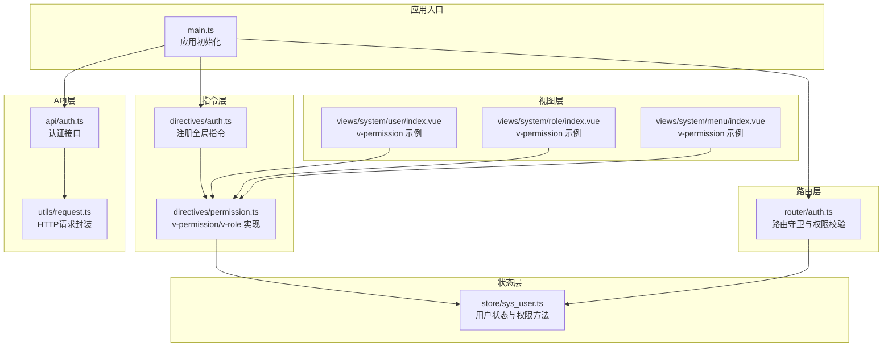
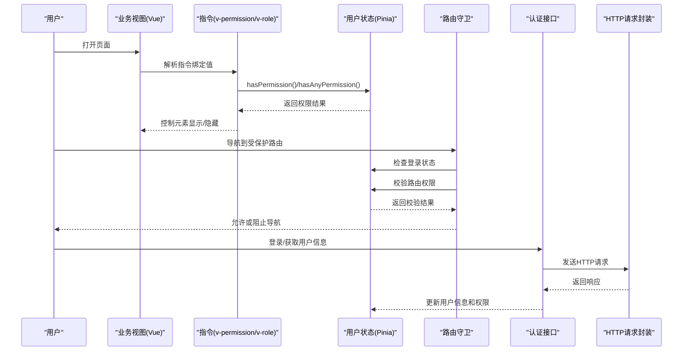
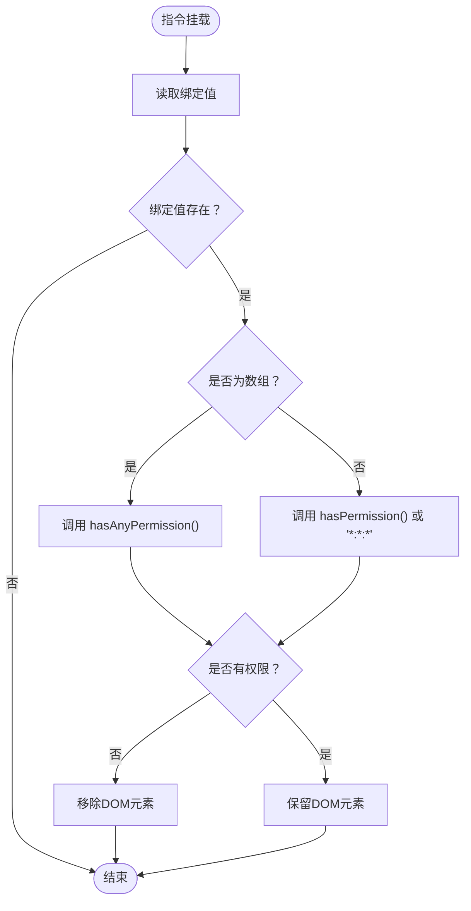
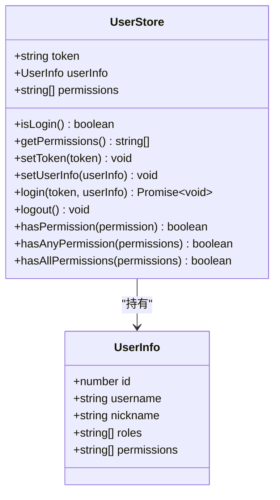
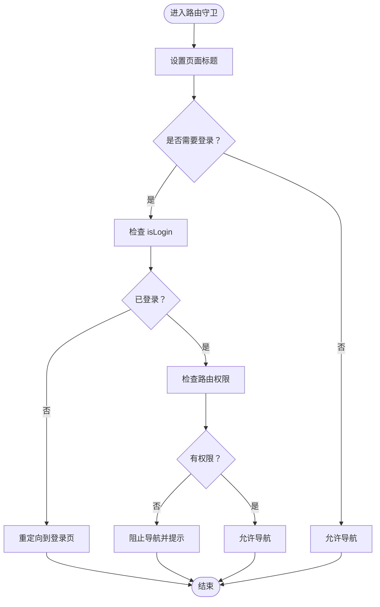
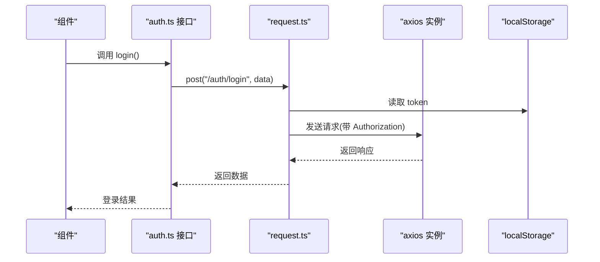
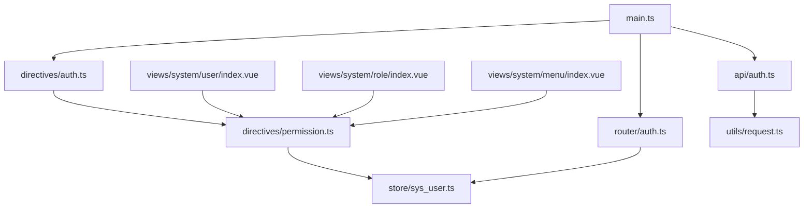

# 权限控制系统

<cite>
**本文档引用的文件**
- [src/directives/auth.ts](file://src/directives/auth.ts)
- [src/directives/permission.ts](file://src/directives/permission.ts)
- [src/store/sys_user.ts](file://src/store/sys_user.ts)
- [src/router/auth.ts](file://src/router/auth.ts)
- [src/api/auth.ts](file://src/api/auth.ts)
- [src/types/auth.ts](file://src/types/auth.ts)
- [src/main.ts](file://src/main.ts)
- [src/utils/request.ts](file://src/utils/request.ts)
- [src/views/system/user/index.vue](file://src/views/system/user/index.vue)
- [src/views/system/role/index.vue](file://src/views/system/role/index.vue)
- [src/views/system/menu/index.vue](file://src/views/system/menu/index.vue)
</cite>

## 目录
1. [简介](#简介)
2. [项目结构](#项目结构)
3. [核心组件](#核心组件)
4. [架构总览](#架构总览)
5. [详细组件分析](#详细组件分析)
6. [依赖关系分析](#依赖关系分析)
7. [性能考虑](#性能考虑)
8. [故障排除指南](#故障排除指南)
9. [结论](#结论)
10. [附录](#附录)

## 简介
本项目实现了基于角色和权限的访问控制（RBAC）系统，采用前端指令与Pinia状态管理相结合的方式，提供页面级和组件级的权限控制能力。系统支持：
- 基于权限字符串的细粒度控制（如 system:user:add）
- 基于角色数组的粗粒度控制（如 admin、user）
- 路由级别的权限校验
- 前端指令级的UI元素可见性控制
- Token自动注入与401处理

## 项目结构
权限控制相关的代码主要分布在以下模块：
- 指令层：全局注册 v-permission 和 v-role 指令
- 状态层：Pinia 用户仓库，存储 token、用户信息和权限集合
- 路由层：路由守卫进行权限校验
- API层：认证接口与HTTP请求封装
- 视图层：各业务页面通过指令控制按钮等元素的显示

**图表来源**
- [src/main.ts](file://src/main.ts#L1-L27)
- [src/directives/auth.ts](file://src/directives/index.ts#L1-L16)
- [src/directives/permission.ts](file://src/directives/permission.ts#L1-L67)
- [src/store/sys_user.ts](file://src/store/user.ts#L1-L68)
- [src/router/auth.ts](file://src/router/index.ts#L1-L123)
- [src/api/auth.ts](file://src/api/auth.ts#L1-L18)
- [src/utils/request.ts](file://src/utils/request.ts#L1-L102)
- [src/views/system/user/index.vue](file://src/views/system/user/index.vue#L1-L183)
- [src/views/system/role/index.vue](file://src/views/system/role/index.vue#L1-L150)
- [src/views/system/menu/index.vue](file://src/views/system/menu/index.vue#L1-L161)

**章节来源**
- [src/main.ts](file://src/main.ts#L1-L27)
- [src/directives/auth.ts](file://src/directives/index.ts#L1-L16)
- [src/directives/permission.ts](file://src/directives/permission.ts#L1-L67)
- [src/store/sys_user.ts](file://src/store/user.ts#L1-L68)
- [src/router/auth.ts](file://src/router/index.ts#L1-L123)
- [src/api/auth.ts](file://src/api/auth.ts#L1-L18)
- [src/utils/request.ts](file://src/utils/request.ts#L1-L102)
- [src/views/system/user/index.vue](file://src/views/system/user/index.vue#L1-L183)
- [src/views/system/role/index.vue](file://src/views/system/role/index.vue#L1-L150)
- [src/views/system/menu/index.vue](file://src/views/system/menu/index.vue#L1-L161)

## 核心组件
本节深入分析权限控制的核心组件及其职责。

- 全局指令注册
  - 在应用启动时注册 v-permission 和 v-role 指令，确保在所有组件中可用
  - 指令挂载时根据绑定值动态判断元素是否渲染

- 用户状态管理（Pinia）
  - 存储 token、用户信息和权限集合
  - 提供 hasPermission、hasAnyPermission、hasAllPermissions 等权限检查方法
  - 支持登录、登出、权限更新等操作

- 路由守卫
  - 在进入路由前检查登录状态
  - 根据路由元信息中的 permission 字段进行权限校验
  - 无权限时阻止导航并提示

- 认证与HTTP请求
  - 自动从本地存储读取 token 并注入到请求头
  - 统一处理 401、403 等错误状态码
  - 提供登录、获取用户信息、退出登录等接口

**章节来源**
- [src/directives/auth.ts](file://src/directives/index.ts#L1-L16)
- [src/directives/permission.ts](file://src/directives/permission.ts#L1-L67)
- [src/store/sys_user.ts](file://src/store/user.ts#L1-L68)
- [src/router/auth.ts](file://src/router/index.ts#L94-L120)
- [src/api/auth.ts](file://src/api/auth.ts#L1-L18)
- [src/utils/request.ts](file://src/utils/request.ts#L14-L78)

## 架构总览
下图展示了权限控制系统的整体架构与交互流程：

**图表来源**
- [src/directives/permission.ts](file://src/directives/permission.ts#L9-L31)
- [src/directives/permission.ts](file://src/directives/permission.ts#L38-L61)
- [src/store/sys_user.ts](file://src/store/user.ts#L52-L65)
- [src/router/auth.ts](file://src/router/index.ts#L94-L120)
- [src/api/auth.ts](file://src/api/auth.ts#L4-L12)
- [src/utils/request.ts](file://src/utils/request.ts#L14-L78)

## 详细组件分析

### 指令组件分析
指令层负责在模板层面实现权限控制，支持两种模式：
- 字符串模式：单个权限字符串
- 数组模式：多个权限，满足其一即可

**图表来源**
- [src/directives/permission.ts](file://src/directives/permission.ts#L9-L31)
- [src/directives/permission.ts](file://src/directives/permission.ts#L38-L61)

**章节来源**
- [src/directives/permission.ts](file://src/directives/permission.ts#L1-L67)

### 用户状态管理分析
用户状态管理采用 Pinia，提供以下能力：
- 登录状态跟踪（isLogin getter）
- 权限集合管理（permissions）
- 权限检查方法（hasPermission、hasAnyPermission、hasAllPermissions）
- 登录/登出流程（setToken、setUserInfo、logout）

**图表来源**
- [src/store/sys_user.ts](file://src/store/user.ts#L4-L66)
- [src/types/auth.ts](file://src/types/index.ts#L2-L11)

**章节来源**
- [src/store/sys_user.ts](file://src/store/user.ts#L1-L68)
- [src/types/auth.ts](file://src/types/index.ts#L1-L45)

### 路由守卫分析
路由守卫在导航前执行以下步骤：
- 设置页面标题
- 非登录页检查登录状态
- 检查路由元信息中的权限字段
- 无权限时阻止导航并提示

**图表来源**
- [src/router/auth.ts](file://src/router/index.ts#L94-L120)

**章节来源**
- [src/router/auth.ts](file://src/router/index.ts#L1-L123)

### API与HTTP请求分析
API层提供认证相关接口，HTTP层统一处理请求与响应：
- 自动注入 Authorization 头部
- 统一处理 401、403、404、500 等错误
- 提供登录、获取用户信息、退出登录等方法

**图表来源**
- [src/api/auth.ts](file://src/api/auth.ts#L4-L12)
- [src/utils/request.ts](file://src/utils/request.ts#L14-L28)
- [src/utils/request.ts](file://src/utils/request.ts#L30-L78)

**章节来源**
- [src/api/auth.ts](file://src/api/auth.ts#L1-L18)
- [src/utils/request.ts](file://src/utils/request.ts#L1-L102)

### 视图层权限控制示例
各业务页面通过指令控制按钮等元素的显示：
- 用户管理：新增、编辑、删除按钮按权限控制
- 角色管理：新增、编辑、权限配置、删除按钮按权限控制
- 菜单管理：新增、编辑、删除按钮按权限控制

**章节来源**
- [src/views/system/user/index.vue](file://src/views/system/user/index.vue#L7-L58)
- [src/views/system/role/index.vue](file://src/views/system/role/index.vue#L7-L57)
- [src/views/system/menu/index.vue](file://src/views/system/menu/index.vue#L7-L47)

## 依赖关系分析
权限控制系统的依赖关系如下：

**图表来源**
- [src/main.ts](file://src/main.ts#L1-L27)
- [src/directives/auth.ts](file://src/directives/index.ts#L1-L16)
- [src/directives/permission.ts](file://src/directives/permission.ts#L1-L67)
- [src/store/sys_user.ts](file://src/store/user.ts#L1-L68)
- [src/router/auth.ts](file://src/router/index.ts#L1-L123)
- [src/api/auth.ts](file://src/api/auth.ts#L1-L18)
- [src/utils/request.ts](file://src/utils/request.ts#L1-L102)
- [src/views/system/user/index.vue](file://src/views/system/user/index.vue#L1-L183)
- [src/views/system/role/index.vue](file://src/views/system/role/index.vue#L1-L150)
- [src/views/system/menu/index.vue](file://src/views/system/menu/index.vue#L1-L161)

**章节来源**
- [src/main.ts](file://src/main.ts#L1-L27)
- [src/directives/auth.ts](file://src/directives/index.ts#L1-L16)
- [src/directives/permission.ts](file://src/directives/permission.ts#L1-L67)
- [src/store/sys_user.ts](file://src/store/user.ts#L1-L68)
- [src/router/auth.ts](file://src/router/index.ts#L1-L123)
- [src/api/auth.ts](file://src/api/auth.ts#L1-L18)
- [src/utils/request.ts](file://src/utils/request.ts#L1-L102)
- [src/views/system/user/index.vue](file://src/views/system/user/index.vue#L1-L183)
- [src/views/system/role/index.vue](file://src/views/system/role/index.vue#L1-L150)
- [src/views/system/menu/index.vue](file://src/views/system/menu/index.vue#L1-L161)

## 性能考虑
- 指令检查复杂度：hasPermission 为 O(n)，hasAnyPermission 为 O(n)，n 为权限数量；可通过缓存优化
- 状态更新：权限变更后应触发相关组件重新渲染，避免重复计算
- 路由守卫：仅在导航时执行，避免频繁检查
- HTTP请求：统一拦截器减少重复代码，提高可维护性

## 故障排除指南
- 无权限访问页面
  - 检查路由元信息中的 permission 字段是否正确
  - 确认用户权限集合是否包含所需权限
  - 查看控制台是否有 403 错误提示

- 指令不生效
  - 确认指令已在 main.ts 中注册
  - 检查绑定值格式（字符串或数组）
  - 验证用户状态是否已正确初始化

- 登录后仍提示未登录
  - 检查 token 是否正确存储在 localStorage
  - 确认请求拦截器是否正确注入 Authorization 头

- 401/403 错误
  - 检查服务端返回的错误码
  - 确认用户会话是否过期
  - 查看响应拦截器中的错误处理逻辑

**章节来源**
- [src/router/auth.ts](file://src/router/index.ts#L110-L116)
- [src/utils/request.ts](file://src/utils/request.ts#L39-L46)
- [src/utils/request.ts](file://src/utils/request.ts#L53-L77)

## 结论
本权限控制系统通过指令、状态管理和路由守卫的协同工作，实现了灵活且高效的前端权限控制。系统具备良好的扩展性，可进一步完善权限缓存、权限继承与组合策略，以及提供更丰富的权限调试工具。

## 附录

### RBAC权限设计原理
- 角色（Role）：一组权限的集合
- 权限（Permission）：对资源的操作授权
- 用户（User）：拥有角色的实体
- 关系：用户通过角色间接获得权限

### 权限指令实现机制
- v-permission：支持字符串和数组两种绑定值
- v-role：基于用户角色数组进行匹配
- 指令在 mounted 阶段执行，根据权限结果决定元素显示

### 权限验证逻辑
- 页面级：路由守卫检查路由元信息中的权限
- 组件级：指令检查用户权限集合
- 支持通配符权限（如 *:*:*）

### 权限缓存策略
- 当前实现：直接从内存中的权限数组检查
- 建议：引入 LRU 缓存或基于权限字符串的哈希缓存

### 权限更新机制
- 登录成功后更新用户状态
- 退出登录时清空权限信息
- 可扩展：提供手动刷新权限的方法

### 权限配置方法
- 在路由元信息中配置 permission 字段
- 在用户信息中配置 roles 和 permissions
- 在组件中使用 v-permission 和 v-role 指令

### 权限继承规则
- 当前系统未实现角色继承
- 建议：在用户状态中提供角色继承计算方法

### 权限组合策略
- hasAnyPermission：满足任一权限即通过
- hasAllPermissions：需满足所有权限才通过
- 可扩展：支持 AND/OR/NOT 组合表达式

### 使用示例
- 单个权限：v-permission="'system:user:add'"
- 多个权限：v-permission="['system:user:add', 'system:user:edit']"
- 角色控制：v-role="'admin'"

### 最佳实践
- 权限字符串采用模块:资源:操作 的命名规范
- 在路由元信息中明确标注权限要求
- 对敏感操作同时使用页面级和组件级双重校验
- 定期清理无效权限，保持权限集合精简