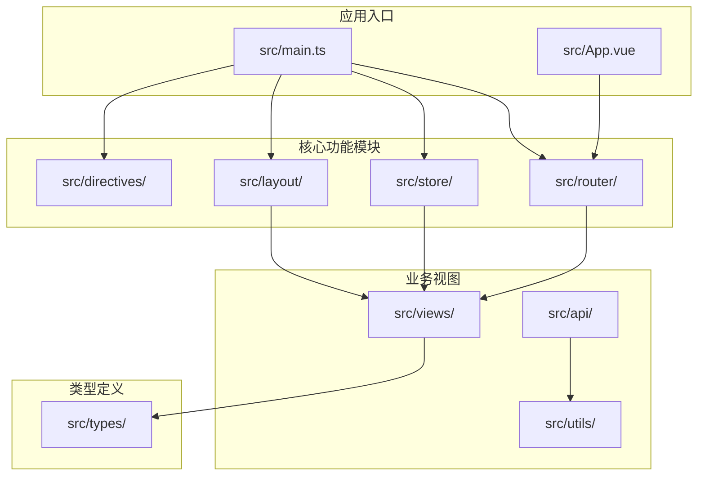
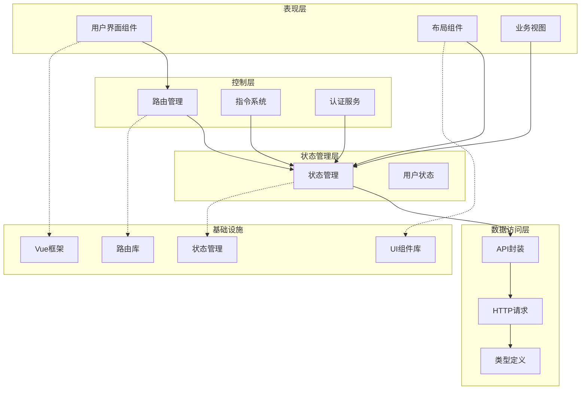
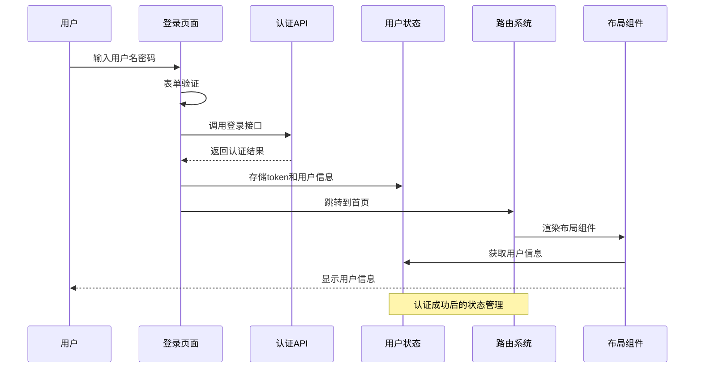
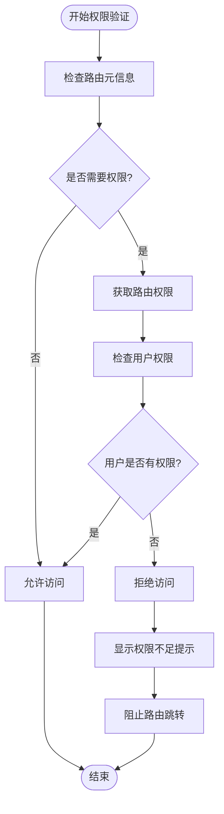
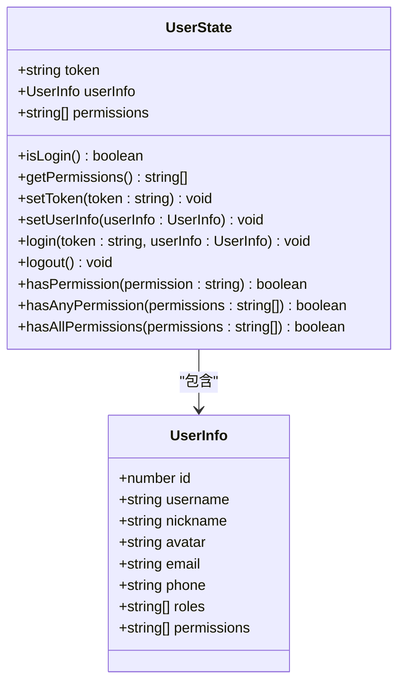
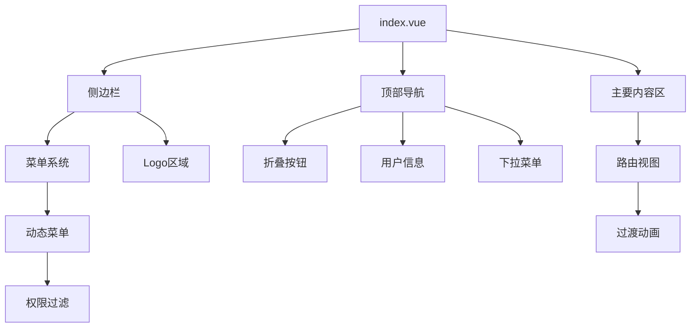
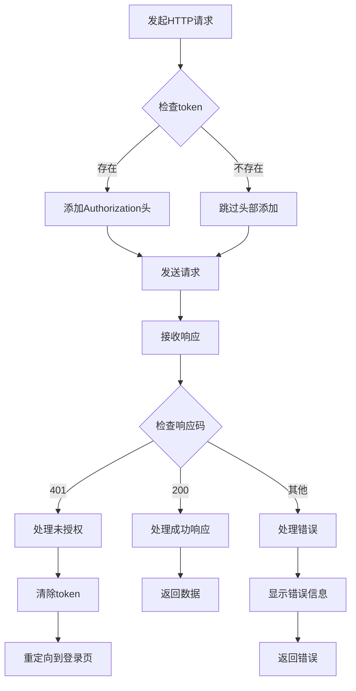

# 核心功能模块

<cite>
**本文档引用的文件**
- [main.ts](file://src/main.ts)
- [App.vue](file://src/App.vue)
- [router/index.ts](file://src/router/index.ts)
- [store/index.ts](file://src/store/index.ts)
- [store/user.ts](file://src/store/user.ts)
- [layout/index.vue](file://src/layout/index.vue)
- [directives/index.ts](file://src/directives/index.ts)
- [directives/permission.ts](file://src/directives/permission.ts)
- [api/auth.ts](file://src/api/auth.ts)
- [utils/request.ts](file://src/utils/request.ts)
- [views/login/index.vue](file://src/views/login/index.vue)
- [views/system/user/index.vue](file://src/views/system/user/index.vue)
- [types/index.ts](file://src/types/index.ts)
- [package.json](file://package.json)
</cite>

## 目录
1. [简介](#简介)
2. [项目结构](#项目结构)
3. [核心组件](#核心组件)
4. [架构概览](#架构概览)
5. [详细组件分析](#详细组件分析)
6. [依赖关系分析](#依赖关系分析)
7. [性能考虑](#性能考虑)
8. [故障排除指南](#故障排除指南)
9. [结论](#结论)

## 简介

这是一个基于 Vue 3 + TypeScript + Element Plus 的现代化后台管理系统。项目采用模块化设计，涵盖了完整的前端开发栈，包括用户认证、权限控制、路由管理、状态管理、布局系统和API封装等核心功能模块。系统支持动态菜单生成、权限验证、响应式布局和丰富的UI组件库。

## 项目结构

项目采用清晰的目录组织结构，按照功能模块进行划分：



**图表来源**
- [main.ts](file://src/main.ts#L1-L27)
- [router/index.ts](file://src/router/index.ts#L1-L119)
- [store/index.ts](file://src/store/index.ts#L1-L6)

**章节来源**
- [main.ts](file://src/main.ts#L1-L27)
- [package.json](file://package.json#L1-L38)

## 核心组件

### 应用启动与初始化

应用通过主入口文件进行初始化，注册必要的插件和服务：

- **Vue应用实例创建**：使用 `createApp` 创建根组件实例
- **Element Plus集成**：注册图标组件和主题样式
- **插件安装**：安装路由、状态管理和自定义指令
- **全局配置**：设置应用的基本配置和样式

### 路由系统

路由系统采用 Vue Router 5，实现了完整的导航控制和权限验证：

- **路由配置**：定义登录页、仪表板、系统管理等路由
- **动态导入**：使用懒加载优化首屏加载性能
- **元信息**：通过 `meta` 属性定义路由的标题、图标和权限
- **导航守卫**：实现全局路由守卫进行权限验证

### 状态管理

使用 Pinia 进行状态管理，提供了用户状态的完整生命周期管理：

- **用户状态**：token、用户信息、权限列表
- **状态持久化**：自动保存到 localStorage
- **权限检查**：提供多种权限验证方法
- **异步操作**：支持登录、登出等异步状态变更

**章节来源**
- [main.ts](file://src/main.ts#L1-L27)
- [router/index.ts](file://src/router/index.ts#L1-L119)
- [store/user.ts](file://src/store/user.ts#L1-L68)

## 架构概览

系统采用分层架构设计，各模块职责明确，耦合度低：



**图表来源**
- [router/index.ts](file://src/router/index.ts#L1-L119)
- [store/user.ts](file://src/store/user.ts#L1-L68)
- [layout/index.vue](file://src/layout/index.vue#L1-L255)
- [api/auth.ts](file://src/api/auth.ts#L1-L18)

## 详细组件分析

### 用户认证模块

用户认证模块是整个系统的安全基础，实现了完整的登录、登出和会话管理功能。

#### 认证流程



**图表来源**
- [views/login/index.vue](file://src/views/login/index.vue#L69-L106)
- [api/auth.ts](file://src/api/auth.ts#L1-L18)
- [store/user.ts](file://src/store/user.ts#L39-L50)

#### 认证状态管理

用户状态管理提供了完整的认证生命周期：

- **登录状态**：通过 token 验证用户是否已登录
- **用户信息**：存储用户的详细信息和权限列表
- **权限验证**：支持单个权限、多个权限的验证
- **会话管理**：自动处理 token 的存储和清理

**章节来源**
- [views/login/index.vue](file://src/views/login/index.vue#L45-L106)
- [store/user.ts](file://src/store/user.ts#L1-L68)

### 权限控制系统

权限控制系统实现了基于角色和权限的细粒度访问控制。

#### 权限验证流程



**图表来源**
- [router/index.ts](file://src/router/index.ts#L91-L116)
- [directives/permission.ts](file://src/directives/permission.ts#L9-L31)

#### 权限指令系统

系统提供了两个核心指令用于UI层面的权限控制：

- **v-permission**：基于权限字符串的指令
- **v-role**：基于角色的指令

这些指令支持数组形式和字符串形式的权限/角色检查。

**章节来源**
- [directives/permission.ts](file://src/directives/permission.ts#L1-L67)
- [directives/index.ts](file://src/directives/index.ts#L1-L16)

### 路由管理系统

路由系统实现了完整的导航控制和权限验证机制。

#### 路由配置结构

系统定义了以下主要路由：

- **登录路由**：`/login` - 提供用户登录功能
- **仪表板路由**：`/` - 默认重定向到 `/dashboard`
- **系统管理路由**：`/system` - 包含用户管理、角色管理、菜单管理
- **404路由**：`/:pathMatch(.*)*` - 处理未匹配的路由

#### 导航守卫实现

路由守卫实现了多层安全控制：

1. **页面标题设置**：根据路由元信息动态设置页面标题
2. **登录状态检查**：非登录路由需要有效的认证状态
3. **权限验证**：检查用户是否具有访问特定路由的权限
4. **权限不足处理**：显示错误消息并阻止路由跳转

**章节来源**
- [router/index.ts](file://src/router/index.ts#L1-L119)

### 状态管理模块

状态管理模块基于 Pinia 实现，提供了集中式的状态管理解决方案。

#### 用户状态模型



**图表来源**
- [store/user.ts](file://src/store/user.ts#L4-L68)
- [types/index.ts](file://src/types/index.ts#L1-L45)

#### 状态持久化机制

系统实现了自动的状态持久化：

- **localStorage集成**：token 自动保存到浏览器本地存储
- **状态恢复**：应用重启时自动恢复用户状态
- **清理机制**：登出时自动清理相关状态

**章节来源**
- [store/user.ts](file://src/store/user.ts#L1-L68)
- [store/index.ts](file://src/store/index.ts#L1-L6)

### 布局系统

布局系统提供了完整的后台管理界面框架。

#### 布局组件架构



**图表来源**
- [layout/index.vue](file://src/layout/index.vue#L1-L255)

#### 动态菜单生成

布局系统实现了智能的菜单生成机制：

- **路由驱动**：从路由配置动态生成菜单
- **权限过滤**：根据用户权限过滤可访问的菜单项
- **图标支持**：支持 Element Plus 图标库的动态加载
- **响应式设计**：支持菜单折叠和展开

**章节来源**
- [layout/index.vue](file://src/layout/index.vue#L1-L255)

### API封装层

API封装层提供了统一的HTTP请求接口和错误处理机制。

#### 请求拦截器



**图表来源**
- [utils/request.ts](file://src/utils/request.ts#L14-L78)

#### API接口定义

系统提供了标准化的API接口：

- **登录接口**：`POST /auth/login`
- **用户信息**：`GET /auth/userinfo`
- **登出接口**：`POST /auth/logout`

所有API接口都遵循统一的响应格式，便于错误处理和状态管理。

**章节来源**
- [api/auth.ts](file://src/api/auth.ts#L1-L18)
- [utils/request.ts](file://src/utils/request.ts#L1-L102)

## 依赖关系分析

系统采用了现代化的前端技术栈，各依赖项之间形成了清晰的层次关系。

```mermaid
graph TB
subgraph "运行时依赖"
Vue[vue@^3.5.24]
Router[vue-router@^5.0.2]
Pinia[pinia@^3.0.4]
ElementPlus[element-plus@^2.13.2]
Axios[axios@^1.13.4]
end
subgraph "开发时依赖"
Vite[vite@^7.2.4]
TypeScript[typescript@~5.9.3]
ESLint[eslint@^9.39.2]
VueTS[vue-tsc@^3.1.4]
AutoImport[unplugin-auto-import@^21.0.0]
Icons[unplugin-icons@^23.0.1]
end
subgraph "应用代码"
Main[main.ts]
RouterIndex[router/index.ts]
StoreUser[store/user.ts]
LayoutIndex[layout/index.vue]
RequestUtils[utils/request.ts]
end
Main --> Vue
Main --> Router
Main --> Pinia
Main --> ElementPlus
RouterIndex --> Router
StoreUser --> Pinia
LayoutIndex --> ElementPlus
RequestUtils --> Axios
Vite --> Main
TypeScript --> Main
ESLint --> Main
```

**图表来源**
- [package.json](file://package.json#L12-L36)
- [main.ts](file://src/main.ts#L1-L27)

### 核心依赖特性

- **Vue 3生态系统**：完整的 Composition API 支持
- **TypeScript集成**：强类型支持和编译时检查
- **现代化构建工具**：Vite提供快速的开发体验
- **组件化设计**：Element Plus提供丰富的UI组件
- **状态管理**：Pinia提供轻量级的状态管理方案

**章节来源**
- [package.json](file://package.json#L1-L38)

## 性能考虑

系统在设计时充分考虑了性能优化，采用了多种策略来提升用户体验：

### 代码分割与懒加载

- **路由懒加载**：使用动态导入实现按需加载
- **组件分割**：大型组件按功能拆分
- **第三方库分离**：外部依赖单独打包

### 状态管理优化

- **局部状态**：组件内部状态保持在组件内
- **状态缓存**：Pinia自动处理状态缓存
- **计算属性**：使用 `computed` 优化响应式更新

### 网络请求优化

- **请求拦截器**：统一处理认证和错误
- **响应缓存**：避免重复请求相同数据
- **超时控制**：合理的请求超时设置

## 故障排除指南

### 常见问题及解决方案

#### 登录认证问题

**问题现象**：登录后无法访问受保护页面

**可能原因**：
- token 未正确存储到 localStorage
- 用户信息格式不正确
- 权限列表为空

**解决步骤**：
1. 检查登录接口返回的数据格式
2. 验证 token 是否正确存储
3. 确认用户权限列表是否正确设置

#### 权限控制失效

**问题现象**：权限指令不起作用

**可能原因**：
- 权限字符串格式不正确
- 用户状态未正确初始化
- 指令注册失败

**解决步骤**：
1. 检查权限字符串格式（如 `system:user:list`）
2. 验证用户状态中的权限列表
3. 确认指令已在应用中正确注册

#### 路由跳转异常

**问题现象**：路由跳转失败或循环重定向

**可能原因**：
- 路由配置错误
- 导航守卫逻辑问题
- 重定向路径不存在

**解决步骤**：
1. 检查路由配置的路径和组件
2. 验证导航守卫中的条件判断
3. 确认重定向目标存在且可访问

**章节来源**
- [router/index.ts](file://src/router/index.ts#L91-L116)
- [directives/permission.ts](file://src/directives/permission.ts#L9-L31)
- [views/login/index.vue](file://src/views/login/index.vue#L69-L106)

## 结论

这个Vue TS Admin项目展示了现代前端开发的最佳实践，通过模块化的架构设计和完善的组件体系，为后台管理系统提供了一个坚实的技术基础。

### 主要优势

1. **架构清晰**：模块职责明确，易于维护和扩展
2. **类型安全**：完整的 TypeScript 类型定义
3. **开发体验**：现代化的开发工具链
4. **用户体验**：响应式设计和流畅的交互
5. **安全性**：完善的认证和权限控制

### 扩展建议

1. **国际化支持**：添加多语言切换功能
2. **主题定制**：支持深色模式和主题切换
3. **缓存策略**：实现更精细的数据缓存机制
4. **监控集成**：添加性能监控和错误追踪
5. **测试覆盖**：完善单元测试和集成测试

该系统为后续的功能扩展提供了良好的基础，开发者可以在此基础上快速实现各种业务需求。