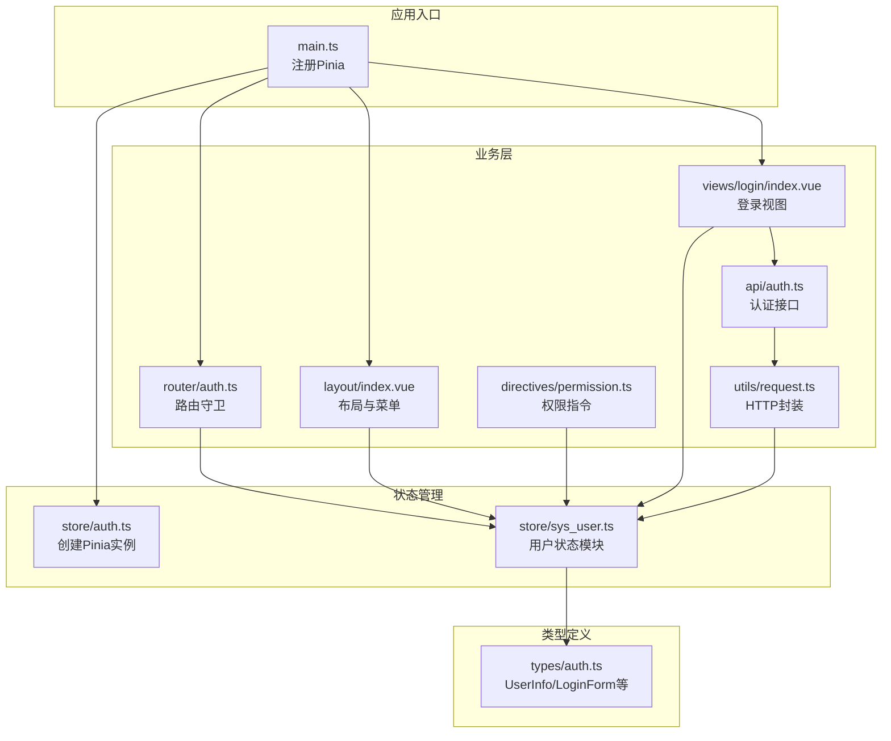
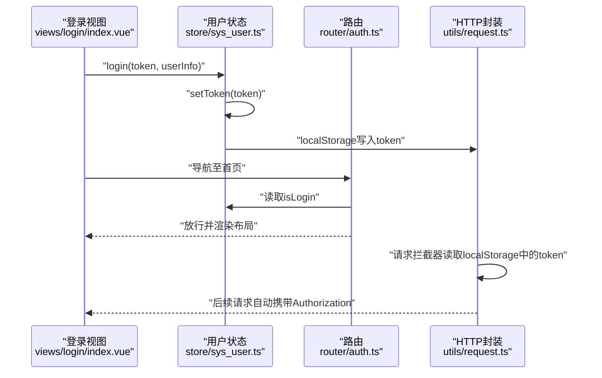
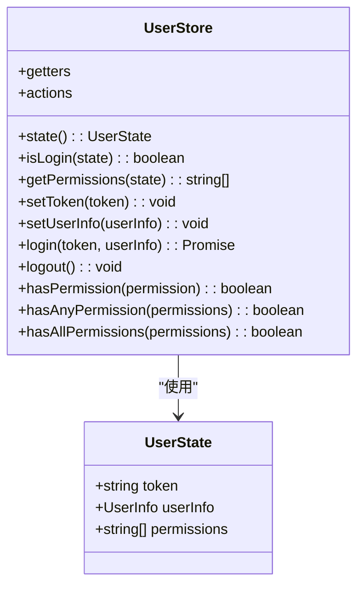
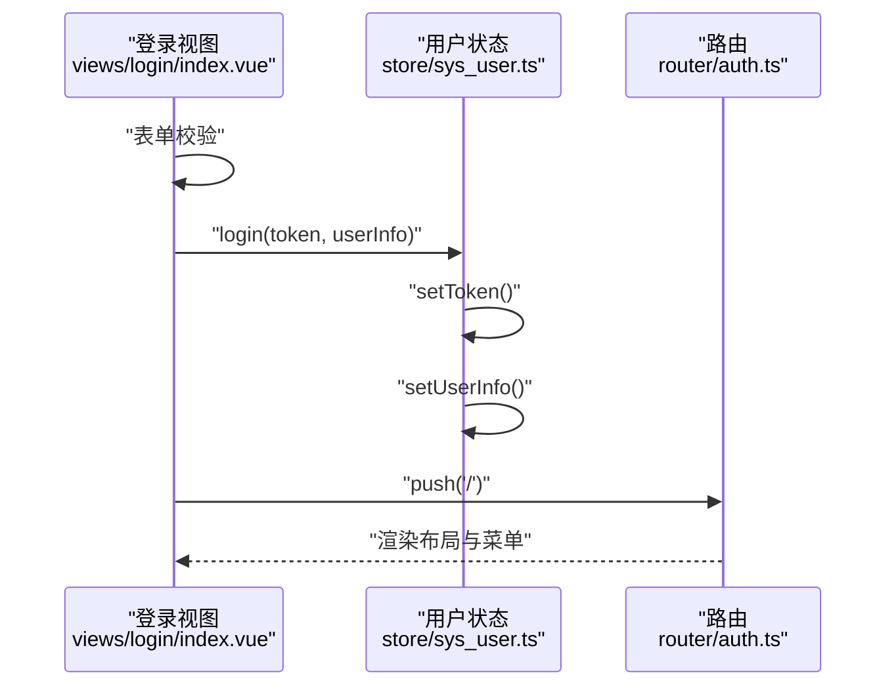
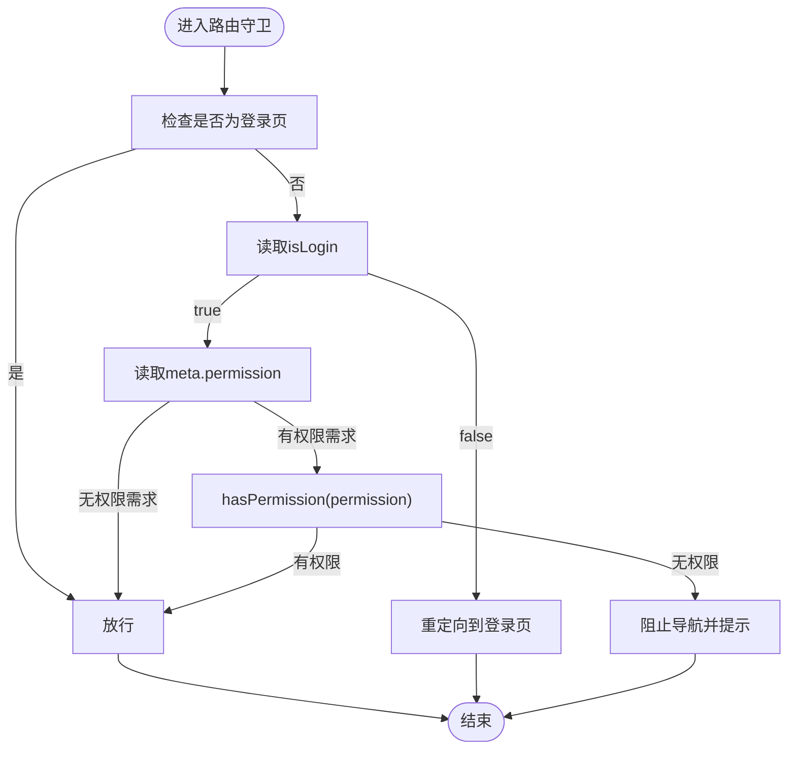
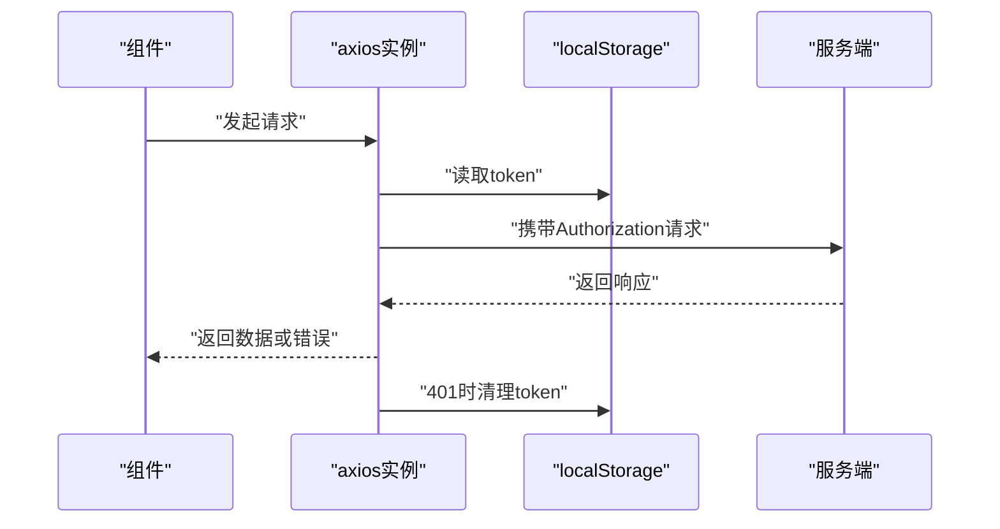
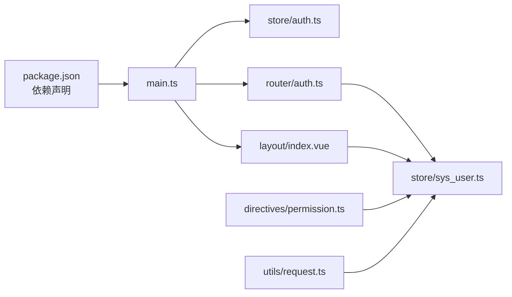

# 状态管理系统

<cite>
**本文引用的文件**
- [src/store/auth.ts](file://src/store/auth.ts)
- [src/store/sys_user.ts](file://src/store/sys_user.ts)
- [src/main.ts](file://src/main.ts)
- [src/types/auth.ts](file://src/types/auth.ts)
- [src/api/auth.ts](file://src/api/auth.ts)
- [src/views/login/index.vue](file://src/views/login/index.vue)
- [src/layout/index.vue](file://src/layout/index.vue)
- [src/router/auth.ts](file://src/router/auth.ts)
- [src/directives/permission.ts](file://src/directives/permission.ts)
- [src/utils/request.ts](file://src/utils/request.ts)
- [package.json](file://package.json)
</cite>

## 目录
1. [简介](#简介)
2. [项目结构](#项目结构)
3. [核心组件](#核心组件)
4. [架构总览](#架构总览)
5. [详细组件分析](#详细组件分析)
6. [依赖关系分析](#依赖关系分析)
7. [性能考虑](#性能考虑)
8. [故障排查指南](#故障排查指南)
9. [结论](#结论)
10. [附录](#附录)

## 简介
本项目采用 Pinia 作为状态管理方案，围绕“用户状态”模块构建了完整的登录认证、权限控制与状态持久化的前端状态管理体系。系统通过 Store 定义状态、Getter 计算属性与 Action 方法，结合路由守卫与指令实现权限控制，并通过本地存储实现状态持久化。本文档将从设计理念、实现原理、模块结构、持久化策略、同步机制、更新流程、最佳实践、调试技巧、性能优化与使用模式等维度进行系统性阐述。

## 项目结构
项目采用典型的 Vue 3 + TypeScript 单页应用结构，状态管理位于 src/store 目录，入口在 src/main.ts 中注册 Pinia 插件；用户状态模块位于 src/store/sys_user.ts；类型定义位于 src/types/auth.ts；登录 API 接口位于 src/api/auth.ts；登录视图、布局与路由分别位于 src/views/login/index.vue、src/layout/index.vue、src/router/auth.ts；权限指令位于 src/directives/permission.ts；HTTP 请求封装位于 src/utils/request.ts。



**图表来源**
- [src/main.ts](file://src/main.ts#L1-L27)
- [src/store/auth.ts](file://src/store/index.ts#L1-L6)
- [src/store/sys_user.ts](file://src/store/user.ts#L1-L68)
- [src/views/login/index.vue](file://src/views/login/index.vue#L1-L257)
- [src/layout/index.vue](file://src/layout/index.vue#L1-L255)
- [src/router/auth.ts](file://src/router/index.ts#L1-L123)
- [src/directives/permission.ts](file://src/directives/permission.ts#L1-L67)
- [src/api/auth.ts](file://src/api/auth.ts#L1-L18)
- [src/utils/request.ts](file://src/utils/request.ts#L1-L102)
- [src/types/auth.ts](file://src/types/index.ts#L1-L45)

**章节来源**
- [src/main.ts](file://src/main.ts#L1-L27)
- [src/store/auth.ts](file://src/store/index.ts#L1-L6)
- [src/store/sys_user.ts](file://src/store/user.ts#L1-L68)
- [src/types/auth.ts](file://src/types/index.ts#L1-L45)
- [src/api/auth.ts](file://src/api/auth.ts#L1-L18)
- [src/views/login/index.vue](file://src/views/login/index.vue#L1-L257)
- [src/layout/index.vue](file://src/layout/index.vue#L1-L255)
- [src/router/auth.ts](file://src/router/index.ts#L1-L123)
- [src/directives/permission.ts](file://src/directives/permission.ts#L1-L67)
- [src/utils/request.ts](file://src/utils/request.ts#L1-L102)

## 核心组件
- Pinia 实例创建与注册：在 store/auth.ts 中创建 Pinia 实例并在 main.ts 中注册到应用。
- 用户状态模块（UserStore）：定义状态、Getter 与 Action，负责 token、用户信息与权限集合的管理，并提供登录、登出与权限校验方法。
- 类型系统：UserInfo、LoginForm、LoginResponse、ApiResponse、MenuItem 等类型定义，确保状态与 API 数据结构一致。
- 登录流程：登录视图触发用户状态的 login，随后路由跳转；同时 HTTP 封装在请求头中携带 token。
- 权限控制：路由守卫与指令组合，基于用户权限动态过滤菜单与隐藏无权限元素。
- 状态持久化：登录时将 token 写入 localStorage，刷新后从 localStorage 初始化用户状态。

**章节来源**
- [src/store/auth.ts](file://src/store/index.ts#L1-L6)
- [src/store/sys_user.ts](file://src/store/user.ts#L1-L68)
- [src/types/auth.ts](file://src/types/index.ts#L1-L45)
- [src/views/login/index.vue](file://src/views/login/index.vue#L68-L106)
- [src/utils/request.ts](file://src/utils/request.ts#L14-L28)
- [src/router/auth.ts](file://src/router/index.ts#L94-L120)
- [src/directives/permission.ts](file://src/directives/permission.ts#L9-L31)

## 架构总览
系统以 Pinia 为核心，围绕用户状态模块构建认证与授权闭环：登录视图调用用户状态的 login，写入 token 并持久化；HTTP 封装自动在请求头注入 token；路由守卫根据用户登录态与权限决定放行；布局与指令根据权限渲染菜单与元素。



**图表来源**
- [src/views/login/index.vue](file://src/views/login/index.vue#L68-L106)
- [src/store/sys_user.ts](file://src/store/user.ts#L38-L50)
- [src/router/auth.ts](file://src/router/index.ts#L94-L120)
- [src/utils/request.ts](file://src/utils/request.ts#L14-L28)

## 详细组件分析

### 用户状态模块（UserStore）
- 状态定义
  - token：字符串，用于鉴权；初始化来自 localStorage。
  - userInfo：用户信息对象或空；包含 id、用户名、昵称、头像、邮箱、手机号、角色与权限数组。
  - permissions：权限字符串数组，来源于 userInfo.permissions。
- Getter 计算属性
  - isLogin：基于 token 的布尔值，判断登录态。
  - getPermissions：返回当前权限集合。
- Action 方法
  - setToken：设置 token 并同步写入 localStorage。
  - setUserInfo：设置 userInfo，并同步更新 permissions。
  - login：原子性地执行 setToken 与 setUserInfo。
  - logout：清空 token、userInfo、permissions，并移除 localStorage 中的 token。
  - hasPermission：判断是否拥有某项权限。
  - hasAnyPermission：判断是否拥有传入权限列表中的任意一项。
  - hasAllPermissions：判断是否同时拥有传入权限列表中的全部项。



**图表来源**
- [src/store/sys_user.ts](file://src/store/user.ts#L4-L67)
- [src/types/auth.ts](file://src/types/index.ts#L1-L11)

**章节来源**
- [src/store/sys_user.ts](file://src/store/user.ts#L1-L68)
- [src/types/auth.ts](file://src/types/index.ts#L1-L11)

### 登录视图与状态更新流程
- 表单校验通过后，调用用户状态的 login，传入模拟的 token 与 userInfo。
- login 内部调用 setToken 与 setUserInfo，完成状态更新与持久化。
- 成功后弹出消息并跳转首页；失败时捕获异常并输出日志。



**图表来源**
- [src/views/login/index.vue](file://src/views/login/index.vue#L68-L106)
- [src/store/sys_user.ts](file://src/store/user.ts#L38-L50)
- [src/router/auth.ts](file://src/router/index.ts#L94-L120)

**章节来源**
- [src/views/login/index.vue](file://src/views/login/index.vue#L68-L106)
- [src/store/sys_user.ts](file://src/store/user.ts#L38-L50)

### 路由守卫与权限控制
- 在 beforeEach 中读取用户登录态与目标路由的权限元信息。
- 若未登录则重定向至登录页；若目标路由需要权限且用户不具备，则提示并阻止导航。
- 布局组件根据用户权限动态生成菜单项，指令可直接在模板中按权限/角色控制元素显示。



**图表来源**
- [src/router/auth.ts](file://src/router/index.ts#L94-L120)
- [src/layout/index.vue](file://src/layout/index.vue#L91-L104)
- [src/directives/permission.ts](file://src/directives/permission.ts#L9-L31)

**章节来源**
- [src/router/auth.ts](file://src/router/index.ts#L94-L120)
- [src/layout/index.vue](file://src/layout/index.vue#L91-L104)
- [src/directives/permission.ts](file://src/directives/permission.ts#L9-L31)

### HTTP 请求与 Token 同步
- 请求拦截器从 localStorage 读取 token 并写入 Authorization 请求头。
- 响应拦截器处理非 200 状态码，当遇到 401 时清理 token 并跳转登录页，保证前后端状态一致。



**图表来源**
- [src/utils/request.ts](file://src/utils/request.ts#L14-L28)
- [src/utils/request.ts](file://src/utils/request.ts#L30-L78)

**章节来源**
- [src/utils/request.ts](file://src/utils/request.ts#L1-L102)

### 状态树结构与持久化策略
- 状态树（简化）
  - user
    - token: string
    - userInfo: UserInfo | null
    - permissions: string[]
- 持久化策略
  - 登录成功后 setToken 将 token 写入 localStorage。
  - 应用启动时，UserStore 从 localStorage 初始化 token。
  - 退出登录时清除 token。

```mermaid
erDiagram
USER_STATE {
string token
object userInfo
string[] permissions
}
USER_STORE {
+state()
+getters
+actions
}
USER_STORE ||--|| USER_STATE : "管理"
```

**图表来源**
- [src/store/sys_user.ts](file://src/store/user.ts#L4-L15)
- [src/store/sys_user.ts](file://src/store/user.ts#L25-L67)

**章节来源**
- [src/store/sys_user.ts](file://src/store/user.ts#L1-L68)

## 依赖关系分析
- 运行时依赖：Vue 3、Pinia、Element Plus、axios、vue-router。
- 开发依赖：TypeScript、ESLint、Vite、unplugin-auto-import 等。
- 关键耦合点：
  - main.ts 依赖 store/auth.ts 提供的 Pinia 实例。
  - 所有业务组件通过 useUserStore 访问用户状态。
  - 路由守卫与布局组件依赖用户状态的登录态与权限。
  - 指令在挂载时读取用户状态并控制 DOM。
  - HTTP 封装依赖 localStorage 与路由守卫共同维护登录态一致性。



**图表来源**
- [package.json](file://package.json#L12-L20)
- [src/main.ts](file://src/main.ts#L1-L27)
- [src/store/auth.ts](file://src/store/index.ts#L1-L6)
- [src/store/sys_user.ts](file://src/store/user.ts#L1-L68)
- [src/router/auth.ts](file://src/router/index.ts#L1-L123)
- [src/layout/index.vue](file://src/layout/index.vue#L1-L255)
- [src/directives/permission.ts](file://src/directives/permission.ts#L1-L67)
- [src/utils/request.ts](file://src/utils/request.ts#L1-L102)

**章节来源**
- [package.json](file://package.json#L1-L38)
- [src/main.ts](file://src/main.ts#L1-L27)

## 性能考虑
- 状态粒度：将用户信息与权限拆分为独立字段，避免不必要的响应式更新。
- 计算属性：使用 getter 缓存派生数据，减少重复计算。
- 权限判断：hasAnyPermission/hasAllPermissions 使用数组原生方法，复杂度 O(n)，在权限数量可控的前提下开销较小。
- 持久化：仅对 token 进行本地存储，降低存储体积与序列化成本。
- 请求头注入：统一在拦截器中处理，避免在组件中重复逻辑。
- 指令控制：在挂载阶段一次性判断权限，避免在渲染过程中频繁判断。

## 故障排查指南
- 登录后无法跳转或页面空白
  - 检查路由守卫是否正确读取 isLogin。
  - 确认登录视图调用了用户状态的 login。
- 401 错误频繁出现
  - 检查请求拦截器是否正确读取 localStorage 中的 token。
  - 确认响应拦截器在 401 时清理了 token 并跳转登录页。
- 权限按钮不显示
  - 检查路由元信息中的 permission 是否与用户权限匹配。
  - 确认指令参数格式与 hasPermission/hasAnyPermission 的预期一致。
- 退出登录后仍显示受限内容
  - 确认 logout 是否清除了 token、userInfo、permissions 并移除了 localStorage 中的 token。
  - 检查路由守卫与布局组件是否重新计算了菜单与权限。

**章节来源**
- [src/router/auth.ts](file://src/router/index.ts#L94-L120)
- [src/utils/request.ts](file://src/utils/request.ts#L30-L78)
- [src/directives/permission.ts](file://src/directives/permission.ts#L9-L31)
- [src/store/sys_user.ts](file://src/store/user.ts#L44-L50)

## 结论
本项目以 Pinia 为核心，构建了清晰的用户状态模块与完善的认证授权体系。通过状态持久化、统一的请求拦截与路由守卫，实现了登录态与权限控制的一致性。模块化设计使状态、视图、路由与指令职责分离，便于扩展与维护。建议在生产环境中进一步引入状态快照、持久化插件与更细粒度的权限模型，以提升可维护性与安全性。

## 附录
- 最佳实践
  - 明确状态边界：仅将跨组件共享且需要持久化的数据放入 Store。
  - 使用类型约束：通过类型定义保证状态与 API 数据结构一致。
  - 统一错误处理：在请求拦截器中集中处理 401/403 等状态码。
  - 避免在组件中直接操作 localStorage：通过 Store 的 Action 统一管理。
  - 权限控制前置：在路由守卫中完成登录态与权限校验，组件内专注渲染。
- 模块化设计原则
  - Store 单一职责：用户状态只负责用户相关数据与权限。
  - 组件低耦合：通过 Store 与指令解耦权限控制逻辑。
  - 路由与菜单解耦：菜单生成基于路由元信息与用户权限。
- 调试技巧
  - 使用浏览器开发者工具查看 Pinia Store 状态变化。
  - 在 Action 中打印关键路径，定位状态更新问题。
  - 在路由守卫中输出 to.meta.permission 与用户权限，排查权限不匹配。
  - 使用指令的 mounted 日志确认权限判断结果。