# 用户认证系统

<cite>
**本文档引用的文件**
- [src/views/login/index.vue](file://src/views/login/index.vue)
- [src/store/sys_user.ts](file://src/store/sys_user.ts)
- [src/api/auth.ts](file://src/api/auth.ts)
- [src/utils/request.ts](file://src/utils/request.ts)
- [src/router/auth.ts](file://src/router/auth.ts)
- [src/types/auth.ts](file://src/types/auth.ts)
- [src/directives/permission.ts](file://src/directives/permission.ts)
- [src/directives/auth.ts](file://src/directives/auth.ts)
- [src/main.ts](file://src/main.ts)
- [src/App.vue](file://src/App.vue)
- [package.json](file://package.json)
</cite>

## 目录
1. [简介](#简介)
2. [项目结构](#项目结构)
3. [核心组件](#核心组件)
4. [架构总览](#架构总览)
5. [详细组件分析](#详细组件分析)
6. [依赖关系分析](#依赖关系分析)
7. [性能考虑](#性能考虑)
8. [故障排除指南](#故障排除指南)
9. [结论](#结论)
10. [附录](#附录)

## 简介
本项目是一个基于 Vue 3 + TypeScript + Element Plus 的管理后台前端应用，实现了完整的用户认证与权限控制体系。系统采用 Pinia 进行状态管理，通过 Vue Router 实现路由守卫和权限校验，结合 Element Plus 提供的 UI 组件和指令系统，构建了现代化的登录界面和权限控制功能。

## 项目结构
项目采用典型的 Vue 3 单页应用结构，主要目录组织如下：
- `src/views/login/` - 登录页面组件
- `src/store/` - 状态管理（Pinia）
- `src/api/` - API 接口封装
- `src/utils/` - 工具函数（HTTP 请求）
- `src/router/` - 路由配置
- `src/types/` - TypeScript 类型定义
- `src/directives/` - 自定义指令（权限控制）

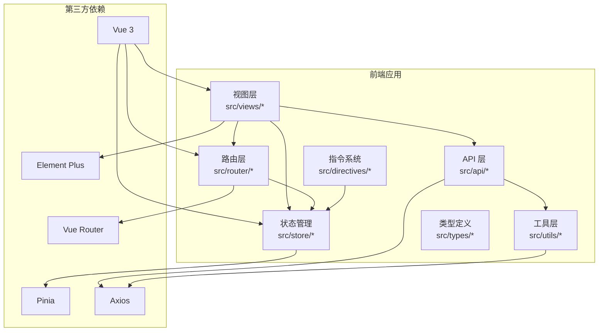

**图表来源**
- [src/main.ts](file://src/main.ts#L1-L27)
- [src/App.vue](file://src/App.vue#L1-L51)

**章节来源**
- [src/main.ts](file://src/main.ts#L1-L27)
- [src/App.vue](file://src/App.vue#L1-L51)

## 核心组件
系统的核心组件包括登录组件、用户状态管理、API 接口、HTTP 请求封装和路由守卫等。

### 登录组件（Login View）
登录组件位于 `src/views/login/index.vue`，提供了完整的登录功能，包括：
- 表单验证（用户名、密码必填）
- Canvas 动画背景（动态粒子效果）
- 异步登录处理
- Token 管理
- 用户信息存储

### 用户状态管理（User Store）
用户状态管理通过 Pinia 实现，包含：
- Token 管理（localStorage 持久化）
- 用户信息存储
- 权限检查方法
- 登出功能

### API 接口封装
API 层提供了标准化的接口调用方法：
- 登录接口
- 用户信息获取
- 退出登录接口

**章节来源**
- [src/views/login/index.vue](file://src/views/login/index.vue#L1-L257)
- [src/store/sys_user.ts](file://src/store/user.ts#L1-L68)
- [src/api/auth.ts](file://src/api/auth.ts#L1-L18)

## 架构总览
系统采用分层架构设计，各层职责清晰分离：

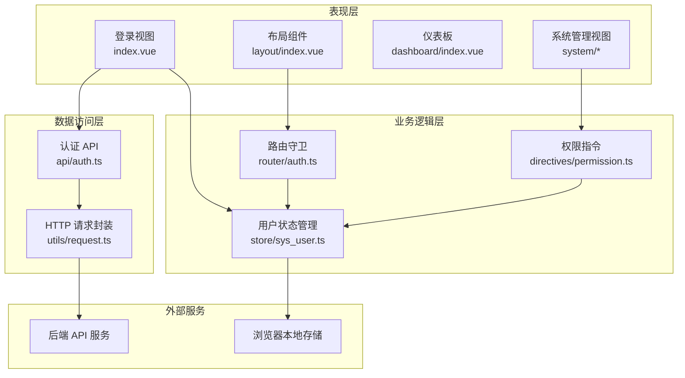

**图表来源**
- [src/views/login/index.vue](file://src/views/login/index.vue#L45-L106)
- [src/store/sys_user.ts](file://src/store/user.ts#L10-L66)
- [src/api/auth.ts](file://src/api/auth.ts#L1-L18)
- [src/utils/request.ts](file://src/utils/request.ts#L1-L102)
- [src/router/auth.ts](file://src/router/index.ts#L94-L120)

## 详细组件分析

### 登录组件实现详解

#### 表单验证机制
登录组件实现了完整的表单验证流程：

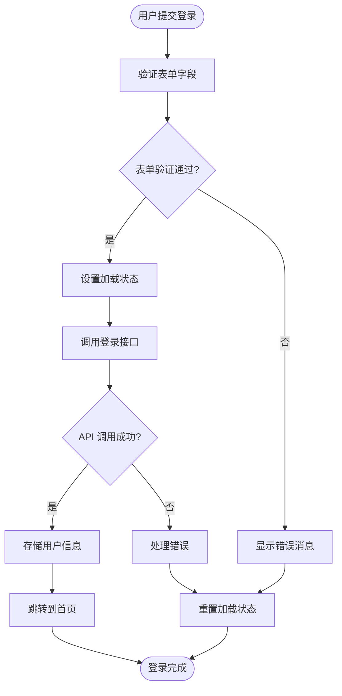

**图表来源**
- [src/views/login/index.vue](file://src/views/login/index.vue#L68-L106)

#### Canvas 动画背景实现
登录页面采用了 Canvas 实现的动态粒子动画效果：

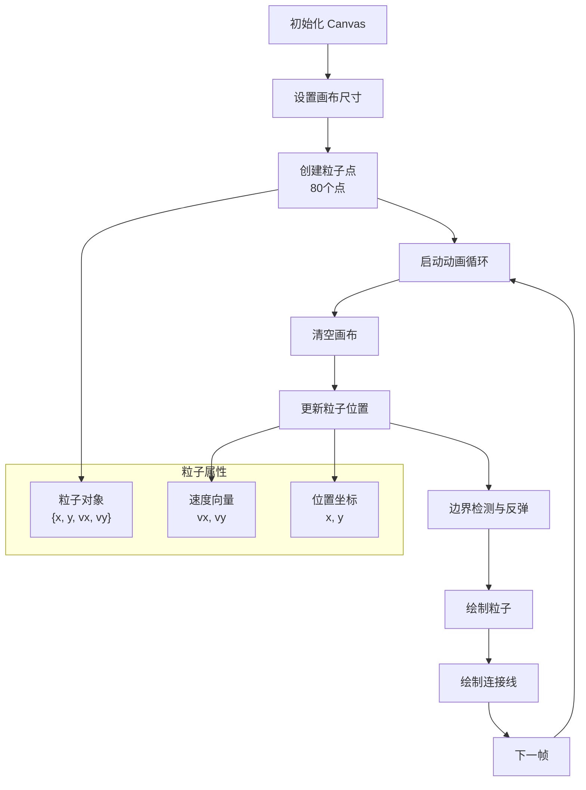

**图表来源**
- [src/views/login/index.vue](file://src/views/login/index.vue#L108-L197)

#### 登录流程时序图
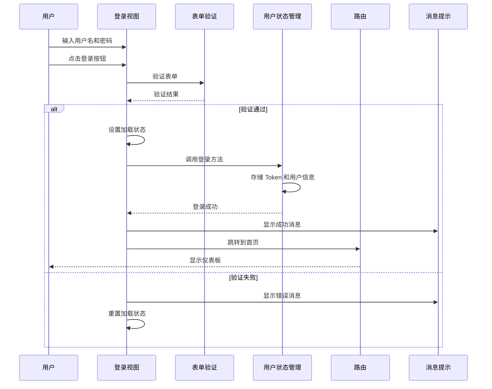

**图表来源**
- [src/views/login/index.vue](file://src/views/login/index.vue#L68-L106)
- [src/store/sys_user.ts](file://src/store/user.ts#L38-L42)
- [src/router/auth.ts](file://src/router/index.ts#L94-L120)

**章节来源**
- [src/views/login/index.vue](file://src/views/login/index.vue#L1-L257)

### 用户状态管理（Pinia Store）

#### 状态结构设计
用户状态管理采用 Pinia 的模块化设计，状态结构清晰：

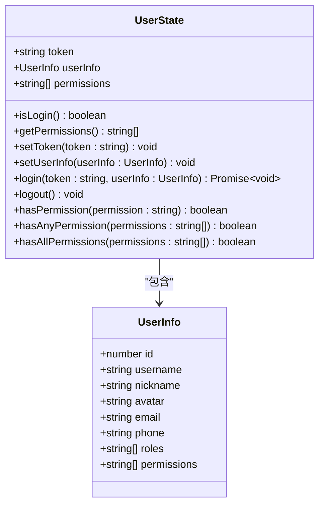

**图表来源**
- [src/store/sys_user.ts](file://src/store/user.ts#L4-L66)
- [src/types/auth.ts](file://src/types/index.ts#L1-L45)

#### Token 管理机制
系统实现了完整的 Token 生命周期管理：
- **存储策略**：使用 localStorage 持久化存储
- **自动加载**：应用启动时自动从 localStorage 读取
- **同步机制**：状态变更时同步更新 localStorage
- **清理机制**：登出时清除本地存储

**章节来源**
- [src/store/sys_user.ts](file://src/store/user.ts#L1-L68)

### API 接口封装

#### HTTP 请求拦截器
系统通过 Axios 拦截器实现了统一的请求和响应处理：

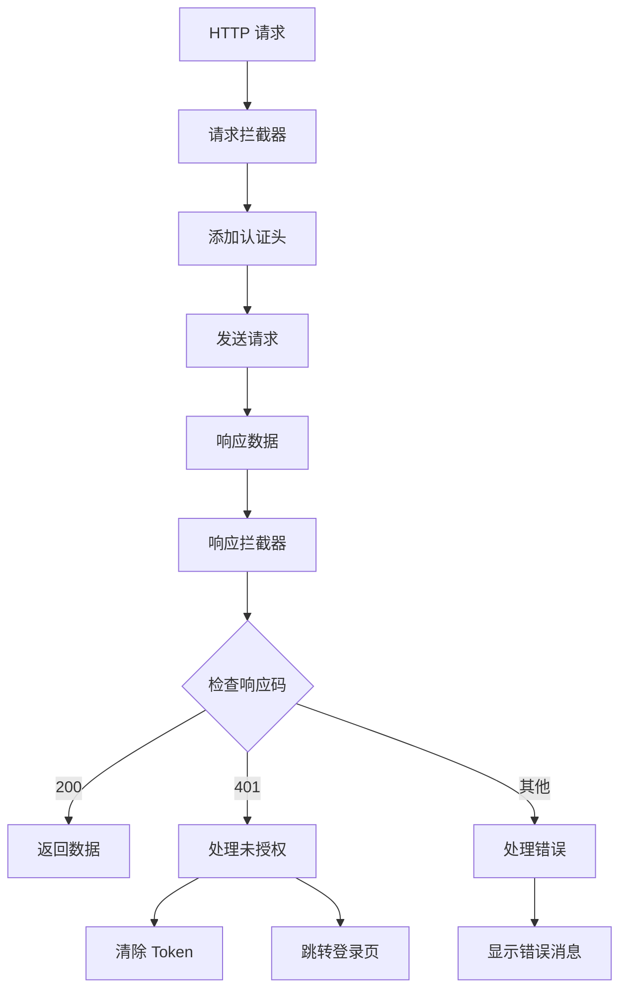

**图表来源**
- [src/utils/request.ts](file://src/utils/request.ts#L13-L78)

#### API 方法设计
API 层提供了标准化的方法签名：
- `login(data: LoginForm)` - 用户登录
- `getUserInfo()` - 获取用户信息
- `logout()` - 用户登出

**章节来源**
- [src/api/auth.ts](file://src/api/auth.ts#L1-L18)
- [src/utils/request.ts](file://src/utils/request.ts#L1-L102)

### 路由守卫与权限控制

#### 路由守卫实现
路由守卫负责全局的权限控制和页面访问限制：

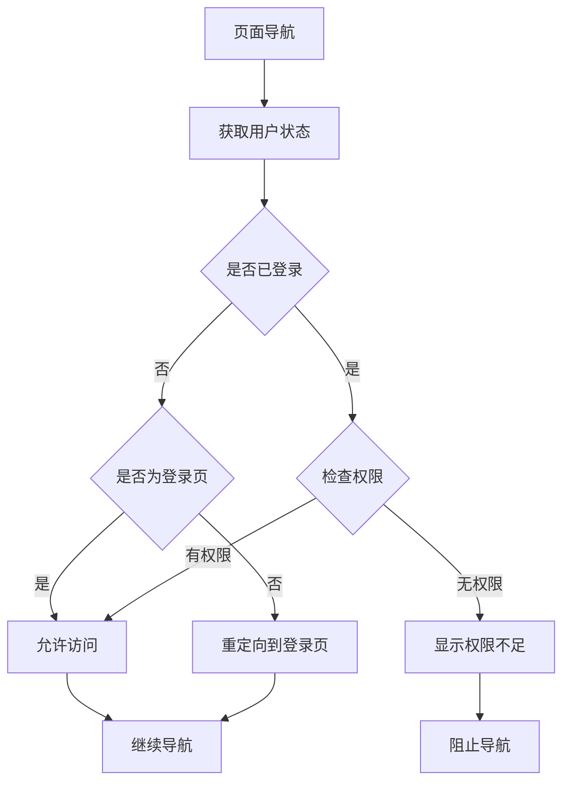

**图表来源**
- [src/router/auth.ts](file://src/router/index.ts#L94-L120)

#### 权限指令系统
系统提供了灵活的权限控制指令：

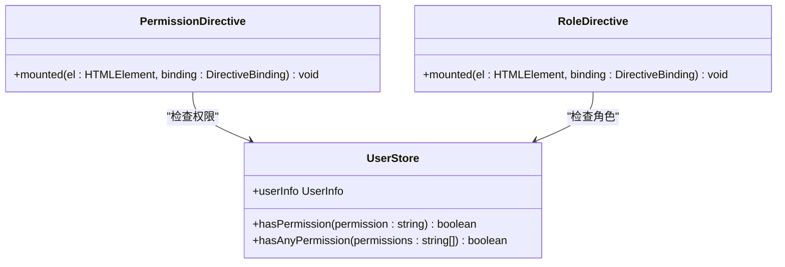

**图表来源**
- [src/directives/permission.ts](file://src/directives/permission.ts#L9-L61)
- [src/store/sys_user.ts](file://src/store/user.ts#L52-L65)

**章节来源**
- [src/router/auth.ts](file://src/router/index.ts#L94-L120)
- [src/directives/permission.ts](file://src/directives/permission.ts#L1-L67)

## 依赖关系分析

### 技术栈依赖
系统采用现代化的前端技术栈，各依赖之间的关系如下：

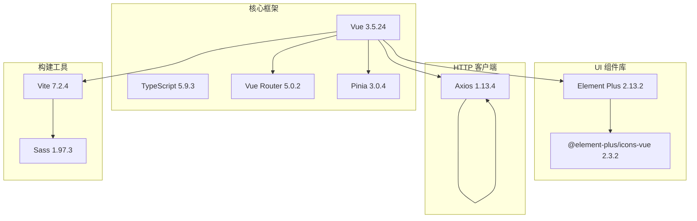

**图表来源**
- [package.json](file://package.json#L12-L36)

### 组件间依赖关系
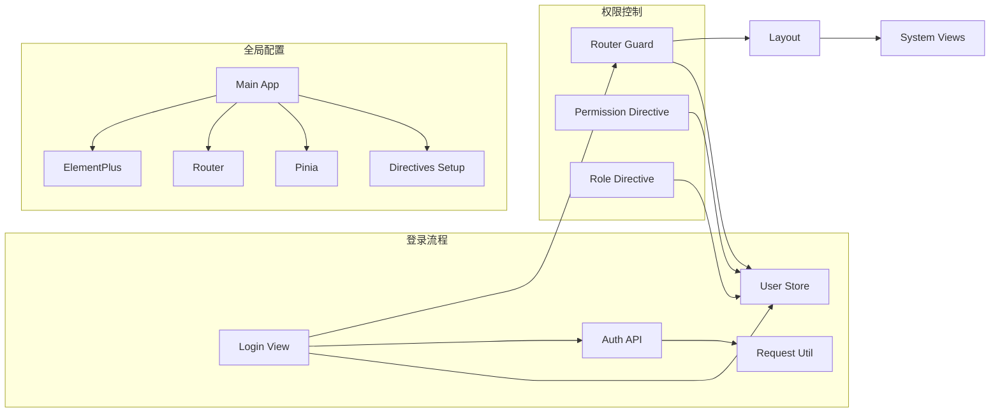

**图表来源**
- [src/main.ts](file://src/main.ts#L1-L27)
- [src/views/login/index.vue](file://src/views/login/index.vue#L45-L53)

**章节来源**
- [package.json](file://package.json#L1-L38)

## 性能考虑
系统在设计时充分考虑了性能优化：

### 登录动画性能
- Canvas 动画使用 requestAnimationFrame 实现平滑渲染
- 粒子数量控制在合理范围（80个点）
- 边界检测和连线计算进行了性能优化

### 状态管理性能
- Pinia 状态树扁平化设计
- localStorage 同步避免频繁 I/O 操作
- 权限检查使用高效的数据结构

### 网络请求优化
- Axios 拦截器减少重复代码
- 统一的错误处理机制
- 超时时间合理设置（15秒）

## 故障排除指南

### 常见问题及解决方案

#### 登录失败问题
**症状**：点击登录按钮后出现错误提示
**可能原因**：
- 表单验证失败
- 网络请求超时
- 后端接口异常

**解决步骤**：
1. 检查用户名和密码格式
2. 查看浏览器开发者工具 Network 标签
3. 确认后端服务正常运行

#### 权限访问受限
**症状**：访问某些页面时被重定向到登录页
**可能原因**：
- Token 过期或无效
- 用户权限不足
- 路由配置错误

**解决步骤**：
1. 检查 localStorage 中的 token
2. 验证用户权限列表
3. 确认路由 meta.permission 配置

#### Canvas 动画异常
**症状**：登录背景动画不显示或卡顿
**可能原因**：
- Canvas 元素无法获取
- 浏览器兼容性问题
- 内存泄漏

**解决步骤**：
1. 检查 Canvas DOM 元素是否存在
2. 确认浏览器支持 Canvas API
3. 监控内存使用情况

**章节来源**
- [src/views/login/index.vue](file://src/views/login/index.vue#L108-L197)
- [src/utils/request.ts](file://src/utils/request.ts#L50-L78)

## 结论
本用户认证系统采用现代化的前端技术栈，实现了完整的登录认证、权限控制和状态管理功能。系统具有以下特点：

1. **模块化设计**：各功能模块职责清晰，便于维护和扩展
2. **类型安全**：完整的 TypeScript 类型定义确保开发时的类型安全
3. **用户体验**：流畅的动画效果和友好的错误提示
4. **安全性**：Token 管理和权限控制机制
5. **可扩展性**：清晰的架构设计支持功能扩展

系统为后续的功能扩展和维护奠定了良好的基础，可以作为企业级管理后台的认证解决方案。

## 附录

### 配置选项参考

#### 登录表单配置
- 表单字段：username（用户名）、password（密码）
- 验证规则：必填验证
- 输入类型：文本输入框

#### 用户状态配置
- Token 存储：localStorage
- Token 键名：'token'
- 状态持久化：应用重启后自动恢复

#### API 接口配置
- 基础 URL：'/api'
- 超时时间：15000ms
- 认证头：Authorization: Bearer {token}

#### 权限控制配置
- 权限检查：字符串匹配
- 多权限检查：支持任意权限或所有权限模式
- 角色控制：基于用户角色的访问控制

### 使用示例

#### 基础登录流程
1. 在登录页面输入用户名和密码
2. 点击登录按钮触发验证
3. 验证通过后调用登录接口
4. 成功后存储 Token 并跳转首页

#### 权限控制使用
1. 在路由配置中添加 meta.permission
2. 在组件中使用 v-permission 指令
3. 在业务逻辑中调用 hasPermission 方法

#### 自定义指令使用
```javascript
// 权限指令
<div v-permission="'system:user:add'">添加用户按钮</div>

// 多权限指令
<div v-permission="['system:user:add', 'system:user:edit']">编辑用户按钮</div>

// 角色指令
<div v-role="'admin'">管理员功能</div>
```

**章节来源**
- [src/views/login/index.vue](file://src/views/login/index.vue#L58-L66)
- [src/router/auth.ts](file://src/router/index.ts#L50-L74)
- [src/directives/permission.ts](file://src/directives/permission.ts#L6-L31)