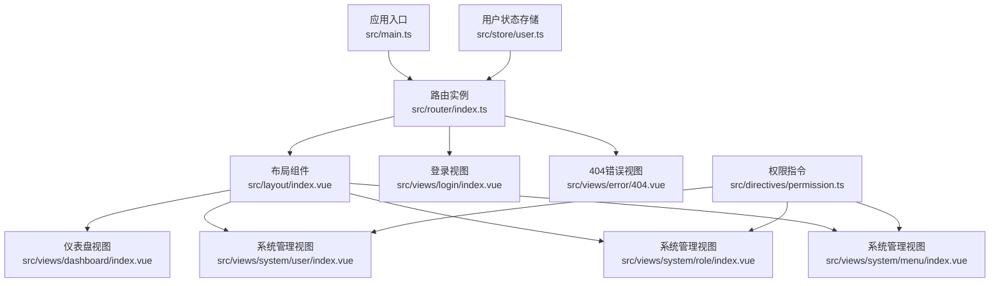
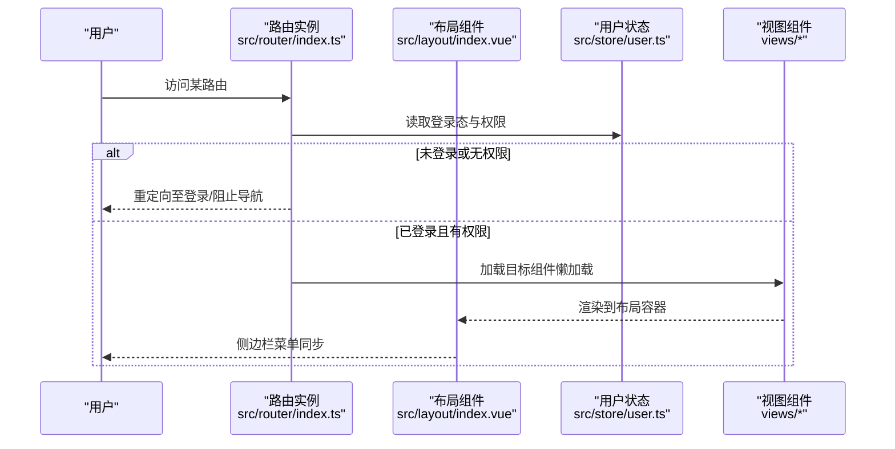
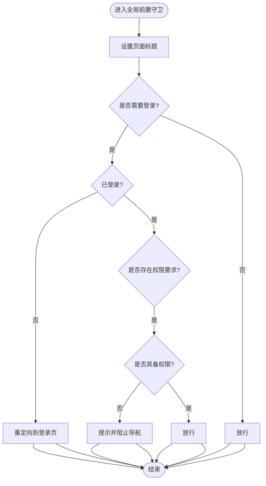
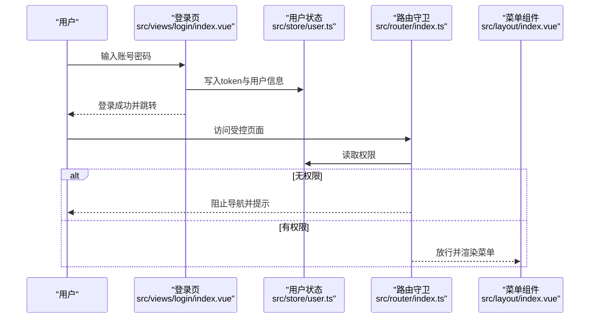
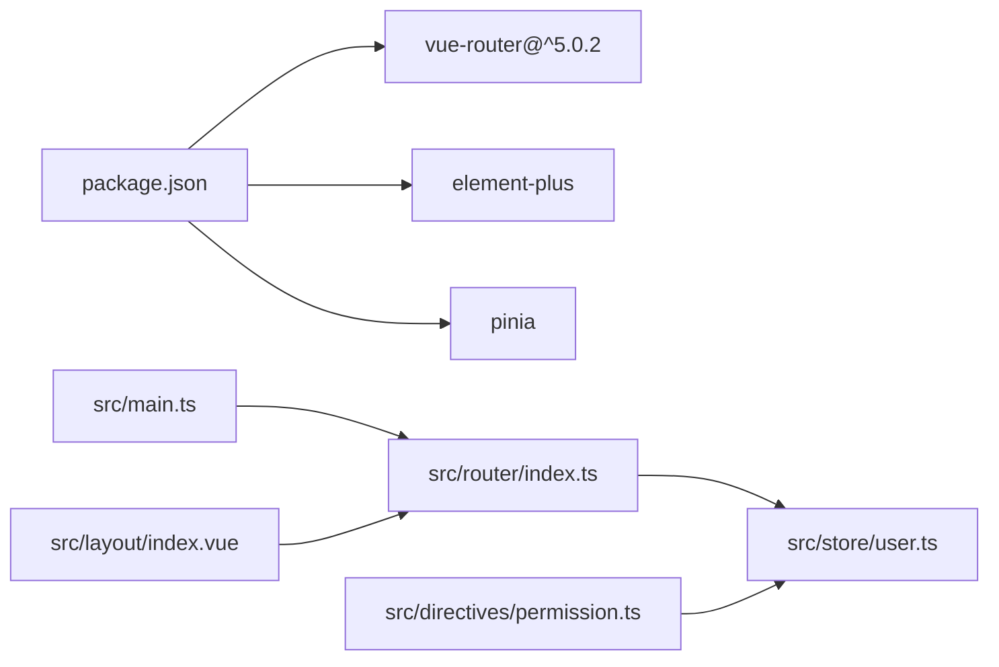

# 路由系统

<cite>
**本文引用的文件**
- [src/router/index.ts](file://src/router/index.ts)
- [src/main.ts](file://src/main.ts)
- [src/layout/index.vue](file://src/layout/index.vue)
- [src/store/user.ts](file://src/store/user.ts)
- [src/directives/permission.ts](file://src/directives/permission.ts)
- [src/views/login/index.vue](file://src/views/login/index.vue)
- [src/views/error/404.vue](file://src/views/error/404.vue)
- [src/views/dashboard/index.vue](file://src/views/dashboard/index.vue)
- [src/views/system/user/index.vue](file://src/views/system/user/index.vue)
- [src/views/system/role/index.vue](file://src/views/system/role/index.vue)
- [src/views/system/menu/index.vue](file://src/views/system/menu/index.vue)
- [src/types/index.ts](file://src/types/index.ts)
- [package.json](file://package.json)
</cite>

## 目录
1. [简介](#简介)
2. [项目结构](#项目结构)
3. [核心组件](#核心组件)
4. [架构总览](#架构总览)
5. [详细组件分析](#详细组件分析)
6. [依赖关系分析](#依赖关系分析)
7. [性能考虑](#性能考虑)
8. [故障排除指南](#故障排除指南)
9. [结论](#结论)
10. [附录](#附录)

## 简介
本文件系统性梳理本项目的路由体系，基于 Vue Router 5 实现。内容涵盖：
- 路由配置结构与动态路由生成机制
- 路由守卫（全局前置守卫）与权限校验流程
- 路由元信息配置与路由懒加载策略
- 嵌套路由设计与路由参数传递方法
- 导航优化、面包屑生成与侧边栏菜单同步机制
- 完整的路由配置与使用示例

## 项目结构
项目采用“按功能模块划分”的组织方式，路由相关代码集中在 src/router 目录，配合布局组件 src/layout 提供统一的侧边栏与主内容区，权限控制通过 Pinia Store 与自定义指令实现。

图表来源
- [src/main.ts](file://src/main.ts#L1-L27)
- [src/router/index.ts](file://src/router/index.ts#L1-L123)
- [src/layout/index.vue](file://src/layout/index.vue#L1-L255)
- [src/store/user.ts](file://src/store/user.ts#L1-L68)
- [src/directives/permission.ts](file://src/directives/permission.ts#L1-L67)

章节来源
- [src/main.ts](file://src/main.ts#L1-L27)
- [src/router/index.ts](file://src/router/index.ts#L1-L123)

## 核心组件
- 路由配置与守卫：在路由配置中定义各页面的元信息与懒加载组件，并在全局前置守卫中进行登录态与权限校验。
- 布局与菜单：布局组件负责渲染侧边栏菜单，根据路由表过滤并结合用户权限动态生成菜单项。
- 权限指令：在组件模板中通过 v-permission 控制按钮等元素的可见性，提升前端权限控制体验。
- 用户状态：Pinia Store 管理 token、用户信息与权限集合，为路由守卫与指令提供数据支撑。

章节来源
- [src/router/index.ts](file://src/router/index.ts#L1-L123)
- [src/layout/index.vue](file://src/layout/index.vue#L1-L255)
- [src/directives/permission.ts](file://src/directives/permission.ts#L1-L67)
- [src/store/user.ts](file://src/store/user.ts#L1-L68)

## 架构总览
路由系统围绕“路由配置 + 全局守卫 + 布局菜单 + 权限指令 + 状态存储”构建，形成从导航到权限控制的闭环。

图表来源
- [src/router/index.ts](file://src/router/index.ts#L95-L120)
- [src/layout/index.vue](file://src/layout/index.vue#L90-L111)
- [src/store/user.ts](file://src/store/user.ts#L17-L23)

## 详细组件分析

### 路由配置与动态路由生成
- 配置结构
  - 登录页：独立路由，meta 中标记 hidden 以隐藏在菜单中。
  - 根路由与重定向：根路径重定向到仪表盘，便于首次进入。
  - 系统管理模块：通过 Layout 组件包裹子路由，实现统一布局下的多页面管理。
  - 404 错误页：兜底路由，用于处理未知路径。
- 动态路由生成机制
  - 布局组件通过 router.getRoutes() 获取当前注册的所有路由，再根据 meta.hidden 过滤隐藏项，并结合用户权限动态筛选可显示的菜单项。
  - 菜单项的激活状态 activeMenu 依据当前路由路径计算，确保侧边栏与当前页面保持一致。
- 路由懒加载
  - 所有页面组件均采用动态导入的方式，实现按需加载，减少首屏体积。

章节来源
- [src/router/index.ts](file://src/router/index.ts#L6-L86)
- [src/layout/index.vue](file://src/layout/index.vue#L90-L111)

### 路由守卫实现原理
- 全局前置守卫
  - 页面标题：根据 to.meta.title 设置 document.title。
  - 登录校验：非登录页且未登录时，重定向至登录页。
  - 权限校验：若路由 meta.permission 存在，则检查用户是否具备对应权限；若无权限则提示并阻止导航。
  - 放行：通过 next() 继续后续导航。
- 路由独享守卫与组件内守卫
  - 本项目未使用路由独享守卫与组件内守卫，权限控制主要集中在全局前置守卫中。

图表来源
- [src/router/index.ts](file://src/router/index.ts#L95-L120)

章节来源
- [src/router/index.ts](file://src/router/index.ts#L95-L120)

### 路由权限验证流程
- 数据来源
  - 用户状态：token、userInfo、permissions。
  - 权限指令：支持字符串与数组两种形式，分别调用 hasPermission、hasAnyPermission 或 hasAllPermissions。
- 流程
  - 登录成功后，将 token 与用户信息写入 Store，并设置权限列表。
  - 路由守卫读取用户权限，匹配 meta.permission。
  - 布局组件在渲染菜单时，同样基于用户权限过滤可显示的菜单项。
  - 指令在挂载阶段判断元素权限，决定是否渲染。

图表来源
- [src/views/login/index.vue](file://src/views/login/index.vue#L68-L106)
- [src/store/user.ts](file://src/store/user.ts#L25-L65)
- [src/router/index.ts](file://src/router/index.ts#L95-L120)
- [src/layout/index.vue](file://src/layout/index.vue#L90-L111)

章节来源
- [src/views/login/index.vue](file://src/views/login/index.vue#L68-L106)
- [src/store/user.ts](file://src/store/user.ts#L25-L65)
- [src/router/index.ts](file://src/router/index.ts#L95-L120)
- [src/layout/index.vue](file://src/layout/index.vue#L90-L111)

### 路由元信息配置与路由懒加载策略
- 元信息字段
  - title：页面标题与菜单标题。
  - icon：菜单图标名（Element Plus 图标组件名）。
  - hidden：是否在菜单中隐藏。
  - permission：访问该路由所需的权限标识。
- 懒加载策略
  - 所有页面组件均通过动态导入实现懒加载，降低初始包体大小，提升首屏性能。

章节来源
- [src/router/index.ts](file://src/router/index.ts#L11-L14)
- [src/router/index.ts](file://src/router/index.ts#L49-L53)
- [src/router/index.ts](file://src/router/index.ts#L69-L73)

### 嵌套路由设计与路由参数传递
- 嵌套路由
  - 根路由与系统管理模块均采用 children 形式组织子路由，配合 Layout 组件实现统一布局下的多页面切换。
- 路由参数传递
  - 本项目未使用路由参数传递（如 params/query），但可在实际业务中通过路由配置扩展相应字段与处理逻辑。

章节来源
- [src/router/index.ts](file://src/router/index.ts#L24-L34)
- [src/router/index.ts](file://src/router/index.ts#L44-L76)

### 导航优化、面包屑生成与侧边栏菜单同步
- 导航优化
  - 路由守卫统一设置页面标题，提升用户体验。
  - 404 页面提供返回首页的便捷操作。
- 面包屑生成
  - 本项目未实现自动化的面包屑生成逻辑，可在布局组件中基于路由层级与 meta.title 构建面包屑。
- 侧边栏菜单同步
  - 布局组件根据当前路由路径 activeMenu 自动高亮对应菜单项，确保导航一致性。

章节来源
- [src/router/index.ts](file://src/router/index.ts#L98-L99)
- [src/views/error/404.vue](file://src/views/error/404.vue#L16-L18)
- [src/layout/index.vue](file://src/layout/index.vue#L107-L111)

### 路由配置示例与使用要点
- 路由配置示例
  - 登录页：path 为 /login，meta.hidden 为 true，不参与菜单渲染。
  - 根路由：redirect 到 /dashboard，children 中定义仪表盘。
  - 系统管理：Layout 包裹多个子路由，每个子路由配置 meta.icon 与 meta.permission。
- 使用要点
  - 在需要权限控制的路由上添加 meta.permission。
  - 使用动态导入保证懒加载生效。
  - 在布局组件中通过 router.getRoutes() 与用户权限过滤生成菜单。

章节来源
- [src/router/index.ts](file://src/router/index.ts#L6-L86)
- [src/layout/index.vue](file://src/layout/index.vue#L90-L111)

## 依赖关系分析
- 路由与应用
  - 应用入口在 main.ts 中安装路由插件，使整个应用具备路由能力。
- 路由与状态
  - 路由守卫依赖用户状态存储，用于判断登录态与权限。
- 路由与布局
  - 布局组件依赖路由实例，用于获取当前路由与动态生成菜单。
- 路由与指令
  - 权限指令依赖用户状态存储，用于在模板层面控制元素可见性。

图表来源
- [package.json](file://package.json#L12-L19)
- [src/main.ts](file://src/main.ts#L18-L21)
- [src/router/index.ts](file://src/router/index.ts#L1-L123)
- [src/store/user.ts](file://src/store/user.ts#L1-L68)
- [src/layout/index.vue](file://src/layout/index.vue#L1-L255)
- [src/directives/permission.ts](file://src/directives/permission.ts#L1-L67)

章节来源
- [package.json](file://package.json#L12-L19)
- [src/main.ts](file://src/main.ts#L18-L21)

## 性能考虑
- 路由懒加载：所有页面组件采用动态导入，有效降低首屏资源消耗。
- 菜单过滤：布局组件仅对可见路由进行过滤与渲染，避免不必要的 DOM 结构。
- 权限指令：在模板层面移除无权限元素，减少无效渲染。

## 故障排除指南
- 登录后仍被重定向到登录页
  - 检查用户状态是否正确写入 token 与权限列表。
  - 确认路由守卫中的登录判断逻辑。
- 有权限但仍无法访问页面
  - 检查路由 meta.permission 是否与用户权限一致。
  - 确认用户状态中的权限集合是否包含通配符权限。
- 菜单不显示或显示异常
  - 检查路由 meta.hidden 与 meta.permission 的配置。
  - 确认布局组件的菜单过滤逻辑与用户权限匹配。

章节来源
- [src/router/index.ts](file://src/router/index.ts#L95-L120)
- [src/layout/index.vue](file://src/layout/index.vue#L90-L111)
- [src/store/user.ts](file://src/store/user.ts#L52-L65)

## 结论
本项目基于 Vue Router 5 构建了清晰的路由体系：通过全局前置守卫实现统一的登录与权限校验，结合 Pinia Store 与自定义指令在前端实现细粒度的权限控制；布局组件动态生成菜单，实现导航与页面的一致性。整体架构简洁、职责明确，具备良好的扩展性与维护性。

## 附录
- 类型定义参考
  - 用户信息、登录表单、API 响应与菜单项等类型定义，便于在路由与组件中统一使用。

章节来源
- [src/types/index.ts](file://src/types/index.ts#L1-L45)