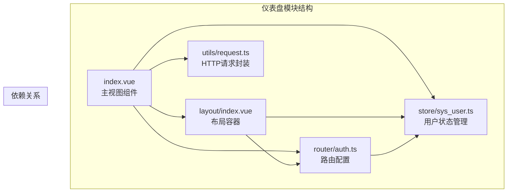
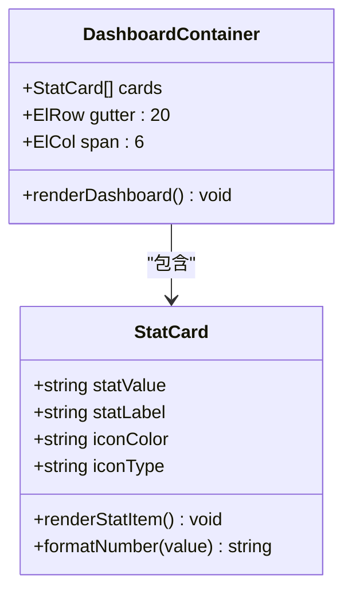
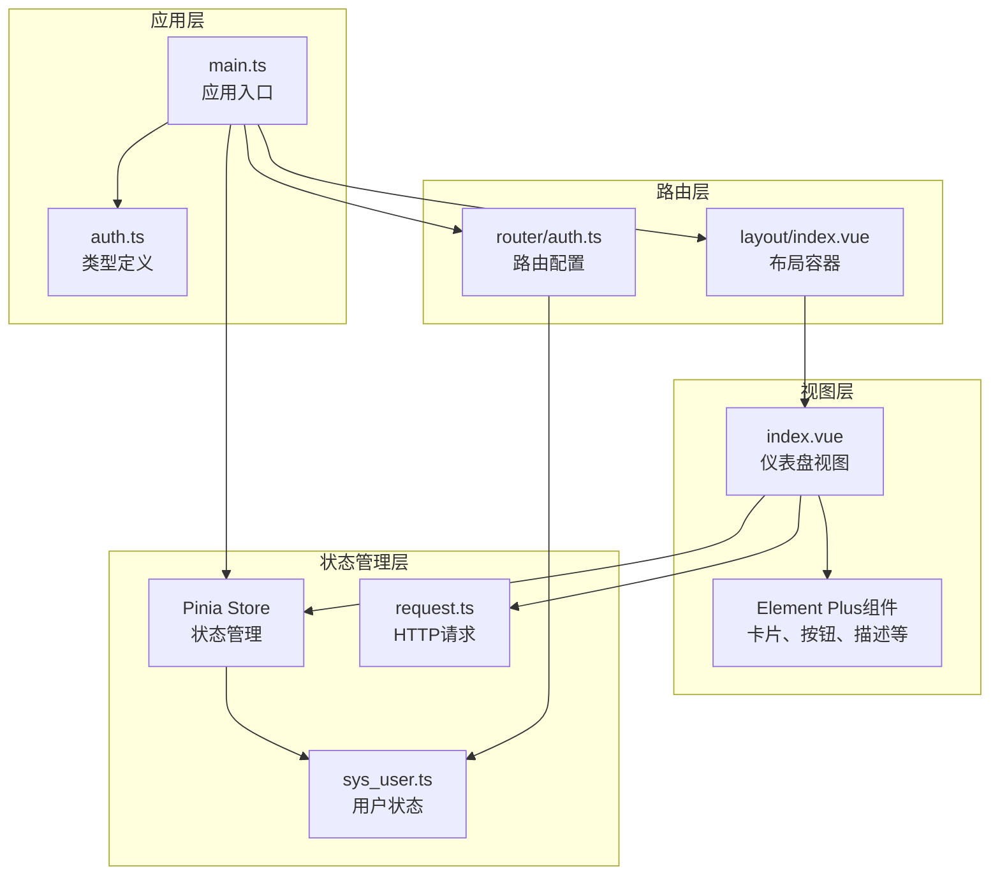
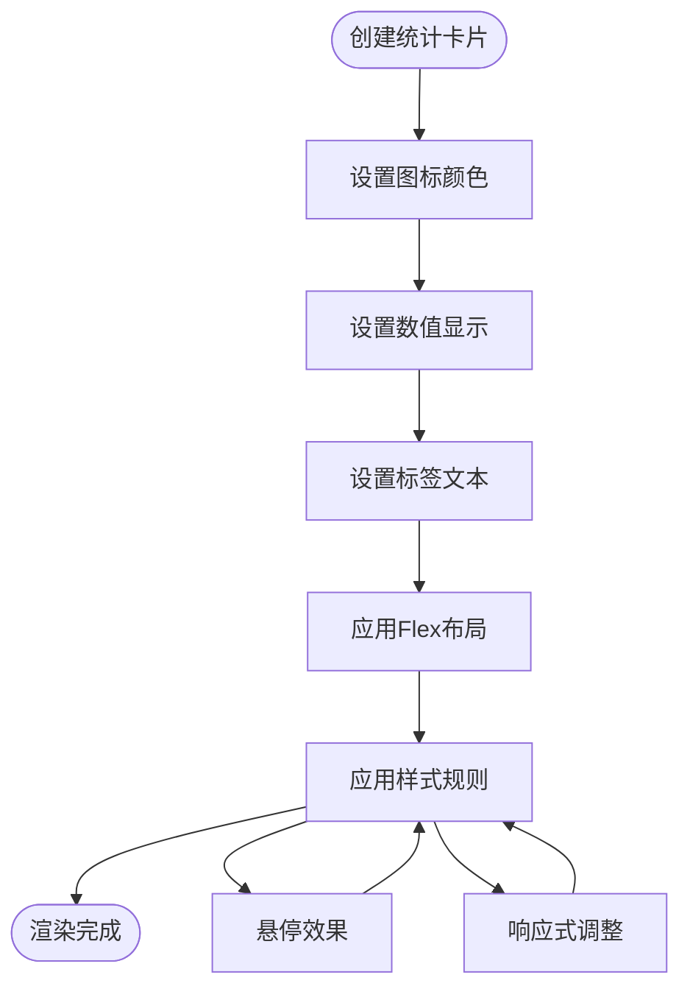
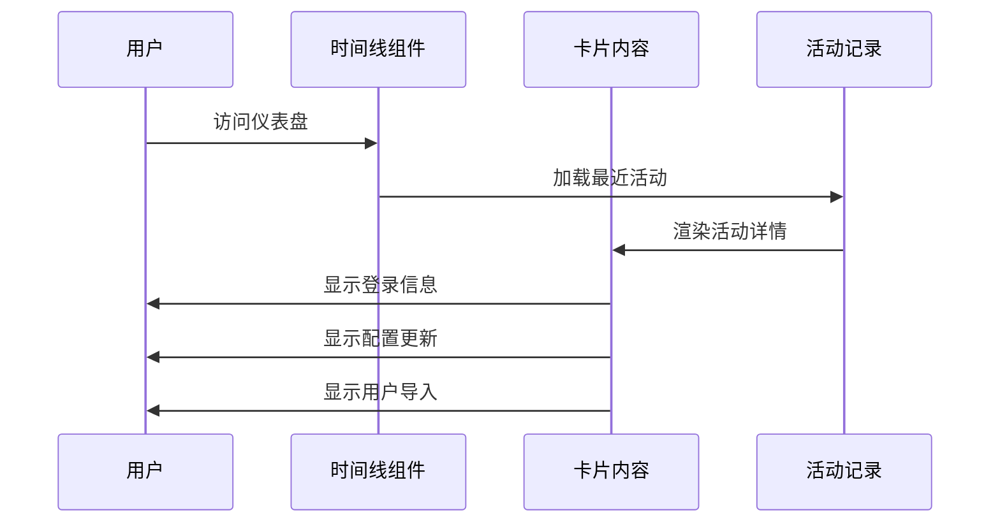
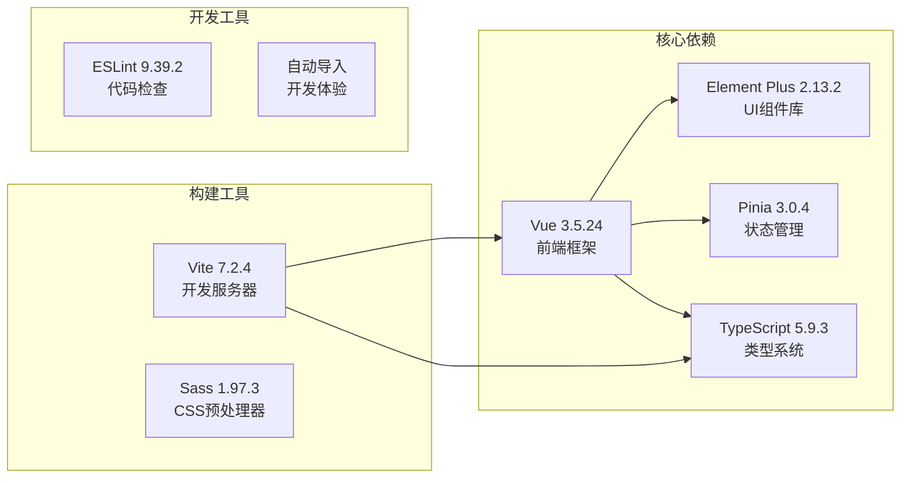
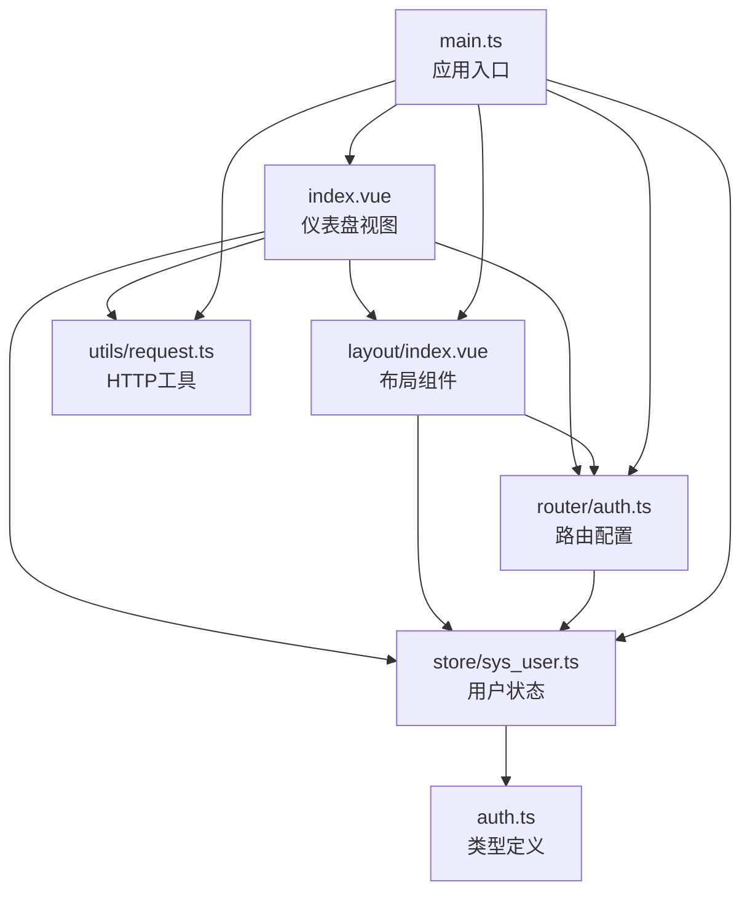

# 仪表盘模块

<cite>
**本文档引用的文件**
- [src/views/dashboard/index.vue](file://src/views/dashboard/index.vue)
- [src/router/auth.ts](file://src/router/auth.ts)
- [src/store/sys_user.ts](file://src/store/sys_user.ts)
- [src/store/auth.ts](file://src/store/auth.ts)
- [src/layout/index.vue](file://src/layout/index.vue)
- [src/utils/request.ts](file://src/utils/request.ts)
- [src/types/auth.ts](file://src/types/auth.ts)
- [src/main.ts](file://src/main.ts)
- [package.json](file://package.json)
</cite>

## 目录
1. [简介](#简介)
2. [项目结构](#项目结构)
3. [核心组件](#核心组件)
4. [架构概览](#架构概览)
5. [详细组件分析](#详细组件分析)
6. [依赖关系分析](#依赖关系分析)
7. [性能考虑](#性能考虑)
8. [故障排除指南](#故障排除指南)
9. [结论](#结论)
10. [附录](#附录)

## 简介

仪表盘模块是Vue TS Admin管理系统的核心界面组件，负责展示关键业务指标、统计数据和系统概览信息。当前版本提供了基础的统计卡片布局和响应式设计，为后续集成高级图表组件和实时数据更新奠定了基础。

该模块采用Element Plus组件库构建，结合Vue 3的Composition API和TypeScript类型系统，实现了现代化的数据可视化界面。通过栅格系统和卡片布局，为用户提供直观的业务数据概览。

## 项目结构

仪表盘模块位于`src/views/dashboard/`目录下，采用标准的Vue单文件组件结构：



**图表来源**
- [src/views/dashboard/index.vue](file://src/views/dashboard/index.vue#L1-L157)
- [src/layout/index.vue](file://src/layout/index.vue#L1-L255)
- [src/router/auth.ts](file://src/router/index.ts#L1-L123)

**章节来源**
- [src/views/dashboard/index.vue](file://src/views/dashboard/index.vue#L1-L157)
- [src/router/auth.ts](file://src/router/index.ts#L1-L123)
- [src/store/auth.ts](file://src/store/index.ts#L1-L6)

## 核心组件

### 统计卡片组件

仪表盘的核心是四个垂直排列的统计卡片，每个卡片展示不同类型的关键指标：



**图表来源**
- [src/views/dashboard/index.vue](file://src/views/dashboard/index.vue#L4-L56)

### 快捷操作面板

右侧包含四个功能按钮的快捷操作面板，支持用户快速执行常用操作：

- 新增用户（主要）
- 新增订单（成功）
- 导出数据（警告）
- 系统设置（信息）

**章节来源**
- [src/views/dashboard/index.vue](file://src/views/dashboard/index.vue#L58-L85)

## 架构概览

仪表盘模块采用分层架构设计，各组件职责明确：



**图表来源**
- [src/main.ts](file://src/main.ts#L1-L27)
- [src/router/auth.ts](file://src/router/index.ts#L1-L123)
- [src/store/sys_user.ts](file://src/store/user.ts#L1-L68)
- [src/utils/request.ts](file://src/utils/request.ts#L1-L50)

## 详细组件分析

### 统计卡片组件实现

每个统计卡片都遵循统一的设计模式：



**图表来源**
- [src/views/dashboard/index.vue](file://src/views/dashboard/index.vue#L122-L156)

#### 数据展示格式化

统计数值采用千分位分隔符格式化，提升可读性：
- 用户总数：1,234
- 订单数量：567  
- 销售额：¥89,234
- 消息数量：123

**章节来源**
- [src/views/dashboard/index.vue](file://src/views/dashboard/index.vue#L11-L51)

### 最近活动时间线

仪表盘底部展示了系统最近的活动记录，采用时间线组件展示：



**图表来源**
- [src/views/dashboard/index.vue](file://src/views/dashboard/index.vue#L87-L115)

**章节来源**
- [src/views/dashboard/index.vue](file://src/views/dashboard/index.vue#L87-L115)

### 系统信息展示

右侧系统信息面板提供技术栈和版本信息：

- 系统名称：Vue Admin
- 版本号：v1.0.0
- 框架：Vue 3 + TypeScript
- UI框架：Element Plus

**章节来源**
- [src/views/dashboard/index.vue](file://src/views/dashboard/index.vue#L77-L82)

## 依赖关系分析

### 外部依赖

项目使用以下关键依赖包：



**图表来源**
- [package.json](file://package.json#L12-L36)

### 内部模块依赖



**图表来源**
- [src/main.ts](file://src/main.ts#L1-L27)
- [src/views/dashboard/index.vue](file://src/views/dashboard/index.vue#L1-L157)

**章节来源**
- [package.json](file://package.json#L1-L38)

## 性能考虑

### 响应式设计优化

仪表盘采用Element Plus的栅格系统实现响应式布局：

- **桌面端**：四列等宽布局（每列占6格）
- **平板端**：根据屏幕宽度自动调整列数
- **移动端**：单列堆叠布局

### 性能最佳实践

1. **组件懒加载**：路由级别的异步组件加载
2. **状态管理**：使用Pinia进行高效的状态更新
3. **样式优化**：Scoped CSS减少样式冲突
4. **图标优化**：Element Plus图标按需加载

### 内存管理

- 合理使用Vue的生命周期钩子
- 避免内存泄漏的事件监听器清理
- 图标组件的动态注册机制

## 故障排除指南

### 常见问题及解决方案

#### 1. 图标不显示问题

**症状**：统计卡片中的图标无法正常显示

**原因分析**：
- Element Plus图标未正确注册
- 图标组件名称不匹配

**解决方案**：
```typescript
// 在main.ts中确保所有图标正确注册
for (const [key, component] of Object.entries(ElementPlusIconsVue)) {
  app.component(key, component as any)
}
```

#### 2. 路由权限问题

**症状**：仪表盘页面无法访问或权限验证失败

**原因分析**：
- 用户未登录或token失效
- 权限检查逻辑异常

**解决方案**：
```typescript
// 路由守卫中的权限检查
router.beforeEach((to, _from, next) => {
  const userStore = useUserStore()
  
  // 检查登录状态
  if (to.path !== '/login' && !userStore.isLogin) {
    next('/login')
    return
  }
  
  // 检查具体权限
  const permission = to.meta.permission as string
  if (permission && !userStore.hasPermission(permission)) {
    ElMessage.error('您没有权限访问该页面')
    next(false)
    return
  }
  
  next()
})
```

#### 3. 样式冲突问题

**症状**：统计卡片样式与其他组件冲突

**原因分析**：
- CSS作用域问题
- 全局样式覆盖

**解决方案**：
- 使用scoped样式
- 避免深度选择器的过度使用
- 统一样式命名规范

**章节来源**
- [src/main.ts](file://src/main.ts#L13-L16)
- [src/router/auth.ts](file://src/router/index.ts#L94-L120)

## 结论

当前的仪表盘模块为Vue TS Admin项目提供了坚实的基础框架。通过Element Plus组件库和Vue 3 Composition API的结合，实现了现代化的数据可视化界面。模块具有良好的可扩展性，可以轻松集成高级图表组件、实时数据更新和复杂的交互功能。

未来的发展方向包括：
1. 集成ECharts或其他专业图表库
2. 实现WebSocket实时数据推送
3. 添加数据缓存和本地存储机制
4. 扩展响应式设计支持更多屏幕尺寸
5. 增强数据可视化和交互功能

## 附录

### 开发环境配置

#### 依赖安装
```bash
# 安装项目依赖
pnpm install

# 开发模式启动
pnpm dev

# 生产环境构建
pnpm build
```

#### 代码规范
- 使用TypeScript进行类型安全编程
- 遵循ESLint代码规范
- 采用SCSS预处理器编写样式

### 扩展指南

#### 添加新的统计指标
1. 在统计卡片数组中添加新项
2. 定义相应的数据格式化函数
3. 更新样式以适应新的布局需求

#### 集成图表组件
1. 安装图表库依赖
2. 在组件中引入图表组件
3. 配置图表数据和样式
4. 实现数据更新和动画效果

#### 实现实时数据更新
1. 使用WebSocket建立长连接
2. 设置定时器进行周期性数据刷新
3. 实现数据缓存和去重机制
4. 添加加载状态和错误处理