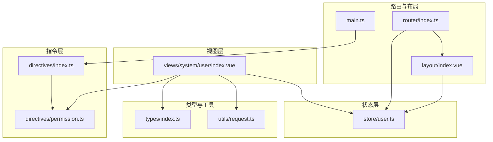
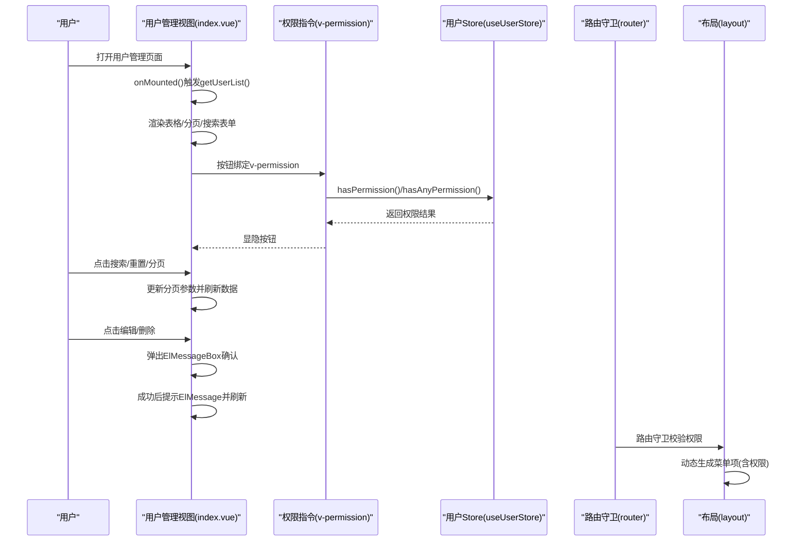
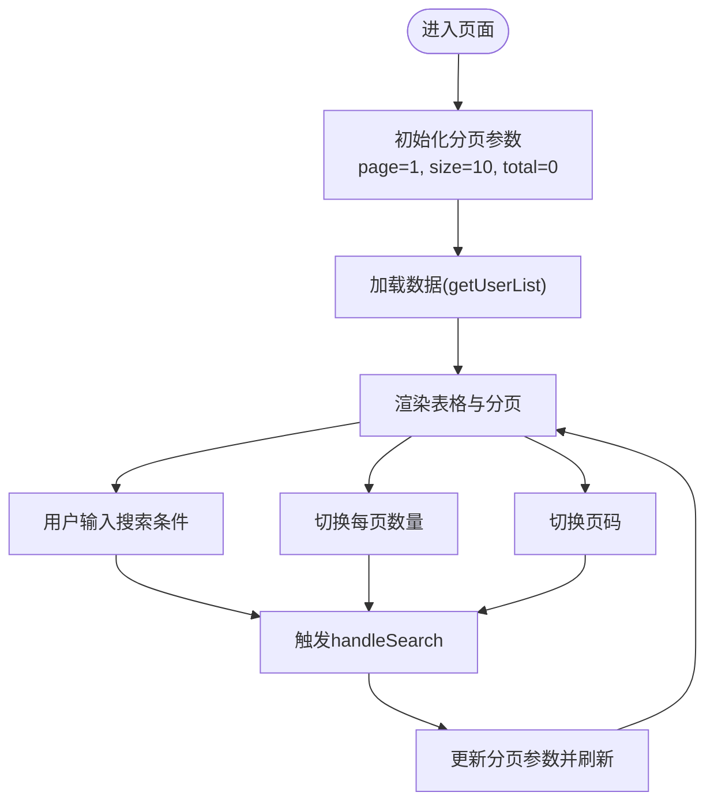
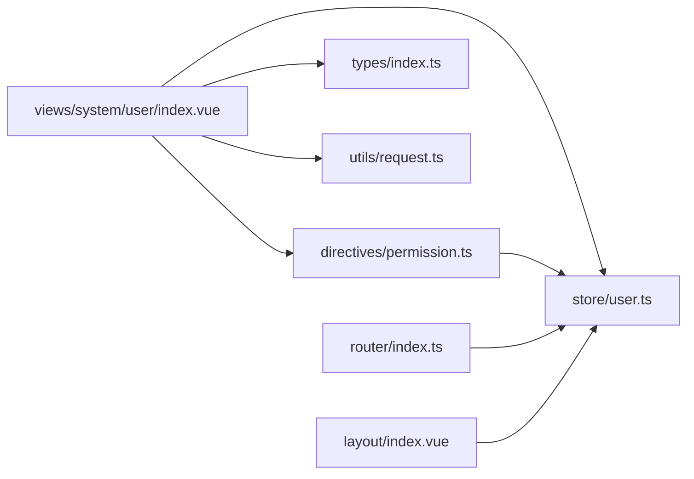

# 用户管理

<cite>
**本文引用的文件**
- [src/views/system/user/index.vue](file://src/views/system/user/index.vue)
- [src/directives/permission.ts](file://src/directives/permission.ts)
- [src/directives/index.ts](file://src/directives/index.ts)
- [src/store/user.ts](file://src/store/user.ts)
- [src/tabs/index.ts](file://src/tabs/index.ts)
- [src/types/index.ts](file://src/types/index.ts)
- [src/utils/request.ts](file://src/utils/request.ts)
- [src/router/index.ts](file://src/router/index.ts)
- [src/layout/index.vue](file://src/layout/index.vue)
- [src/main.ts](file://src/main.ts)
</cite>

## 目录
1. [简介](#简介)
2. [项目结构](#项目结构)
3. [核心组件](#核心组件)
4. [架构总览](#架构总览)
5. [详细组件分析](#详细组件分析)
6. [依赖关系分析](#依赖关系分析)
7. [性能考虑](#性能考虑)
8. [故障排查指南](#故障排查指南)
9. [结论](#结论)
10. [附录](#附录)

## 简介
本文件面向开发者与产品人员，系统性阐述“用户管理”功能的设计与实现，涵盖：
- 用户列表展示、搜索、分页与CRUD交互
- 用户数据模型User接口字段与业务含义
- 权限指令v-permission在用户管理中的应用（system:user:add、system:user:edit、system:user:delete）
- 用户状态管理（启用/禁用）与状态标签显示逻辑
- 模拟数据获取机制、ElMessageBox确认对话框与ElMessage消息提示的集成
- 实际代码示例路径与扩展建议

## 项目结构
用户管理位于系统管理模块下，采用按功能域划分的目录组织方式：
- 视图层：src/views/system/user/index.vue
- 权限指令：src/directives/permission.ts、src/directives/index.ts
- 状态管理：src/store/user.ts
- 类型定义：src/types/index.ts
- 网络请求封装：src/utils/request.ts
- 路由与导航：src/router/index.ts、src/layout/index.vue
- 应用入口：src/main.ts

图表来源
- [src/views/system/user/index.vue](file://src/views/system/user/index.vue#L1-L183)
- [src/directives/permission.ts](file://src/directives/permission.ts#L1-L67)
- [src/directives/index.ts](file://src/directives/index.ts#L1-L16)
- [src/store/user.ts](file://src/store/user.ts#L1-L68)
- [src/types/index.ts](file://src/types/index.ts#L1-L45)
- [src/utils/request.ts](file://src/utils/request.ts#L1-L102)
- [src/router/index.ts](file://src/router/index.ts#L1-L123)
- [src/layout/index.vue](file://src/layout/index.vue#L1-L255)
- [src/main.ts](file://src/main.ts#L1-L27)

章节来源
- [src/views/system/user/index.vue](file://src/views/system/user/index.vue#L1-L183)
- [src/router/index.ts](file://src/router/index.ts#L36-L76)
- [src/layout/index.vue](file://src/layout/index.vue#L1-L255)

## 核心组件
- 用户管理视图组件：负责渲染用户列表、搜索表单、分页控件以及操作按钮；内置模拟数据获取与状态标签展示。
- 权限指令：v-permission用于根据用户权限动态显隐按钮等UI元素。
- 用户状态管理：Pinia Store提供token、用户信息与权限集合，支持权限校验。
- 类型系统：统一定义用户信息、登录表单、API响应等类型。
- 路由与布局：系统管理路由配置与侧边栏菜单生成，结合权限指令实现菜单与页面级权限控制。
- 网络请求：基于Axios封装的请求工具，统一处理鉴权头、错误提示与状态码。

章节来源
- [src/views/system/user/index.vue](file://src/views/system/user/index.vue#L77-L172)
- [src/directives/permission.ts](file://src/directives/permission.ts#L9-L31)
- [src/store/user.ts](file://src/store/user.ts#L10-L66)
- [src/types/index.ts](file://src/types/index.ts#L1-L45)
- [src/router/index.ts](file://src/router/index.ts#L36-L76)
- [src/layout/index.vue](file://src/layout/index.vue#L90-L104)
- [src/utils/request.ts](file://src/utils/request.ts#L1-L102)

## 架构总览
用户管理功能围绕“视图-指令-状态-类型-路由-工具”的分层设计展开，核心交互流程如下：

图表来源
- [src/views/system/user/index.vue](file://src/views/system/user/index.vue#L77-L172)
- [src/directives/permission.ts](file://src/directives/permission.ts#L9-L31)
- [src/store/user.ts](file://src/store/user.ts#L52-L65)
- [src/router/index.ts](file://src/router/index.ts#L94-L120)
- [src/layout/index.vue](file://src/layout/index.vue#L90-L104)

## 详细组件分析

### 用户管理视图组件（index.vue）
- 页面结构
  - 卡片头部包含标题与“新增用户”按钮，按钮通过v-permission控制显示。
  - 搜索表单支持按用户名过滤，提供搜索与重置按钮。
  - 表格列包含ID、用户名、昵称、邮箱、手机号、状态、创建时间等字段。
  - 状态列以标签形式展示启用/禁用，颜色区分。
  - 操作列包含“编辑”“删除”按钮，均受v-permission控制。
  - 分页组件支持页码与每页条数切换，联动触发搜索。

- 数据模型与业务含义
  - User接口字段定义与含义：
    - id：用户唯一标识
    - username：登录账号
    - nickname：用户昵称
    - email：电子邮箱
    - phone：手机号
    - status：用户状态（1=启用，0=禁用）
    - createTime：创建时间
  - 以上字段均来自类型定义，确保前后端一致。

- 模拟数据获取
  - 组件内部定义模拟数据数组，设置tableData与pagination.total，用于演示列表展示与分页。
  - 搜索与重置会更新分页参数并刷新数据。

- 状态标签显示逻辑
  - 状态列使用条件渲染：status为1时显示“启用”，否则显示“禁用”，并以不同标签类型区分视觉状态。

- CRUD交互
  - 新增：当前仅提示“功能待开发”，可扩展至弹窗表单提交。
  - 编辑：当前仅提示“功能待开发”，可扩展至弹窗表单提交。
  - 删除：使用ElMessageBox进行二次确认，确认后提示成功并刷新列表。

- 分页机制
  - 使用el-pagination双向绑定当前页与每页大小，页码变化与尺寸变化均触发handleSearch，从而刷新数据。

- 搜索机制
  - 搜索表单绑定username字段，点击搜索或重置时调用handleSearch，内部刷新列表。

章节来源
- [src/views/system/user/index.vue](file://src/views/system/user/index.vue#L1-L183)
- [src/types/index.ts](file://src/types/index.ts#L1-L11)

### 权限指令v-permission
- 指令行为
  - 在mounted阶段读取绑定值（字符串或字符串数组），调用useUserStore进行权限校验。
  - 若无权限，则移除DOM节点，达到“不可见且不可用”的效果。
  - 支持数组形式：任一权限满足即通过；支持通配符“*:*:*”。

- 在用户管理中的应用
  - 新增按钮：v-permission="'system:user:add'"
  - 编辑按钮：v-permission="'system:user:edit'"
  - 删除按钮：v-permission="'system:user:delete'"
  - 通过权限指令实现细粒度的UI权限控制。

- 与路由守卫的协同
  - 路由meta.permission用于页面级权限控制；布局侧边栏菜单也基于权限动态生成。

章节来源
- [src/directives/permission.ts](file://src/directives/permission.ts#L9-L31)
- [src/directives/index.ts](file://src/directives/index.ts#L7-L13)
- [src/store/user.ts](file://src/store/user.ts#L52-L65)
- [src/router/index.ts](file://src/router/index.ts#L110-L116)
- [src/layout/index.vue](file://src/layout/index.vue#L96-L98)

### 用户状态管理（启用/禁用）
- 状态字段
  - User接口中的status字段表示用户启用/禁用状态（1/0）。
- 展示逻辑
  - 表格状态列根据status值渲染不同标签文本与类型，实现直观的状态可视化。
- 扩展建议
  - 后续可增加“启用/禁用”按钮，调用后端接口切换状态，并在成功后刷新列表。

章节来源
- [src/views/system/user/index.vue](file://src/views/system/user/index.vue#L29-L35)
- [src/types/index.ts](file://src/types/index.ts#L1-L11)

### 消息与确认交互
- ElMessageBox确认对话框
  - 删除操作使用ElMessageBox.confirm进行二次确认，提升安全性。
- ElMessage消息提示
  - 新增/编辑操作当前提示“功能待开发”，删除成功提示“删除成功”。
  - 网络请求封装中统一处理错误消息提示，保证一致的用户体验。

章节来源
- [src/views/system/user/index.vue](file://src/views/system/user/index.vue#L158-L167)
- [src/utils/request.ts](file://src/utils/request.ts#L30-L78)

### 模拟数据获取机制
- 当前实现
  - 组件内部定义mockData数组，直接赋值给tableData并设置pagination.total，用于演示列表与分页。
- 后续扩展
  - 替换为真实API调用，结合分页参数（page、size）向后端发起查询请求，解析响应数据填充列表。

章节来源
- [src/views/system/user/index.vue](file://src/views/system/user/index.vue#L103-L138)

### 分页与搜索流程图

图表来源
- [src/views/system/user/index.vue](file://src/views/system/user/index.vue#L95-L148)

## 依赖关系分析
- 组件耦合
  - index.vue依赖：权限指令（v-permission）、用户Store、类型定义、网络请求工具。
  - 权限指令依赖：用户Store提供的权限校验方法。
  - 路由与布局依赖：用户Store进行权限判断与菜单生成。
- 外部依赖
  - Element Plus：表格、分页、消息、确认框等UI组件。
  - Pinia：状态管理。
  - Vue Router：路由与导航。
  - Axios：HTTP请求封装。

图表来源
- [src/views/system/user/index.vue](file://src/views/system/user/index.vue#L77-L172)
- [src/directives/permission.ts](file://src/directives/permission.ts#L1-L67)
- [src/store/user.ts](file://src/store/user.ts#L1-L68)
- [src/router/index.ts](file://src/router/index.ts#L1-L123)
- [src/layout/index.vue](file://src/layout/index.vue#L1-L255)
- [src/utils/request.ts](file://src/utils/request.ts#L1-L102)
- [src/types/index.ts](file://src/types/index.ts#L1-L45)

章节来源
- [src/views/system/user/index.vue](file://src/views/system/user/index.vue#L77-L172)
- [src/directives/permission.ts](file://src/directives/permission.ts#L1-L67)
- [src/store/user.ts](file://src/store/user.ts#L1-L68)
- [src/router/index.ts](file://src/router/index.ts#L1-L123)
- [src/layout/index.vue](file://src/layout/index.vue#L1-L255)
- [src/utils/request.ts](file://src/utils/request.ts#L1-L102)
- [src/types/index.ts](file://src/types/index.ts#L1-L45)

## 性能考虑
- 列表渲染优化
  - 对于大数据量场景，建议使用虚拟滚动或服务端分页，避免一次性渲染过多DOM节点。
- 搜索与分页
  - 搜索与分页事件合并为一次handleSearch调用，减少重复渲染。
- 权限指令
  - 指令在mounted阶段执行一次判定，避免频繁重绘。
- 网络请求
  - 统一拦截器处理错误与超时，避免阻塞主线程。

## 故障排查指南
- 页面无法显示或空白
  - 检查路由守卫是否正确校验登录状态与页面权限。
  - 确认用户Store中token与userInfo是否正确设置。
- 按钮不可见
  - 检查v-permission绑定的权限值是否存在于用户Store的permissions中。
  - 确认权限指令注册是否生效。
- 删除操作无效
  - 检查ElMessageBox确认逻辑与成功回调是否执行。
  - 确认列表刷新逻辑是否被调用。
- 网络请求失败
  - 查看请求拦截器与响应拦截器的错误分支，确认错误提示是否正确显示。
  - 检查后端返回的code与message格式是否符合约定。

章节来源
- [src/router/index.ts](file://src/router/index.ts#L94-L120)
- [src/directives/permission.ts](file://src/directives/permission.ts#L9-L31)
- [src/views/system/user/index.vue](file://src/views/system/user/index.vue#L158-L167)
- [src/utils/request.ts](file://src/utils/request.ts#L30-L78)

## 结论
用户管理功能以清晰的分层架构实现：视图层负责交互与展示，指令层实现UI级权限控制，状态层提供权限与用户信息，类型系统保障数据一致性，路由与布局实现页面级权限与菜单生成，工具层统一处理网络请求与错误提示。当前版本以模拟数据演示核心流程，后续可无缝对接真实API，扩展新增、编辑、删除等CRUD能力，并完善状态切换与权限细化。

## 附录

### 用户数据模型（User接口）字段定义与业务含义
- id：用户唯一标识
- username：登录账号
- nickname：用户昵称
- email：电子邮箱
- phone：手机号
- status：用户状态（1=启用，0=禁用）
- createTime：创建时间

章节来源
- [src/types/index.ts](file://src/types/index.ts#L1-L11)

### 权限指令v-permission在用户管理中的应用
- 新增按钮：v-permission="'system:user:add'"
- 编辑按钮：v-permission="'system:user:edit'"
- 删除按钮：v-permission="'system:user:delete'"
- 指令会在mounted阶段校验权限，无权限则移除DOM节点。

章节来源
- [src/views/system/user/index.vue](file://src/views/system/user/index.vue#L7-L58)
- [src/directives/permission.ts](file://src/directives/permission.ts#L9-L31)

### ElMessageBox与ElMessage集成示例路径
- 删除确认与成功提示：参见删除处理函数路径
  - [src/views/system/user/index.vue](file://src/views/system/user/index.vue#L158-L167)
- 全局错误提示：参见请求拦截器路径
  - [src/utils/request.ts](file://src/utils/request.ts#L30-L78)

### 扩展指南
- 新增/编辑
  - 在handleAdd/handleEdit中打开表单弹窗，提交后调用后端接口，成功后刷新列表并提示成功。
- 删除
  - 已具备确认与提示，后续补充后端删除接口调用。
- 分页与搜索
  - 替换模拟数据为真实API调用，传入分页参数与搜索条件，解析响应数据。
- 状态切换
  - 增加“启用/禁用”按钮，调用后端接口切换状态，成功后刷新列表。
- 权限细化
  - 可在路由meta中配置更细粒度的权限，结合v-permission实现按钮级权限控制。