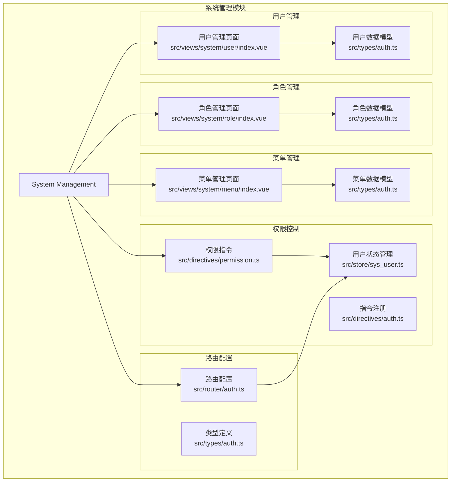
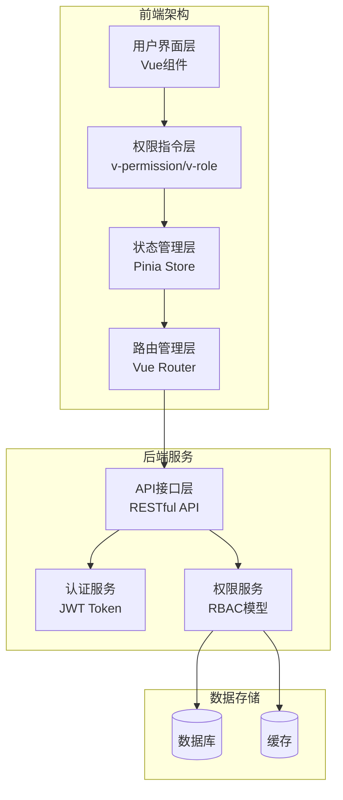
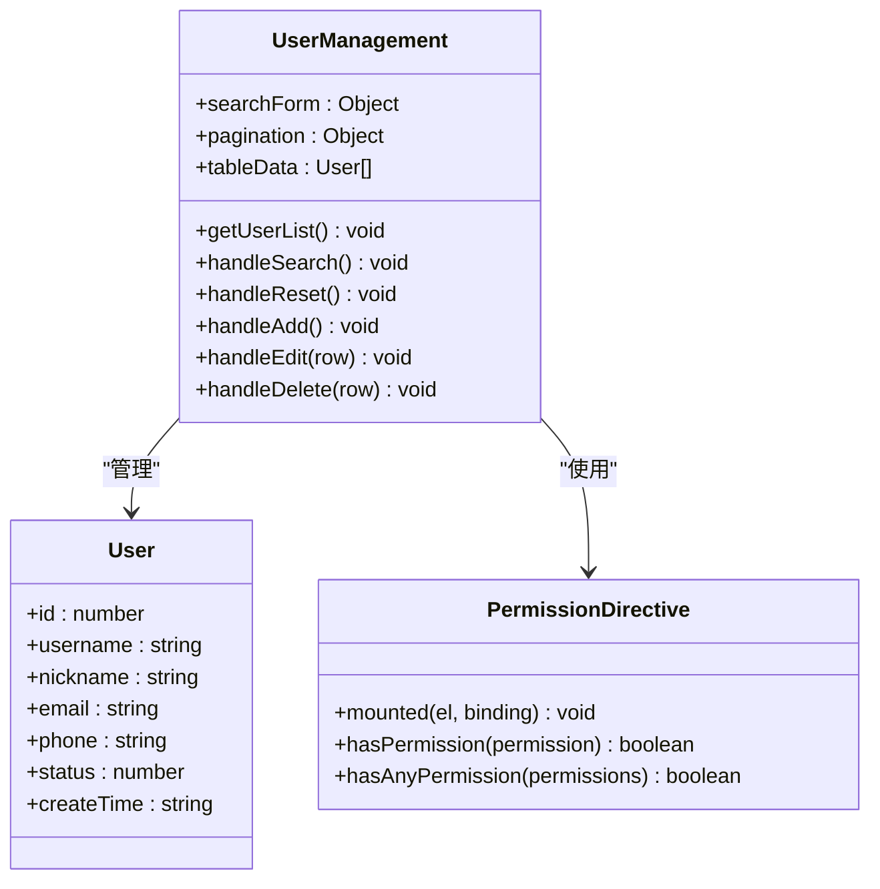
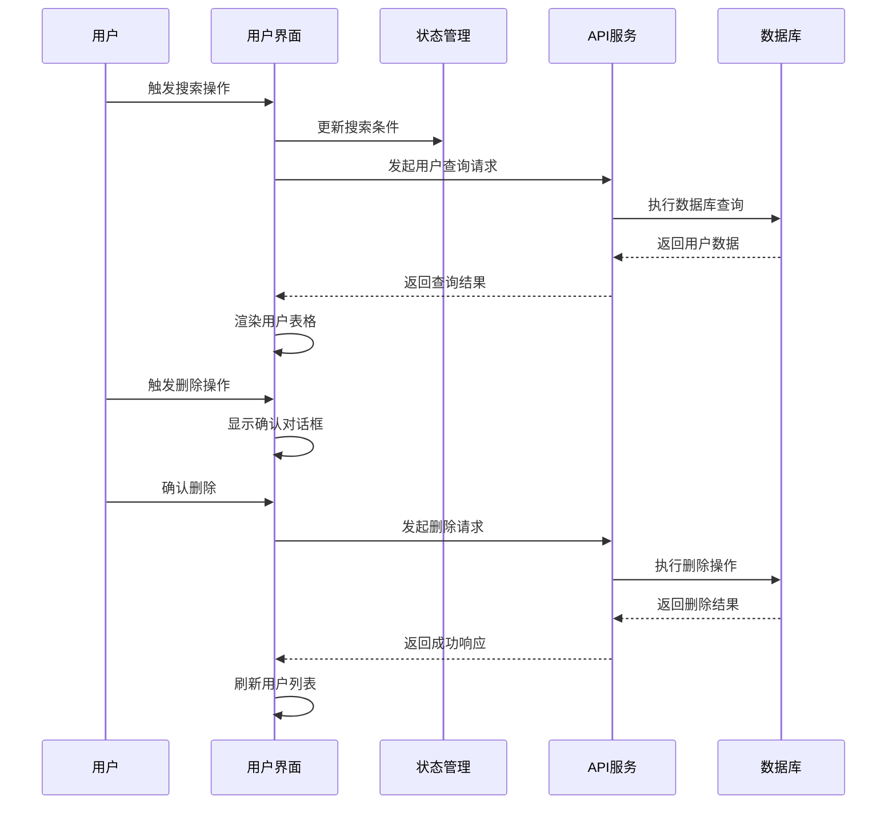
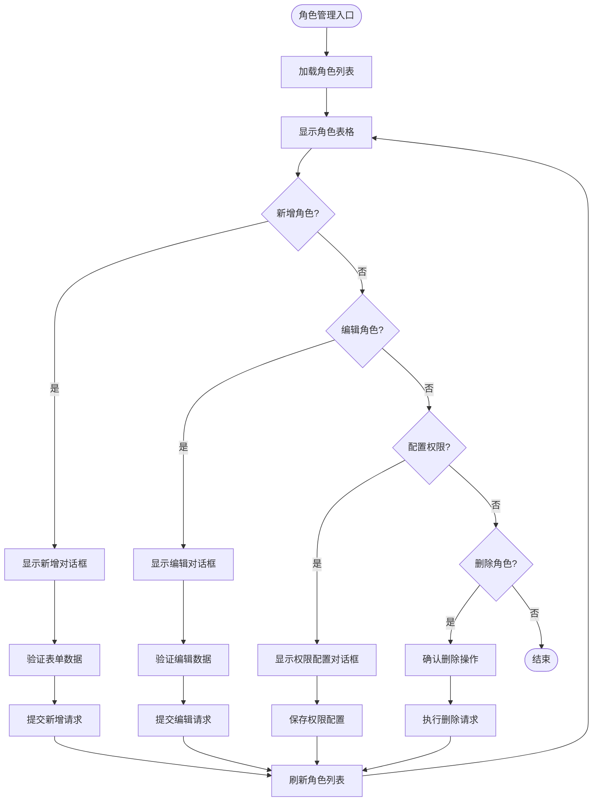
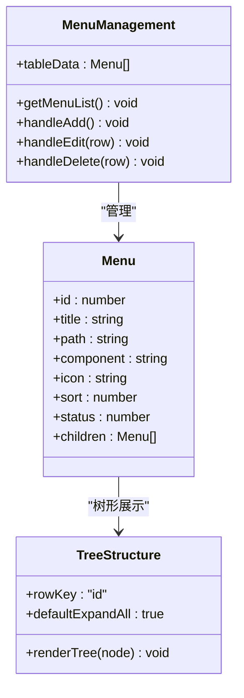
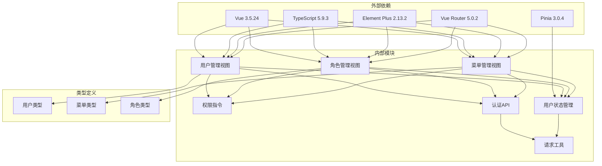

# 系统管理模块

<cite>
**本文档引用的文件**
- [src/views/system/user/index.vue](file://src/views/system/user/index.vue)
- [src/views/system/role/index.vue](file://src/views/system/role/index.vue)
- [src/views/system/menu/index.vue](file://src/views/system/menu/index.vue)
- [src/store/sys_user.ts](file://src/store/sys_user.ts)
- [src/directives/permission.ts](file://src/directives/permission.ts)
- [src/directives/auth.ts](file://src/directives/auth.ts)
- [src/types/auth.ts](file://src/types/auth.ts)
- [src/router/auth.ts](file://src/router/auth.ts)
- [src/utils/request.ts](file://src/utils/request.ts)
- [src/api/auth.ts](file://src/api/auth.ts)
- [src/main.ts](file://src/main.ts)
- [package.json](file://package.json)
</cite>

## 目录
1. [简介](#简介)
2. [项目结构](#项目结构)
3. [核心组件](#核心组件)
4. [架构概览](#架构概览)
5. [详细组件分析](#详细组件分析)
6. [依赖关系分析](#依赖关系分析)
7. [性能考虑](#性能考虑)
8. [故障排除指南](#故障排除指南)
9. [结论](#结论)
10. [附录](#附录)

## 简介

系统管理模块是基于Vue 3 + TypeScript构建的企业级管理系统的核心功能模块，主要包含用户管理、角色管理和菜单管理三大核心功能。该模块实现了完整的RBAC（基于角色的访问控制）权限模型，提供了完善的权限控制机制和用户界面设计。

本模块采用现代化的前端技术栈，结合Element Plus组件库和Pinia状态管理，为开发者提供了可扩展、可维护的系统管理解决方案。通过权限指令、路由守卫和状态管理的协同工作，实现了细粒度的权限控制和用户体验优化。

## 项目结构

系统管理模块位于`src/views/system/`目录下，采用按功能模块划分的组织方式：



**图表来源**
- [src/views/system/user/index.vue](file://src/views/system/user/index.vue#L1-L183)
- [src/views/system/role/index.vue](file://src/views/system/role/index.vue#L1-L150)
- [src/views/system/menu/index.vue](file://src/views/system/menu/index.vue#L1-L161)
- [src/directives/permission.ts](file://src/directives/permission.ts#L1-L67)
- [src/router/auth.ts](file://src/router/index.ts#L1-L119)

**章节来源**
- [src/views/system/user/index.vue](file://src/views/system/user/index.vue#L1-L183)
- [src/views/system/role/index.vue](file://src/views/system/role/index.vue#L1-L150)
- [src/views/system/menu/index.vue](file://src/views/system/menu/index.vue#L1-L161)

## 核心组件

系统管理模块包含三个核心组件，每个组件都实现了完整的CRUD操作和权限控制：

### 用户管理组件
- **功能特性**：用户列表展示、搜索过滤、分页显示、新增编辑删除操作
- **数据模型**：包含用户基本信息、状态管理和创建时间
- **权限控制**：支持用户相关的增删改查权限验证

### 角色管理组件  
- **功能特性**：角色列表管理、角色权限配置、状态控制
- **数据模型**：角色名称、角色标识、描述信息和创建时间
- **权限控制**：支持角色管理相关的权限操作

### 菜单管理组件
- **功能特性**：树形菜单展示、层级关系管理、动态菜单生成
- **数据模型**：菜单标题、路由路径、组件路径和排序字段
- **权限控制**：支持菜单管理的权限验证

**章节来源**
- [src/views/system/user/index.vue](file://src/views/system/user/index.vue#L81-L101)
- [src/views/system/role/index.vue](file://src/views/system/role/index.vue#L69-L76)
- [src/views/system/menu/index.vue](file://src/views/system/menu/index.vue#L59-L68)

## 架构概览

系统管理模块采用分层架构设计，通过权限指令、状态管理和路由守卫实现多层权限控制：



**图表来源**
- [src/directives/permission.ts](file://src/directives/permission.ts#L9-L31)
- [src/store/sys_user.ts](file://src/store/user.ts#L10-L66)
- [src/router/auth.ts](file://src/router/index.ts#L91-L116)

### RBAC权限模型实现

系统采用标准的RBAC（基于角色的访问控制）模型，通过以下层次实现权限控制：

1. **用户层**：用户拥有多个角色
2. **角色层**：角色拥有多个权限
3. **权限层**：权限控制具体的操作能力

权限格式采用`模块:操作:资源`的三层结构：
- `system:user:add` - 用户管理模块的新增权限
- `system:role:list` - 角色管理模块的列表权限
- `system:menu:edit` - 菜单管理模块的编辑权限

**章节来源**
- [src/directives/permission.ts](file://src/directives/permission.ts#L4-L8)
- [src/types/auth.ts](file://src/types/index.ts#L1-L11)
- [src/router/auth.ts](file://src/router/index.ts#L48-L68)

## 详细组件分析

### 用户管理组件分析

用户管理组件实现了完整的用户生命周期管理功能：



**图表来源**
- [src/views/system/user/index.vue](file://src/views/system/user/index.vue#L81-L101)
- [src/directives/permission.ts](file://src/directives/permission.ts#L9-L31)

#### 数据模型设计

用户数据模型包含以下关键字段：
- **基础信息**：用户名、昵称、邮箱、手机号
- **状态管理**：启用/禁用状态标识
- **时间戳**：创建时间记录
- **唯一标识**：自增ID主键

#### CRUD操作流程



**图表来源**
- [src/views/system/user/index.vue](file://src/views/system/user/index.vue#L140-L167)
- [src/utils/request.ts](file://src/utils/request.ts#L81-L100)

**章节来源**
- [src/views/system/user/index.vue](file://src/views/system/user/index.vue#L1-L183)
- [src/types/auth.ts](file://src/types/index.ts#L2-L11)

### 角色管理组件分析

角色管理组件提供了角色的完整生命周期管理：



**图表来源**
- [src/views/system/role/index.vue](file://src/views/system/role/index.vue#L113-L134)

#### 角色权限配置

角色管理组件特别提供了权限配置功能，支持：
- 单个角色权限的增删改查
- 权限树形结构的可视化展示
- 权限继承关系的管理

**章节来源**
- [src/views/system/role/index.vue](file://src/views/system/role/index.vue#L1-L150)
- [src/types/auth.ts](file://src/types/index.ts#L9-L11)

### 菜单管理组件分析

菜单管理组件实现了动态菜单的完整管理功能：



**图表来源**
- [src/views/system/menu/index.vue](file://src/views/system/menu/index.vue#L59-L68)
- [src/views/system/menu/index.vue](file://src/views/system/menu/index.vue#L13-L50)

#### 菜单树形结构

菜单管理支持多层级的树形结构：
- **根节点**：顶级菜单项
- **子节点**：嵌套的子菜单
- **叶子节点**：最终的页面链接

菜单数据结构包含：
- **导航属性**：路径、组件、图标
- **显示属性**：标题、排序、状态
- **关系属性**：父子关系、层级结构

**章节来源**
- [src/views/system/menu/index.vue](file://src/views/system/menu/index.vue#L1-L161)
- [src/types/auth.ts](file://src/types/index.ts#L32-L44)

## 依赖关系分析

系统管理模块的依赖关系体现了清晰的分层架构：



**图表来源**
- [package.json](file://package.json#L12-L20)
- [src/main.ts](file://src/main.ts#L1-L27)

### 关键依赖说明

1. **Vue生态**：使用Vue 3.5.24和TypeScript提供类型安全的开发体验
2. **UI框架**：Element Plus提供丰富的组件库支持
3. **状态管理**：Pinia替代Vuex，提供更简洁的状态管理模式
4. **路由管理**：Vue Router实现前端路由和权限控制
5. **HTTP客户端**：Axios封装统一的API调用接口

**章节来源**
- [package.json](file://package.json#L1-L38)
- [src/main.ts](file://src/main.ts#L1-L27)

## 性能考虑

系统管理模块在设计时充分考虑了性能优化：

### 内存管理
- **组件卸载**：Vue组件自动清理事件监听器和定时器
- **状态清理**：Pinia Store在用户登出时自动清理内存
- **图片懒加载**：对于大图片资源采用懒加载策略

### 网络优化
- **请求缓存**：API响应数据进行本地缓存
- **并发控制**：限制同时发起的请求数量
- **错误重试**：网络异常时自动重试机制

### 渲染优化
- **虚拟滚动**：大数据量时采用虚拟滚动提升渲染性能
- **组件懒加载**：路由级别的代码分割
- **防抖节流**：搜索和筛选操作的防抖处理

## 故障排除指南

### 权限控制问题

**问题现象**：按钮或页面无法显示，但用户应该有权限

**排查步骤**：
1. 检查用户权限列表是否正确加载
2. 验证权限字符串格式是否符合规范
3. 确认路由元信息中的权限配置

**解决方案**：
```typescript
// 检查权限状态
console.log('当前权限:', userStore.getPermissions())
console.log('是否有权限:', userStore.hasPermission('system:user:add'))
```

### 数据加载问题

**问题现象**：用户列表无法加载或显示空白

**排查步骤**：
1. 检查API接口是否正常响应
2. 验证token是否有效
3. 确认网络连接状态

**解决方案**：
```typescript
// 添加错误处理
try {
  await getUserList()
} catch (error) {
  console.error('加载用户列表失败:', error)
  ElMessage.error('加载失败，请稍后重试')
}
```

### 页面权限访问问题

**问题现象**：用户访问受保护页面时被重定向到登录页

**排查步骤**：
1. 检查路由守卫逻辑
2. 验证用户登录状态
3. 确认权限验证逻辑

**解决方案**：
```typescript
// 在路由守卫中添加调试信息
console.log('目标路由权限:', to.meta.permission)
console.log('用户权限:', userStore.getPermissions())
console.log('登录状态:', userStore.isLogin)
```

**章节来源**
- [src/directives/permission.ts](file://src/directives/permission.ts#L10-L31)
- [src/router/auth.ts](file://src/router/index.ts#L91-L116)
- [src/utils/request.ts](file://src/utils/request.ts#L31-L78)

## 结论

系统管理模块是一个功能完整、架构清晰的企业级管理解决方案。通过RBAC权限模型的深入实现，配合Vue 3的响应式特性和TypeScript的类型安全，为开发者提供了可靠的系统管理功能。

模块的主要优势包括：
- **完整的CRUD功能**：用户、角色、菜单管理的全生命周期支持
- **细粒度权限控制**：基于指令和路由的多层权限验证
- **良好的用户体验**：响应式的界面设计和流畅的交互体验
- **可扩展性**：模块化的架构便于功能扩展和维护

建议在实际项目中根据具体需求进行定制化开发，如添加数据验证规则、批量操作功能、审计日志等高级特性。

## 附录

### 权限配置示例

```typescript
// 用户管理权限配置
const userPermissions = [
  'system:user:list',    // 查看用户列表
  'system:user:add',     // 新增用户
  'system:user:edit',    // 编辑用户
  'system:user:delete'   // 删除用户
]

// 角色管理权限配置
const rolePermissions = [
  'system:role:list',
  'system:role:add',
  'system:role:edit', 
  'system:role:delete',
  'system:role:permission'  // 配置角色权限
]

// 菜单管理权限配置
const menuPermissions = [
  'system:menu:list',
  'system:menu:add',
  'system:menu:edit',
  'system:menu:delete'
]
```

### 扩展开发指南

1. **新增管理模块**：
   - 创建新的Vue组件页面
   - 定义相应的数据模型
   - 配置路由和权限
   - 实现CRUD操作

2. **权限扩展**：
   - 在用户类型中添加新的权限字段
   - 更新权限指令以支持新权限
   - 配置路由元信息中的权限

3. **界面定制**：
   - 修改组件样式和布局
   - 添加自定义验证规则
   - 优化用户体验

**章节来源**
- [src/types/auth.ts](file://src/types/index.ts#L1-L45)
- [src/directives/permission.ts](file://src/directives/permission.ts#L38-L61)