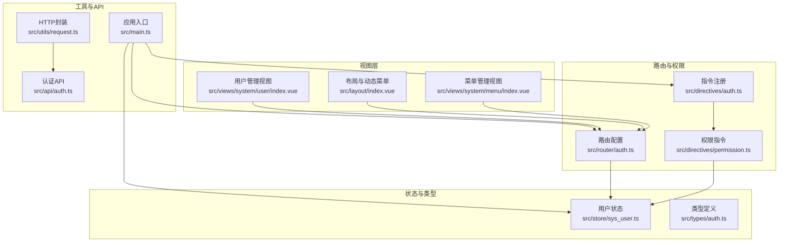
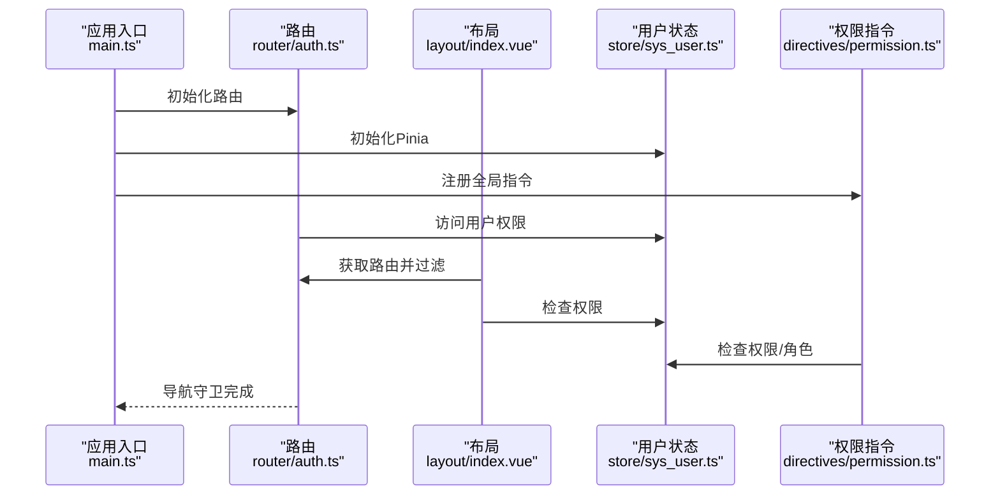
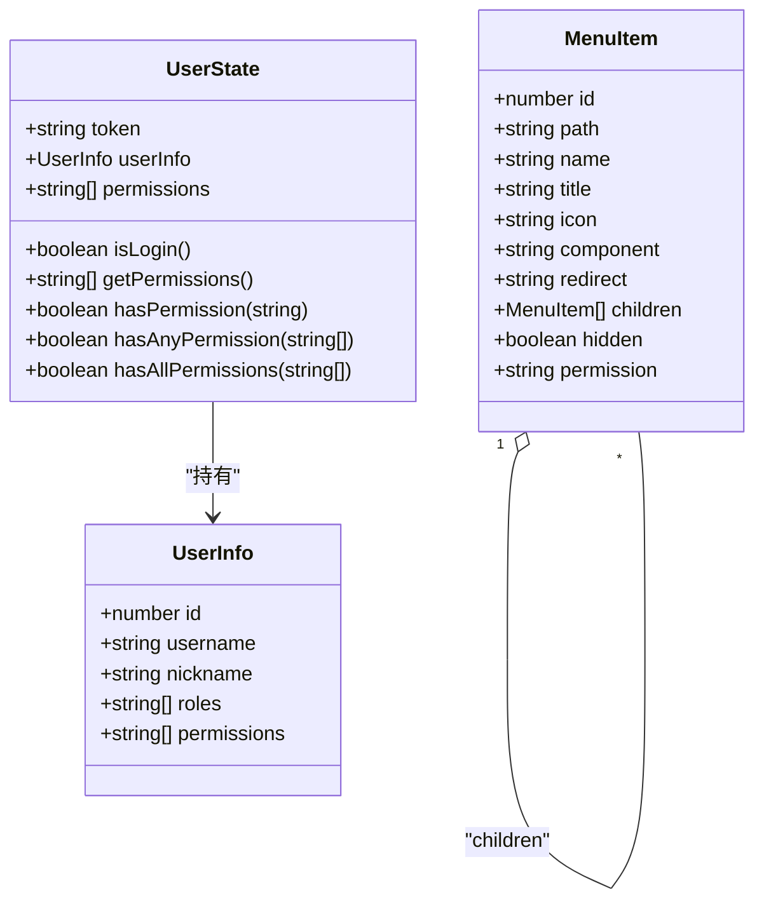
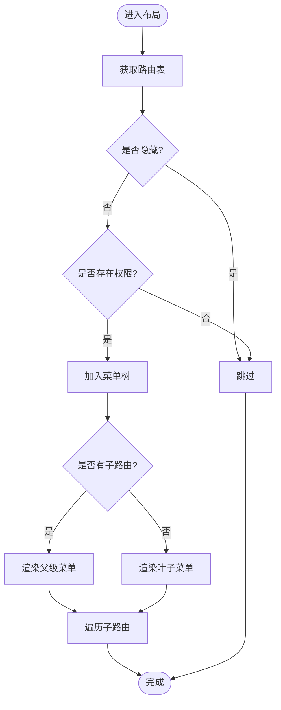
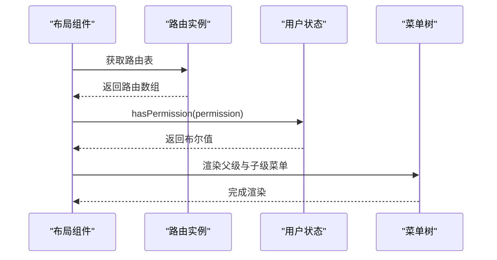
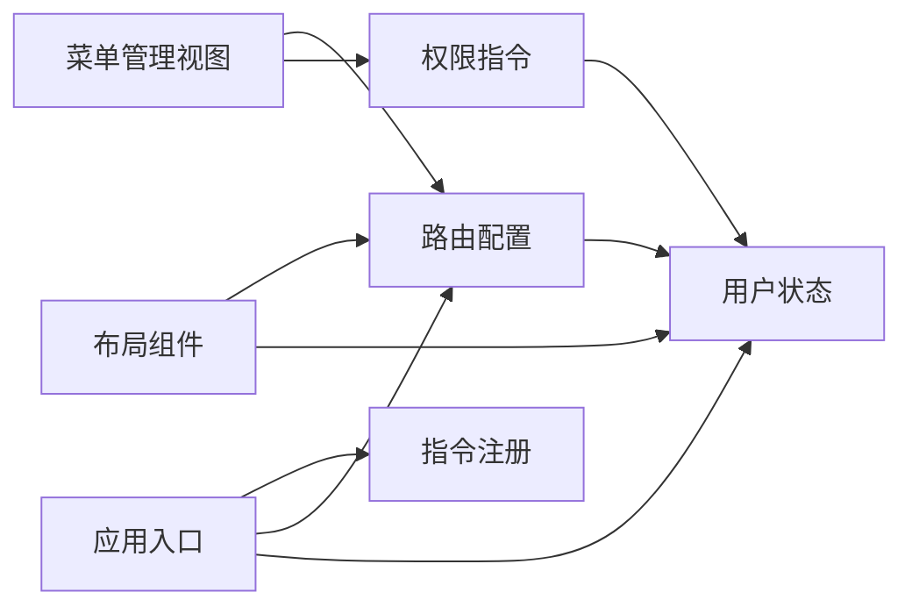

# 菜单管理

<cite>
**本文引用的文件**
- [src/views/system/menu/index.vue](file://src/views/system/menu/index.vue)
- [src/layout/index.vue](file://src/layout/index.vue)
- [src/router/auth.ts](file://src/router/auth.ts)
- [src/store/sys_user.ts](file://src/store/sys_user.ts)
- [src/directives/permission.ts](file://src/directives/permission.ts)
- [src/directives/auth.ts](file://src/directives/auth.ts)
- [src/types/auth.ts](file://src/types/auth.ts)
- [src/main.ts](file://src/main.ts)
- [src/utils/request.ts](file://src/utils/request.ts)
- [src/api/auth.ts](file://src/api/auth.ts)
- [src/views/system/user/index.vue](file://src/views/system/user/index.vue)
</cite>

## 目录
1. [简介](#简介)
2. [项目结构](#项目结构)
3. [核心组件](#核心组件)
4. [架构总览](#架构总览)
5. [详细组件分析](#详细组件分析)
6. [依赖分析](#依赖分析)
7. [性能考虑](#性能考虑)
8. [故障排查指南](#故障排查指南)
9. [结论](#结论)
10. [附录](#附录)

## 简介
本文件围绕菜单管理功能进行系统性文档化，涵盖菜单树形结构展示、菜单层级管理、动态菜单生成、菜单数据模型与父子关系映射、权限配置、排序与状态控制、以及菜单的增删改流程。同时解释菜单与路由系统的集成方式、图标配置、路由关联与权限标识设置，并提供扩展指南与最佳实践，帮助开发者快速理解并扩展菜单管理能力。

## 项目结构
菜单管理功能涉及以下关键模块：
- 菜单管理界面：负责展示与操作菜单（新增、编辑、删除）
- 动态菜单渲染：基于路由与权限动态生成侧边栏菜单
- 权限控制：通过指令与路由守卫实现按钮级与页面级权限控制
- 类型定义：统一的菜单项与用户信息类型
- 存储与API：用户权限存储与认证接口

图表来源
- [src/views/system/menu/index.vue](file://src/views/system/menu/index.vue#L1-L161)
- [src/layout/index.vue](file://src/layout/index.vue#L1-L255)
- [src/router/auth.ts](file://src/router/index.ts#L1-L123)
- [src/directives/permission.ts](file://src/directives/permission.ts#L1-L67)
- [src/directives/auth.ts](file://src/directives/index.ts#L1-L16)
- [src/store/sys_user.ts](file://src/store/user.ts#L1-L68)
- [src/types/auth.ts](file://src/types/index.ts#L1-L45)
- [src/main.ts](file://src/main.ts#L1-L27)
- [src/utils/request.ts](file://src/utils/request.ts#L1-L102)
- [src/api/auth.ts](file://src/api/auth.ts#L1-L18)

章节来源
- [src/views/system/menu/index.vue](file://src/views/system/menu/index.vue#L1-L161)
- [src/layout/index.vue](file://src/layout/index.vue#L1-L255)
- [src/router/auth.ts](file://src/router/index.ts#L1-L123)
- [src/directives/permission.ts](file://src/directives/permission.ts#L1-L67)
- [src/directives/auth.ts](file://src/directives/index.ts#L1-L16)
- [src/store/sys_user.ts](file://src/store/user.ts#L1-L68)
- [src/types/auth.ts](file://src/types/index.ts#L1-L45)
- [src/main.ts](file://src/main.ts#L1-L27)
- [src/utils/request.ts](file://src/utils/request.ts#L1-L102)
- [src/api/auth.ts](file://src/api/auth.ts#L1-L18)

## 核心组件
- 菜单管理视图：提供菜单表格展示、状态标签、操作按钮（新增、编辑、删除），当前为演示数据与占位逻辑。
- 动态菜单渲染：根据路由配置与用户权限过滤生成侧边栏菜单树。
- 路由配置：定义菜单对应的路由、元信息（标题、图标、权限）与重定向规则。
- 权限指令：在模板层面按权限/角色控制元素显示。
- 用户状态：维护token、用户信息与权限集合，提供权限判断方法。
- 类型定义：统一的菜单项与用户信息类型，确保前后端一致的数据契约。

章节来源
- [src/views/system/menu/index.vue](file://src/views/system/menu/index.vue#L55-L149)
- [src/layout/index.vue](file://src/layout/index.vue#L90-L111)
- [src/router/auth.ts](file://src/router/index.ts#L6-L86)
- [src/directives/permission.ts](file://src/directives/permission.ts#L9-L31)
- [src/store/sys_user.ts](file://src/store/user.ts#L10-L66)
- [src/types/auth.ts](file://src/types/index.ts#L32-L44)

## 架构总览
菜单管理的运行时交互链路如下：
- 应用启动后注册全局指令与插件，加载路由与状态管理。
- 用户登录后，路由守卫根据用户权限与路由元信息决定页面可访问性。
- 布局组件动态读取路由表，过滤隐藏项与无权限项，生成侧边栏菜单树。
- 菜单管理视图展示菜单数据，操作按钮受权限指令保护。

图表来源
- [src/main.ts](file://src/main.ts#L1-L27)
- [src/router/auth.ts](file://src/router/index.ts#L94-L120)
- [src/layout/index.vue](file://src/layout/index.vue#L90-L111)
- [src/store/sys_user.ts](file://src/store/user.ts#L52-L65)
- [src/directives/permission.ts](file://src/directives/permission.ts#L9-L31)

## 详细组件分析

### 菜单数据模型与父子关系映射
- 数据模型
  - 菜单项包含：唯一标识、路径、名称、标题、图标、组件路径、重定向、子节点、隐藏标记、权限标识等字段。
  - 支持嵌套子节点，形成树形结构。
- 父子关系映射
  - 路由配置中的父子关系直接映射到菜单树；父路由作为容器，子路由作为叶子菜单项。
  - 动态菜单渲染时，通过遍历路由树构建侧边栏菜单树，自动继承父级的图标与标题。

图表来源
- [src/types/auth.ts](file://src/types/index.ts#L32-L44)
- [src/types/auth.ts](file://src/types/index.ts#L2-L11)
- [src/store/sys_user.ts](file://src/store/user.ts#L4-L66)

章节来源
- [src/types/auth.ts](file://src/types/index.ts#L32-L44)
- [src/router/auth.ts](file://src/router/index.ts#L6-L86)

### 菜单树形结构展示与动态菜单生成
- 菜单管理视图
  - 使用表格展示菜单列表，支持默认展开全部、行键为id。
  - 展示字段：菜单名称、路由路径、组件路径、图标、排序、状态。
  - 操作列使用权限指令保护，仅授权用户可见。
- 动态菜单生成
  - 布局组件从路由表中筛选非隐藏且符合权限的路由项。
  - 递归渲染父级与子级菜单，支持图标组件化渲染。
  - 侧边栏菜单与路由联动，点击即导航。

图表来源
- [src/layout/index.vue](file://src/layout/index.vue#L90-L111)
- [src/router/auth.ts](file://src/router/index.ts#L6-L86)

章节来源
- [src/views/system/menu/index.vue](file://src/views/system/menu/index.vue#L13-L50)
- [src/layout/index.vue](file://src/layout/index.vue#L8-L40)

### 菜单权限配置、排序与状态控制
- 权限配置
  - 路由元信息中设置权限标识，路由守卫与布局动态菜单均据此过滤。
  - 按钮级权限通过指令在模板中声明式控制。
- 排序
  - 菜单管理视图提供排序字段，用于展示与后续持久化排序。
- 状态控制
  - 菜单管理视图以标签展示显示/隐藏状态，便于直观管理。

章节来源
- [src/router/auth.ts](file://src/router/index.ts#L40-L76)
- [src/views/system/menu/index.vue](file://src/views/system/menu/index.vue#L18-L25)
- [src/directives/permission.ts](file://src/directives/permission.ts#L9-L31)

### 菜单添加、编辑、删除的实现流程
- 当前状态
  - 菜单管理视图的新增、编辑、删除按钮为占位逻辑，调用消息提示。
- 实现建议
  - 新增：弹出表单，校验必填字段与父子关系合法性，提交后刷新列表。
  - 编辑：打开表单回显当前数据，提交后更新对应节点。
  - 删除：二次确认，删除后刷新列表并同步路由配置。
- 注意事项
  - 删除父节点需处理子节点迁移或删除策略。
  - 修改排序需保证连续性与唯一性。

章节来源
- [src/views/system/menu/index.vue](file://src/views/system/menu/index.vue#L128-L145)

### 图标配置、路由关联与权限标识设置
- 图标配置
  - 路由元信息与菜单项均支持图标字段，布局组件通过动态组件渲染图标。
  - 应用入口注册Element Plus图标，可在模板中直接使用图标名。
- 路由关联
  - 菜单项的路径与组件路径需与路由配置一致，确保导航正确。
  - 父子路由关系决定菜单树的层级结构。
- 权限标识
  - 路由元信息中的权限标识用于页面级访问控制。
  - 按钮级权限通过指令在模板中声明，避免无权限元素出现。

章节来源
- [src/layout/index.vue](file://src/layout/index.vue#L16-L38)
- [src/main.ts](file://src/main.ts#L13-L16)
- [src/router/auth.ts](file://src/router/index.ts#L10-L76)
- [src/directives/permission.ts](file://src/directives/permission.ts#L9-L31)

### 动态菜单生成与路由系统的集成
- 集成点
  - 布局组件通过路由实例获取路由表，结合用户权限与隐藏标记生成菜单树。
  - 路由守卫在导航前检查权限，未授权则阻止导航。
- 关键流程
  - 过滤隐藏路由与无权限路由。
  - 递归渲染父级与子级菜单项。
  - 与Element Plus菜单组件联动，支持折叠与图标渲染。

图表来源
- [src/layout/index.vue](file://src/layout/index.vue#L90-L111)
- [src/router/auth.ts](file://src/router/index.ts#L94-L120)
- [src/store/sys_user.ts](file://src/store/user.ts#L52-L65)

## 依赖分析
- 组件耦合
  - 菜单管理视图依赖路由与权限指令，但不直接依赖路由实例。
  - 布局组件强依赖路由实例与用户状态，负责动态菜单生成。
  - 权限指令依赖用户状态，实现按钮级权限控制。
- 外部依赖
  - Element Plus提供UI组件与图标库。
  - Vue Router提供路由与导航能力。
  - Pinia提供状态管理。
  - Axios提供HTTP请求封装。

图表来源
- [src/views/system/menu/index.vue](file://src/views/system/menu/index.vue#L55-L149)
- [src/layout/index.vue](file://src/layout/index.vue#L90-L111)
- [src/router/auth.ts](file://src/router/index.ts#L94-L120)
- [src/directives/permission.ts](file://src/directives/permission.ts#L9-L31)
- [src/directives/auth.ts](file://src/directives/index.ts#L7-L13)
- [src/main.ts](file://src/main.ts#L1-L27)

章节来源
- [src/views/system/menu/index.vue](file://src/views/system/menu/index.vue#L55-L149)
- [src/layout/index.vue](file://src/layout/index.vue#L90-L111)
- [src/router/auth.ts](file://src/router/index.ts#L94-L120)
- [src/directives/permission.ts](file://src/directives/permission.ts#L9-L31)
- [src/directives/auth.ts](file://src/directives/index.ts#L7-L13)
- [src/main.ts](file://src/main.ts#L1-L27)

## 性能考虑
- 路由过滤与渲染
  - 在布局组件中对路由进行过滤与渲染，建议在用户权限稳定后一次性计算，避免频繁重算。
- 图标渲染
  - 动态组件渲染图标，建议减少不必要的重渲染，可通过key优化。
- 数据量大时
  - 菜单管理视图建议采用分页或虚拟滚动，提升表格渲染性能。
- 权限判断
  - 权限判断为O(n)查找，建议在用户登录后缓存权限集合，避免重复计算。

## 故障排查指南
- 页面无法访问
  - 检查路由元信息中的权限标识是否正确配置。
  - 检查用户状态中权限集合是否包含所需权限。
- 按钮不显示
  - 检查指令参数格式与权限字符串是否匹配。
  - 确认用户状态中权限集合是否正确加载。
- 菜单不显示
  - 检查路由是否被标记为隐藏。
  - 检查路由与菜单路径是否一致。
- 图标不显示
  - 检查图标名是否存在于Element Plus图标库。
  - 确认应用入口是否正确注册了图标组件。

章节来源
- [src/router/auth.ts](file://src/router/index.ts#L94-L120)
- [src/store/sys_user.ts](file://src/store/user.ts#L52-L65)
- [src/directives/permission.ts](file://src/directives/permission.ts#L9-L31)
- [src/layout/index.vue](file://src/layout/index.vue#L16-L38)
- [src/main.ts](file://src/main.ts#L13-L16)

## 结论
菜单管理功能通过“路由+权限+指令”的组合实现了灵活的动态菜单生成与权限控制。当前菜单管理视图为演示形态，建议在此基础上接入真实API与表单校验，完善菜单的增删改流程与持久化存储。通过统一的类型定义与状态管理，可进一步扩展菜单的排序、状态与父子关系管理，提升系统的可维护性与扩展性。

## 附录
- 扩展建议
  - 引入菜单API：提供菜单列表、新增、编辑、删除、排序、状态切换接口。
  - 表单校验：对菜单路径、组件路径、权限标识进行格式与业务规则校验。
  - 父子关系约束：禁止自环、路径冲突、非法层级等。
  - 菜单缓存：在用户登录后缓存菜单树，减少重复计算。
  - 国际化：标题与描述支持多语言。
- 最佳实践
  - 路由与菜单保持一一对应，避免重复或遗漏。
  - 权限标识命名规范，遵循“模块:资源:操作”约定。
  - 图标选择简洁明确，避免过多样式差异。
  - 操作按钮与页面级权限保持一致，避免“页面可访问但按钮不可见”的矛盾。