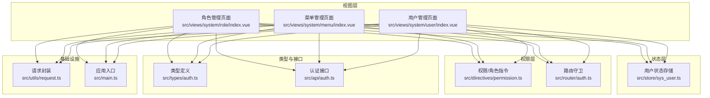
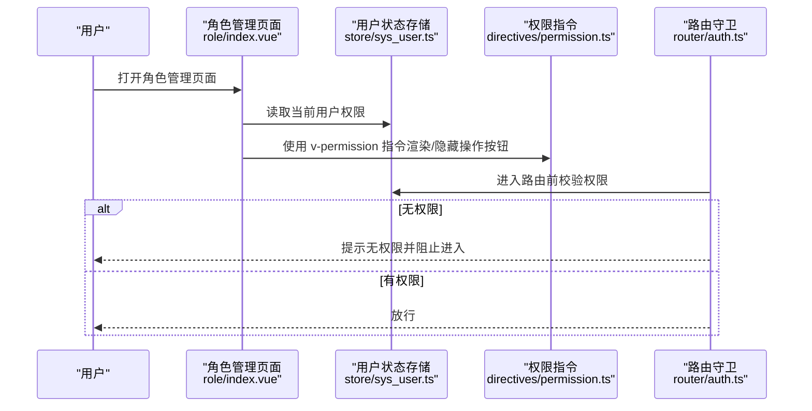
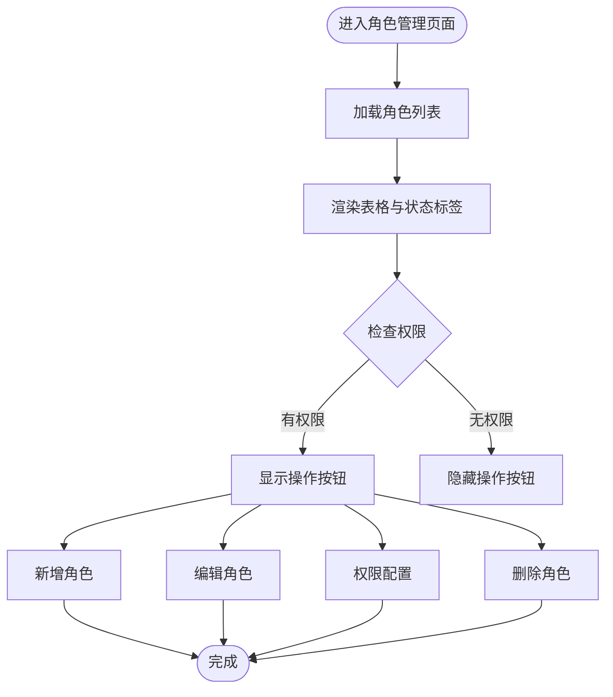
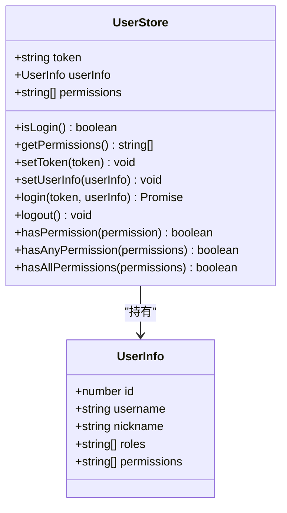
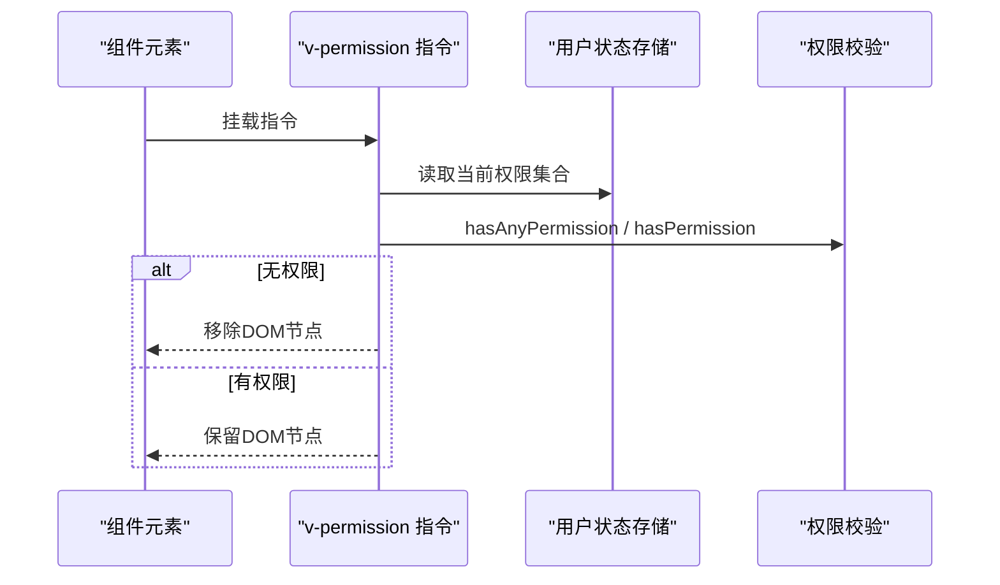
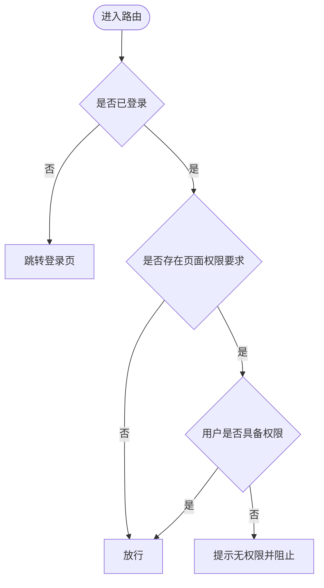
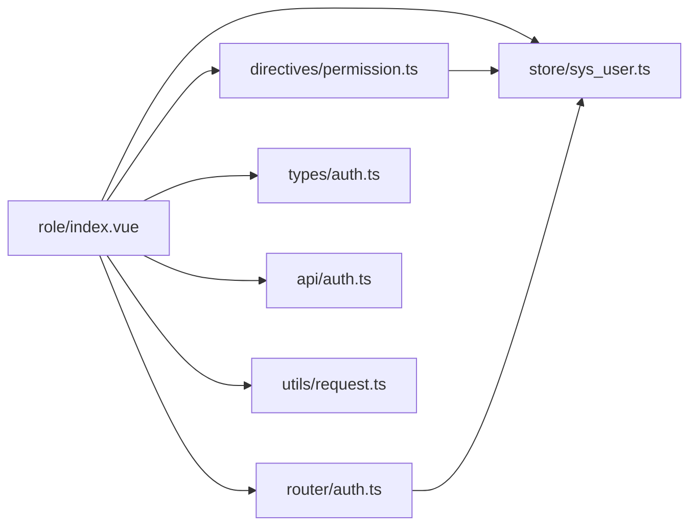

# 角色管理

<cite>
**本文引用的文件**
- [src/views/system/role/index.vue](file://src/views/system/role/index.vue)
- [src/store/sys_user.ts](file://src/store/sys_user.ts)
- [src/directives/permission.ts](file://src/directives/permission.ts)
- [src/directives/auth.ts](file://src/directives/auth.ts)
- [src/tabs/auth.ts](file://src/tabs/auth.ts)
- [src/types/auth.ts](file://src/types/auth.ts)
- [src/api/auth.ts](file://src/api/auth.ts)
- [src/router/auth.ts](file://src/router/auth.ts)
- [src/utils/request.ts](file://src/utils/request.ts)
- [src/main.ts](file://src/main.ts)
- [src/views/system/menu/index.vue](file://src/views/system/menu/index.vue)
- [src/views/system/user/index.vue](file://src/views/system/user/index.vue)
</cite>

## 目录
1. [简介](#简介)
2. [项目结构](#项目结构)
3. [核心组件](#核心组件)
4. [架构总览](#架构总览)
5. [详细组件分析](#详细组件分析)
6. [依赖分析](#依赖分析)
7. [性能考虑](#性能考虑)
8. [故障排查指南](#故障排查指南)
9. [结论](#结论)
10. [附录](#附录)

## 简介
本文件围绕“角色管理”功能进行深入技术文档化，涵盖界面设计与实现、角色数据模型与权限映射机制、角色与用户关联关系、权限继承逻辑、角色 CRUD 流程（创建、编辑、删除）、权限树形结构展示、批量权限分配与角色状态管理等。同时提供可扩展指南，帮助开发者在现有架构上快速实现完整的角色管理能力。

## 项目结构
角色管理位于系统管理模块下，采用按功能分层的组织方式：
- 视图层：角色管理页面、菜单管理页面、用户管理页面
- 状态层：Pinia 用户状态存储
- 权限层：全局指令（权限/角色）与路由守卫
- 类型层：统一的数据类型定义
- 接口层：认证与通用请求封装
- 入口层：应用初始化与全局指令注册

图表来源
- [src/views/system/role/index.vue](file://src/views/system/role/index.vue#L1-L150)
- [src/views/system/menu/index.vue](file://src/views/system/menu/index.vue#L1-L161)
- [src/views/system/user/index.vue](file://src/views/system/user/index.vue#L1-L183)
- [src/store/sys_user.ts](file://src/store/user.ts#L1-L68)
- [src/directives/permission.ts](file://src/directives/permission.ts#L1-L67)
- [src/router/auth.ts](file://src/router/index.ts#L1-L123)
- [src/types/auth.ts](file://src/types/index.ts#L1-L45)
- [src/api/auth.ts](file://src/api/auth.ts#L1-L18)
- [src/utils/request.ts](file://src/utils/request.ts#L1-L102)
- [src/main.ts](file://src/main.ts#L1-L27)

章节来源
- [src/views/system/role/index.vue](file://src/views/system/role/index.vue#L1-L150)
- [src/router/auth.ts](file://src/router/index.ts#L1-L123)
- [src/store/sys_user.ts](file://src/store/user.ts#L1-L68)
- [src/directives/permission.ts](file://src/directives/permission.ts#L1-L67)
- [src/types/auth.ts](file://src/types/index.ts#L1-L45)
- [src/api/auth.ts](file://src/api/auth.ts#L1-L18)
- [src/utils/request.ts](file://src/utils/request.ts#L1-L102)
- [src/main.ts](file://src/main.ts#L1-L27)

## 核心组件
- 角色管理页面：负责角色列表展示、角色状态管理、角色操作按钮（新增、编辑、权限配置、删除）
- 用户状态存储：维护用户信息、权限集合、登录态与权限校验工具
- 权限/角色指令：基于用户权限与角色动态显隐 UI 元素
- 路由守卫：根据路由元信息与用户权限控制页面访问
- 类型定义：统一的用户、菜单、角色等数据模型
- 认证与请求：登录、获取用户信息、HTTP 请求封装与错误处理

章节来源
- [src/views/system/role/index.vue](file://src/views/system/role/index.vue#L65-L139)
- [src/store/sys_user.ts](file://src/store/user.ts#L10-L67)
- [src/directives/permission.ts](file://src/directives/permission.ts#L9-L61)
- [src/router/auth.ts](file://src/router/index.ts#L94-L120)
- [src/types/auth.ts](file://src/types/index.ts#L2-L44)
- [src/api/auth.ts](file://src/api/auth.ts#L4-L17)
- [src/utils/request.ts](file://src/utils/request.ts#L1-L102)

## 架构总览
角色管理功能遵循“视图-状态-权限-路由”的分层架构，通过 Pinia 维护用户权限，通过全局指令与路由守卫实现前端权限控制，通过类型定义保证数据一致性，通过请求封装统一处理鉴权与错误。

图表来源
- [src/views/system/role/index.vue](file://src/views/system/role/index.vue#L7-L57)
- [src/store/sys_user.ts](file://src/store/user.ts#L52-L65)
- [src/directives/permission.ts](file://src/directives/permission.ts#L9-L31)
- [src/router/auth.ts](file://src/router/index.ts#L94-L120)

## 详细组件分析

### 角色管理页面（视图层）
- 数据模型：角色对象包含 id、角色名、角色标识、描述、状态、创建时间等字段
- 展示逻辑：使用表格展示角色列表，状态以标签形式显示启用/禁用
- 操作按钮：通过 v-permission 指令绑定权限点，仅当用户具备相应权限时显示
- 交互行为：新增、编辑、权限配置、删除均以消息提示占位，实际业务需对接后端接口

图表来源
- [src/views/system/role/index.vue](file://src/views/system/role/index.vue#L13-L60)
- [src/views/system/role/index.vue](file://src/views/system/role/index.vue#L113-L134)

章节来源
- [src/views/system/role/index.vue](file://src/views/system/role/index.vue#L69-L139)

### 用户状态存储（状态层）
- 状态字段：token、userInfo、permissions
- 访问器：isLogin、getPermissions
- 动作方法：setToken、setUserInfo、login、logout、hasPermission、hasAnyPermission、hasAllPermissions
- 与角色管理的关系：角色页面通过指令与路由守卫读取用户权限，从而决定 UI 显示与页面访问

图表来源
- [src/store/sys_user.ts](file://src/store/user.ts#L4-L67)
- [src/types/auth.ts](file://src/types/index.ts#L2-L11)

章节来源
- [src/store/sys_user.ts](file://src/store/user.ts#L10-L67)
- [src/types/auth.ts](file://src/types/index.ts#L2-L11)

### 权限/角色指令（权限层）
- 权限指令：支持字符串与数组两种形式，数组形式表示“任一权限满足即可”，支持通配符“*:*:*”
- 角色指令：基于用户的角色数组判断是否显示元素
- 注册方式：在应用入口通过 setupDirectives 注册为全局指令

图表来源
- [src/directives/permission.ts](file://src/directives/permission.ts#L9-L31)
- [src/store/sys_user.ts](file://src/store/user.ts#L52-L65)
- [src/directives/auth.ts](file://src/directives/index.ts#L7-L13)
- [src/main.ts](file://src/main.ts#L23-L24)

章节来源
- [src/directives/permission.ts](file://src/directives/permission.ts#L9-L61)
- [src/directives/auth.ts](file://src/directives/index.ts#L1-L16)
- [src/main.ts](file://src/main.ts#L23-L24)

### 路由守卫（权限层）
- 在路由进入前校验登录态与页面权限
- 通过路由元信息中的 permission 字段与用户权限进行匹配
- 无权限时提示并阻止进入

图表来源
- [src/router/auth.ts](file://src/router/index.ts#L94-L120)

章节来源
- [src/router/auth.ts](file://src/router/index.ts#L94-L120)

### 类型定义（类型层）
- 用户信息：包含 id、username、nickname、roles、permissions 等
- 登录表单与响应：LoginForm、LoginResponse
- API 响应：通用响应结构
- 菜单项：用于菜单管理页面的数据模型

章节来源
- [src/types/auth.ts](file://src/types/index.ts#L2-L44)

### 认证与请求（接口层）
- 认证接口：login、getUserInfo、logout
- 请求封装：统一设置 Authorization 头、处理 401/403/404/500 等错误场景
- 与角色管理的关系：用户登录成功后，userInfo 中携带权限集合，供角色页面与指令使用

章节来源
- [src/api/auth.ts](file://src/api/auth.ts#L4-L17)
- [src/utils/request.ts](file://src/utils/request.ts#L14-L78)

### 菜单管理与用户管理（辅助参考）
- 菜单管理页面展示了树形结构菜单的展示方式，可作为权限树形结构展示的参考
- 用户管理页面展示了分页与搜索的实现方式，可作为角色列表扩展的参考

章节来源
- [src/views/system/menu/index.vue](file://src/views/system/menu/index.vue#L13-L50)
- [src/views/system/user/index.vue](file://src/views/system/user/index.vue#L13-L72)

## 依赖分析
- 角色管理页面依赖用户状态存储、权限指令、路由守卫、类型定义、认证接口与请求封装
- 权限指令依赖用户状态存储；路由守卫依赖用户状态存储与 Element Plus 提示
- 应用入口负责注册全局指令，确保指令在整个应用范围内可用

图表来源
- [src/views/system/role/index.vue](file://src/views/system/role/index.vue#L65-L139)
- [src/store/sys_user.ts](file://src/store/user.ts#L10-L67)
- [src/directives/permission.ts](file://src/directives/permission.ts#L1-L67)
- [src/router/auth.ts](file://src/router/index.ts#L1-L123)
- [src/types/auth.ts](file://src/types/index.ts#L1-L45)
- [src/api/auth.ts](file://src/api/auth.ts#L1-L18)
- [src/utils/request.ts](file://src/utils/request.ts#L1-L102)

章节来源
- [src/views/system/role/index.vue](file://src/views/system/role/index.vue#L65-L139)
- [src/store/sys_user.ts](file://src/store/user.ts#L10-L67)
- [src/directives/permission.ts](file://src/directives/permission.ts#L1-L67)
- [src/router/auth.ts](file://src/router/index.ts#L1-L123)
- [src/types/auth.ts](file://src/types/index.ts#L1-L45)
- [src/api/auth.ts](file://src/api/auth.ts#L1-L18)
- [src/utils/request.ts](file://src/utils/request.ts#L1-L102)

## 性能考虑
- 权限指令在挂载阶段一次性校验权限，避免重复计算
- 路由守卫仅在路由切换时执行，建议在用户信息变更时及时更新状态
- 表格渲染使用虚拟滚动与懒加载（如后续引入），减少大数据量下的渲染压力
- 请求拦截器统一处理错误，避免重复的错误处理逻辑

## 故障排查指南
- 页面无法访问：检查路由守卫是否正确读取用户权限与页面权限要求
- 操作按钮不显示：确认 v-permission 的权限值是否与用户权限一致，注意通配符“*:*:*”的使用
- 登录后权限无效：确认登录成功后是否调用了 setUserInfo 并更新了 permissions
- 请求 401：检查请求拦截器是否正确设置 Authorization 头，以及服务端 token 验证逻辑

章节来源
- [src/router/auth.ts](file://src/router/index.ts#L94-L120)
- [src/directives/permission.ts](file://src/directives/permission.ts#L9-L31)
- [src/store/sys_user.ts](file://src/store/user.ts#L32-L36)
- [src/utils/request.ts](file://src/utils/request.ts#L14-L28)

## 结论
角色管理功能在当前代码库中已完成基础视图与权限控制框架搭建，具备角色列表展示、状态管理与操作按钮的权限控制能力。后续可在现有基础上扩展角色 CRUD、权限树形结构展示、批量权限分配与角色状态管理等高级功能，保持与现有类型定义、状态存储与指令体系的一致性。

## 附录

### 角色数据模型与权限映射机制
- 角色对象字段：id、角色名、角色标识、描述、状态、创建时间
- 权限映射：用户权限集合来自登录后的 userInfo.permissions，指令与路由守卫据此进行权限判断
- 关联关系：用户具备多个角色，每个角色可映射到一组权限；角色状态影响用户可见性与操作能力

章节来源
- [src/views/system/role/index.vue](file://src/views/system/role/index.vue#L69-L76)
- [src/types/auth.ts](file://src/types/index.ts#L2-L11)
- [src/store/sys_user.ts](file://src/store/user.ts#L32-L36)

### 角色与用户关联关系与权限继承逻辑
- 用户与角色：用户具备多个角色，角色具备多个权限
- 权限继承：当前实现为直接权限集合匹配，未体现角色到权限的层级继承；可通过在后端或前端构建角色-权限映射表实现
- 角色状态：角色启用/禁用影响用户对该角色的操作与可见性

章节来源
- [src/types/auth.ts](file://src/types/index.ts#L2-L11)
- [src/store/sys_user.ts](file://src/store/user.ts#L52-L65)

### 角色 CRUD 完整流程实现（扩展指南）
- 创建角色
  - 视图：新增按钮触发弹窗输入角色名、角色标识、描述、状态
  - 状态：提交后调用后端接口，成功后刷新列表
  - 权限：使用 v-permission 控制新增按钮显示
- 编辑角色
  - 视图：点击编辑打开表单，回填当前角色信息
  - 状态：提交后调用更新接口，成功后刷新列表
  - 权限：使用 v-permission 控制编辑按钮显示
- 删除角色
  - 视图：点击删除弹出确认框，确认后调用删除接口
  - 状态：成功后刷新列表
  - 权限：使用 v-permission 控制删除按钮显示

章节来源
- [src/views/system/role/index.vue](file://src/views/system/role/index.vue#L113-L134)
- [src/directives/permission.ts](file://src/directives/permission.ts#L9-L31)

### 权限树形结构展示、批量权限分配与角色状态管理（扩展指南）
- 权限树形结构展示
  - 参考菜单管理页面的树形表格展示方式，结合角色权限映射构建树形结构
  - 使用 Element Plus 的 Tree 组件或自定义树形控件
- 批量权限分配
  - 提供全选/反选、展开/折叠、父子联动选择等交互
  - 提交时将选中的权限集合发送至后端进行角色权限更新
- 角色状态管理
  - 在角色列表中提供启用/禁用开关，提交后调用状态更新接口
  - 状态变更后刷新列表并同步用户权限

章节来源
- [src/views/system/menu/index.vue](file://src/views/system/menu/index.vue#L13-L50)
- [src/views/system/role/index.vue](file://src/views/system/role/index.vue#L18-L24)

### 实际代码示例与扩展路径
- 角色列表加载与渲染：参考角色管理页面的模拟数据加载与表格渲染
- 权限指令使用：参考角色管理页面中 v-permission 的使用方式
- 路由权限控制：参考路由守卫中对页面权限的校验逻辑
- 请求封装与错误处理：参考请求封装模块的拦截器与错误处理

章节来源
- [src/views/system/role/index.vue](file://src/views/system/role/index.vue#L80-L111)
- [src/directives/permission.ts](file://src/directives/permission.ts#L9-L31)
- [src/router/auth.ts](file://src/router/index.ts#L94-L120)
- [src/utils/request.ts](file://src/utils/request.ts#L14-L78)