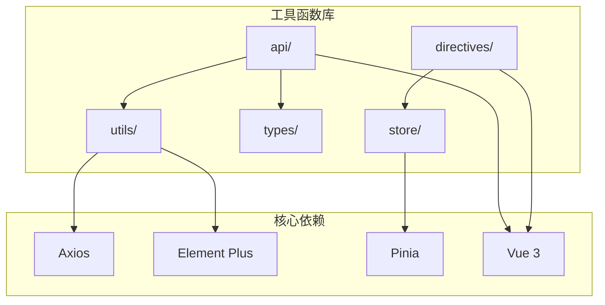
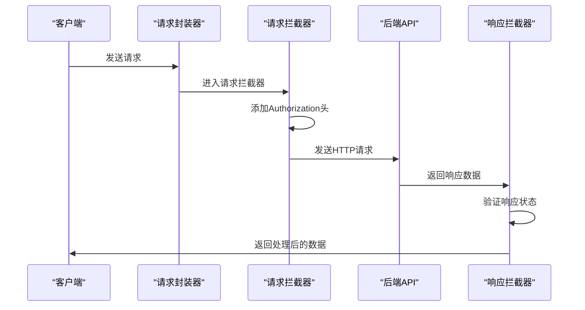
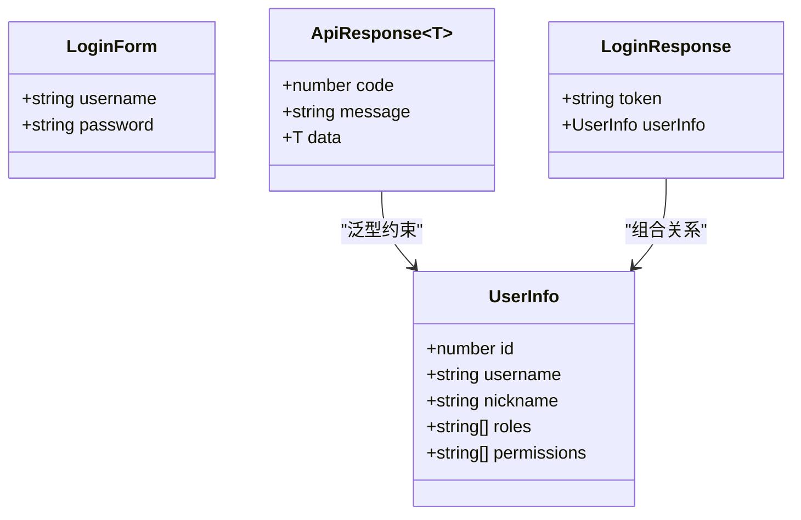
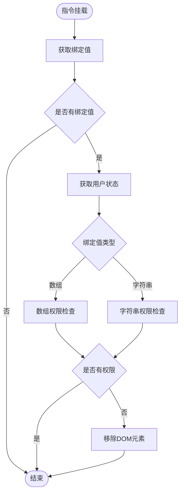
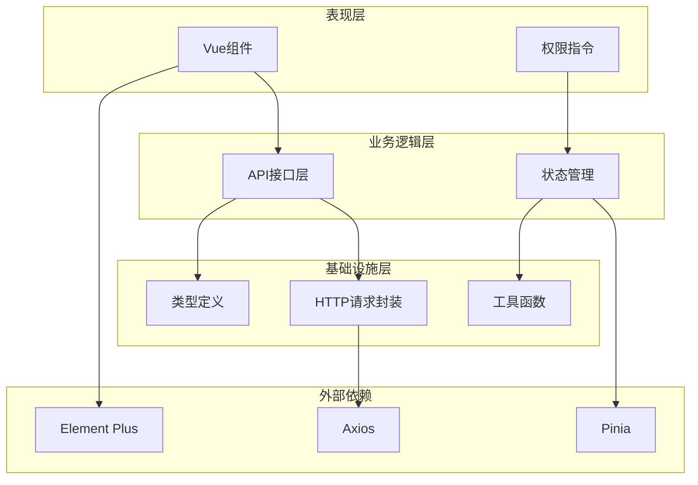
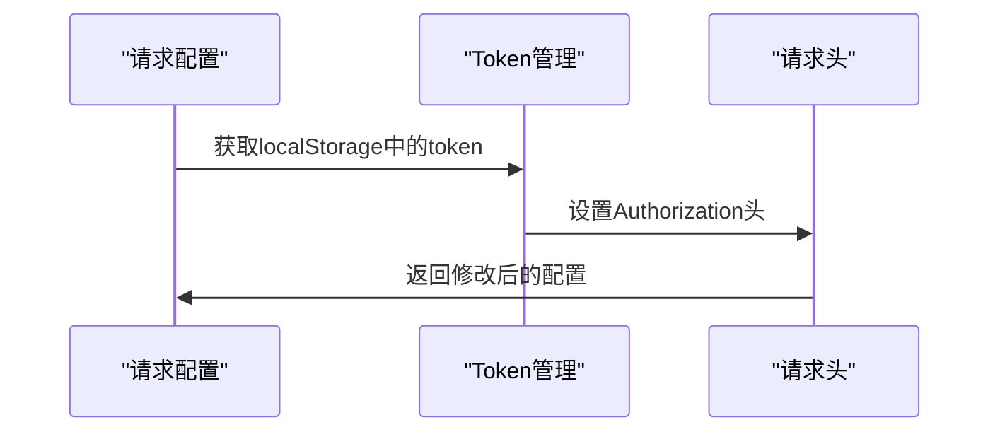
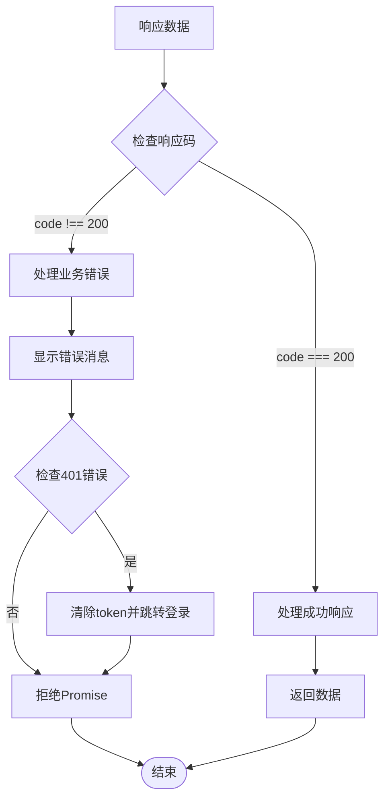
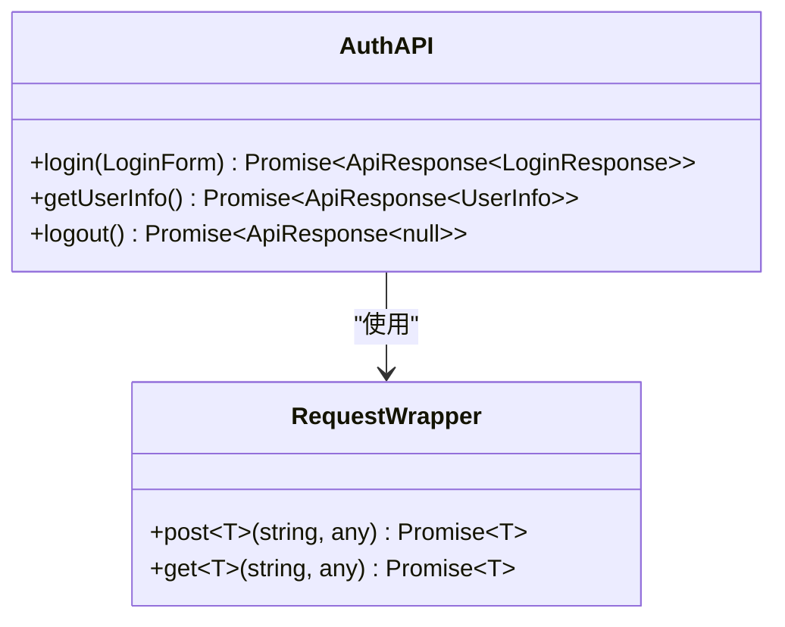
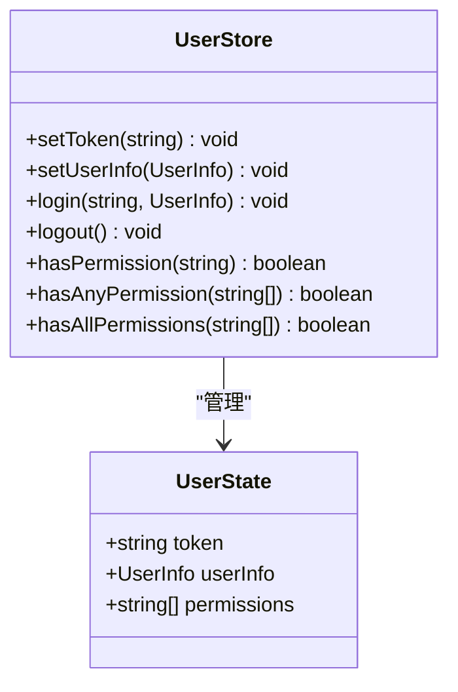

# 工具函数库

<cite>
**本文档引用的文件**
- [src/utils/request.ts](file://src/utils/request.ts)
- [src/types/index.ts](file://src/types/index.ts)
- [src/api/auth.ts](file://src/api/auth.ts)
- [src/store/user.ts](file://src/store/user.ts)
- [src/directives/index.ts](file://src/directives/index.ts)
- [src/directives/permission.ts](file://src/directives/permission.ts)
- [src/main.ts](file://src/main.ts)
- [package.json](file://package.json)
- [eslint.config.js](file://eslint.config.js)
- [tsconfig.app.json](file://tsconfig.app.json)
- [tsconfig.node.json](file://tsconfig.node.json)
</cite>

## 目录
1. [简介](#简介)
2. [项目结构](#项目结构)
3. [核心组件](#核心组件)
4. [架构概览](#架构概览)
5. [详细组件分析](#详细组件分析)
6. [依赖关系分析](#依赖关系分析)
7. [性能考虑](#性能考虑)
8. [故障排除指南](#故障排除指南)
9. [结论](#结论)
10. [附录](#附录)

## 简介

本项目是一个基于Vue 3 + TypeScript + Vite构建的企业级管理后台系统，工具函数库是整个应用的核心基础设施之一。该库提供了HTTP请求封装、类型定义、权限控制等关键功能，为开发者提供了统一的开发体验和强大的类型安全保障。

工具函数库采用模块化设计，主要包含以下核心功能：
- **HTTP请求封装**：基于axios的完整请求处理链路
- **类型系统**：完善的TypeScript类型定义
- **权限控制**：基于Vue指令的权限验证机制
- **状态管理**：Pinia状态管理集成

## 项目结构

项目采用清晰的分层架构，工具函数库位于`src/utils/`目录下，配合类型定义、API接口和权限控制模块共同构成完整的工具体系。



**图表来源**
- [src/utils/request.ts](file://src/utils/request.ts#L1-L102)
- [src/types/index.ts](file://src/types/index.ts#L1-L45)
- [src/api/auth.ts](file://src/api/auth.ts#L1-L18)

**章节来源**
- [src/utils/request.ts](file://src/utils/request.ts#L1-L102)
- [src/types/index.ts](file://src/types/index.ts#L1-L45)
- [src/api/auth.ts](file://src/api/auth.ts#L1-L18)

## 核心组件

### HTTP请求封装器

HTTP请求封装器是工具函数库的核心组件，基于axios提供了完整的请求处理链路，包括请求拦截器、响应拦截器和错误处理机制。

#### 主要特性
- **统一的请求配置**：基础URL、超时时间、请求头设置
- **自动认证**：基于localStorage的token自动注入
- **智能错误处理**：针对不同HTTP状态码的差异化处理
- **泛型支持**：完整的TypeScript类型推导
- **RESTful API**：支持GET、POST、PUT、DELETE四种HTTP方法

#### 关键实现模式



**图表来源**
- [src/utils/request.ts](file://src/utils/request.ts#L14-L78)

**章节来源**
- [src/utils/request.ts](file://src/utils/request.ts#L1-L102)

### 类型定义系统

项目建立了完整的TypeScript类型定义体系，确保了代码的类型安全性和开发体验。

#### 核心类型定义

| 类型名称 | 描述 | 主要字段 |
|---------|------|----------|
| UserInfo | 用户信息类型 | id, username, nickname, roles, permissions |
| LoginForm | 登录表单类型 | username, password |
| LoginResponse | 登录响应类型 | token, userInfo |
| ApiResponse<T> | API通用响应类型 | code, message, data |
| MenuItem | 菜单项类型 | id, path, name, children |

#### 泛型设计模式

类型系统采用了泛型设计，实现了高度的可复用性和类型安全性：



**图表来源**
- [src/types/index.ts](file://src/types/index.ts#L1-L45)

**章节来源**
- [src/types/index.ts](file://src/types/index.ts#L1-L45)

### 权限控制系统

权限控制系统通过Vue指令实现了细粒度的UI权限控制，支持基于权限字符串和角色的双重验证机制。

#### 指令类型

| 指令名称 | 功能描述 | 使用方式 |
|---------|----------|----------|
| v-permission | 权限验证指令 | `v-permission="'system:user:add'"` |
| v-role | 角色验证指令 | `v-role="'admin'"` |

#### 权限验证流程



**图表来源**
- [src/directives/permission.ts](file://src/directives/permission.ts#L9-L31)

**章节来源**
- [src/directives/permission.ts](file://src/directives/permission.ts#L1-L67)

## 架构概览

工具函数库采用分层架构设计，各组件之间职责明确，耦合度低，便于维护和扩展。



**图表来源**
- [src/main.ts](file://src/main.ts#L1-L27)
- [src/utils/request.ts](file://src/utils/request.ts#L1-L102)
- [src/types/index.ts](file://src/types/index.ts#L1-L45)

## 详细组件分析

### HTTP请求封装器详细分析

#### 配置初始化

请求封装器在初始化时设置了统一的基础配置：

| 配置项 | 值 | 说明 |
|-------|----|-----|
| baseURL | `/api` | API基础路径前缀 |
| timeout | 15000ms | 请求超时时间 |
| Content-Type | application/json;charset=utf-8 | 默认请求头 |

#### 请求拦截器实现

请求拦截器负责在请求发送前进行必要的预处理：



**图表来源**
- [src/utils/request.ts](file://src/utils/request.ts#L14-L28)

#### 响应拦截器实现

响应拦截器提供了完整的响应处理逻辑：



**图表来源**
- [src/utils/request.ts](file://src/utils/request.ts#L30-L78)

**章节来源**
- [src/utils/request.ts](file://src/utils/request.ts#L1-L102)

### API接口层分析

API接口层基于HTTP请求封装器提供了具体的业务接口实现。

#### 接口设计原则

1. **类型安全**：每个接口都使用泛型约束确保返回数据的类型正确性
2. **统一格式**：所有接口都遵循相同的响应格式约定
3. **错误处理**：接口层不处理业务错误，由调用方决定如何处理

#### 典型接口实现



**图表来源**
- [src/api/auth.ts](file://src/api/auth.ts#L1-L18)

**章节来源**
- [src/api/auth.ts](file://src/api/auth.ts#L1-L18)

### 状态管理系统分析

状态管理系统基于Pinia实现了用户状态的集中管理。

#### 状态结构设计



**图表来源**
- [src/store/user.ts](file://src/store/user.ts#L4-L67)

**章节来源**
- [src/store/user.ts](file://src/store/user.ts#L1-L68)

## 依赖关系分析

工具函数库的依赖关系清晰明确，各模块之间的耦合度低，便于独立维护和测试。

```mermaid
graph LR
subgraph "核心依赖"
Axios[axios@^1.13.4]
ElementPlus[element-plus@^2.13.2]
Pinia[pinia@^3.0.4]
Vue[vue@^3.5.24]
end
subgraph "工具函数库"
Request[request.ts]
Types[index.ts]
AuthAPI[auth.ts]
Permission[permission.ts]
UserStore[user.ts]
end
Request --> Axios
Request --> ElementPlus
AuthAPI --> Request
AuthAPI --> Types
Permission --> UserStore
UserStore --> Pinia
Permission --> Vue
AuthAPI --> Vue
```

**图表来源**
- [package.json](file://package.json#L12-L20)
- [src/utils/request.ts](file://src/utils/request.ts#L1-L2)
- [src/api/auth.ts](file://src/api/auth.ts#L1-L2)

**章节来源**
- [package.json](file://package.json#L1-L38)

## 性能考虑

### HTTP请求优化

1. **请求缓存策略**：对于频繁访问的只读数据，建议在业务层实现缓存机制
2. **批量请求**：对于多个相关的API请求，可以考虑合并为批量请求以减少网络开销
3. **请求去重**：对相同参数的请求进行去重处理，避免重复网络请求

### 内存管理

1. **事件监听器清理**：确保在组件卸载时清理相关的事件监听器
2. **定时器清理**：及时清理定时器和轮询任务
3. **存储清理**：在用户登出时清理localStorage中的敏感信息

### 类型系统优化

1. **类型声明复用**：通过接口继承和泛型约束减少重复的类型声明
2. **条件类型**：利用条件类型实现更精确的类型推导
3. **工具类型**：合理使用内置的工具类型提升开发效率

## 故障排除指南

### 常见问题及解决方案

#### 1. 认证失败问题

**问题现象**：用户登录后仍然提示未登录或token过期

**排查步骤**：
1. 检查localStorage中是否存在token
2. 验证token是否在有效期内
3. 确认请求头中Authorization字段是否正确设置

**解决方案**：
```typescript
// 在请求拦截器中添加调试信息
console.log('当前token:', localStorage.getItem('token'))
console.log('请求头:', config.headers)
```

#### 2. API响应格式不一致

**问题现象**：部分API接口返回的数据格式与预期不符

**排查步骤**：
1. 检查API接口的响应格式是否符合`ApiResponse<T>`约定
2. 验证后端服务是否正确设置HTTP状态码
3. 确认错误信息的message字段是否正确设置

**解决方案**：
```typescript
// 在响应拦截器中添加格式验证
if (!res.hasOwnProperty('code') || !res.hasOwnProperty('message') || !res.hasOwnProperty('data')) {
    throw new Error('API响应格式不正确')
}
```

#### 3. 权限控制失效

**问题现象**：权限指令无法正确控制元素的显示

**排查步骤**：
1. 检查用户状态中permissions数组是否正确设置
2. 验证权限字符串的格式是否正确
3. 确认指令的绑定值格式是否符合要求

**解决方案**：
```typescript
// 在权限指令中添加调试信息
console.log('用户权限:', userStore.permissions)
console.log('绑定值:', binding.value)
console.log('权限检查结果:', hasPermission)
```

**章节来源**
- [src/utils/request.ts](file://src/utils/request.ts#L24-L27)
- [src/utils/request.ts](file://src/utils/request.ts#L50-L77)
- [src/directives/permission.ts](file://src/directives/permission.ts#L10-L31)

## 结论

本工具函数库通过精心设计的架构和完善的类型系统，为Vue 3 + TypeScript项目提供了强大而灵活的基础设施支持。其主要优势包括：

1. **类型安全**：完整的TypeScript类型定义确保了代码的类型安全性和开发体验
2. **易于扩展**：模块化的架构设计使得新功能的添加变得简单直观
3. **错误处理**：完善的错误处理机制提高了应用的健壮性
4. **性能优化**：合理的架构设计和优化策略确保了良好的运行性能

通过遵循本文档提供的最佳实践和扩展方法，开发者可以快速地在现有基础上添加新的工具函数和功能模块，同时保持代码质量和系统稳定性。

## 附录

### 最佳实践指南

#### 添加新的工具函数

1. **选择合适的模块位置**：根据功能性质选择合适的模块目录
2. **编写类型定义**：优先考虑TypeScript类型定义的完整性
3. **实现错误处理**：确保函数具有适当的错误处理机制
4. **添加单元测试**：为新函数编写相应的测试用例
5. **更新文档**：及时更新相关文档和使用示例

#### 维护现有工具库

1. **定期代码审查**：通过代码审查发现潜在问题
2. **性能监控**：建立性能监控机制，及时发现性能瓶颈
3. **依赖更新**：定期更新第三方依赖，修复安全漏洞
4. **兼容性测试**：确保新版本的向后兼容性

#### 扩展类型系统

1. **接口继承**：通过接口继承实现类型的复用
2. **泛型约束**：合理使用泛型约束提升类型安全性
3. **条件类型**：利用条件类型实现更精确的类型推导
4. **工具类型**：善用内置工具类型简化复杂类型定义

### 集成方案

#### 项目集成步骤

1. **安装依赖**：确保所有必需的依赖包已正确安装
2. **配置环境**：根据项目需求调整工具函数的配置
3. **导入使用**：在需要的地方正确导入和使用工具函数
4. **测试验证**：进行全面的功能测试和集成测试

#### 自定义配置

```typescript
// 示例：自定义HTTP请求配置
const customConfig = {
    baseURL: process.env.VUE_APP_API_BASE_URL,
    timeout: parseInt(process.env.VUE_APP_REQUEST_TIMEOUT),
    headers: {
        'Content-Type': 'application/json',
        'Accept': 'application/json'
    }
}

// 创建自定义的请求实例
const customService = axios.create(customConfig)
```

通过以上方案，开发者可以根据具体项目需求灵活地使用和扩展工具函数库，构建更加稳定和高效的Vue 3应用。