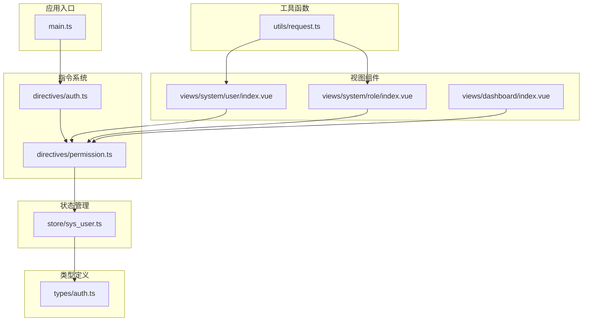
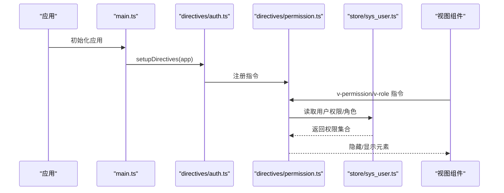
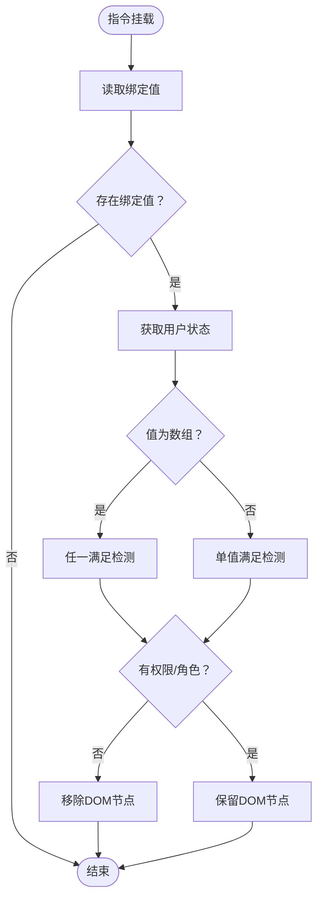
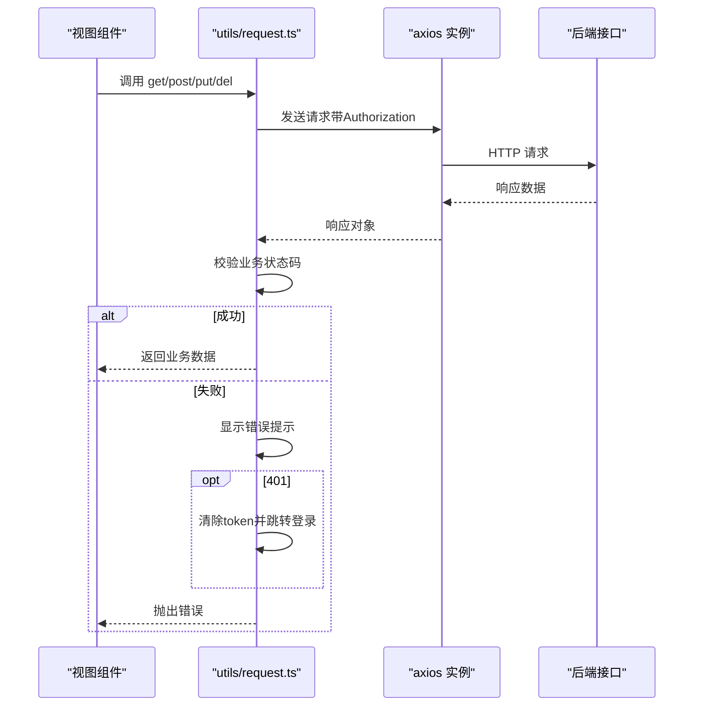
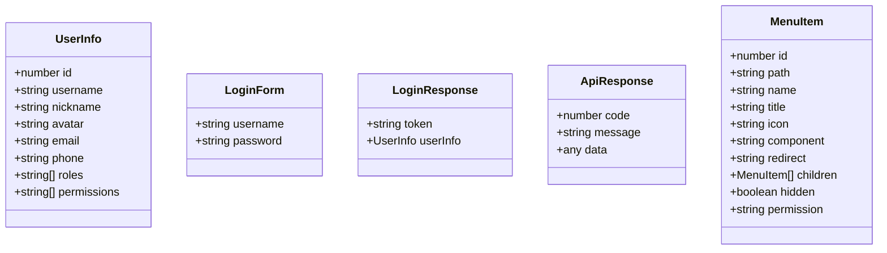
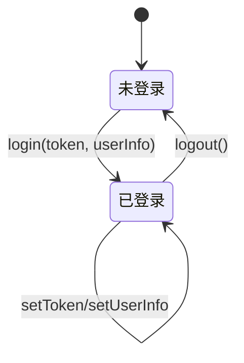
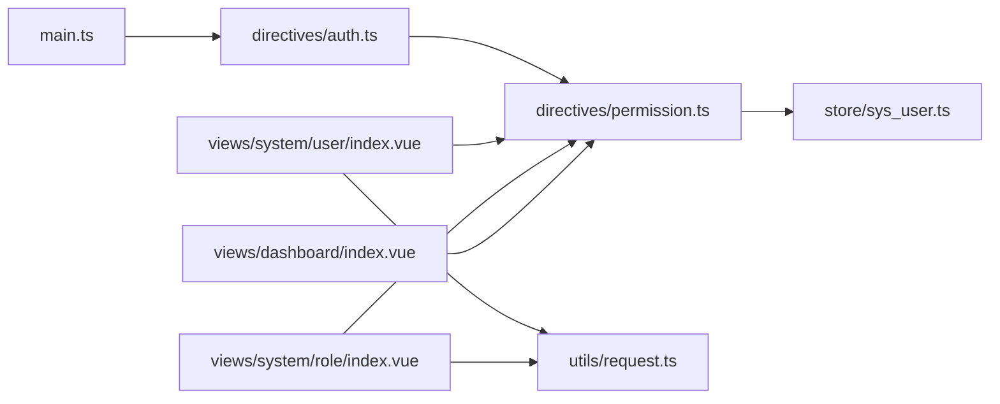

# 组件与工具库

<cite>
**本文档引用的文件**
- [src/main.ts](file://src/main.ts)
- [src/directives/auth.ts](file://src/directives/auth.ts)
- [src/directives/permission.ts](file://src/directives/permission.ts)
- [src/store/sys_user.ts](file://src/store/sys_user.ts)
- [src/types/auth.ts](file://src/types/auth.ts)
- [src/utils/request.ts](file://src/utils/request.ts)
- [src/components/HelloWorld.vue](file://src/components/HelloWorld.vue)
- [src/views/system/user/index.vue](file://src/views/system/user/index.vue)
- [src/views/system/role/index.vue](file://src/views/system/role/index.vue)
- [src/views/dashboard/index.vue](file://src/views/dashboard/index.vue)
- [src/auto-imports.d.ts](file://src/auto-imports.d.ts)
- [src/components.d.ts](file://src/components.d.ts)
- [README.md](file://README.md)
</cite>

## 目录
1. [简介](#简介)
2. [项目结构](#项目结构)
3. [核心组件](#核心组件)
4. [架构总览](#架构总览)
5. [详细组件分析](#详细组件分析)
6. [依赖关系分析](#依赖关系分析)
7. [性能考虑](#性能考虑)
8. [故障排除指南](#故障排除指南)
9. [结论](#结论)
10. [附录](#附录)

## 简介
本项目是一个基于 Vue 3 + TypeScript + Vite 的后台管理系统，重点提供了可复用的组件与工具库。文档围绕以下目标展开：
- 通用组件设计原则、API 接口与使用方法
- 自定义指令（特别是权限控制指令）的实现原理与应用场景
- 工具函数的详细说明与使用示例
- TypeScript 类型定义的说明与扩展方法
- 组件复用的最佳实践与性能优化建议

## 项目结构
项目采用按功能分层的组织方式，核心目录包括：
- src/api：API 层（当前仅包含认证相关）
- src/components：通用组件（当前包含基础示例组件）
- src/directives：自定义指令（权限与角色控制）
- src/layout：布局组件
- src/router：路由配置
- src/store：状态管理（Pinia）
- src/types：TypeScript 类型定义
- src/utils：工具函数（HTTP 请求封装）
- src/views：页面视图（系统管理、仪表盘等）

图表来源
- [src/main.ts](file://src/main.ts#L1-L27)
- [src/directives/auth.ts](file://src/directives/index.ts#L1-L16)
- [src/directives/permission.ts](file://src/directives/permission.ts#L1-L67)
- [src/store/sys_user.ts](file://src/store/user.ts#L1-L68)
- [src/types/auth.ts](file://src/types/index.ts#L1-L45)
- [src/utils/request.ts](file://src/utils/request.ts#L1-L102)
- [src/views/system/user/index.vue](file://src/views/system/user/index.vue#L1-L183)
- [src/views/system/role/index.vue](file://src/views/system/role/index.vue#L1-L150)
- [src/views/dashboard/index.vue](file://src/views/dashboard/index.vue#L1-L157)

章节来源
- [src/main.ts](file://src/main.ts#L1-L27)
- [README.md](file://README.md#L1-L6)

## 核心组件
本项目的核心资产包括：
- 自定义指令：权限指令与角色指令，用于在模板层面进行细粒度的 UI 控制
- 工具函数：基于 axios 的 HTTP 请求封装，统一处理鉴权、错误与响应格式
- 类型定义：用户信息、菜单项、登录表单、API 响应等核心类型
- 状态管理：用户登录态、权限集合的集中管理

章节来源
- [src/directives/permission.ts](file://src/directives/permission.ts#L1-L67)
- [src/utils/request.ts](file://src/utils/request.ts#L1-L102)
- [src/types/auth.ts](file://src/types/index.ts#L1-L45)
- [src/store/sys_user.ts](file://src/store/user.ts#L1-L68)

## 架构总览
应用启动时通过入口文件注册全局指令、Element Plus、路由与 Pinia；权限指令在挂载阶段读取用户权限并动态隐藏无权限的 DOM 元素；工具函数负责统一的 HTTP 请求与错误处理。

图表来源
- [src/main.ts](file://src/main.ts#L1-L27)
- [src/directives/auth.ts](file://src/directives/index.ts#L1-L16)
- [src/directives/permission.ts](file://src/directives/permission.ts#L1-L67)
- [src/store/sys_user.ts](file://src/store/user.ts#L1-L68)

## 详细组件分析

### 自定义指令：权限与角色控制
- 设计原则
  - 在模板层面进行 UI 控制，避免在逻辑层重复判断
  - 支持字符串与数组两种绑定值，数组模式支持“任一满足”策略
  - 与 Pinia 状态管理解耦，通过组合式函数读取用户信息
- API 接口
  - 权限指令：v-permission
    - 单个权限：v-permission="'system:user:add'"
    - 多个权限：v-permission="['system:user:add', 'system:user:edit']"
    - 特殊通配符：'*:*:*' 表示超级权限
  - 角色指令：v-role
    - 单个角色：v-role="'admin'"
    - 多个角色：v-role="['admin', 'user']"
- 实现要点
  - 指令在 mounted 生命周期执行，读取绑定值与用户信息
  - 当无权限或无角色时，直接移除对应 DOM 节点，避免渲染无效 UI
  - 与用户状态管理配合，确保权限变更后即时生效

图表来源
- [src/directives/permission.ts](file://src/directives/permission.ts#L1-L67)
- [src/store/sys_user.ts](file://src/store/user.ts#L1-L68)

章节来源
- [src/directives/auth.ts](file://src/directives/index.ts#L1-L16)
- [src/directives/permission.ts](file://src/directives/permission.ts#L1-L67)
- [src/store/sys_user.ts](file://src/store/user.ts#L1-L68)

### 工具函数：HTTP 请求封装
- 设计原则
  - 统一的 baseURL、超时与请求头配置
  - 自动注入 Authorization 头部（基于本地存储的 token）
  - 统一响应处理：业务状态码校验、错误提示、自动登出
- API 接口
  - request(config)：通用请求方法
  - get(url, params)、post(url, data)、put(url, data)、del(url)：常用方法封装
- 错误处理
  - 401：自动清除 token 并跳转登录页
  - 403/404/500：根据状态码给出相应提示
  - 网络异常：统一提示网络错误

图表来源
- [src/utils/request.ts](file://src/utils/request.ts#L1-L102)

章节来源
- [src/utils/request.ts](file://src/utils/request.ts#L1-L102)

### 类型定义：核心数据模型
- 用户信息类型：包含用户标识、用户名、昵称、头像、邮箱、电话、角色数组、权限数组
- 登录表单类型：用户名、密码
- 登录响应类型：token、userInfo
- API 响应类型：code、message、data
- 菜单项类型：包含路径、标题、图标、子项、权限标识等

图表来源
- [src/types/auth.ts](file://src/types/index.ts#L1-L45)

章节来源
- [src/types/auth.ts](file://src/types/index.ts#L1-L45)

### 状态管理：用户与权限
- 状态结构
  - token：登录标识
  - userInfo：用户信息（含角色与权限）
  - permissions：权限集合
- 关键方法
  - setToken、setUserInfo、login、logout
  - hasPermission、hasAnyPermission、hasAllPermissions
- 设计原则
  - 与本地存储结合，保证刷新后状态不丢失
  - 提供多种权限检查策略，便于指令与业务逻辑使用

图表来源
- [src/store/sys_user.ts](file://src/store/user.ts#L1-L68)

章节来源
- [src/store/sys_user.ts](file://src/store/user.ts#L1-L68)

### 通用组件：HelloWorld 示例
- 设计原则
  - 使用 Composition API 与 TypeScript
  - props 传入、响应式状态、模板交互
- 使用方法
  - 在其他组件中通过标签引入，传递 msg 属性
- 扩展建议
  - 可增加更多 props 与事件，适配不同场景
  - 结合样式模块化，提升复用性

章节来源
- [src/components/HelloWorld.vue](file://src/components/HelloWorld.vue#L1-L42)

### 视图组件：系统管理与仪表盘
- 用户管理页面
  - 使用 v-permission 指令控制按钮与操作列的显示
  - 演示了权限指令在复杂表格中的应用
- 角色管理页面
  - 同样使用 v-permission 指令控制新增、编辑、权限配置、删除等操作
- 仪表盘页面
  - 展示统计卡片、快捷操作与系统信息，作为通用布局组件的示例

章节来源
- [src/views/system/user/index.vue](file://src/views/system/user/index.vue#L1-L183)
- [src/views/system/role/index.vue](file://src/views/system/role/index.vue#L1-L150)
- [src/views/dashboard/index.vue](file://src/views/dashboard/index.vue#L1-L157)

## 依赖关系分析
- 应用入口依赖指令注册与状态管理
- 指令依赖状态管理以获取用户信息
- 视图组件依赖指令进行 UI 控制
- 工具函数被视图组件调用以进行数据交互

图表来源
- [src/main.ts](file://src/main.ts#L1-L27)
- [src/directives/auth.ts](file://src/directives/index.ts#L1-L16)
- [src/directives/permission.ts](file://src/directives/permission.ts#L1-L67)
- [src/store/sys_user.ts](file://src/store/user.ts#L1-L68)
- [src/utils/request.ts](file://src/utils/request.ts#L1-L102)
- [src/views/system/user/index.vue](file://src/views/system/user/index.vue#L1-L183)
- [src/views/system/role/index.vue](file://src/views/system/role/index.vue#L1-L150)
- [src/views/dashboard/index.vue](file://src/views/dashboard/index.vue#L1-L157)

章节来源
- [src/main.ts](file://src/main.ts#L1-L27)
- [src/directives/auth.ts](file://src/directives/index.ts#L1-L16)
- [src/directives/permission.ts](file://src/directives/permission.ts#L1-L67)
- [src/store/sys_user.ts](file://src/store/user.ts#L1-L68)
- [src/utils/request.ts](file://src/utils/request.ts#L1-L102)
- [src/views/system/user/index.vue](file://src/views/system/user/index.vue#L1-L183)
- [src/views/system/role/index.vue](file://src/views/system/role/index.vue#L1-L150)
- [src/views/dashboard/index.vue](file://src/views/dashboard/index.vue#L1-L157)

## 性能考虑
- 指令执行时机
  - 在 mounted 阶段一次性判断并移除无权限元素，避免后续渲染开销
- 状态管理
  - 将权限集合缓存于 Pinia，减少重复计算与 API 调用
- 请求封装
  - 统一拦截器减少重复代码，提高可维护性
- 组件复用
  - 将权限控制抽象为指令，降低业务组件的复杂度
- 最佳实践
  - 对频繁使用的权限检查，优先使用 hasAnyPermission 或 hasAllPermissions 的组合
  - 在大型表格中，尽量将权限指令放在最外层容器上，减少 DOM 操作次数

## 故障排除指南
- 权限指令不生效
  - 检查是否正确注册全局指令
  - 确认用户状态已初始化且权限集合已填充
- 登录后仍提示未授权
  - 确认登录流程中已调用 setToken 与 setUserInfo
  - 检查本地存储中是否存在 token
- 请求报 401
  - 确认请求头是否正确携带 Authorization
  - 检查服务端 token 校验逻辑
- 网络错误提示
  - 检查 baseURL 与网络连通性
  - 确认跨域配置正确

章节来源
- [src/directives/permission.ts](file://src/directives/permission.ts#L1-L67)
- [src/store/sys_user.ts](file://src/store/user.ts#L1-L68)
- [src/utils/request.ts](file://src/utils/request.ts#L1-L102)

## 结论
本项目的组件与工具库以“指令 + 状态管理 + 工具函数”的组合为核心，实现了在模板层面的权限控制与统一的 HTTP 请求处理。通过清晰的类型定义与可扩展的状态管理，开发者可以快速构建具备细粒度权限控制的后台界面。建议在实际项目中：
- 将权限指令广泛应用于按钮、菜单与页面元素
- 使用工具函数封装所有 HTTP 请求，保持一致的错误处理
- 在状态管理中持续维护权限集合，确保指令判断的准确性
- 结合组件化思想，将通用逻辑下沉到指令与工具函数中，提升复用性与可维护性

## 附录
- 自动生成的类型声明
  - auto-imports.d.ts：提供 Vue 与 Pinia 的自动导入类型
  - components.d.ts：提供 Element Plus 组件的全局类型声明
- 项目背景
  - 项目基于 Vue 3 + TypeScript + Vite，采用单文件组件与 Composition API

章节来源
- [src/auto-imports.d.ts](file://src/auto-imports.d.ts#L1-L91)
- [src/components.d.ts](file://src/components.d.ts#L1-L42)
- [README.md](file://README.md#L1-L6)