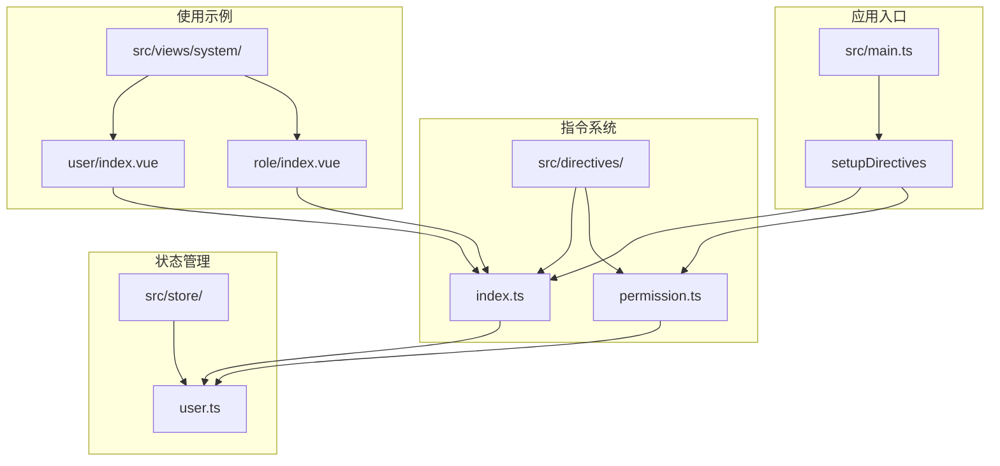
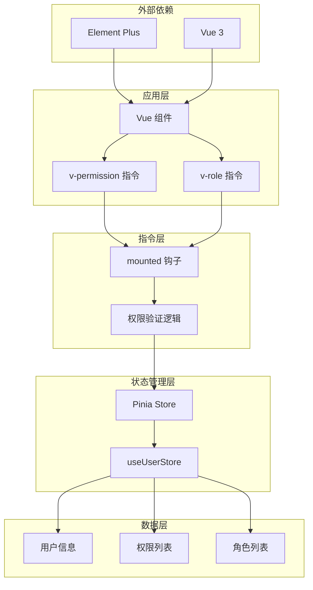
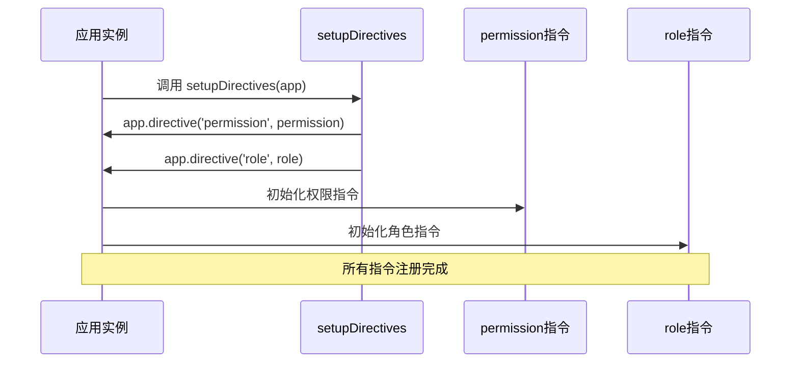
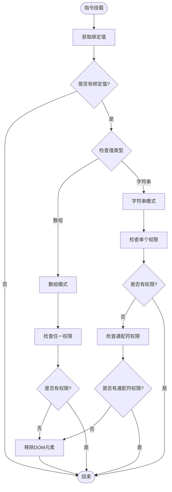
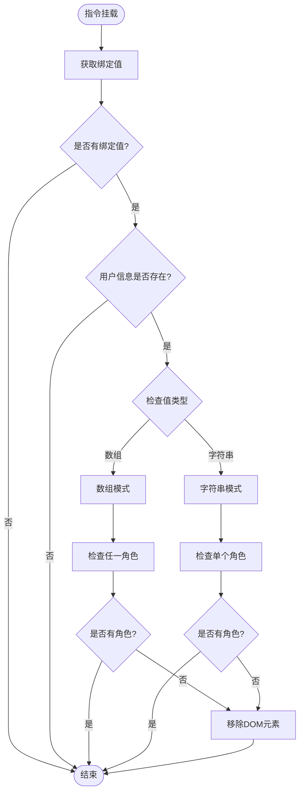
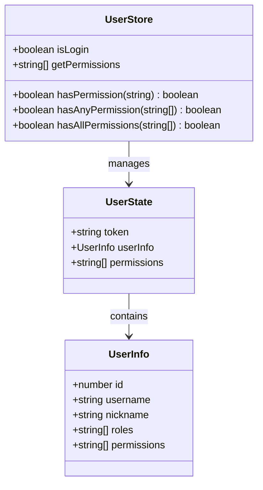
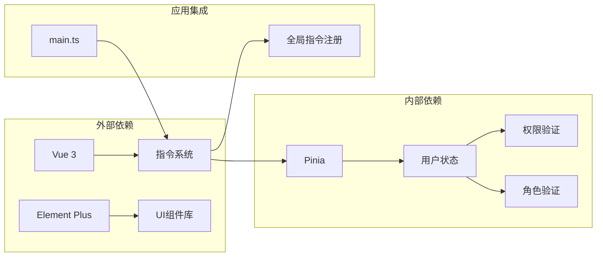

# 自定义指令

<cite>
**本文档引用的文件**
- [src/directives/index.ts](file://src/directives/index.ts)
- [src/directives/permission.ts](file://src/directives/permission.ts)
- [src/main.ts](file://src/main.ts)
- [src/store/user.ts](file://src/store/user.ts)
- [src/views/system/user/index.vue](file://src/views/system/user/index.vue)
- [src/views/system/role/index.vue](file://src/views/system/role/index.vue)
- [src/layout/index.vue](file://src/layout/index.vue)
- [src/types/index.ts](file://src/types/index.ts)
- [package.json](file://package.json)
</cite>

## 目录
1. [简介](#简介)
2. [项目结构](#项目结构)
3. [核心组件](#核心组件)
4. [架构概览](#架构概览)
5. [详细组件分析](#详细组件分析)
6. [依赖关系分析](#依赖关系分析)
7. [性能考虑](#性能考虑)
8. [故障排除指南](#故障排除指南)
9. [结论](#结论)

## 简介

本项目实现了基于 Vue 3 的自定义指令系统，主要包含权限控制和角色验证两大核心功能。通过自定义指令，开发者可以在模板层面实现细粒度的权限控制，无需在每个组件中重复编写权限检查逻辑。

该指令系统采用现代化的 TypeScript 实现，结合 Pinia 状态管理，提供了灵活且高效的权限控制解决方案。指令支持多种使用模式，包括字符串权限、数组权限以及角色验证，能够满足复杂的业务场景需求。

## 项目结构

项目采用模块化组织方式，权限指令相关的核心文件分布如下：

**图表来源**
- [src/directives/index.ts](file://src/directives/index.ts#L1-L16)
- [src/directives/permission.ts](file://src/directives/permission.ts#L1-L67)
- [src/main.ts](file://src/main.ts#L1-L27)

**章节来源**
- [src/directives/index.ts](file://src/directives/index.ts#L1-L16)
- [src/main.ts](file://src/main.ts#L1-L27)

## 核心组件

### 指令注册系统

指令系统通过统一的注册函数进行管理，确保所有指令能够在应用启动时正确初始化。

### 权限指令 (permission)

权限指令是整个权限控制系统的核心，支持多种权限验证模式：
- 单个权限字符串验证
- 多个权限数组验证（任一满足即通过）
- 通配符权限支持 (`*:*:*`)

### 角色指令 (role)

角色指令专注于基于角色的访问控制，支持：
- 单个角色验证
- 多个角色数组验证
- 基于用户角色列表的角色匹配

**章节来源**
- [src/directives/permission.ts](file://src/directives/permission.ts#L9-L61)
- [src/store/user.ts](file://src/store/user.ts#L52-L65)

## 架构概览

指令系统的整体架构采用分层设计，确保职责分离和可维护性：

**图表来源**
- [src/directives/permission.ts](file://src/directives/permission.ts#L9-L61)
- [src/store/user.ts](file://src/store/user.ts#L10-L67)

## 详细组件分析

### 指令注册机制

指令注册采用集中式管理模式，通过 `setupDirectives` 函数统一处理所有指令的注册过程。

#### 注册流程

**图表来源**
- [src/directives/index.ts](file://src/directives/index.ts#L7-L13)

#### 生命周期钩子详解

指令在 Vue 3 中使用 `mounted` 钩子而非传统的多个生命周期钩子，这种设计简化了实现并减少了不必要的复杂性。

**章节来源**
- [src/directives/index.ts](file://src/directives/index.ts#L7-L13)

### 权限指令实现

权限指令是系统中最复杂的组件，需要处理多种权限验证场景。

#### 权限验证算法

**图表来源**
- [src/directives/permission.ts](file://src/directives/permission.ts#L10-L31)

#### 参数传递机制

权限指令支持两种主要的参数传递方式：

1. **字符串参数**：`v-permission="'system:user:add'"`
2. **数组参数**：`v-permission="['system:user:add', 'system:user:edit']"`

#### 权限验证逻辑

权限验证采用"任一满足"的策略，即当提供的权限数组中任一权限满足时，验证即通过。

**章节来源**
- [src/directives/permission.ts](file://src/directives/permission.ts#L9-L31)

### 角色指令实现

角色指令相对简单，专注于基于角色的访问控制。

#### 角色验证流程

**图表来源**
- [src/directives/permission.ts](file://src/directives/permission.ts#L38-L61)

**章节来源**
- [src/directives/permission.ts](file://src/directives/permission.ts#L38-L61)

### 状态管理集成

指令系统与 Pinia 状态管理深度集成，通过 `useUserStore` 访问用户相关信息。

#### 用户状态结构

**图表来源**
- [src/store/user.ts](file://src/store/user.ts#L4-L67)

**章节来源**
- [src/store/user.ts](file://src/store/user.ts#L10-L67)

## 依赖关系分析

指令系统的依赖关系清晰明确，遵循单一职责原则。

**图表来源**
- [src/main.ts](file://src/main.ts#L9-L24)
- [package.json](file://package.json#L12-L20)

**章节来源**
- [src/main.ts](file://src/main.ts#L9-L24)
- [package.json](file://package.json#L12-L20)

## 性能考虑

### 指令执行时机

指令在 `mounted` 钩子中执行，这确保了：
- DOM 已经准备就绪
- 避免了不必要的更新开销
- 简化了生命周期管理

### 内存管理

指令销毁时会自动清理 DOM 元素，避免内存泄漏。

### 最佳实践

1. **避免频繁重新渲染**：权限指令只在挂载时检查，减少不必要的计算
2. **合理使用通配符**：谨慎使用 `*:*:*` 通配符，确保安全边界
3. **批量权限检查**：对于复杂的权限逻辑，考虑在组件级别进行预处理

## 故障排除指南

### 常见问题及解决方案

#### 问题1：指令不生效

**可能原因**：
- 指令未正确注册到应用实例
- 用户状态未正确初始化
- 权限值格式不正确

**解决方法**：
1. 检查 `setupDirectives` 是否在应用启动时调用
2. 确认 `useUserStore` 是否正确初始化
3. 验证权限值的数据类型是否正确

#### 问题2：权限验证结果异常

**可能原因**：
- 权限字符串格式不正确
- 用户权限列表为空
- 通配符权限未正确配置

**解决方法**：
1. 检查权限字符串格式是否符合约定
2. 确认用户登录状态和权限加载
3. 验证通配符权限的配置

#### 问题3：角色验证失败

**可能原因**：
- 用户角色信息缺失
- 角色字符串大小写不匹配
- 角色数组格式错误

**解决方法**：
1. 检查用户角色信息的完整性
2. 确保角色字符串大小写一致
3. 验证角色数组的数据格式

**章节来源**
- [src/directives/permission.ts](file://src/directives/permission.ts#L10-L61)
- [src/store/user.ts](file://src/store/user.ts#L32-L36)

## 结论

本项目的自定义指令系统为 Vue 3 应用提供了强大而灵活的权限控制能力。通过模块化的架构设计和清晰的职责分离，系统既保证了功能的完整性，又保持了良好的可维护性。

### 主要优势

1. **简洁易用**：通过简单的指令语法实现复杂的权限控制
2. **类型安全**：完整的 TypeScript 支持，提供编译时类型检查
3. **性能优化**：合理的执行时机和内存管理策略
4. **扩展性强**：清晰的架构便于功能扩展和定制

### 发展方向

1. **动态权限更新**：支持运行时权限变更的实时响应
2. **权限缓存**：优化频繁权限检查的性能
3. **权限审计**：添加权限访问日志和审计功能
4. **多租户支持**：扩展支持多租户环境下的权限隔离

该指令系统为构建企业级权限控制应用提供了坚实的基础，能够有效提升开发效率和系统安全性。