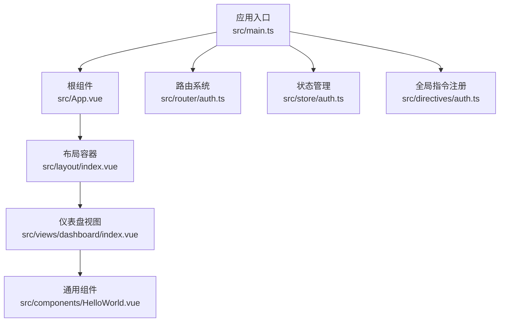
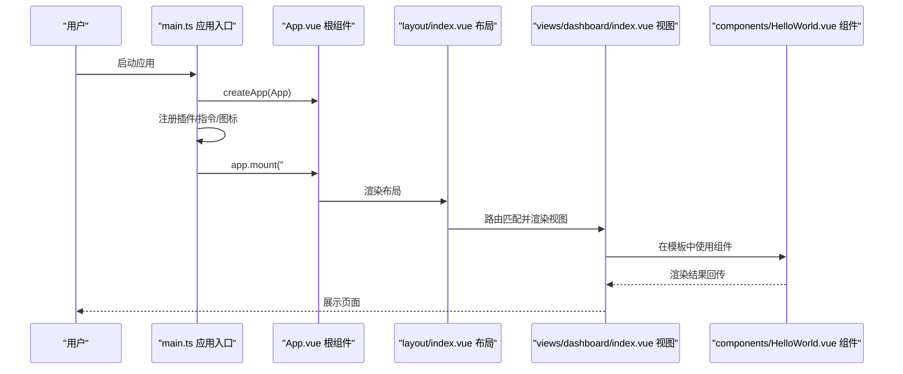
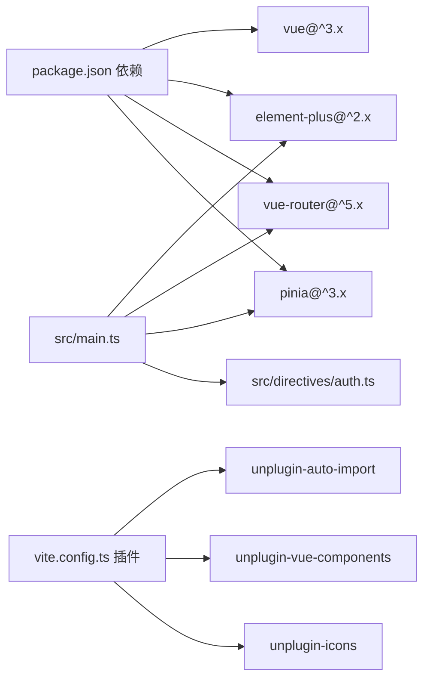

# 通用组件

<cite>
**本文引用的文件**
- [src/components/HelloWorld.vue](file://src/components/HelloWorld.vue)
- [src/main.ts](file://src/main.ts)
- [src/App.vue](file://src/App.vue)
- [src/views/dashboard/index.vue](file://src/views/dashboard/index.vue)
- [src/layout/index.vue](file://src/layout/index.vue)
- [src/router/auth.ts](file://src/router/auth.ts)
- [src/store/auth.ts](file://src/store/auth.ts)
- [src/directives/auth.ts](file://src/directives/auth.ts)
- [src/auto-imports.d.ts](file://src/auto-imports.d.ts)
- [src/components.d.ts](file://src/components.d.ts)
- [vite.config.ts](file://vite.config.ts)
- [package.json](file://package.json)
- [README.md](file://README.md)
</cite>

## 目录
1. [简介](#简介)
2. [项目结构](#项目结构)
3. [核心组件](#核心组件)
4. [架构总览](#架构总览)
5. [组件详解](#组件详解)
6. [依赖关系分析](#依赖关系分析)
7. [性能与可维护性](#性能与可维护性)
8. [测试与调试指南](#测试与调试指南)
9. [结论](#结论)
10. [附录：最佳实践清单](#附录最佳实践清单)

## 简介
本文件围绕项目中的通用组件进行系统化说明，以 HelloWorld 组件为切入点，阐述 Vue 3 Composition API 的使用方式、组件属性定义、响应式数据绑定与模板语法；解释 props 接口设计、事件处理机制与生命周期管理；给出在其他组件中引入与使用的示例路径；说明 scoped 样式的作用与 CSS 模块化实践；并提供组件测试方法与调试技巧，帮助开发者理解与扩展通用组件库。

## 项目结构
该项目采用基于功能分层的组织方式，核心入口通过应用挂载点集中初始化插件与全局能力，页面视图按业务模块划分，通用组件位于 components 目录，便于跨页面复用。

图表来源
- [src/main.ts](file://src/main.ts#L1-L27)
- [src/App.vue](file://src/App.vue#L1-L51)
- [src/layout/index.vue](file://src/layout/index.vue#L1-L255)
- [src/views/dashboard/index.vue](file://src/views/dashboard/index.vue#L1-L157)
- [src/components/HelloWorld.vue](file://src/components/HelloWorld.vue#L1-L42)

章节来源
- [src/main.ts](file://src/main.ts#L1-L27)
- [src/App.vue](file://src/App.vue#L1-L51)
- [src/router/auth.ts](file://src/router/index.ts#L1-L123)
- [src/store/auth.ts](file://src/store/index.ts#L1-L6)
- [src/directives/auth.ts](file://src/directives/index.ts#L1-L16)

## 核心组件
本节聚焦 HelloWorld 组件，它是项目中最小但最典型的通用组件示例，展示了：
- 使用 <script setup> 与 TypeScript 的组合式 API 写法
- props 接口定义与默认值策略
- 响应式数据（ref）与模板双向绑定
- 事件处理与交互逻辑
- 生命周期钩子的使用场景
- scoped 样式的作用域隔离

章节来源
- [src/components/HelloWorld.vue](file://src/components/HelloWorld.vue#L1-L42)

## 架构总览
从应用启动到组件渲染的关键流程如下：

图表来源
- [src/main.ts](file://src/main.ts#L1-L27)
- [src/App.vue](file://src/App.vue#L1-L51)
- [src/layout/index.vue](file://src/layout/index.vue#L1-L255)
- [src/views/dashboard/index.vue](file://src/views/dashboard/index.vue#L1-L157)
- [src/components/HelloWorld.vue](file://src/components/HelloWorld.vue#L1-L42)

## 组件详解

### HelloWorld 组件概览
- 文件位置：src/components/HelloWorld.vue
- 特性要点：
  - 使用 <script setup> 与 TypeScript
  - 定义单向 props 接口
  - 使用 ref 声明响应式数据
  - 模板内使用插值与事件绑定
  - 使用 scoped 样式限定作用域

章节来源
- [src/components/HelloWorld.vue](file://src/components/HelloWorld.vue#L1-L42)

### Props 接口设计
- 设计原则
  - 明确输入类型，避免动态类型污染
  - 对于可选属性，提供合理默认值或在模板中做安全访问
- 实现参考
  - 组件通过 defineProps 定义字符串类型的 msg 属性
  - 在模板中直接消费该属性，体现单向数据流

章节来源
- [src/components/HelloWorld.vue](file://src/components/HelloWorld.vue#L4-L10)

### 响应式数据绑定与模板语法
- 数据声明
  - 使用 ref 声明局部响应式状态 count
- 模板绑定
  - 插值表达式展示 msg 与 count
  - 事件绑定 @click 实现点击自增
- 交互效果
  - 点击按钮触发 count++，模板自动更新

章节来源
- [src/components/HelloWorld.vue](file://src/components/HelloWorld.vue#L6-L18)

### 事件处理机制
- 事件绑定
  - 模板中使用 @click 将点击事件映射到组件内部逻辑
- 事件处理
  - 在 <script setup> 中直接执行自增操作，无需额外声明方法
- 扩展建议
  - 复杂交互建议抽取为独立方法，提升可读性与可测试性

章节来源
- [src/components/HelloWorld.vue](file://src/components/HelloWorld.vue#L13-L13)

### 生命周期管理
- 当前组件未显式使用生命周期钩子
- 常见使用场景
  - onMounted：发起异步请求或订阅外部事件
  - onUnmounted：清理定时器、取消订阅
  - onBeforeUpdate/onUpdated：调试渲染过程或同步 DOM
- 在 HelloWorld 中如需副作用，可在 <script setup> 中直接编写逻辑，或按需引入相应钩子

章节来源
- [src/components/HelloWorld.vue](file://src/components/HelloWorld.vue#L1-L7)

### scoped 样式与 CSS 模块化
- scoped 样式
  - 通过 <style scoped> 限定类名作用域，避免样式泄漏
  - 适用于组件级样式隔离与快速迭代
- CSS 模块化实践
  - 项目中多处使用 scoped 与 SCSS，建议：
    - 为组件定义明确的 BEM 或命名空间前缀
    - 将复杂样式拆分为多个局部样式块，保持单一职责
    - 避免深度选择器滥用，必要时配合 ::deep 使用
- 示例参考
  - HelloWorld 使用 scoped 简化样式
  - 布局与视图广泛使用 scoped 与 SCSS 进行模块化组织

章节来源
- [src/components/HelloWorld.vue](file://src/components/HelloWorld.vue#L37-L41)
- [src/views/dashboard/index.vue](file://src/views/dashboard/index.vue#L122-L156)
- [src/layout/index.vue](file://src/layout/index.vue#L136-L255)

### 在其他组件中引入与使用
- 自动导入与类型支持
  - 通过 Vite 插件与类型声明文件，组件可被自动识别与类型补全
  - HelloWorld 已在类型声明中注册，可在任意模板中直接使用
- 引入路径
  - 组件文件位于 src/components/HelloWorld.vue
  - 类型声明文件中包含 HelloWorld 类型，确保 TS 推断可用
- 使用示例（路径参考）
  - 在视图模板中直接使用组件标签，并传递 msg 属性
  - 参考路径：src/views/dashboard/index.vue（组件使用示例）

章节来源
- [src/components.d.ts](file://src/components.d.ts#L34-L41)
- [src/auto-imports.d.ts](file://src/auto-imports.d.ts#L1-L91)
- [src/views/dashboard/index.vue](file://src/views/dashboard/index.vue#L1-L157)

### 与应用生态的集成
- 应用入口
  - main.ts 中注册 Element Plus、路由、状态管理与全局指令
- 路由与权限
  - 路由守卫结合用户权限控制页面访问
- 布局与视图
  - layout/index.vue 提供菜单、头部与内容区，dashboard/index.vue 展示业务卡片

章节来源
- [src/main.ts](file://src/main.ts#L1-L27)
- [src/router/auth.ts](file://src/router/index.ts#L94-L120)
- [src/layout/index.vue](file://src/layout/index.vue#L1-L255)

## 依赖关系分析

图表来源
- [package.json](file://package.json#L12-L20)
- [vite.config.ts](file://vite.config.ts#L14-L32)
- [src/main.ts](file://src/main.ts#L1-L27)
- [src/directives/auth.ts](file://src/directives/index.ts#L1-L16)

章节来源
- [package.json](file://package.json#L1-L38)
- [vite.config.ts](file://vite.config.ts#L1-L49)
- [src/main.ts](file://src/main.ts#L1-L27)

## 性能与可维护性
- 组件粒度
  - 将通用逻辑下沉为小而专一的组件，降低耦合度
- 响应式与计算
  - 合理使用 ref/computed，避免不必要的响应式开销
- 样式隔离
  - 优先使用 scoped 与局部样式，减少全局污染
- 自动导入
  - 通过插件自动导入 API 与组件，减少手动引入成本，提升一致性

## 测试与调试指南
- 单元测试（建议）
  - 使用 Vitest + @vue/test-utils 对组件行为进行断言
  - 关注 props 输入、事件触发、状态变更与快照渲染
- 端到端测试（建议）
  - 使用 Playwright/Cypress 验证组件在真实路由与布局中的表现
- 调试技巧
  - 在组件中使用浏览器 Vue DevTools 观察响应式数据与渲染树
  - 利用 onMounted 等钩子输出日志，定位生命周期问题
  - 对复杂交互拆解为独立方法，便于单测与调试

## 结论
HelloWorld 组件体现了 Vue 3 + TypeScript + Vite 的最佳实践：简洁的 props 接口、组合式 API 的响应式写法、模板插值与事件绑定、以及 scoped 样式的模块化组织。在此基础上，结合自动导入、类型声明与路由/状态生态，可以高效构建可复用、可维护的通用组件库。

## 附录：最佳实践清单
- Props 设计
  - 明确必填/可选属性，提供合理默认值
  - 使用 TypeScript 接口约束，增强类型安全
- 响应式与模板
  - 将交互逻辑封装为方法，保持模板简洁
  - 避免在模板中执行复杂表达式
- 样式组织
  - 优先使用 scoped 与 SCSS，遵循命名规范
  - 控制样式层级，避免过深的选择器
- 引入与复用
  - 通过自动导入与类型声明统一引入方式
  - 在视图模板中直接使用，减少中间层
- 生命周期
  - 按需引入生命周期钩子，避免滥用
  - 将副作用集中在合适的钩子中执行
- 测试与调试
  - 为关键交互编写单元测试
  - 使用 DevTools 与日志定位问题