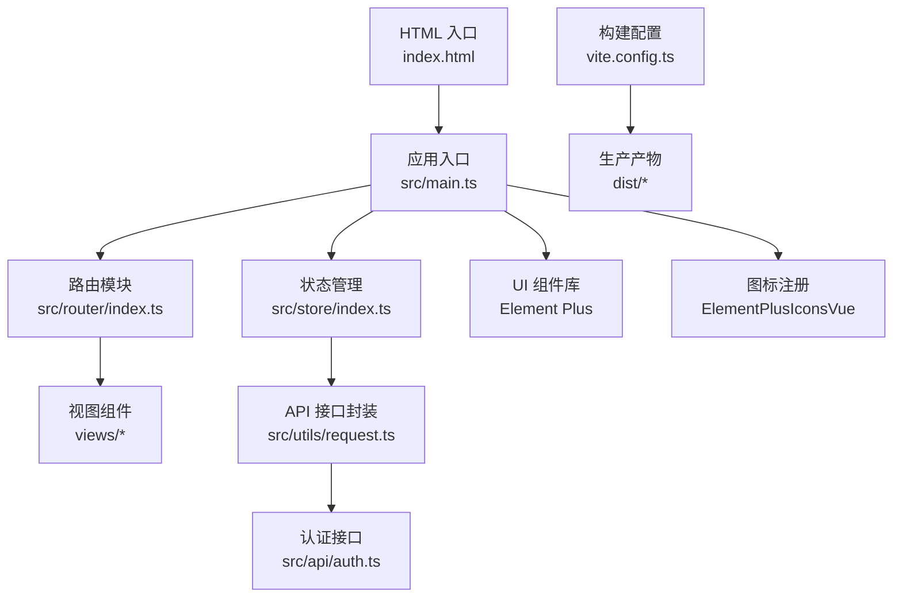
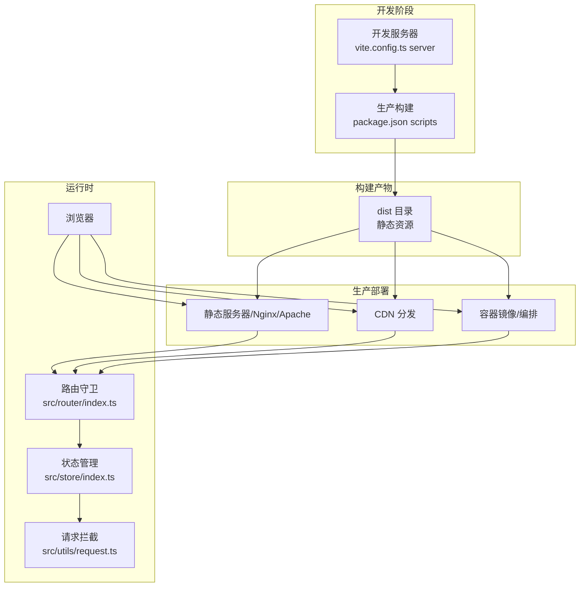
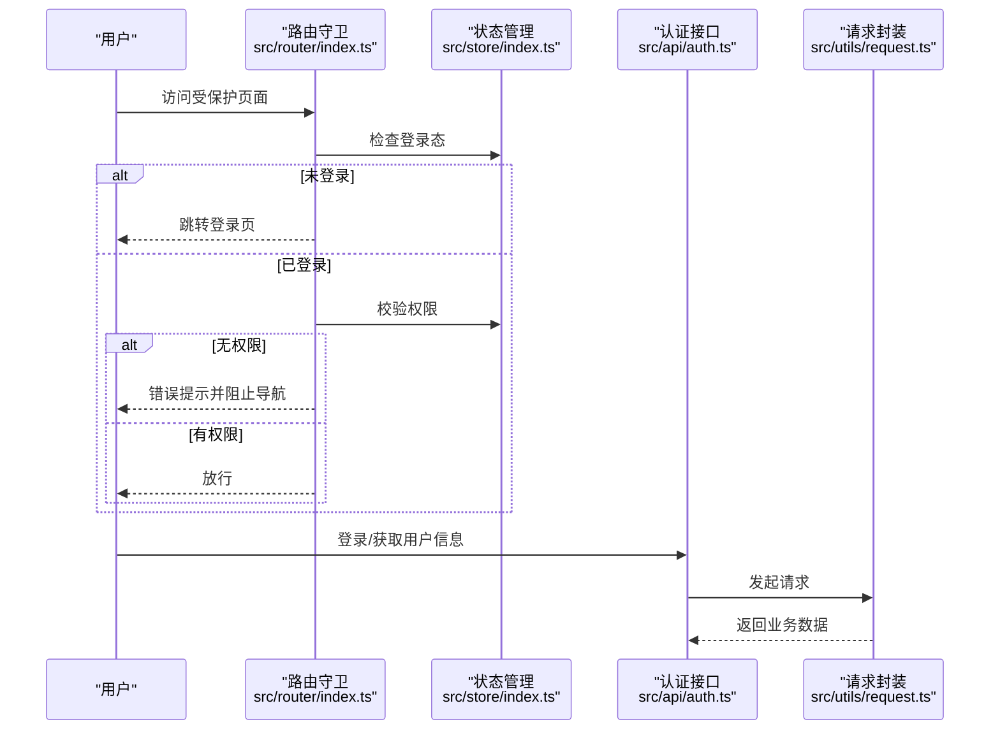
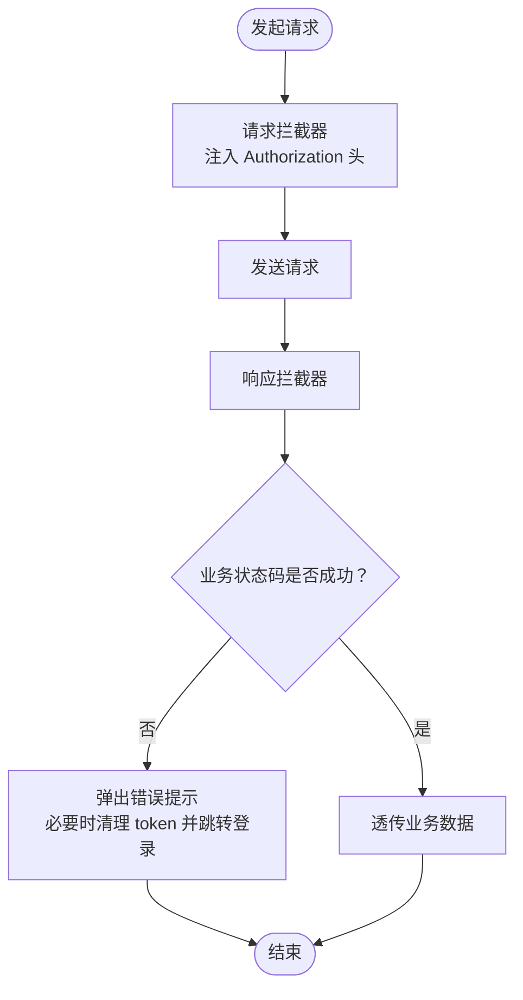
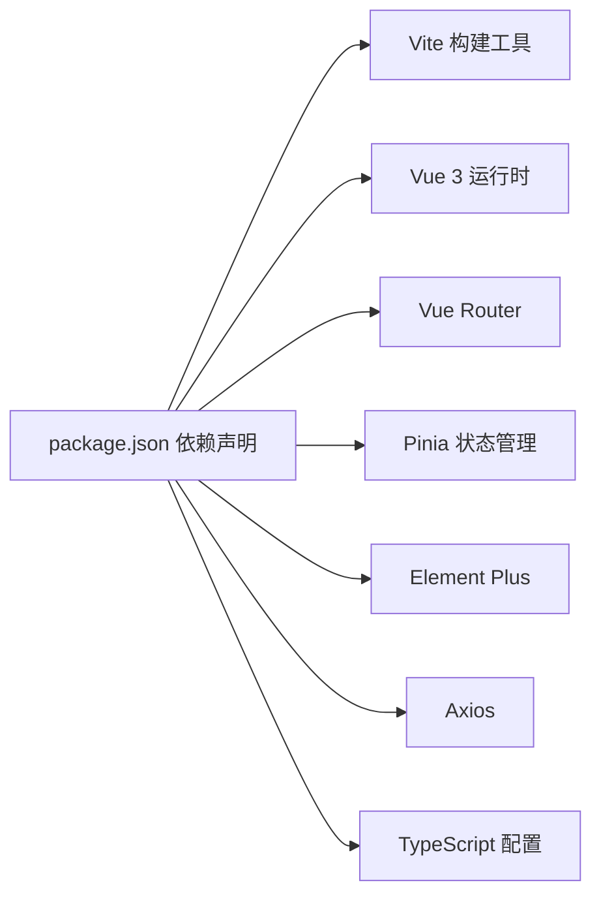

# 部署指南

<cite>
**本文引用的文件**
- [package.json](file://package.json)
- [vite.config.ts](file://vite.config.ts)
- [index.html](file://index.html)
- [src/main.ts](file://src/main.ts)
- [src/router/index.ts](file://src/router/index.ts)
- [src/store/index.ts](file://src/store/index.ts)
- [src/utils/request.ts](file://src/utils/request.ts)
- [src/api/auth.ts](file://src/api/auth.ts)
- [tsconfig.json](file://tsconfig.json)
- [tsconfig.app.json](file://tsconfig.app.json)
- [tsconfig.node.json](file://tsconfig.node.json)
- [.gitignore](file://.gitignore)
</cite>

## 目录
1. [简介](#简介)
2. [项目结构](#项目结构)
3. [核心组件](#核心组件)
4. [架构总览](#架构总览)
5. [详细组件分析](#详细组件分析)
6. [依赖分析](#依赖分析)
7. [性能考虑](#性能考虑)
8. [故障排查指南](#故障排查指南)
9. [结论](#结论)
10. [附录](#附录)

## 简介
本指南面向将基于 Vue 3 + TypeScript + Vite 的前端项目部署到生产环境的工程师与运维人员。内容覆盖生产构建、部署策略（静态服务器、CDN、容器化）、环境变量与敏感信息保护、性能监控与日志、错误追踪、域名与 HTTPS、缓存策略等，帮助团队安全可靠地交付产品。

## 项目结构
该项目采用 Vite 作为构建工具，使用 Vue 3 单文件组件与 TypeScript 进行开发；Pinia 提供状态管理，Element Plus 提供 UI 组件库；路由采用 Vue Router；Axios 封装统一请求与拦截逻辑。

图表来源
- [src/main.ts](file://src/main.ts#L1-L27)
- [src/router/index.ts](file://src/router/index.ts#L1-L113)
- [src/store/index.ts](file://src/store/index.ts#L1-L6)
- [src/utils/request.ts](file://src/utils/request.ts#L1-L102)
- [src/api/auth.ts](file://src/api/auth.ts#L1-L17)
- [vite.config.ts](file://vite.config.ts#L1-L49)
- [index.html](file://index.html#L1-L14)

章节来源
- [package.json](file://package.json#L1-L38)
- [vite.config.ts](file://vite.config.ts#L1-L49)
- [index.html](file://index.html#L1-L14)
- [src/main.ts](file://src/main.ts#L1-L27)
- [src/router/index.ts](file://src/router/index.ts#L1-L113)
- [src/store/index.ts](file://src/store/index.ts#L1-L6)
- [src/utils/request.ts](file://src/utils/request.ts#L1-L102)
- [src/api/auth.ts](file://src/api/auth.ts#L1-L17)
- [tsconfig.json](file://tsconfig.json#L1-L8)
- [tsconfig.app.json](file://tsconfig.app.json#L1-L17)
- [tsconfig.node.json](file://tsconfig.node.json#L1-L27)
- [.gitignore](file://.gitignore#L1-L24)

## 核心组件
- 构建与开发工具链
  - 生产构建命令通过脚本调用类型检查与 Vite 打包，产物输出至 dist 目录。
  - 开发服务器默认端口为 3000，并配置了以 /api 前缀代理后端服务。
- 应用入口与运行时
  - 应用在入口文件中注册 Element Plus、路由、状态管理与全局指令，随后挂载到 DOM。
- 路由与鉴权
  - 路由守卫负责页面标题设置、登录态校验与权限校验；未授权或无权限时进行提示与跳转。
- 状态管理
  - Pinia 实例在独立文件中创建，供应用使用。
- 请求与认证
  - Axios 实例统一设置基础路径、超时与通用头部；请求拦截器自动注入 Authorization 头；响应拦截器处理业务状态码与错误提示，并在 401 时清理本地 token 并跳转登录页。
  - 认证相关接口封装于 api/auth.ts，包括登录、获取用户信息与退出登录。

章节来源
- [package.json](file://package.json#L6-L11)
- [vite.config.ts](file://vite.config.ts#L38-L47)
- [src/main.ts](file://src/main.ts#L11-L26)
- [src/router/index.ts](file://src/router/index.ts#L84-L110)
- [src/store/index.ts](file://src/store/index.ts#L1-L6)
- [src/utils/request.ts](file://src/utils/request.ts#L4-L11)
- [src/utils/request.ts](file://src/utils/request.ts#L13-L28)
- [src/utils/request.ts](file://src/utils/request.ts#L30-L78)
- [src/api/auth.ts](file://src/api/auth.ts#L4-L17)

## 架构总览
下图展示从前端构建到生产部署的关键流程与集成点：

图表来源
- [package.json](file://package.json#L6-L11)
- [vite.config.ts](file://vite.config.ts#L38-L47)
- [src/router/index.ts](file://src/router/index.ts#L84-L110)
- [src/store/index.ts](file://src/store/index.ts#L1-L6)
- [src/utils/request.ts](file://src/utils/request.ts#L4-L11)

## 详细组件分析

### Vite 生产构建与优化
- 构建命令
  - 通过脚本先执行类型检查，再执行 Vite 生产打包，生成 dist 目录产物。
- 插件生态
  - Vue 单文件组件支持、自动导入与组件解析、图标自动安装与解析，提升开发效率与产物体积控制。
- 开发服务器与代理
  - 开发服务器默认端口与 /api 代理规则，便于前后端联调；生产环境需替换为实际后端地址或通过反向代理统一转发。
- 产物与入口
  - HTML 入口文件引入应用入口脚本，构建后由 Vite 自动注入资源链接。

建议的生产构建优化方向（概念性说明）
- 代码分割与懒加载：利用路由级异步组件与按需加载第三方库，减少首屏体积。
- 静态资源优化：开启压缩、哈希命名与预加载策略，结合 CDN 缓存。
- Source Map：生产关闭以避免源码泄露风险。
- 环境变量：使用 Vite 环境变量机制注入只读配置，避免硬编码。

章节来源
- [package.json](file://package.json#L6-L11)
- [vite.config.ts](file://vite.config.ts#L11-L32)
- [vite.config.ts](file://vite.config.ts#L38-L47)
- [index.html](file://index.html#L9-L12)

### 路由与鉴权流程

图表来源
- [src/router/index.ts](file://src/router/index.ts#L84-L110)
- [src/store/index.ts](file://src/store/index.ts#L1-L6)
- [src/api/auth.ts](file://src/api/auth.ts#L4-L17)
- [src/utils/request.ts](file://src/utils/request.ts#L80-L101)

章节来源
- [src/router/index.ts](file://src/router/index.ts#L84-L110)
- [src/api/auth.ts](file://src/api/auth.ts#L4-L17)
- [src/utils/request.ts](file://src/utils/request.ts#L30-L78)

### 请求拦截与错误处理

图表来源
- [src/utils/request.ts](file://src/utils/request.ts#L13-L28)
- [src/utils/request.ts](file://src/utils/request.ts#L30-L78)

章节来源
- [src/utils/request.ts](file://src/utils/request.ts#L4-L11)
- [src/utils/request.ts](file://src/utils/request.ts#L13-L28)
- [src/utils/request.ts](file://src/utils/request.ts#L30-L78)

## 依赖分析
- 构建与开发
  - Vite、@vitejs/plugin-vue、unplugin-* 系列插件用于开发体验与产物优化。
- 运行时依赖
  - Vue 3、Vue Router、Pinia、Element Plus、Axios 等构成前端核心能力。
- 类型与配置
  - TypeScript 通过多配置文件组织应用与 Node 环境的编译选项，确保严格性与兼容性。

图表来源
- [package.json](file://package.json#L12-L36)
- [tsconfig.json](file://tsconfig.json#L1-L8)
- [tsconfig.app.json](file://tsconfig.app.json#L1-L17)
- [tsconfig.node.json](file://tsconfig.node.json#L1-L27)

章节来源
- [package.json](file://package.json#L12-L36)
- [tsconfig.json](file://tsconfig.json#L1-L8)
- [tsconfig.app.json](file://tsconfig.app.json#L1-L17)
- [tsconfig.node.json](file://tsconfig.node.json#L1-L27)

## 性能考虑
- 构建优化（概念性）
  - 启用代码分割与路由懒加载，减少首屏 JS 体积。
  - 对第三方库进行按需引入与 Tree Shaking，避免冗余代码。
  - 使用 CDN 缓存静态资源，合理设置缓存策略与版本号。
- 运行时优化（概念性）
  - 合理使用 keep-alive 与组件缓存，降低重复渲染成本。
  - 控制并发请求数量，合并不紧急请求。
  - 在路由切换时避免不必要的全局状态更新。
- 监控与日志（概念性）
  - 前端埋点采集首屏时间、交互延迟与错误事件，结合后端日志统一分析。
  - 对关键接口设置超时与重试策略，增强稳定性。

## 故障排查指南
- 构建失败
  - 确认类型检查通过后再执行打包；检查插件配置与别名映射。
- 开发代理无效
  - 确认开发服务器代理前缀与后端接口一致；生产环境需通过 Nginx 或网关统一转发 /api。
- 登录后仍被重定向到登录页
  - 检查本地存储中的 token 是否存在且未过期；确认响应拦截器对 401 的处理逻辑。
- 权限不足导致页面无法访问
  - 检查路由元信息中的权限标识与用户权限列表；确认权限校验逻辑。
- 资源 404 或缓存问题
  - 检查生产环境静态资源路径与缓存头；确认 CDN 缓存是否命中或失效。

章节来源
- [vite.config.ts](file://vite.config.ts#L38-L47)
- [src/utils/request.ts](file://src/utils/request.ts#L39-L46)
- [src/router/index.ts](file://src/router/index.ts#L92-L107)

## 结论
本指南提供了从构建到生产的完整路径：明确生产构建流程、部署方式选择、环境变量与安全策略、性能与可观测性实践，以及常见问题的排查思路。建议在正式上线前完成端到端演练与压测，确保交付质量与稳定性。

## 附录

### A. 生产构建与部署策略
- 静态服务器部署
  - 将 dist 目录部署到 Nginx/Apache 等静态服务器，配置根目录指向 dist。
  - 配置缓存头与 gzip/br 压缩，启用 HTTPS。
- CDN 部署
  - 将 dist 资源上传至 CDN，配置边缘缓存与回源策略；通过自定义域名访问。
- 容器化部署
  - 使用 Nginx 镜像作为静态服务器，挂载 dist 目录；或在容器内运行 Nginx 配置文件。
  - 通过编排平台（如 Kubernetes）管理副本、滚动更新与健康检查。

### B. 环境变量与敏感信息保护
- 构建期注入
  - 使用 Vite 环境变量机制注入只读配置（如 API 基础地址、站点名称），避免硬编码到源码。
- 运行时安全
  - 不在前端存储长期密钥；token 仅保存在内存或安全的同源存储中。
  - 通过 HTTPS 传输，启用 HSTS 与安全响应头。
- 变更管理
  - 使用 CI/CD 管理不同环境的变量，禁止将敏感变量提交到版本库。

### C. 域名、HTTPS 与缓存策略
- 域名与证书
  - 为生产域名申请并部署 SSL 证书；配置强制 HTTPS 重定向。
- 缓存策略
  - 对静态资源（JS/CSS/图片）设置长缓存与版本号；对 HTML 设置短缓存或不缓存。
  - CDN 层面配置边缘缓存与刷新策略。

### D. 性能监控、日志与错误追踪
- 性能监控
  - 采集首屏时间、交互延迟、资源大小等指标；结合后端日志与埋点系统统一分析。
- 日志收集
  - 前端错误与用户行为日志通过上报接口发送至后端；后端集中存储与检索。
- 错误追踪
  - 使用错误追踪平台记录异常堆栈与上下文；对高频错误设置告警。

### E. 关键配置清单（示例）
- 构建脚本与产物
  - 构建命令与输出目录遵循现有脚本与 Vite 默认配置。
- 代理与后端对接
  - 开发代理规则用于联调；生产通过网关或反向代理统一转发 /api。
- TypeScript 严格模式
  - 应用与 Node 环境分别配置严格编译选项，提升代码质量。

章节来源
- [package.json](file://package.json#L6-L11)
- [vite.config.ts](file://vite.config.ts#L38-L47)
- [tsconfig.app.json](file://tsconfig.app.json#L8-L13)
- [tsconfig.node.json](file://tsconfig.node.json#L10-L15)