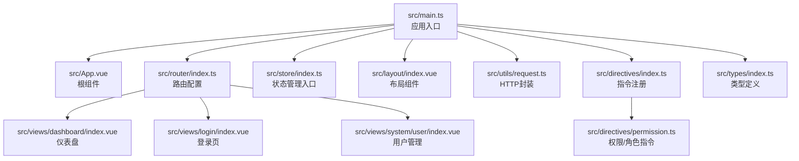
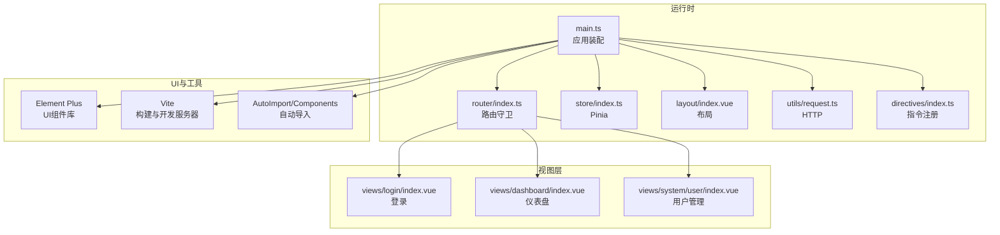
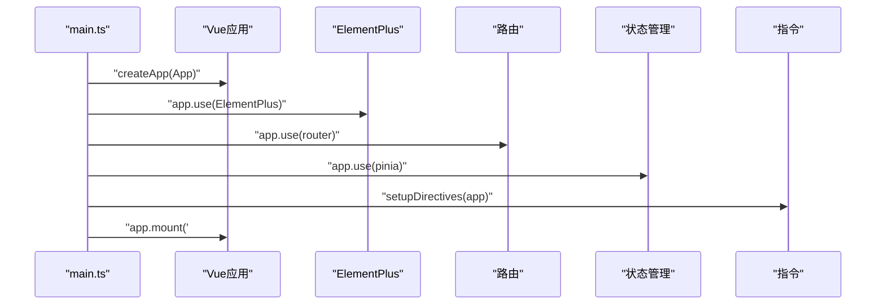
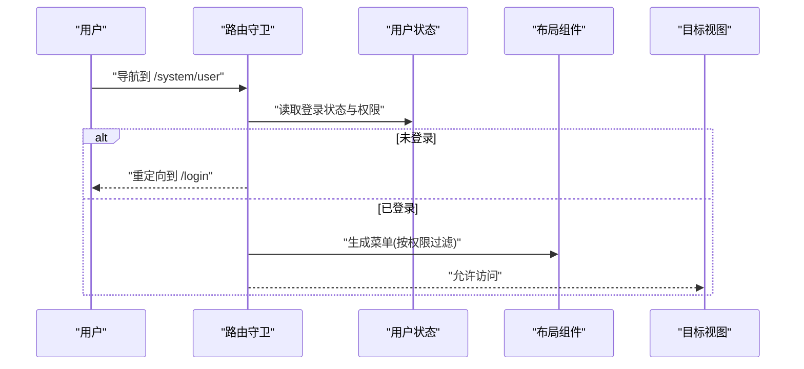
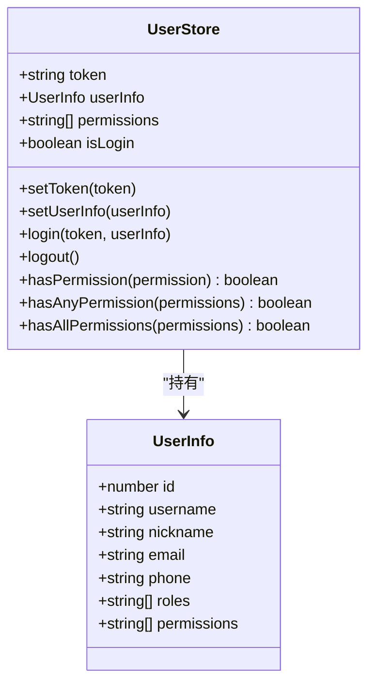
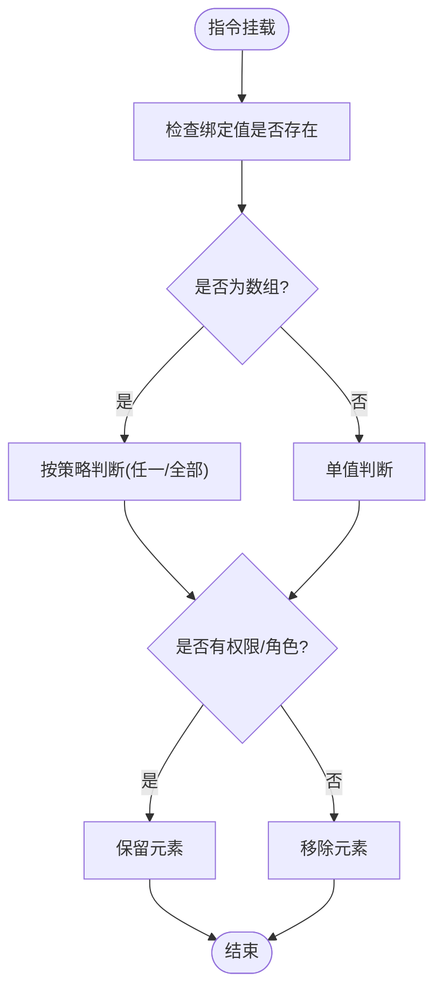
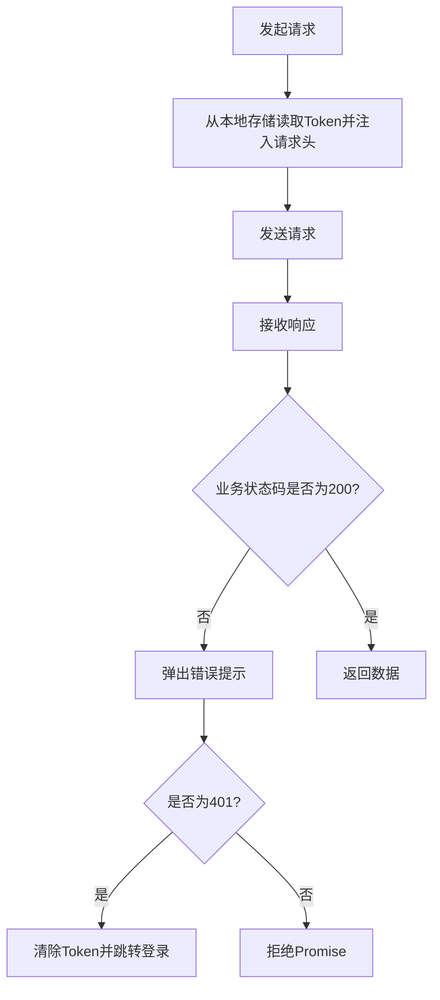
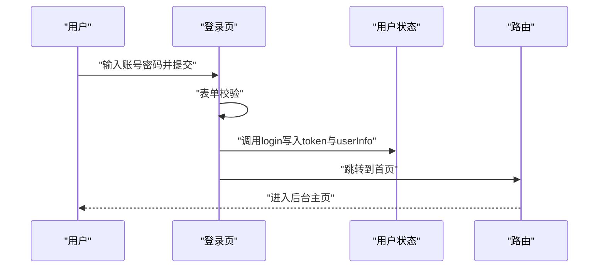
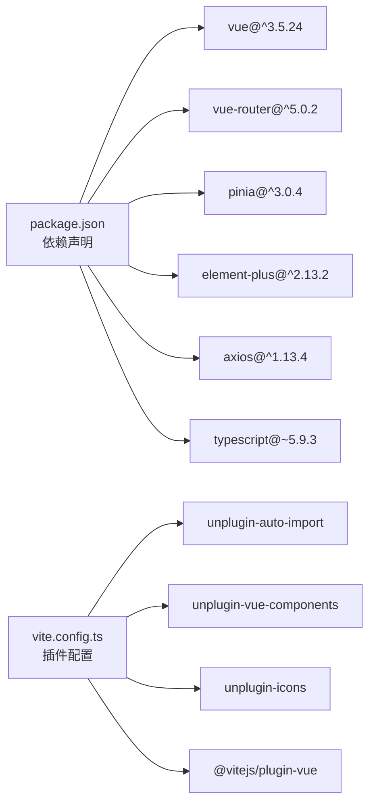

# 项目概述

<cite>
**本文档引用的文件**
- [README.md](file://README.md)
- [package.json](file://package.json)
- [vite.config.ts](file://vite.config.ts)
- [src/main.ts](file://src/main.ts)
- [src/App.vue](file://src/App.vue)
- [src/router/index.ts](file://src/router/index.ts)
- [src/store/index.ts](file://src/store/index.ts)
- [src/store/user.ts](file://src/store/user.ts)
- [src/layout/index.vue](file://src/layout/index.vue)
- [src/views/dashboard/index.vue](file://src/views/dashboard/index.vue)
- [src/views/login/index.vue](file://src/views/login/index.vue)
- [src/views/system/user/index.vue](file://src/views/system/user/index.vue)
- [src/utils/request.ts](file://src/utils/request.ts)
- [src/directives/index.ts](file://src/directives/index.ts)
- [src/directives/permission.ts](file://src/directives/permission.ts)
- [src/types/index.ts](file://src/types/index.ts)
</cite>

## 目录
1. [引言](#引言)
2. [项目结构](#项目结构)
3. [核心组件](#核心组件)
4. [架构总览](#架构总览)
5. [详细组件分析](#详细组件分析)
6. [依赖关系分析](#依赖关系分析)
7. [性能考量](#性能考量)
8. [故障排除指南](#故障排除指南)
9. [结论](#结论)
10. [附录](#附录)

## 引言
本项目是一个基于 Vue 3 + TypeScript + Element Plus + Vite 的企业级后台管理系统模板，旨在为开发者提供一套现代化、可扩展且具有良好开发体验的管理平台基础骨架。项目通过脚手架工具快速搭建，集成了路由、状态管理、权限控制、UI 组件库与构建优化等关键能力，适合用于中大型后台系统的快速起步与二次开发。

项目目标与价值：
- 提供标准化的企业级后台管理前端架构，降低重复造轮子成本
- 展示 Vue 3 + TypeScript 在大型项目中的最佳实践
- 通过权限指令、路由守卫与状态管理实现完善的鉴权与用户体验
- 以 Element Plus 作为 UI 基座，结合 Vite 的热更新与自动导入生态，提升开发效率

适用场景与目标用户：
- 中小型企业后台管理系统（如用户/角色/菜单管理）
- 需要快速落地的中后台产品原型与演示系统
- 希望学习 Vue 3 + TypeScript + Element Plus 技术栈组合的开发者与团队

## 项目结构
项目采用按功能域划分的目录组织方式，核心模块包括应用入口、路由、状态管理、布局、视图页面、工具函数、指令与类型定义等。整体结构清晰，职责边界明确，便于扩展与维护。

图表来源
- [src/main.ts](file://src/main.ts#L1-L27)
- [src/App.vue](file://src/App.vue#L1-L51)
- [src/router/index.ts](file://src/router/index.ts#L1-L119)
- [src/store/index.ts](file://src/store/index.ts#L1-L6)
- [src/layout/index.vue](file://src/layout/index.vue#L1-L255)
- [src/views/dashboard/index.vue](file://src/views/dashboard/index.vue#L1-L157)
- [src/views/login/index.vue](file://src/views/login/index.vue#L1-L257)
- [src/views/system/user/index.vue](file://src/views/system/user/index.vue#L1-L183)
- [src/utils/request.ts](file://src/utils/request.ts#L1-L102)
- [src/directives/index.ts](file://src/directives/index.ts#L1-L16)
- [src/directives/permission.ts](file://src/directives/permission.ts#L1-L67)
- [src/types/index.ts](file://src/types/index.ts#L1-L45)

章节来源
- [src/main.ts](file://src/main.ts#L1-L27)
- [src/router/index.ts](file://src/router/index.ts#L1-L119)
- [src/store/index.ts](file://src/store/index.ts#L1-L6)
- [src/layout/index.vue](file://src/layout/index.vue#L1-L255)
- [src/views/dashboard/index.vue](file://src/views/dashboard/index.vue#L1-L157)
- [src/views/login/index.vue](file://src/views/login/index.vue#L1-L257)
- [src/views/system/user/index.vue](file://src/views/system/user/index.vue#L1-L183)
- [src/utils/request.ts](file://src/utils/request.ts#L1-L102)
- [src/directives/index.ts](file://src/directives/index.ts#L1-L16)
- [src/directives/permission.ts](file://src/directives/permission.ts#L1-L67)
- [src/types/index.ts](file://src/types/index.ts#L1-L45)

## 核心组件
- 应用入口与插件装配：负责注册 Element Plus、路由、状态管理、全局指令与图标组件，统一挂载应用。
- 路由系统：采用 Vue Router 5，支持动态菜单生成、权限校验与页面标题设置；提供登录页、仪表盘、系统管理等基础页面。
- 状态管理：基于 Pinia，集中管理用户 Token、用户信息与权限集合，提供登录、登出与权限判断等动作。
- 布局组件：提供侧边栏、头部导航与主内容区，支持菜单折叠、用户信息展示与退出登录流程。
- 权限指令：提供 v-permission 与 v-role 指令，可在模板层面进行细粒度的可见性控制。
- HTTP 封装：基于 Axios，统一处理请求头、响应拦截与错误提示，并集成 401 自动跳转登录逻辑。
- 类型系统：集中定义用户信息、登录表单、API 响应与菜单项等类型，确保开发时的类型安全。

章节来源
- [src/main.ts](file://src/main.ts#L1-L27)
- [src/router/index.ts](file://src/router/index.ts#L1-L119)
- [src/store/user.ts](file://src/store/user.ts#L1-L68)
- [src/layout/index.vue](file://src/layout/index.vue#L1-L255)
- [src/directives/permission.ts](file://src/directives/permission.ts#L1-L67)
- [src/utils/request.ts](file://src/utils/request.ts#L1-L102)
- [src/types/index.ts](file://src/types/index.ts#L1-L45)

## 架构总览
项目采用“入口装配 + 路由驱动 + 状态管理 + 权限控制 + UI 组件库”的分层架构，结合 Vite 的插件生态实现自动导入与组件解析，形成高内聚、低耦合的前端体系。

图表来源
- [src/main.ts](file://src/main.ts#L1-L27)
- [src/router/index.ts](file://src/router/index.ts#L1-L119)
- [src/store/index.ts](file://src/store/index.ts#L1-L6)
- [src/layout/index.vue](file://src/layout/index.vue#L1-L255)
- [src/utils/request.ts](file://src/utils/request.ts#L1-L102)
- [src/directives/index.ts](file://src/directives/index.ts#L1-L16)
- [vite.config.ts](file://vite.config.ts#L1-L49)

## 详细组件分析

### 应用入口与装配流程
应用入口负责初始化 Vue 实例、注册 Element Plus 图标、安装路由与状态管理、注册全局指令，并最终挂载到 DOM。该流程体现了“约定优于配置”的思想，确保各模块按序接入，避免遗漏。

图表来源
- [src/main.ts](file://src/main.ts#L1-L27)

章节来源
- [src/main.ts](file://src/main.ts#L1-L27)

### 路由与权限控制
路由系统通过 beforeEach 守卫实现登录态与权限校验，动态设置页面标题，并根据用户权限过滤可访问的菜单项。同时，布局组件会根据当前路由计算激活菜单与侧边栏显示。

图表来源
- [src/router/index.ts](file://src/router/index.ts#L90-L116)
- [src/layout/index.vue](file://src/layout/index.vue#L90-L104)
- [src/store/user.ts](file://src/store/user.ts#L17-L23)

章节来源
- [src/router/index.ts](file://src/router/index.ts#L1-L119)
- [src/layout/index.vue](file://src/layout/index.vue#L1-L255)
- [src/store/user.ts](file://src/store/user.ts#L1-L68)

### 状态管理与用户模型
用户状态采用 Pinia 进行集中管理，提供 Token、用户信息与权限集合的持久化存储与派生状态，同时提供登录、登出与权限判断等动作，支撑全局鉴权与界面渲染。

图表来源
- [src/store/user.ts](file://src/store/user.ts#L1-L68)
- [src/types/index.ts](file://src/types/index.ts#L1-L45)

章节来源
- [src/store/user.ts](file://src/store/user.ts#L1-L68)
- [src/types/index.ts](file://src/types/index.ts#L1-L45)

### 权限指令与角色指令
权限指令在挂载阶段根据用户权限决定元素是否渲染；角色指令则根据用户角色集合进行判定。两者均支持字符串与数组两种传参形式，满足灵活的权限控制需求。

图表来源
- [src/directives/permission.ts](file://src/directives/permission.ts#L9-L31)
- [src/directives/permission.ts](file://src/directives/permission.ts#L38-L61)

章节来源
- [src/directives/permission.ts](file://src/directives/permission.ts#L1-L67)
- [src/directives/index.ts](file://src/directives/index.ts#L1-L16)

### HTTP 封装与错误处理
HTTP 封装基于 Axios，统一设置基础路径、超时与请求头，并在响应拦截中处理业务状态码与各类错误场景（如 401、403、404、500），同时对 401 自动清理本地 Token 并跳转登录页，保证用户体验一致性。

图表来源
- [src/utils/request.ts](file://src/utils/request.ts#L14-L78)

章节来源
- [src/utils/request.ts](file://src/utils/request.ts#L1-L102)

### 登录流程与动画背景
登录页提供基础表单校验与模拟登录逻辑，成功后写入用户信息与 Token 并跳转首页；同时内置 Canvas 动态背景动画，增强视觉体验。

图表来源
- [src/views/login/index.vue](file://src/views/login/index.vue#L68-L106)
- [src/store/user.ts](file://src/store/user.ts#L38-L42)
- [src/router/index.ts](file://src/router/index.ts#L98-L103)

章节来源
- [src/views/login/index.vue](file://src/views/login/index.vue#L1-L257)
- [src/store/user.ts](file://src/store/user.ts#L1-L68)
- [src/router/index.ts](file://src/router/index.ts#L1-L119)

### 仪表盘与用户管理页面
仪表盘页面展示统计卡片、快捷操作与系统信息，体现后台管理的概览能力；用户管理页面提供搜索、分页与操作按钮，结合权限指令实现细粒度的功能可见性控制。

章节来源
- [src/views/dashboard/index.vue](file://src/views/dashboard/index.vue#L1-L157)
- [src/views/system/user/index.vue](file://src/views/system/user/index.vue#L1-L183)

## 依赖关系分析
项目依赖围绕 Vue 3 生态展开，核心依赖包括 Vue、Vue Router、Pinia、Element Plus、Axios 与 Vite 插件生态。构建配置通过 Vite 插件实现自动导入与组件解析，减少样板代码，提升开发效率。

图表来源
- [package.json](file://package.json#L12-L36)
- [vite.config.ts](file://vite.config.ts#L1-L49)

章节来源
- [package.json](file://package.json#L1-L38)
- [vite.config.ts](file://vite.config.ts#L1-L49)

## 性能考量
- 开发体验：Vite 提供快速冷启动与热更新，结合自动导入与组件解析，显著缩短等待时间。
- 运行时体积：按需加载路由视图与 Element Plus 组件，避免一次性引入过多资源。
- 网络请求：统一的请求拦截与错误处理，减少重复的错误分支判断，提高稳定性。
- 界面渲染：布局组件采用过渡动画与折叠交互，兼顾美观与流畅度。

## 故障排除指南
- 登录后无法进入系统：检查路由守卫中的登录态判断与 Token 写入逻辑，确认用户状态是否正确更新。
- 权限按钮不显示：确认用户权限集合是否包含所需权限，或检查指令参数格式（字符串/数组）。
- 接口报 401：检查本地 Token 是否存在且未过期，确认响应拦截器是否正确处理 401 场景。
- 菜单不显示：检查路由元信息中的权限字段与布局组件的菜单过滤逻辑。

章节来源
- [src/router/index.ts](file://src/router/index.ts#L90-L116)
- [src/directives/permission.ts](file://src/directives/permission.ts#L9-L31)
- [src/utils/request.ts](file://src/utils/request.ts#L30-L78)
- [src/layout/index.vue](file://src/layout/index.vue#L90-L104)

## 结论
本项目以 Vue 3 + TypeScript + Element Plus + Vite 为核心技术栈，构建了具备完整鉴权、路由与状态管理能力的企业级后台管理模板。其模块化设计、完善的权限控制与良好的开发体验，使其既能作为快速起步的脚手架，也能作为学习现代前端工程化的范例。建议在此基础上进一步完善接口对接、国际化与测试体系，以适配更复杂的企业级场景。

## 附录
- 项目脚手架与推荐 IDE 支持可参考官方文档与脚手架说明。
- 如需扩展更多业务模块，建议遵循现有目录结构与命名规范，保持一致的开发风格。